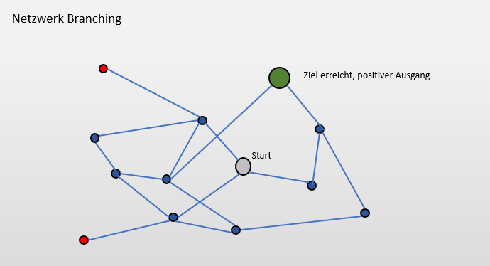
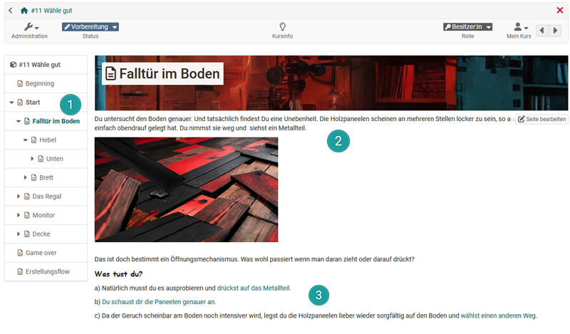
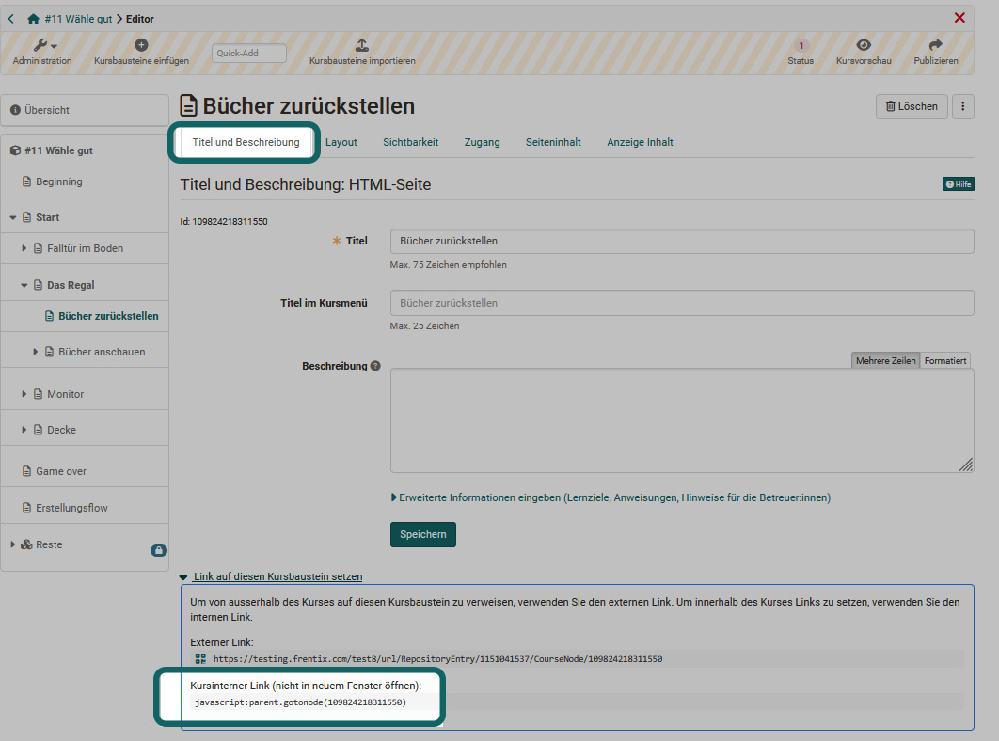

# How do I create course-internal branches? {: #branching}

??? abstract "Objectives and content of this instruction"

    Branching scenarios enable the creation of interactive teaching and learning environments in which learners have to make active decisions in order to progress. Depending on the option selected, they are then redirected to different pages, further information or calls to action. The following instructions show how such interactive teaching/learning settings can be implemented with OpenOlat.

??? abstract "Target group"

    [x] Authors [x] Coaches  [ ] Participants

    [ ] Beginners [x] Advanced users  [x] Experts

??? abstract "Expected previous knowledge"

    * You have already created an OpenOlat course and are familiar with [Adding course elements]. (https://www.youtube.com/embed/AJ76e3urdKA). 
    * ["How do I create my first OpenOlat course?"](../my_first_course/my_first_course.md)

---

## How can branches be structured in a course? {: #description}

There are various ways to design the structure for branching scenarios. Here are three typical examples:

a) **Linear branching (Pearl necklace model):** 
The main nodes/pages are processed one after the other. The decisions tend to only lead to small insertions/loops or provide different information. However, the information or pages are always brought together again. All in all, a rather simple approach.

b) **Branching** 
In this variant, there are different (parallel) paths through the individual pages. Each choice leads to different branches, which open up new decision options but can also restrict certain paths. Several endings, including negative ones, are possible. Often organized more hierarchically and less permeable.

c) **Network branching**  
This structure allows learners to navigate between different decision points in a non-linear way; there is usually no clear predetermined sequence. This structure is rather permeable and gives learners the greatest scope for individual paths and discoveries. 

[To the top of the page ^](#branching)

---

## How do I plan a branching scenario? {: #plan}

The design of branching scenarios requires careful planning: Teachers should define clear learning objectives and develop comprehensible, logical courses of action. 

A branching scenario is narrative and consists of an **overall story** that also reflects the learning objective. 

### Find your topic, your story
* Define your topic, your content.
* Establish a connection to the target group. 
* Define the learning objectives.
* Which electoral decisions would be thematically good and important? What do you want to raise awareness of?
* Build in tension and dramaturgy.
* Also consider how you want to use the branching scenario in practice, e.g. 
    * instructor-led in the plenum 
    * as a self-directed individual course
    * as a competition: Who was the first to reach the target node?
    * etc.
* Is the branching scenario part of a more complex setting? Should it be combined with other OpenOlat elements such as quizzes, evaluation, reflection, etc.?

The overall story is spread over several pages, also known as nodes, which are connected to each other via the respective options.

A single page or node consists of at least the following elements:

* A unique name or **title**. This is also required for the link.

* A **story element**, usually a text, but images, videos or combinations of different multimedia elements are also possible. 
* Two to five **choices** that are derived from the story. Each choice then leads to a new page or a new node. These new pages also form the feedback for the learner regarding the choice made. 

Plan each of these nodes and keep an eye on the overall story and structure. 

### Approach
There are several ways to create a branching scenario for and with OpenOlat.

**a)	Implement structure first, then content**

The focus here is on planning the branches and decision paths. The concrete design of the nodes with the story then takes place in the second step. First, the entire branching structure is planned, transferred to OpenOlat and implemented with HTML pages. A node corresponds to a course element [HTML page](../../manual_user/learningresources/Course_Element_HTML_Page.md). In the next step, the created pages are filled with the specific content or story elements and optional descriptions. 
This procedure is particularly suitable for branched branching and network branching.

**b)	Successive assembly**

Do you have an exciting idea but no concrete branching structure yet and want to develop your scenario step by step? Then proceed as follows: Start with the story of the start page (HTML page course element) and the first options. Now gradually develop the different options. However, make sure that the parts are brought together again. 
This procedure is well suited for hierarchical structures and branched branching.

**c)	Turn linear into branched**

Do you already have a suitable linear story? Then supplement it with suitable branches at certain points. These options can lead to a different focus or depth, but ultimately always lead to the next "chapter". To do this, divide your story into suitable chapters and branch out at each chapter. This approach fits well with the pearl necklace model. A chapter could represent a pearl.

[To the top of the page ^](#branching)

---

## Implement a planned branching scenario with OpenOlat {: #create}

You need:

* a classic or **conventional course**
* many course elements ["HTML page"](../../manual_user/learningresources/Course_Element_HTML_Page.md). Editing then takes place in the OpenOlat HTML editor. Alternatively, the [Course element page](../../manual_user/learningresources/Course_Element_Page.md) can also be used.
* OpenOlat internal **JavaScript links** of the course elements. These can be read in the [Course Editor](../../manual_user/learningresources/General_Configuration_of_Course_Elements.md).
* Suitable configuration in [Administration > Settings](../../manual_user/learningresources/Course_Settings.md) to hide the navigation

Depending on the design, you may need additional course elements such as [Test](../../manual_user/learningresources/Course_Element_Test.md), webcam recordings, [Forms](../../manual_user/learningresources/Course_Element_Form.md), etc. In most cases, you will also need graphics for the visualization. 

The procedure for using the course element ["HTML page"](../../manual_user/learningresources/Course_Element_HTML_Page.md) is described below. 

[To the top of the page ^](#branching)

---

### Step 1: Create course {: #step_1}

Create a new classic (conventional) OpenOlat course.

!!! info "Note"

    Why not a learning path course? The learning path course type offers no added value for this scenario and also restricts use for guests. Furthermore, the paths through the course vary depending on the user's decisions. The aim is therefore generally not to achieve 100% progress. 

[To the top of the page ^](#branching)

---

### Step 2: Create starting page {: #step_2}

Go to the [Course editor](../../manual_user/learningresources/General_Configuration_of_Course_Elements.md) and add a course element ["HTML page"](../../manual_user/learningresources/Course_Element_HTML_Page.md). Assign a meaningful title in the "Title and description" tab, e.g. "Starting page". Make sure that the names of all other course elements to be created are as clear as possible. This will help you to find your way around the scenario.

Go to the "Page content" tab and create a new HTML page file. It makes sense to use the same title as in the Title and Description tab. If necessary, also allow the link in the entire storage folder. 

[To the top of the page ^](#branching)

---

### Step 4: Create and design election pages {: #step_4}

Now create a new HTML page in the course editor for each of the options listed on the start page. Proceed in a similar way to step 2. Again, assign a short, unique title that clearly indicates the option. If necessary, add a number for orientation. 

The new HTML pages must then be designed with the respective story continuation and the next options. The procedure is based on step 3. 

Now proceed in the same way for each node: 

* Insert course element "HTML page"
* Assign title
* Create html page
* Design page individually
* Insert election options.

!!! info "Hint"

    It is best to use three options for an interesting but still manageable scenario. In exceptional cases, you can also use only one further link in the course of the scenario if you do not want to give users a real choice. It is also possible to include a selection option that leads back to the start or a specific page.

[To the top of the page ^](#branching)

---

### Step 5: Read out links {: #step_5}

In order for the various (HTML) pages created to be linked together, you still need to read out the appropriate internal links and link them to the selection options. 

#### Where can I find the links I need?

The internal linking option, which is generally available for all OpenOlat course elements, is used for this purpose.
The internal linking option, which is generally available for all OpenOlat course elements, is used for this purpose -> Set a link to this course element. -> Course internal link (JavaScript).

The link could look like this for example:
"javascript:parent.gotonode(111293110549156)"
Copy the link displayed for you. 

!!! info "Hint"

    This procedure works not only for branching scenarios, but generally for course element links within a course and offers a lot of potential! 

[To the top of the page ^](#branching)

---

### Step 6: Set links {: #step_6}

Now navigate to the HTML page on which the previously accessed page is stored as an option. Go back to the HTML editor (see step 3). 
Select the corresponding option, choose "Insert" -> Link or use the corresponding symbol in the HTML editor directly. 

Example: You have selected the JavaScript link for option 1 of the start page, then call up the start page, go to the HTML editor and insert the link for option 1 there. 

Proceed in the same way for the other selection options or target pages.

!!! info "Hint"

    You can also copy all internal links for an election page one after the other in the course editor and only then switch to the HTML page editor of the election node. This is usually quicker.

[To the top of the page ^](#branching)

---

### Step 7: Test and optimize {: #step_7}

To create a good, coherent branching scenario, you should also test the individual paths and options thoroughly. Does everything work? Is the flow of action appropriate? Are there any inconsistencies, illogicalities or link errors? Switch to the participant role and follow different paths. Correct and optimize if necessary.

Now make your scenarios even more vivid. Add a suitable visualization for each HTML page, for example. 

!!! info "Hint"

    You can also experiment with videos. In the simplest case, OpenOlat internal webcam recordings could be used. The combination with other action elements is also particularly exciting for teaching. OpenOlat offers a lot of potential for this. 

[To the top of the page ^](#branching)

---

### Step 8: Finalize {: #step_8}

Before you can make your branched scenario accessible to your learners, you still need to publish the course, [Access configuration](../../manual_user/learningresources/Access_configuration.md) and hide a few things. After all, learners are not supposed to navigate through the left-hand navigation, but really follow the prepared and self-selected paths.

#### Hide course navigation and toolbar

Go to the course administration and select the [Settings](../../manual_user/learningresources/Course_Settings.md).

* The navigation can now be hidden in the **"Layout"** tab: 
Course administration -> Settings -> Tab "Layout" ->
Remove all check marks in the navigation area, no menu navigation and no crumb navigation

* The toolbar for participants can also be hidden in the **Tab "Toolbar"**. 
Course administration -> Settings -> Tab "Layout" -> R
Remove "Toolbar visible for participants" checkmark

!!! warning "Important"

    Only really do this step at the end.

[To the top of the page ^](#branching)

---

## General Hints {: #hints}

* Use the course element [Test](../../manual_user/learningresources/Course_Element_Test.md) to query "secret codes" that could be collected during the course. Maybe the users need the code to get to the final page. 
* Use QR codes and store important information or additional information, puzzles or rewards there. This makes it more exciting.
* AI can generally provide great support in the development of branching scenarios, e.g. to develop a suitable action, choices and even a meaningful branching structure for your project and also to create suitable graphics.
* If you find it difficult to build the structure with OpenOlat, you can also use specific tools such as [Twine](https://twinery.org/) to develop the structure first and then transfer the structure to OpenOlat.
* If you are working with the [Course element "Page"](../../manual_user/learningresources/Course_Element_Page.md): Use the "Note box" type, user-defined, for the selection options. In this way, the options can be highlighted consistently. 

[To the top of the page ^](#branching)

---

## Further information {: #further_information}

[Example course for branching "Select well" (created by vcrp) >](https://olat.vcrp.de/url/RepositoryEntry/4575461519?guest=true&lang=de)  
[Course element "HTML page" >](../../manual_user/learningresources/Course_Element_HTML_Page.md)  
[Course element "page" >](../../manual_user/learningresources/Course_Element_Page.md) 
[Course settings >](../../manual_user/learningresources/Course_Settings.md) 
[Course editor >](../../manual_user/learningresources/General_Configuration_of_Course_Elements.md) 
[Videos in OpenOlat >](../../manual_user/learningresources/Video.md) 
Quiz/[Test >](../../manual_user/learningresources/Test_editor_QTI_2.1.md)

[To the top of the page ^](#branching)

