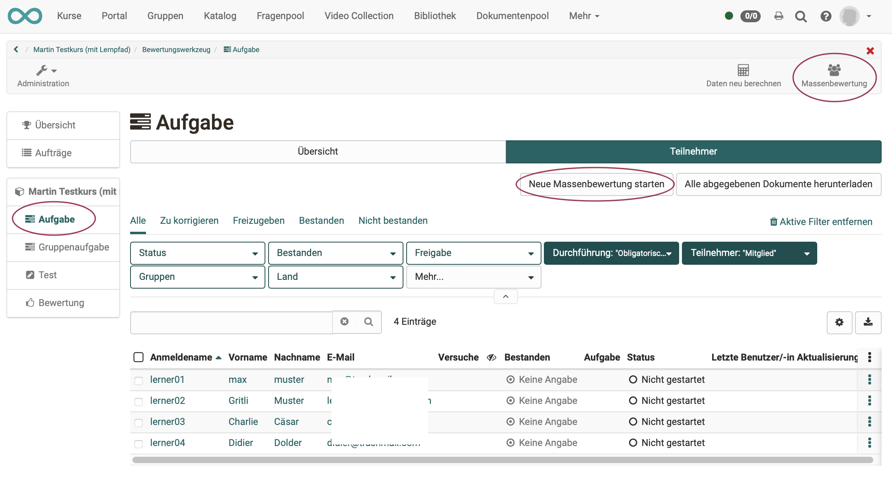
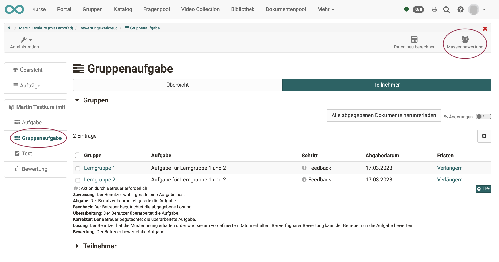
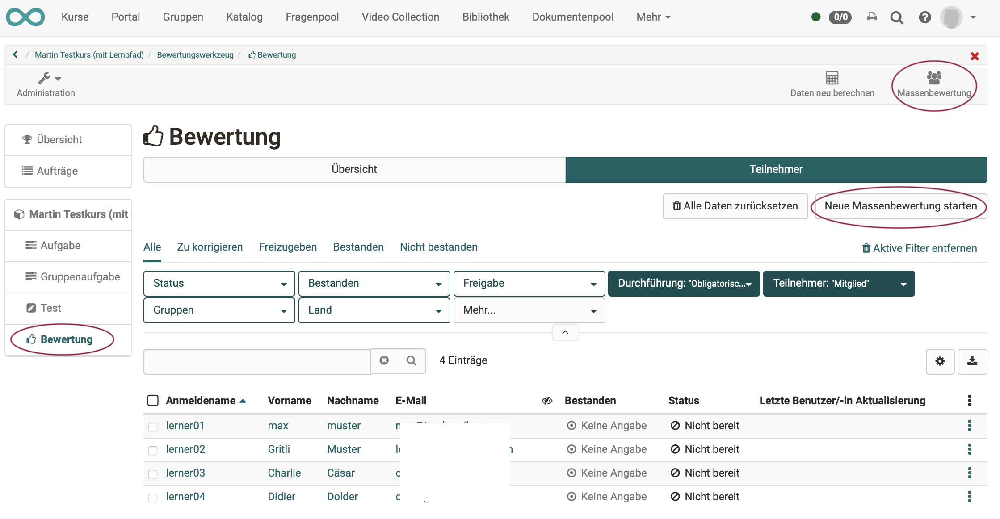
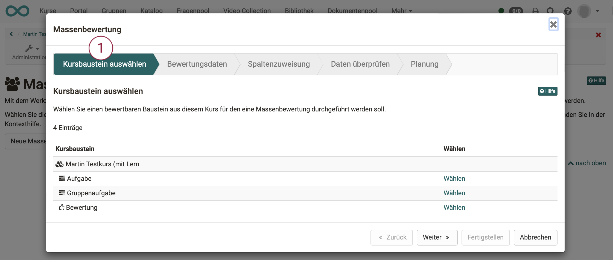
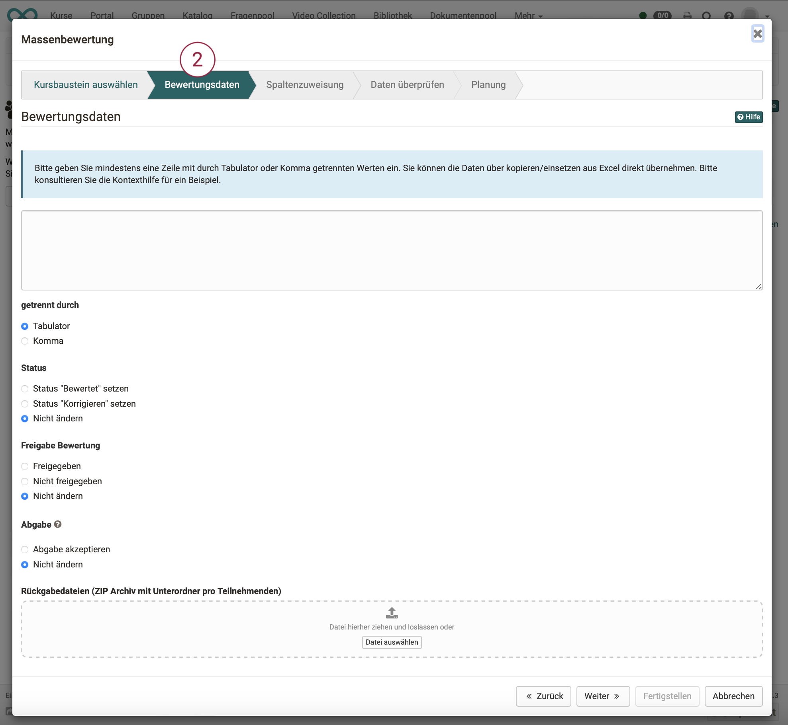
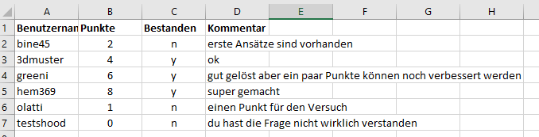
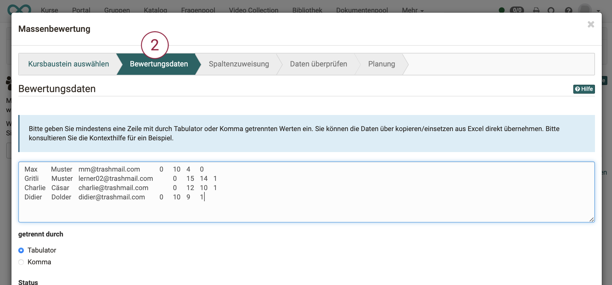
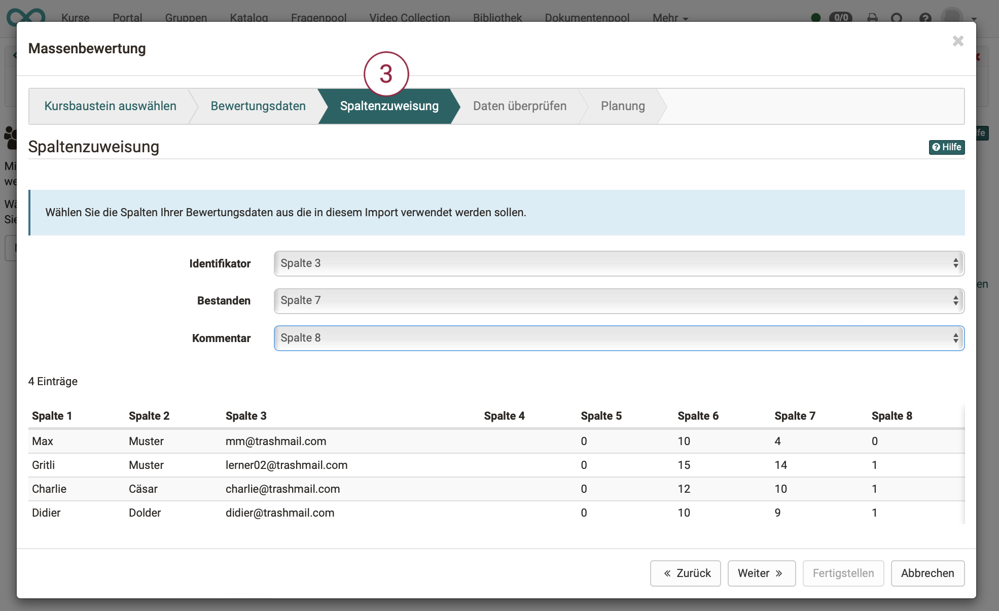
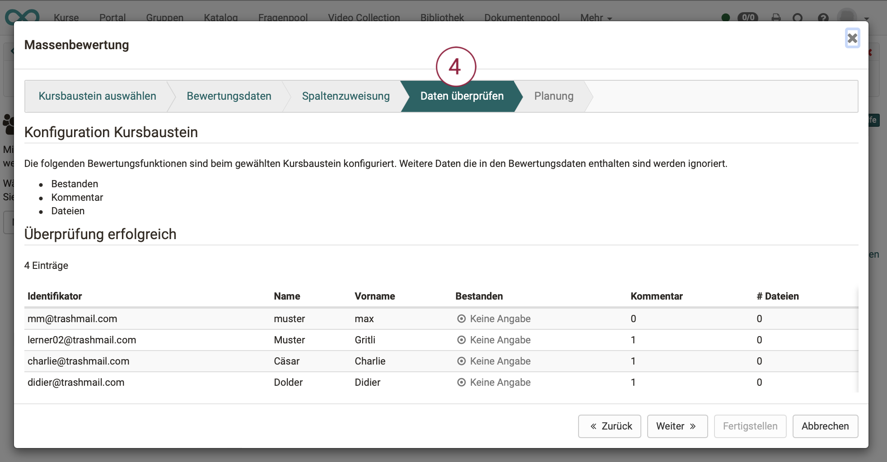
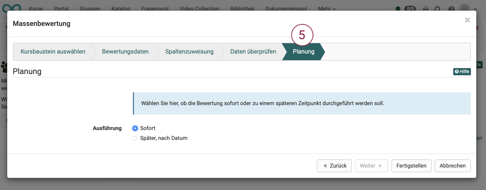

# Wie und wo kann ich eine Massenbewertung vornehmen?

??? abstract "Ziel und Inhalt dieser Anleitung"

    Als Betreuer:in bewerten Sie in der Regel Einzelleistungen und einzelne Teilnehmer:innen.
    In manchen Fällen steigern Sie Ihre Effizienz, wenn Sie die Massenbewertung verwenden. Diese Anleitung zeigt Ihnen, wie es geht.

??? abstract "Zielgruppe"

    [ ] Autor:innen [x] Betreuer:innen  [ ] Teilnehmer:innen

    [ ] Anfänger:innen [x] Fortgeschrittene  [x] Experten/Expertinnen

??? abstract "Erwartete Vorkenntnisse"

    * Erfahrung mit dem Bewertungswerkzeug

---

## Was ist eine Massenbewertung?

Mit der Massenbewertung können Sie im [Bewertungswerkzeug](../../manual_user/learningresources/Assessment_tool_overview.de.md) mehrere Kursteilnehmende zu
einem von Ihnen gewünschten Zeitpunkt auf einmal bewerten. 

Massenbewertungen können für die [bewertbaren Kursbausteine](../../manual_user/learningresources/Course_Elements.de.md)

* Kursbaustein "Aufgabe",
* Kursbaustein "Gruppenaufgabe" und
* Kursbaustein "Bewertung"

vorgenommen werden.

Für die Kursbausteine "Aufgabe" und "Bewertung" ist auch eine Massenbewertung für dort vorhandene Gruppen möglich.

## Wer kann eine Massenbewertung vornehmen?

Eine Massenbewertung kann durch alle Personen vorgenommen werden, die auch sonst die Berechtigung zum Bewerten haben. Dies sind in erster Linie die Betreuer eines Kurses.

!!! note "Hinweis"

    Je nach Konfiguration eines Kursbausteins stehen unterschiedliche Optionen zur Verfügung.
    
    Ist die Option "Bewertung" im Kursbaustein nicht aktiviert, kann auch keine Massenbewertung vorgenommen werden.
    
    Der Kursbaustein muss so konfiguriert sein, dass mindestens eine der folgenden Optionen aktiviert wurde:

    * Punkte
    * Bestanden
    * Kommentar
    * Dateien

## Wo wird eine Massenbewertung gestartet?

Das grundsätzliche Vorgehen ist:

* Wählen Sie im [Bewertungswerkzeug](../../manual_user/learningresources/Assessment_tool_overview.de.md) den Kursbaustein Ihres Kurses aus, für den eine Massenbewertung durchgeführt werden soll 
* oder wählen Sie die Option "Massenbewertung" in der Toolbar. 

### Die Massenbewertung für den **Kursbaustein Aufgabe** wird gestartet durch
* Wahl des Kurses
* Klick auf das Icon "Administration"
* Klick auf die Menüoption "Bewertungswerkzeug"
* Wahl des Kursbausteins vom Typ "Aufgabe" im Menü am linken Rand
* Wahl des Tabs "Teilnehmer"
* Klick auf den Button "Neue Massenbewertung starten" oder Button "Massenbewertung" in der Werkzeugleiste

{ class="shadow lightbox" }

### Die Massenbewertung für den **Kursbaustein Gruppenaufgabe** wird gestartet durch
* Wahl des Kurses
* Klick auf das Icon "Administration"
* Klick auf die Menüoption "Bewertungswerkzeug"
* Wahl des Kursbausteins vom Typ "Gruppenaufgabe" im Menü am linken Rand
* Wahl des Tabs "Teilnehmer"
* Klick auf den Button "Massenbewertung" in der Werkzeugleiste

{ class="shadow lightbox" }

### Die Massenbewertung für den **Kursbaustein Bewertung** wird gestartet durch
* Wahl des Kurses
* Klick auf die Menüoption "Bewertungswerkzeug"
* Wahl des Kursbausteins vom Typ "Bewertung" im Menü am linken Rand
* Wahl des Tabs "Teilnehmer"
* Klick auf den Button "Neue Massenbewertung starten" oder Button "Massenbewertung" in der Werkzeugleiste

{ class="shadow lightbox" }

### Die Massenbewertung für einen **gesamten Kurs** oder für eine **bestimmte Gruppe**
beginnt mit der Wahl des Kurses oder der Gruppe. Dann müssen aber konkrete Kursbausteine gewählt werden, die dieser Kurs enthält, bzw. die diese Gruppe bearbeitet. Ab dort wird die Massenbewertung nach einer der obigen Vorgehensweisen weiter ausgeführt. 

## Wie gehe ich nach dem Start weiter vor?

Nach dem Start führt Sie ein Wizard schrittweise durch die Massenbewertung.

## Schritt 1: Kursbaustein wählen 

Aus dem gewählten Kurs werden nur die bewertbaren Kursbausteine in einer Liste angezeigt. Wählen Sie den gewünschten Kursbaustein. 
{ class="shadow lightbox" }

## Schritt 2: Bewertungsdaten vorbereiten und einfügen

{ class="shadow lightbox" }

!!! info "Hinweis zum Kursbaustein Aufgabe"

    Beim Kursbaustein Aufgabe kann zusätzlich gewählt werden, ob die Abgabe akzeptiert wurde und es können gezippte Rückgabedateien hochgeladen werden. Ist kein solcher Baustein enthalten, entfallen "Abgabe" und "Rückgabedateien". 

## Schritt 2a: Bewertungsdaten vorbereiten 

Sie benötigen zur Massenbewertung eine Liste, die 

* die Benutzeridentifikation (Benutzername, registrierte E-Mail-Adresse oder Institutionsnummer/Matrikelnummer),
* die Anzahl Punkte,
* Status 
* und (falls gewünscht) den Kommentar enthält.

Die einzelnen Felder werden durch Tabulator oder Komma getrennt. 

!!! note "Hinweis"

    * <b>Teilpunkte</b> können mit Komma oder Punkt eingegeben werden (Achtung: Komma kann nicht verwendet werden, wenn Komma als Trennzeichen verwendet wird.)

    * Folgende Eingaben können Sie für den <b>Bestanden-Status</b> nutzen:
    Bestanden: `y, yes, passed, true, 1, bestanden` 
    Nicht bestanden: `no, failed, false, 0, nicht bestanden`

Am einfachsten ist es, eine Tabelle aus Excel oder OpenOffice zu verwenden und diese mit Werten zu füllen.

{ class="shadow lightbox" }

## Schritt 2b: Bewertungsdaten einfügen 

Laden Sie hier die außerhalb von OpenOlat erstellten Bewertungsdaten hoch, indem Sie die Infos mit "copy+paste" in das freie Feld einfügen. Wenn Sie sich vorher die leere Tabelle exportiert haben, sollte es keine Syntax Probleme geben. Wählen Sie "getrennt durch Tabulator", wenn Sie Daten aus einer Excel-Datei übernehmen.

Alternativ können Sie die Daten auch von Hand eintragen.

### Beispiel, aus Excel kopiert:

{ class="shadow lightbox" }

### Beispiel, manuelle Eintragung:

`micki,5,y,Hervorragend`| Dem Benutzer "micki" werden 5 Punkte, der Status "Bestanden" sowie ein Kommentar hinzugefügt.  
---|---  
`micki,,y,Hervorragend`| Wird die Punktezahl nicht benötigt, lassen Sie das Feld frei. Der Platzhalter muss allerdings dennoch eingefügt werden  
`micki,4,y,""`| Um Kommentare zurückzusetzen, können Sie "" verwenden, wie dieses Beispiel zeigt  

!!! note "Hinweis zu manueller Dateneintragung

    Wenn Sie die Daten von Hand eintragen, müssen Sie zur Abtrennung "getrennt durch Komma" auswählen, um die Daten korrekt zu übernehmen.

!!! note "Hinweis zur Massenbewertungen des <b>Aufgabenbausteins</b>"

    Erstellen Sie für die einzelnen Studierenden, die eine Rückgabedatei erhalten, je einen Ordner. Legen Sie dort das individuelle Feedback für die jeweilige Person ab. Zippen Sie die Datei und laden Sie diese im ersten Schritt unter "Bewertungsdaten" hoch.

## Schritt 3: Spaltenzuweisung 

Im Schritt <b>Spaltenzuweisung</b> können Sie zuordnen, welche Spalten Ihrer extern erstellten Bewertung (Ihrer eingefügten Daten aus Excel) für welches Feld stehen. 
Zum Beispiel:

 * Identifikator => Spalte 3
 *  Punkte => Spalte 7 
 * bestanden => Spalte 8
 * Kommentar => Spalte ignorieren

{ class="shadow lightbox" }

!!! tip "Tipp"

    Am einfachsten ist es, wenn Sie zunächst die gewünschten Tabellenspalten in der Bewertungsübersicht aktivieren und dann die leere oder nur teilausgefüllte Tabelle herunterladen. So erhalten Sie eine optimale Tabellenvorlage, die Sie nur noch entsprechend befüllen müssen.

## Schritt 4: Daten überprüfen

Dieser Schritt dient dazu, die eingefügten Bewertungsdaten nochmals zu kontrollieren. Es wird Ihnen noch einmal angezeigt, <b>welche</b> Informationen <b>wie</b> übernommen werden und ob es Probleme gibt.

{ class="shadow lightbox" }

## Schritt 5: Planung

Hier können Sie bestimmen, ob die Massenbewertung sofort erfolgen soll oder erst zu einem bestimmten Datum.

{ class="shadow lightbox" }

## Ergebnis 
Nach Durchführung der Schritte des Wizards erscheinen die vorgenommenen Änderungen in der Bewertungstabelle.
