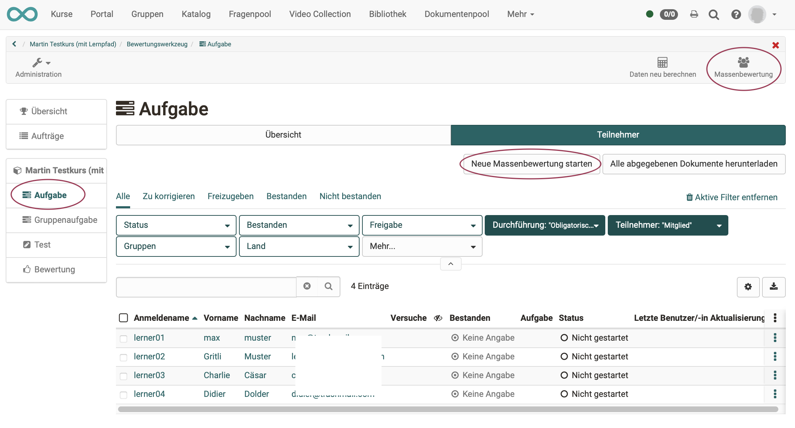
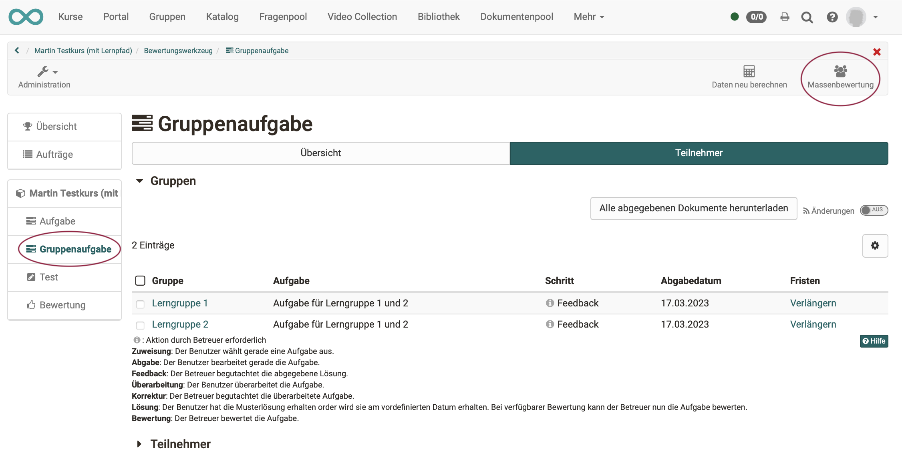
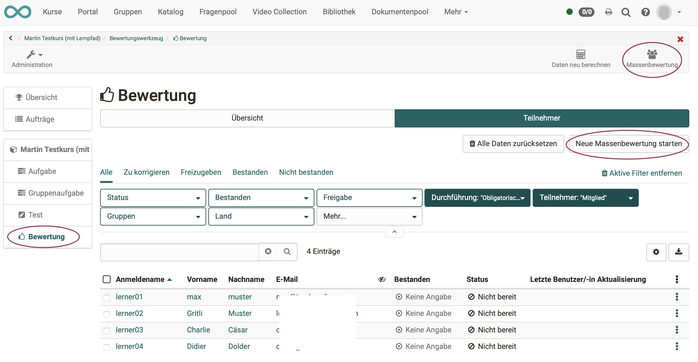
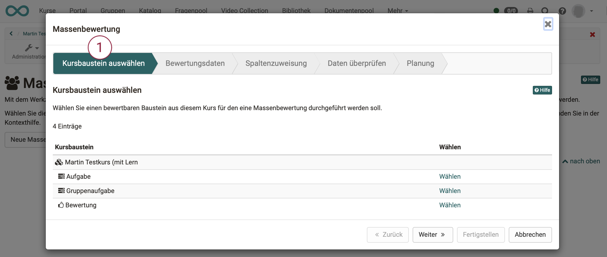
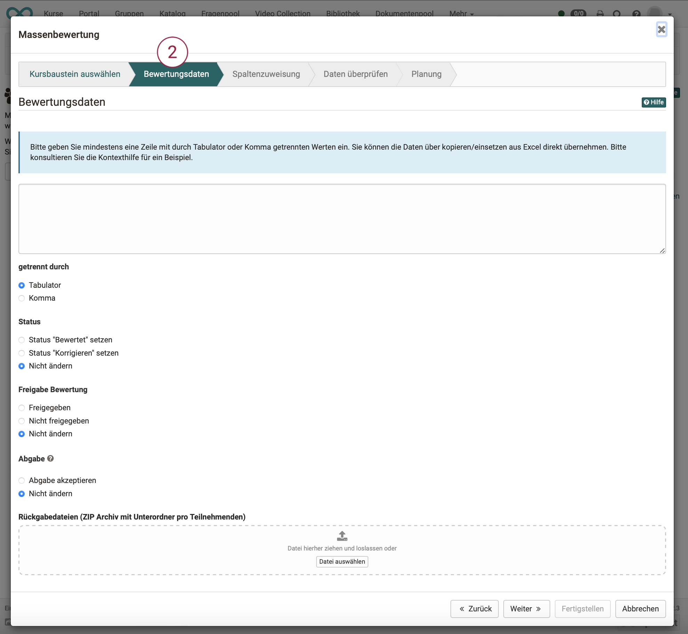
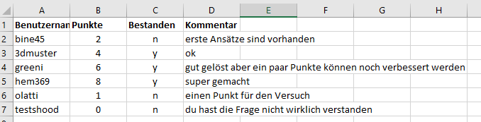
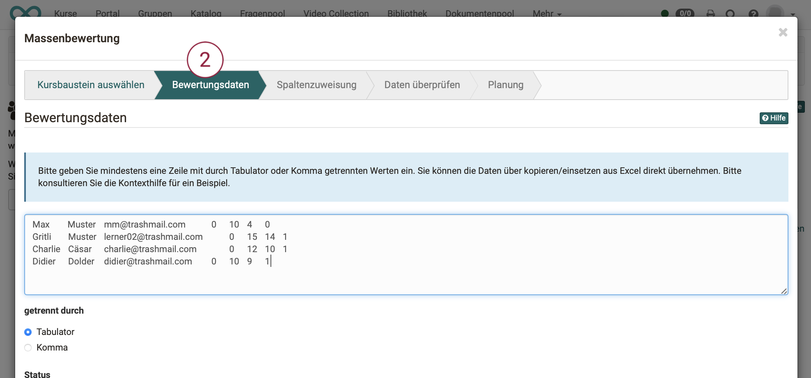
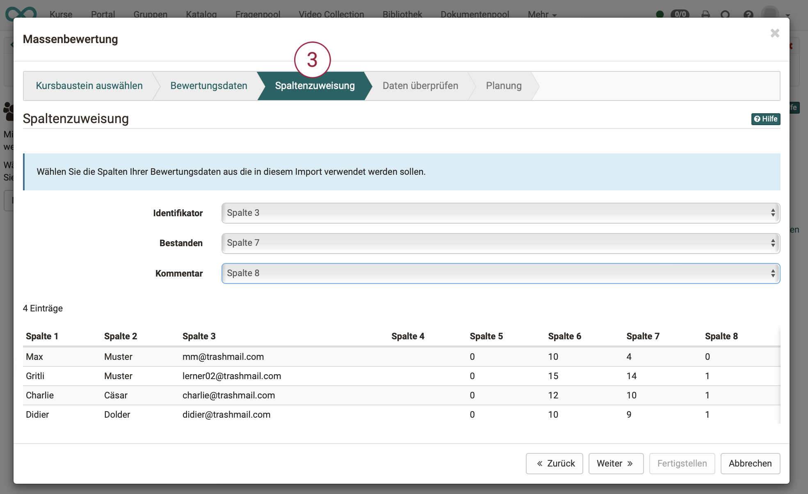
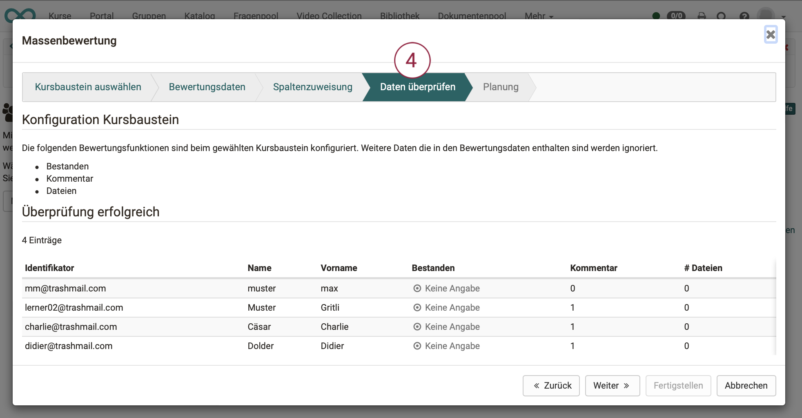
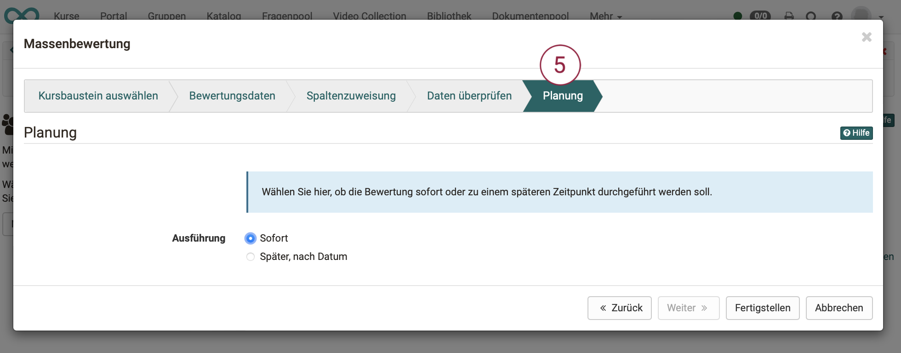

# Wie und wo kann ich eine Massenbewertung vornehmen? {: #bulk_assessment}

??? abstract "Ziel und Inhalt dieser Anleitung"

    Als Betreuer:in bewerten Sie in der Regel Einzelleistungen und einzelne Teilnehmer:innen.
    In manchen Fällen steigern Sie Ihre Effizienz, wenn Sie die Massenbewertung verwenden. Diese Anleitung zeigt Ihnen, wie es geht.

??? abstract "Zielgruppe"

    [ ] Autor:innen [x] Betreuer:innen  [ ] Teilnehmer:innen

    [ ] Anfänger:innen [x] Fortgeschrittene  [x] Expert:innen

??? abstract "Erwartete Vorkenntnisse"

    * Erfahrung mit dem Bewertungswerkzeug

---

## Was ist eine Massenbewertung? {: #what-is-a-bulk-assessment}

Mit der Massenbewertung können Sie im [Bewertungswerkzeug](../../manual_user/learningresources/Assessment_tool_overview.de.md) mehrere Teilnehmende zu
einem von Ihnen gewünschten Zeitpunkt auf einmal bewerten.

Massenbewertungen können für die [bewertbaren Kursbausteine](../../manual_user/learningresources/Course_Elements.de.md)

* Kursbaustein "Aufgabe",
* Kursbaustein "Gruppenaufgabe",
* Kursbaustein "Bewertung" und
* Kursbaustein "Videoaufgabe"

vorgenommen werden.

Für die Kursbausteine "Aufgabe" und "Bewertung" ist auch eine Massenbewertung für dort vorhandene Gruppen möglich.

## Wer kann eine Massenbewertung vornehmen? {: #who-can-do-a-bulk-assessment}

Eine Massenbewertung kann durch alle Personen vorgenommen werden, die auch sonst die Berechtigung zum Bewerten haben. Dies sind in erster Linie die Betreuer:innen eines Kurses.

!!! note "Hinweis"

    Je nach Konfiguration eines Kursbausteins stehen unterschiedliche Optionen zur Verfügung.

    Ist die Option "Bewertung" im Kursbaustein nicht aktiviert, kann auch keine Massenbewertung vorgenommen werden.

    Der Kursbaustein muss so konfiguriert sein, dass mindestens eine der folgenden Optionen aktiviert wurde:

    * Punkte
    * Bestanden
    * Kommentar
    * Dateien

## Wo wird eine Massenbewertung gestartet? {: #where-do-you-start-a-bulk-assessment}

Sie starten die Massenbewertung im Bewertungswerkzeug des Kurses: 
`Kurs > Administration > Bewertungswerkzeug`

Dort gibt es zwei Wege:

* Der Button "Massenbewertung" oben rechts öffnet die Übersicht der Massenbewertungen. Mit dem Button "Neue Massenbewertung starten" beginnt der Assistent beim Schritt 1, in dem Sie den Kursbaustein wählen.
* Bei den Kursbausteinen "Aufgabe" und "Bewertung" steht im Tab "Teilnehmer:innen" je nach Konfiguration zusätzlich der Button "Neue Massenbewertung starten". Der Kursbaustein ist damit schon gewählt, und der Assistent beginnt beim Schritt 2.

### Massenbewertung im Kursbaustein "Aufgabe" starten {: #the-bulk-assessment-for-course-element-task-is-started-by}

`Kurs > Administration > Bewertungswerkzeug > "Aufgabe" > Teilnehmer:innen` 
Klicken Sie auf den Button "Neue Massenbewertung starten" oder auf den Button "Massenbewertung" oben rechts.

{ class="shadow lightbox" title="Kursbaustein Aufgabe im Bewertungswerkzeug" }

### Massenbewertung im Kursbaustein "Gruppenaufgabe" starten {: #the-bulk-assessment-for-course-element-group-task-is-started-by}

`Kurs > Administration > Bewertungswerkzeug > "Gruppenaufgabe" > Teilnehmer:innen` 
Klicken Sie auf den Button "Massenbewertung" oben rechts.

{ class="shadow lightbox" title="Kursbaustein Gruppenaufgabe im Bewertungswerkzeug" }

### Massenbewertung im Kursbaustein "Bewertung" starten {: #the-bulk-assessment-for-course-element-assessment-is-started-by}

`Kurs > Administration > Bewertungswerkzeug > "Bewertung" > Teilnehmer:innen` 
Klicken Sie auf den Button "Neue Massenbewertung starten" oder auf den Button "Massenbewertung" oben rechts.

{ class="shadow lightbox" title="Kursbaustein Bewertung im Bewertungswerkzeug" }

### Massenbewertung für einen ganzen Kurs oder eine Gruppe {: #the-bulk-assessment-of-an-entire-course-or-of-a-certain-group}

Eine Massenbewertung gilt immer für einen einzelnen Kursbaustein. Wollen Sie einen ganzen Kurs oder eine bestimmte Gruppe bewerten, führen Sie die Massenbewertung für jeden Kursbaustein einzeln aus, den dieser Kurs enthält bzw. den diese Gruppe bearbeitet. Für jeden Kursbaustein gilt eine der obigen Vorgehensweisen.

## Wie gehe ich nach dem Start weiter vor? {: #how-do-i-proceed-after-the-start}

Nach dem Start führt Sie ein Assistent mit fünf Schritten durch die Massenbewertung.

## Schritt 1: Kursbaustein auswählen {: #step-1-choose-your-course-element}

Aus dem gewählten Kurs werden nur die bewertbaren Kursbausteine in einer Liste angezeigt. Wählen Sie den gewünschten Kursbaustein.

{ class="shadow lightbox" title="Schritt 1 des Assistenten Massenbewertung" }

## Schritt 2: Bewertungsdaten vorbereiten und einfügen {: #step-2-prepare-and-insert-assessment-data}

Im zweiten Schritt fügen Sie die Bewertungsdaten ein und legen fest, wie OpenOlat sie übernimmt:

* **getrennt durch**: "Tabulator" oder "Komma"
* **Status**: Status "Bewertet" setzen, Status "Korrigieren" setzen oder "Nicht ändern"
* **Freigabe Bewertung**: "Freigegeben", "Nicht freigegeben" oder "Nicht ändern". Das Feld erscheint, wenn Sie die Freigabe der Bewertung bearbeiten dürfen.
* **Abgabe**: "Abgabe akzeptieren" oder "Nicht ändern", nur bei den Kursbausteinen "Aufgabe" und "Gruppenaufgabe"
* **Rückgabedateien (ZIP Archiv mit Unterordner pro Teilnehmenden)**: nur, wenn der Kursbaustein Rückgabedateien vorsieht

{ class="shadow lightbox" title="Schritt 2 des Assistenten Massenbewertung" }

!!! info "Hinweis zum Kursbaustein Aufgabe"

    Beim Kursbaustein Aufgabe kann zusätzlich gewählt werden, ob die Abgabe akzeptiert wurde und es können gezippte Rückgabedateien hochgeladen werden. Ist kein solcher Baustein enthalten, entfallen "Abgabe" und "Rückgabedateien".

## Schritt 2a: Bewertungsdaten vorbereiten {: #step-2a-prepare-assessment-data}

Sie benötigen zur Massenbewertung eine Liste, die

* die Benutzeridentifikation (Benutzername, registrierte E-Mail-Adresse oder Institutionsnummer/Matrikelnummer),
* die Anzahl Punkte,
* Status
* und (falls gewünscht) den Kommentar enthält.

Die einzelnen Felder werden durch Tabulator oder Komma getrennt.

!!! note "Hinweis"

    * <b>Teilpunkte</b> können mit Komma oder Punkt eingegeben werden (Achtung: Komma kann nicht verwendet werden, wenn Komma als Trennzeichen verwendet wird.)

    * Folgende Eingaben können Sie für den <b>Bestanden-Status</b> nutzen:
    Bestanden: `y, yes, passed, true, 1, bestanden` 
    Nicht bestanden: `n, no, failed, false, 0, nicht bestanden`

Am einfachsten ist es, eine Tabelle aus Excel oder OpenOffice zu verwenden und diese mit Werten zu füllen.

{ class="shadow lightbox" title="Bewertungsdaten in einer Excel-Tabelle" }

## Schritt 2b: Bewertungsdaten einfügen {: #step-2b-insert-assessment-data}

Laden Sie hier die ausserhalb von OpenOlat erstellten Bewertungsdaten hoch, indem Sie die Infos mit "copy+paste" in das freie Feld einfügen. Wenn Sie sich vorher die leere Tabelle exportiert haben, sollte es keine Syntax Probleme geben. Wählen Sie bei "getrennt durch" die Option "Tabulator", wenn Sie Daten aus einer Excel-Datei übernehmen.

Alternativ können Sie die Daten auch von Hand eintragen.

### Beispiel, aus Excel kopiert: {: #example-copied-from-excel}

{ class="shadow lightbox" title="Schritt 2 mit eingefügten Bewertungsdaten" }

### Beispiel, manuelle Eintragung: {: #example-manual-input}

`micki,5,y,Hervorragend`| Der Person mit dem Benutzernamen "micki" werden 5 Punkte, der Status "Bestanden" sowie ein Kommentar hinzugefügt.
---|---
`micki,,y,Hervorragend`| Wird die Punktezahl nicht benötigt, lassen Sie das Feld frei. Der Platzhalter muss allerdings dennoch eingefügt werden.
`micki,4,y,""`| Um Kommentare zurückzusetzen, können Sie "" verwenden, wie dieses Beispiel zeigt.

!!! note "Hinweis zu manueller Dateneintragung"

    Wenn Sie die Daten von Hand eintragen, müssen Sie bei "getrennt durch" die Option "Komma" auswählen, um die Daten korrekt zu übernehmen.

!!! note "Hinweis zur Massenbewertung des <b>Aufgabenbausteins</b>"

    Erstellen Sie für die einzelnen Teilnehmenden, die eine Rückgabedatei erhalten, je einen Ordner. Legen Sie dort das individuelle Feedback für die jeweilige Person ab. Zippen Sie die Ordner und laden Sie die ZIP-Datei in diesem Schritt unter "Rückgabedateien" hoch.

## Schritt 3: Spaltenzuweisung {: #step-3-column-assignment}

Im Schritt <b>Spaltenzuweisung</b> können Sie zuordnen, welche Spalten Ihrer extern erstellten Bewertung (Ihrer eingefügten Daten aus Excel) für welches Feld stehen. Es erscheinen nur die Felder, die der Kursbaustein bewertet: "Identifikator" immer, "Punkte", "Bestanden" und "Kommentar" je nach Konfiguration. Eine Spalte, die nicht übernommen werden soll, setzen Sie auf "Ignorieren". 
Zum Beispiel:

 * Identifikator => Spalte 3
 * Punkte => Spalte 7
 * Bestanden => Spalte 8
 * Kommentar => Ignorieren

{ class="shadow lightbox" title="Schritt 3 des Assistenten Massenbewertung" }

!!! tip "Tipp"

    Am einfachsten ist es, wenn Sie zunächst die gewünschten Tabellenspalten in der Bewertungsübersicht aktivieren und dann die leere oder nur teilausgefüllte Tabelle herunterladen. So erhalten Sie eine optimale Tabellenvorlage, die Sie nur noch entsprechend befüllen müssen.

## Schritt 4: Daten überprüfen {: #step-4-validation}

Dieser Schritt dient dazu, die eingefügten Bewertungsdaten nochmals zu kontrollieren. Es wird Ihnen noch einmal angezeigt, <b>welche</b> Informationen <b>wie</b> übernommen werden und ob es Probleme gibt.

{ class="shadow lightbox" title="Schritt 4 des Assistenten Massenbewertung" }

## Schritt 5: Planung {: #step-5-schedule}

Hier können Sie bestimmen, ob die Massenbewertung "Sofort" erfolgen soll oder "Später, nach Datum".

{ class="shadow lightbox" title="Schritt 5 des Assistenten Massenbewertung" }

## Ergebnis {: #result}

Nach Durchführung der Schritte des Assistenten erscheinen die vorgenommenen Änderungen in der Bewertungstabelle.

## Weiterführende Informationen {: #further_information}

**Auf dieser Seite erwähnt** 
[Bewertungswerkzeug - Übersicht >](../../manual_user/learningresources/Assessment_tool_overview.de.md) 
[Kursbausteine >](../../manual_user/learningresources/Course_Elements.de.md)

**Weiterführend** 
[Bewertung von Kursbausteinen >](../../manual_user/learningresources/Assessment_of_course_modules.de.md) 
[Aufgaben und Gruppenaufgaben bewerten >](../../manual_user/learningresources/Assessing_tasks_and_group_tasks.de.md) 
[Kursbaustein "Bewertung" >](../../manual_user/learningresources/Course_Element_Assessment.de.md) 
[Kursbaustein "Videoaufgabe" >](../../manual_user/learningresources/Course_Element_Video_Task.de.md)

[Zum Seitenanfang ^](#bulk_assessment)
