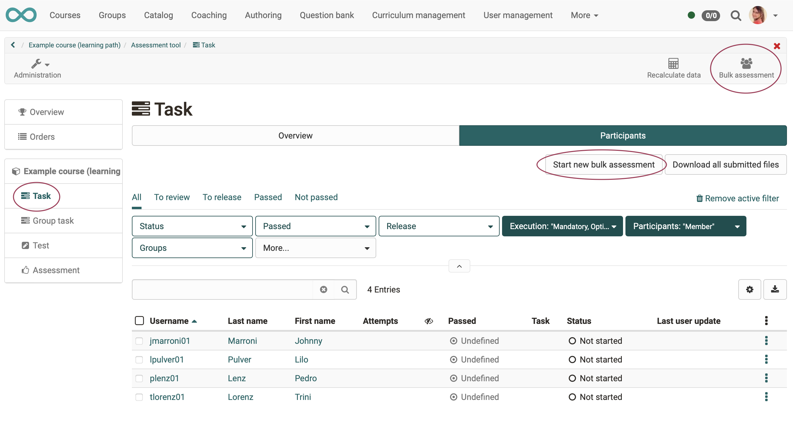
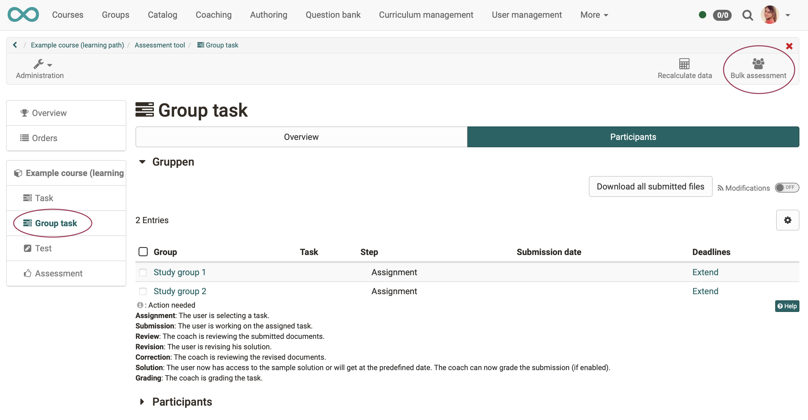
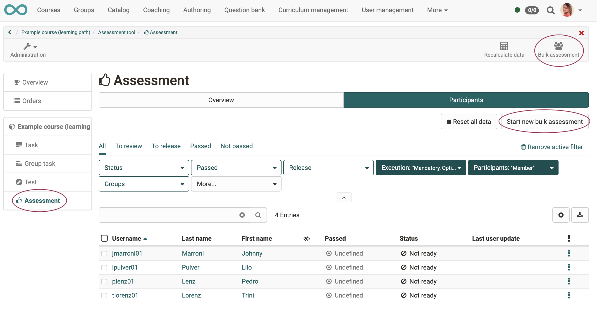
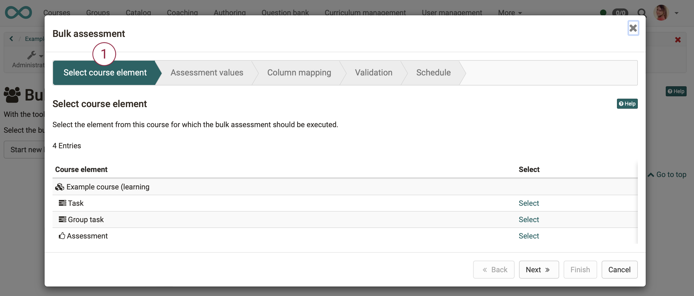
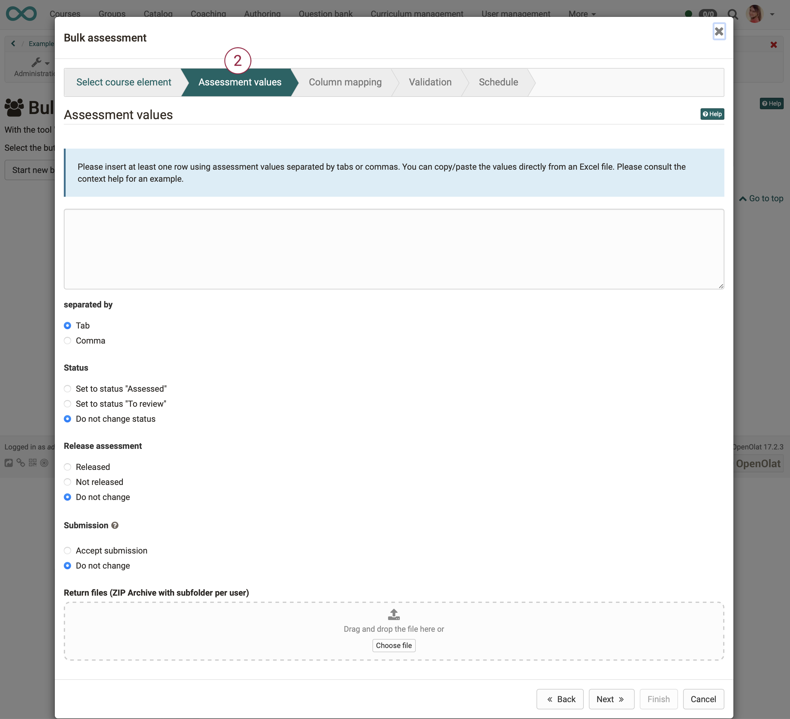
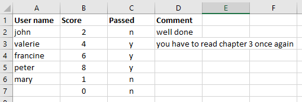
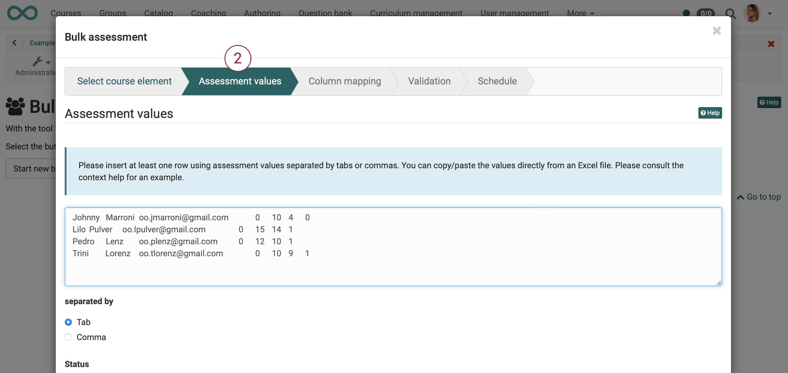
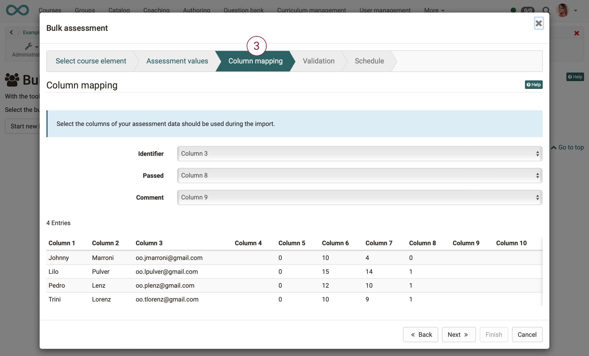
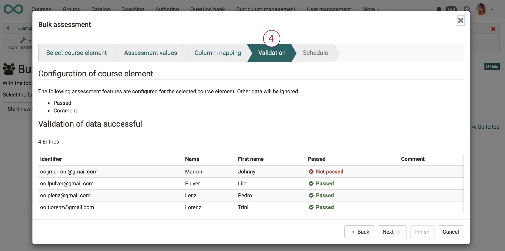
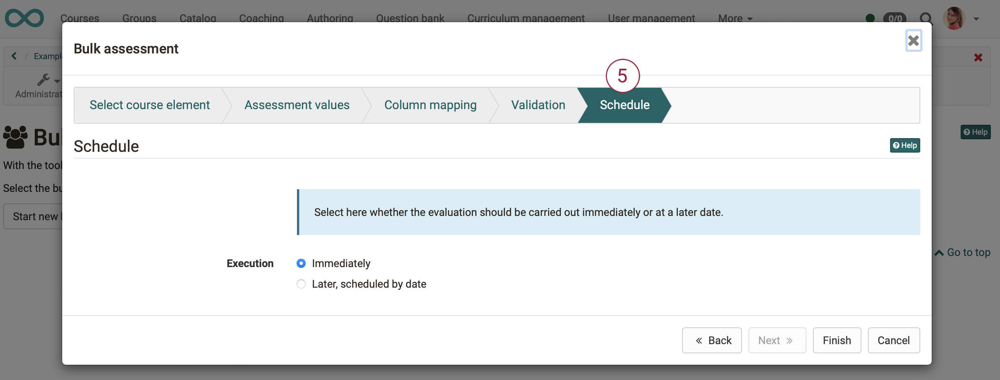

# How and where can I do a bulk assessment?

## What is a bulk assessment?

With a bulk assessment you may assess several course participants with the [assessment tool
](../course_operation/Assessment_tool_-_overview.md) at a time of your choice at once.
  
Bulk assessments can be done for [assessment course elements](../course_elements/Assessment.md):
* course element "task",
* course element "group task" and
* course element "assessment"

For course elements "task" and "assessment" you may also do a bulk assessment for groups used in these elements.
  
## Who can do a bulk assessment?

A bulk assessment can be performed by all persons who are otherwise authorized to assess. These are primarily the coaches of a course.

!!! note "Note"

    Depending on the configuration of a course element, different options are available.
    
    If the option "assessment" is not activated in the course element, no bulk assessment can be carried out.

    All course elements are displayed for which at least one of the following assessment features is configured:

    * score
    * passed
    * comment
    * files
  

## Where do you start a bulk assessment?

The general procedure is:
* Select in the [assessment tool
](../course_operation/Assessment_tool_-_overview.de.md) the course element of your course, for which you want to do a bulk assessment
* or select the "bulk assessment" option in the toolbar. 
  

### The bulk assessment for <b>course element task</b> is started by 
* selection of your course
* then click the icon "administration"
* click the menu option "assessment tool"
* choose the course element of type "task" in the menu at the left side
* select tab „participants“
* click the button "start new bulk assessment" or the button "bulk assessment" in the tool bar

  

### The bulk assessment for <b>course element group task</b> is started by  
* selection of your course
* then click the icon "administration"
* click the menu option "assessment tool"
* choose the course element of type "group task" in the menu at the left side
* select tab „participants“
* click the button "bulk assessment" in the tool bar

  

### The bulk assessment for <b>course element assessment</b> is started by
* selection of your course
* then click on the icon "administration"
* click the menu option "assessment tool"
* choose the course element of type "assessment" in the menu at the left side
* select tab „participants“
* click the button "start new bulk assessment" or the button "bulk assessment" in the tool bar

  

### The bulk assessment of an <b>entire course</b> or of a <b>certain group</b> 
starts with the selection of the course or the group. 
Then, however, concrete course elements must be selected which this course contains or which this group works on. From there on, the bulk assessment will be carried out according to one of the above procedures.
  

## How do I proceed after the start?

After the start you will be guided step by step by a <b>wizard</b> through the bulk assessment.
  

## Step 1: Choose your course element
 
Only the assessable course elements from the selected course are displayed in a list. Select the desired course element.

  

## Step 2: Prepare and insert assessment data

!!! info "Note on course element task"

    For the course element task, you can additionally select whether the delivery was accepted and upload zipped return files. If no such course element is included, "delivery" and "return files" are not applicable.
  

## Step 2a: Prepare assessment data 

For bulk assessment, you need a list that includes. 
* the user identification (username, registered email address or institution number/matriculation number),
* the number of points,
* status 
* and, if desired, the comment.

The individual fields are separated by tab or comma.

!!! note "Note"

    * <b>Subpoints</b> can be entered with comma or period (Attention: comma cannot be used if comma is used as separator).

    * You can use the following inputs for the <b>passed status</b>:
    passed: `y, yes, passed, true, 1, bestanden` 
    failed: `no, failed, false, 0, nicht bestanden`

The easiest way is to use a table from Excel or OpenOffice and fill it with values.

  

## Step 2b: Insert Assessment data 

Upload here the rating data created outside OpenOlat by 'copy+paste' into the free field. If you have exported the empty table before, there should be no syntax problems. Select "separated by tab" if you are transferring data from an Excel file.

Alternatively, you can enter the data manually.

### Example, copied from Excel:

### Example, manual input:

`micki,5,y,excellent`| The user "micki" gets a score of 5, a "passed" status and a comment added.
---|---  
`micki,,y,excellent`| If the score is not needed, leave the field blank. However, the placeholder must still be inserted.
`micki,4,y,""`| To reset comments, you can use "", as this example shows.

!!! note "Note on manual data entry

    If you enter the data manually, you must select "separated by commas" to separate the data correctly.

!!! note "Note on bulk assessment of <b>course element task</b>"

    Create a folder for each student who receives a feedback file. Place the individual feedback for each person there. Zip the file and upload it in the first step under "assessment data".

  

## Step 3: Column assignment

In step <b>column assignment</b> you can assign which columns of your externally created assessment (of your inserted data from Excel) stand for which field. 
For example:
 * identifier => column 3
 * points => column 7 
 * passed => column 8
 * comment => ignore column

!!! tip "Hint"

    The easiest way is to first activate the desired table columns in the evaluation overview and then download the empty or only partially filled table. This way you get an optimal table template, which you only have to fill in accordingly.
  

## Step 4: Validation

This step is used to check the inserted evaluation data once again. You will be shown once again <b>which</b> information is taken over and <b>how</b>, and whether there are any problems.

  
## Step 5: Schedule

Here you can define whether the valuation takes place immediately or only on a certain date.

  

## Result 

After performing the steps of the wizard, the changes made appear in the rating table.
