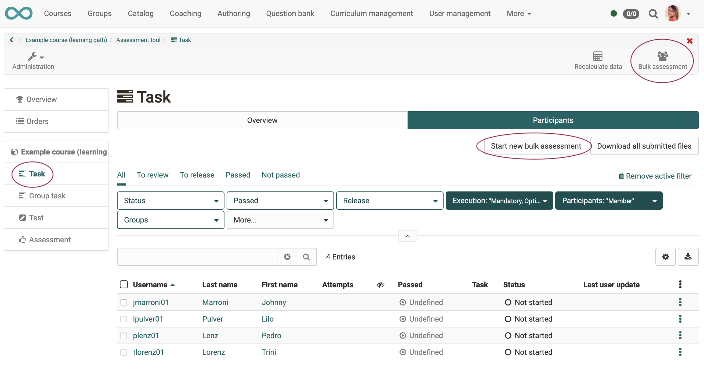
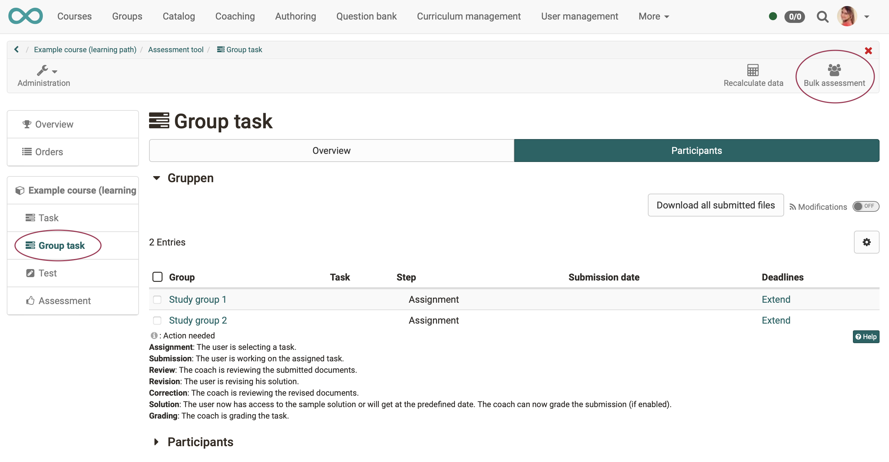
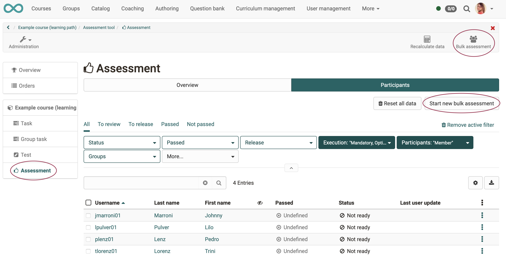
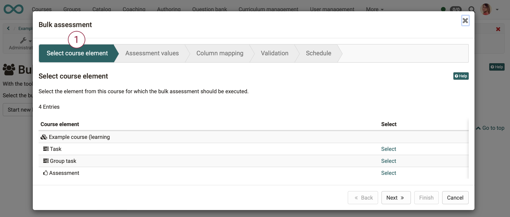
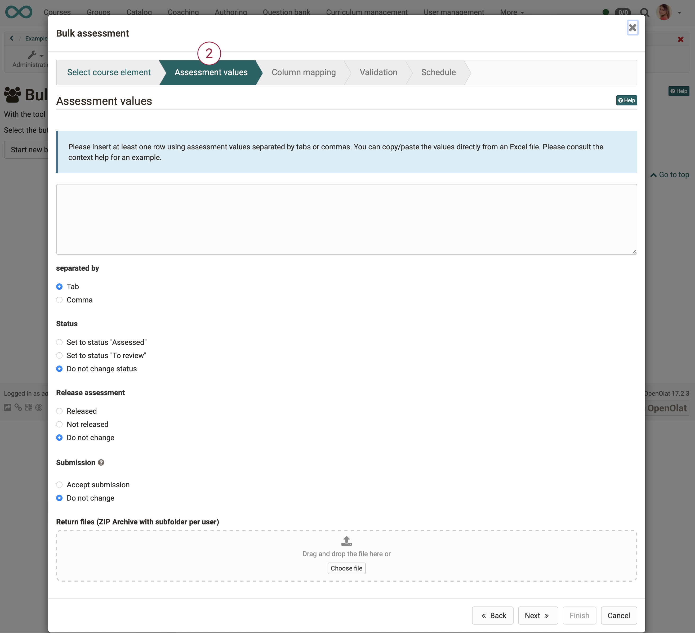
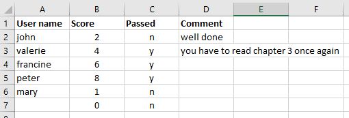
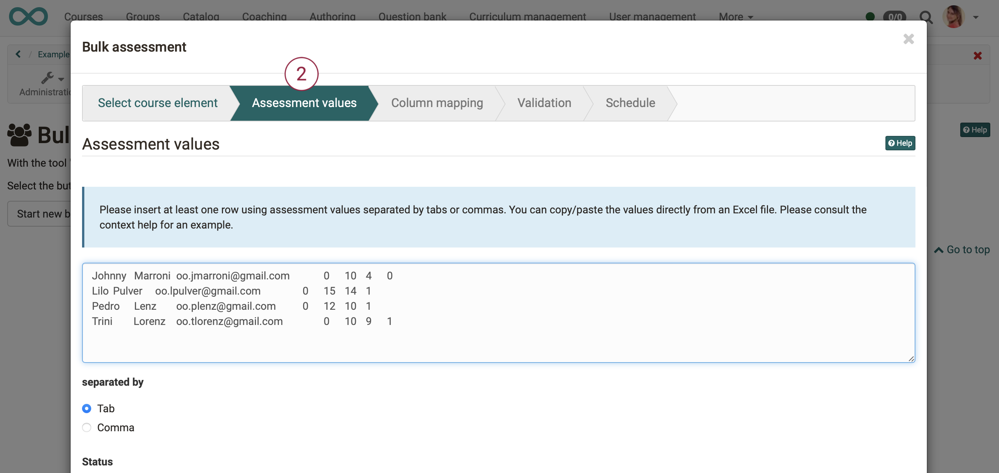
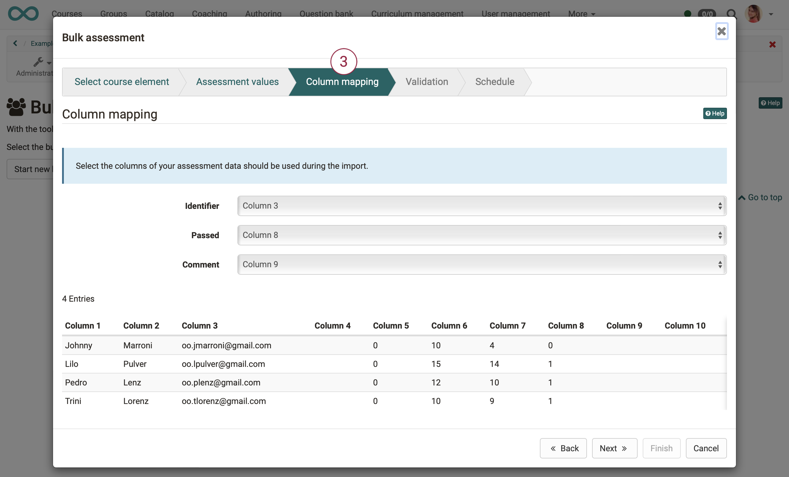
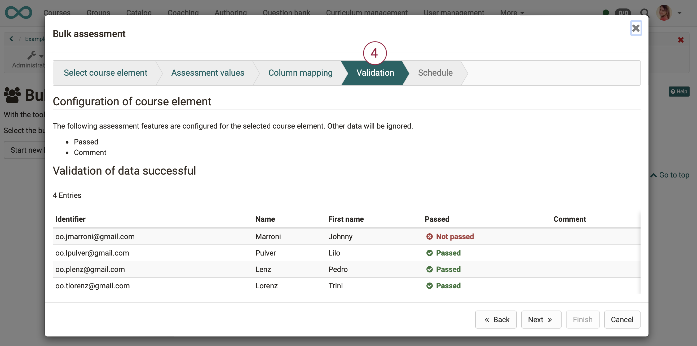
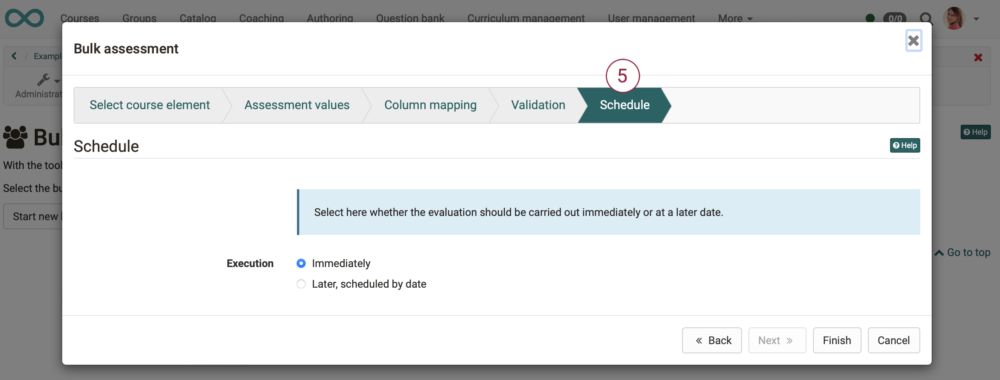

# How and where can I do a bulk assessment? {: #bulk_assessment}

??? abstract "Objectives and content of this instruction"

    As a coach, you usually evaluate individual performances and individual participants.
    Sometimes, however, you increase your efficiency by using the bulk assessment. This guide shows you how to do it.

??? abstract "Target group"

    [ ] Authors [x] Coaches  [ ] Participants

    [ ] Beginners [x] Advanced users  [x] Experts

??? abstract "Expected previous knowledge"

    * Experience with the assessment tool

---

## What is a bulk assessment? {: #what-is-a-bulk-assessment}

With a bulk assessment you may assess several participants with the [assessment tool](../../manual_user/learningresources/Assessment_tool_overview.md) at a time of your choice at once.

Bulk assessments can be done for the [assessable course elements](../../manual_user/learningresources/Course_Elements.md)

* course element "Task",
* course element "Group task",
* course element "Assessment" and
* course element "Video task".

For course elements "Task" and "Assessment" you may also do a bulk assessment for groups used in these elements.

## Who can do a bulk assessment? {: #who-can-do-a-bulk-assessment}

A bulk assessment can be performed by all persons who are otherwise authorized to assess. These are primarily the coaches of a course.

!!! note "Note"

    Depending on the configuration of a course element, different options are available.

    If the option "Assessment" is not activated in the course element, no bulk assessment can be carried out.

    The course element must be configured so that at least one of the following options is activated:

    * Score
    * Passed
    * Comment
    * Files

## Where do you start a bulk assessment? {: #where-do-you-start-a-bulk-assessment}

You start the bulk assessment in the assessment tool of the course: 
`Course > Administration > Assessment tool`

There are two ways:

* The button "Bulk assessment" at the top right opens the overview of bulk assessments. With the button "Start new bulk assessment", the wizard begins at step 1, in which you choose the course element.
* For the course elements "Task" and "Assessment", depending on the configuration, the tab "Participants" additionally shows the button "Start new bulk assessment". The course element is then already chosen, and the wizard begins at step 2.

### Start the bulk assessment in the course element "Task" {: #the-bulk-assessment-for-course-element-task-is-started-by}

`Course > Administration > Assessment tool > "Task" > Participants` 
Click the button "Start new bulk assessment" or the button "Bulk assessment" at the top right.

{ class="shadow lightbox" title="Course element Task in the assessment tool" }

### Start the bulk assessment in the course element "Group task" {: #the-bulk-assessment-for-course-element-group-task-is-started-by}

`Course > Administration > Assessment tool > "Group task" > Participants` 
Click the button "Bulk assessment" at the top right.

{ class="shadow lightbox" title="Course element Group task in the assessment tool" }

### Start the bulk assessment in the course element "Assessment" {: #the-bulk-assessment-for-course-element-assessment-is-started-by}

`Course > Administration > Assessment tool > "Assessment" > Participants` 
Click the button "Start new bulk assessment" or the button "Bulk assessment" at the top right.

{ class="shadow lightbox" title="Course element Assessment in the assessment tool" }

### Bulk assessment for an entire course or a group {: #the-bulk-assessment-of-an-entire-course-or-of-a-certain-group}

A bulk assessment always applies to a single course element. If you want to assess an entire course or a certain group, carry out the bulk assessment separately for each course element which this course contains or which this group works on. For each course element, one of the above procedures applies.

## How do I proceed after the start? {: #how-do-i-proceed-after-the-start}

After the start, a wizard with five steps guides you through the bulk assessment.

## Step 1: Select course element {: #step-1-choose-your-course-element}

Only the assessable course elements from the selected course are displayed in a list. Select the desired course element.

{ class="shadow lightbox" title="Step 1 of the wizard Bulk assessment" }

## Step 2: Prepare and insert assessment data {: #step-2-prepare-and-insert-assessment-data}

In the second step, you insert the assessment data and define how OpenOlat takes them over:

* **separated by**: "Tab" or "Comma"
* **Status**: Set to status "Assessed", Set to status "To review" or "Do not change status"
* **Release assessment**: "Released", "Not released" or "Do not change". The field appears if you may edit the release of the assessment.
* **Submission**: "Accept submission" or "Do not change", only for the course elements "Task" and "Group task"
* **Return files (ZIP Archive with subfolder per user)**: only if the course element provides return files

{ class="shadow lightbox" title="Step 2 of the wizard Bulk assessment" }

!!! info "Note on course element task"

    For the course element task, you can additionally select whether the submission was accepted and upload zipped return files. If no such course element is included, "Submission" and "Return files" are not applicable.

## Step 2a: Prepare assessment data {: #step-2a-prepare-assessment-data}

For bulk assessment, you need a list that includes

* the user identification (username, registered email address or institution number/matriculation number),
* the number of points,
* status
* and, if desired, the comment.

The individual fields are separated by tab or comma.

!!! note "Note"

    * <b>Subpoints</b> can be entered with comma or period (Attention: comma cannot be used if comma is used as separator).

    * You can use the following inputs for the <b>passed status</b>:
    Passed: `y, yes, passed, true, 1, bestanden` 
    Failed: `n, no, failed, false, 0, nicht bestanden`

The easiest way is to use a table from Excel or OpenOffice and fill it with values.

{ class="shadow lightbox" title="Assessment data in an Excel table" }

## Step 2b: Insert Assessment data {: #step-2b-insert-assessment-data}

Upload here the assessment data created outside OpenOlat by "copy+paste" into the free field. If you have exported the empty table before, there should be no syntax problems. For "separated by", select the option "Tab" if you are transferring data from an Excel file.

Alternatively, you can enter the data manually.

### Example, copied from Excel: {: #example-copied-from-excel}

{ class="shadow lightbox" title="Step 2 with inserted assessment data" }

### Example, manual input: {: #example-manual-input}

`micki,5,y,excellent`| The person with the username "micki" gets a score of 5, a "passed" status and a comment added.
---|---
`micki,,y,excellent`| If the score is not needed, leave the field blank. However, the placeholder must still be inserted.
`micki,4,y,""`| To reset comments, you can use "", as this example shows.

!!! note "Note on manual data entry"

    If you enter the data manually, you must select the option "Comma" for "separated by" to take over the data correctly.

!!! note "Note on bulk assessment of <b>course element task</b>"

    Create a folder for each participant who receives a return file. Place the individual feedback for each person there. Zip the folders and upload the ZIP file in this step under "Return files".

## Step 3: Column mapping {: #step-3-column-assignment}

In step <b>Column mapping</b> you can assign which columns of your externally created assessment (of your inserted data from Excel) stand for which field. Only the fields that the course element assesses appear: "Identifier" always, "Score", "Passed" and "Comment" depending on the configuration. Set a column that is not to be taken over to "Ignore". 
For example:

 * Identifier => Column 3
 * Score => Column 7
 * Passed => Column 8
 * Comment => Ignore

{ class="shadow lightbox" title="Step 3 of the wizard Bulk assessment" }

!!! tip "Tip"

    The easiest way is to first activate the desired table columns in the assessment overview and then download the empty or only partially filled table. This way you get an optimal table template, which you only have to fill in accordingly.

## Step 4: Validation {: #step-4-validation}

This step is used to check the inserted assessment data once again. You will be shown once again <b>which</b> information is taken over and <b>how</b>, and whether there are any problems.

{ class="shadow lightbox" title="Step 4 of the wizard Bulk assessment" }

## Step 5: Schedule {: #step-5-schedule}

Here you can define whether the bulk assessment takes place "Immediately" or "Later, scheduled by date".

{ class="shadow lightbox" title="Step 5 of the wizard Bulk assessment" }

## Result {: #result}

After performing the steps of the wizard, the changes made appear in the assessment table.

## Further information {: #further_information}

**Mentioned on this page** 
[Assessment tool - overview >](../../manual_user/learningresources/Assessment_tool_overview.md) 
[Types of Course Elements >](../../manual_user/learningresources/Course_Elements.md)

**Further reading** 
[Assessment of course modules >](../../manual_user/learningresources/Assessment_of_course_modules.md) 
[Assessing tasks and group tasks >](../../manual_user/learningresources/Assessing_tasks_and_group_tasks.md) 
[Course Element "Assessment" >](../../manual_user/learningresources/Course_Element_Assessment.md) 
[Course Element "Video task" >](../../manual_user/learningresources/Course_Element_Video_Task.md)

[To the top of the page ^](#bulk_assessment)
