# Wie zeige ich meine Kurse im OpenOlat-Katalog? {: #catalog}

??? abstract "Ziel und Inhalt dieser Anleitung"

    Die folgende Anleitung zeigt Ihnen, wie Sie einen fertigen Kurs in den Katalog aufnehmen und anbieten können.

??? abstract "Zielgruppe"

    [x] Autor:innen [ ] Betreuer:innen  [ ] Teilnehmer:innen

    [x] Anfänger:innen [x] Fortgeschrittene  [ ] Expert:innen

??? abstract "Erwartete Vorkenntnisse"

    * Sie haben bereits einen Kurs erstellt.
    * ["Wie erstelle ich meinen ersten OpenOlat-Kurs?"](../my_first_course/my_first_course.de.md)

---

## Wo finde ich den OpenOlat-Katalog? {: #catalog_where}

### a) Als registrierte:r Benutzer:in {: #catalog_where_reg}

OpenOlat-Benutzer:innen sehen in der Hauptnavigation meistens "Kurse" und "Gruppen", wenn sie Teilnehmer:innen sind. Autor:innen sehen zusätzlich den "Autorenbereich". Aber die Bereiche in der Hauptnavigation können variieren. Je nach Rolle oder aktivierten Modulen, können weitere Bereiche in der Hauptnavigation dazu kommen. So z.B. auch der Katalog. Haben Administrator:innen den [Katalog (Version 2.0)](../../manual_user/area_modules/catalog2.0.de.md) aktiviert, finden Sie den Bereich "Katalog" in der Hauptnavigation. Wird kein Katalog in der Hauptnavigation angezeigt, wenden Sie sich bitte an die Administrator:innen Ihrer OpenOlat-Instanz.

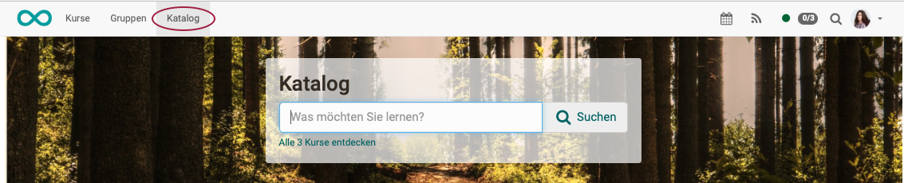{ class="shadow lightbox" title="Katalog in der Hauptnavigation" }

### b) Ohne Registrierung (externer Web-Katalog) {: #catalog_where_nonreg}

In OpenOlat können auch Angebote hinterlegt werden, die in einem externen Katalog angezeigt werden. "Extern" bedeutet, dass der Katalog nach ausserhalb der "Registrierungsmauer" gespiegelt wird und dort ohne Registrierung aufgerufen werden kann. Die Ausgangsversion des Katalogs (innerhalb der "Registrierungsmauer"), die nur von registrierten Benutzer:innen aufgerufen werden kann, muss ein Katalog V2 sein. Ein Katalog V1 kann nicht als externer Katalog angezeigt werden.

Benutzer:innen können dann diese Kurse auswählen und buchen. Sie werden erst nach einer getroffenen Wahl durch den Registrierungsprozess geführt (um Arbeitsergebnisse speichern zu können).

Bei bereits in OpenOlat registrierten Benutzer:innen wird der Buchungsauftrag ihrem bestehenden Konto zugeordnet. Der Buchungsauftrag wird anschliessend bestätigt.

Der externe Katalog kann auf dem Login-Screen angeboten werden.
Der Link kann aber auch an anderer Stelle z.B. in eine Website eingebaut oder per Mail verschickt werden.
Auch [direkte Links zu einem bestimmten Angebot](../../manual_user/area_modules/catalog2.0_web.de.md#web_catalog_direct_link) können verschickt werden.

{ class="shadow lightbox" title="Login-Seite mit Zugang zum externen Katalog" }

[Weitere Informationen zum externen Katalog >](../../manual_user/area_modules/catalog2.0_web.de.md)

!!! info "Wichtig"

    In OpenOlat gibt es 2 Versionen des Katalogs: [Katalog 1.0](../../manual_user/area_modules/catalog1.0.de.md) und [Katalog 2.0](../../manual_user/area_modules/catalog2.0.de.md).
    Die nachstehenden Ausführungen beschreiben das Vorgehen im **Katalog 2.0**.

[zum Seitenanfang ^](#catalog)

---

## Was kann ich im OpenOlat-Katalog anzeigen?  {: #catalog_what}

Der OpenOlat-Katalog listet **Kurzbeschreibungen zu Kursen und Lernressourcen** auf. Es können bereits auf der Startseite einzelne Kacheln angezeigt werden. Unter den **Kategorien** befinden sich **Microsites**, auf denen dann weitere Einzelbeschreibungen (Kacheln) zu finden sind.

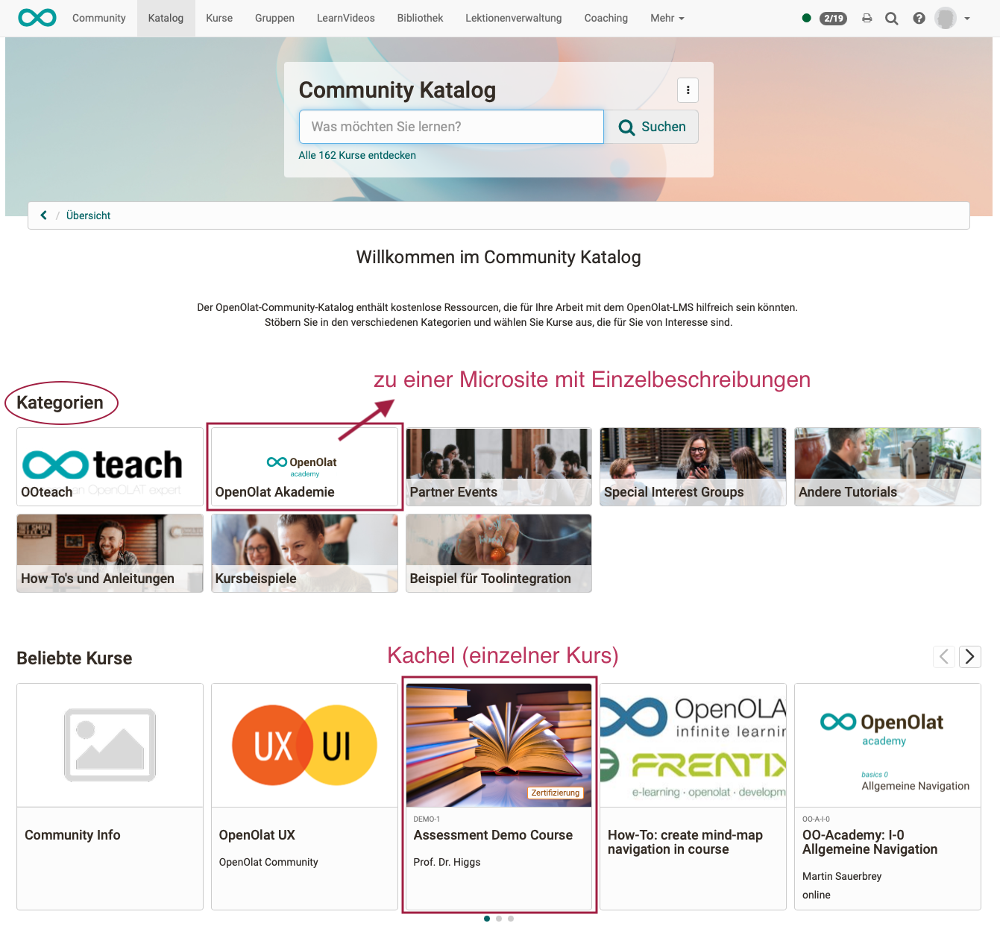{ class="shadow lightbox" title="Startseite eines Katalogs" }

Die Angaben in den Kurzbeschreibungen stammen aus den Angaben, die Autor:innen beim Erstellen eines Kurses oder einer Lernressource in den [Einstellungen](../../manual_user/learningresources/Course_Settings.de.md) machen (Tab "Info" und Tab "Metadaten"). Meistens sind es Angaben, die Teilnehmende auch auf der Infoseite zu einem Kurs finden.

Die **Gestaltung** des Katalogs legen [Administrator:innen](../../manual_admin/administration/Modules_Catalog_2.0.de.md) fest. Wurde z.B. bestimmt, dass in den Katalogeinträgen eine Angabe zum Durchführungsformat angezeigt werden soll, holt sich OpenOlat diese Information aus den Angaben der Autor:innen unter "Einstellungen" und zeigt sie an der vorgesehenen Stelle auf der Katalogkachel an.

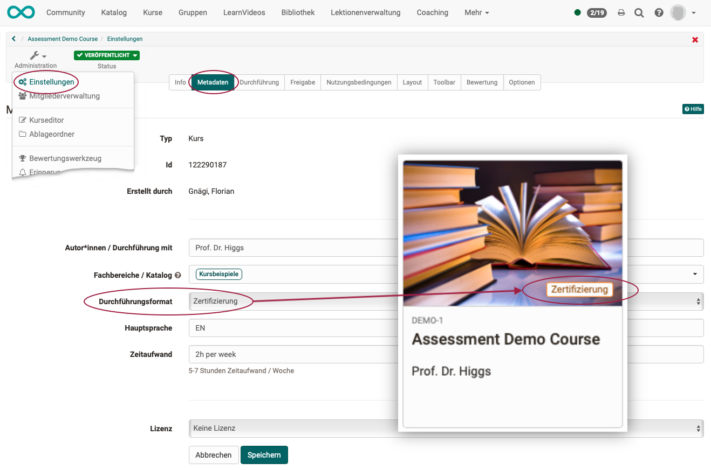{ class="shadow lightbox" title="Tab Metadaten in den Kurseinstellungen" }

Angaben, die im Katalog-Layout nicht vorgesehen sind, können also beim Katalog 2.0 nicht von den Autor:innen völlig frei ergänzt werden. Das garantiert aber andererseits ein einheitliches geordnetes Aussehen des Katalogs. Wenden Sie sich an die Administrator:innen, wenn Sie Wünsche zur Gestaltung der Katalog-Kacheln haben.

[zum Seitenanfang ^](#catalog)

---

## Wie wird entschieden, was im Katalog angezeigt wird? {: #catalog_decision}

Es werden nicht automatisch alle vorhandenen Kurse und Lernressourcen im Katalog aufgeführt. Ob ein Katalogeintrag erzeugt wird, entscheiden die Besitzer:innen des Kurses, also die Autor:innen, die in der Mitgliederverwaltung des Kurses als Besitzer:in eingetragen sind. Lernressourcenverwalter:innen können das für alle Kurse ihrer Organisation.

Die Besitzer:innen müssen dazu

a) den Kurs für den Katalog **freigeben** und

b) ein [Angebot formulieren](../../manual_user/learningresources/Access_configuration.de.md), mit dem der Kurs oder die Lernressource im Katalog beworben wird.

Die Freigabe finden Sie in der Administration Ihres Kurses unter: 
`Kurs > Administration > Einstellungen > Tab "Freigabe"`

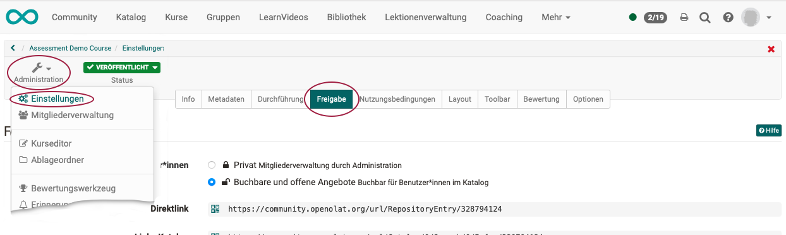{ class="shadow lightbox" title="Tab Freigabe in den Kurseinstellungen" }

Steht im Feld "Zugang für Teilnehmer:innen" die Option "Privat", erscheint der Kurs nirgends im Katalog. Im ersten Schritt wählen Sie deshalb die Option "Buchbare und offene Angebote - Buchbar für Benutzer:innen im Katalog" und ermöglichen so die Anzeige Ihres Kurses im Katalog.

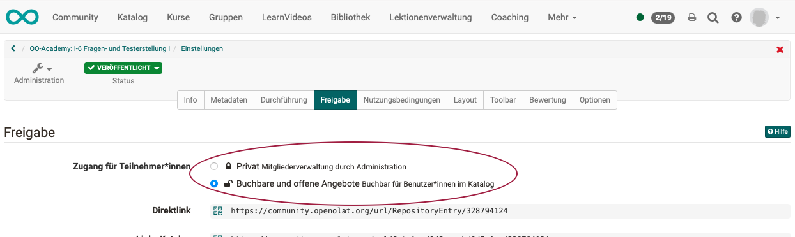{ class="shadow lightbox" title="Feld Zugang für Teilnehmer:innen im Tab Freigabe" }

Ob und wo der Kurs im Katalog erscheint, wird dann im zweiten Schritt durch die Erstellung von Angeboten festgelegt. Im unteren Bereich können Sie ein oder mehrere Angebote für den Katalog erstellen.

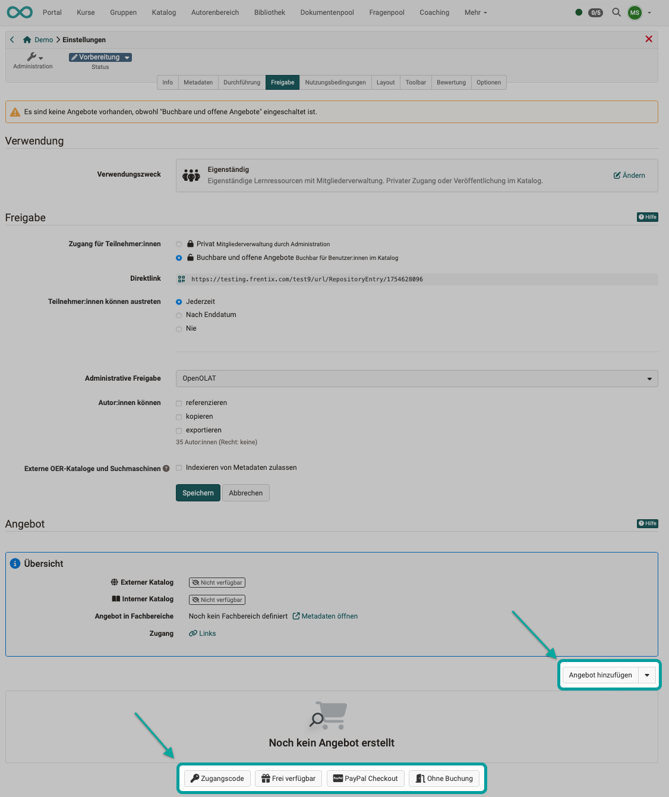{ class="shadow lightbox" title="Bereich Angebot im Tab Freigabe" }

!!! info "Wichtig"

    Ein Angebot ist standardmässig verfügbar, sobald der Kurs den Status "Veröffentlicht" hat. Wählen Sie im Angebot unter "Verfügbar wenn" die Option "Benutzerdefinierte Bedingung", kann das Angebot auch in einem anderen Kursstatus oder ab einem bestimmten Zeitpunkt verfügbar sein, etwa für einen Kurs, der noch in Vorbereitung ist.

[zum Seitenanfang ^](#catalog)

---

## Angebote erstellen  {: #catalog_create_offer}

!!! info "Wichtig"

    Im Katalog 1.0 enthalten die Einstellungen eines Kurses den Tab "Katalog", in dem Sie den Kurs einer Katalogkategorie zuordnen.
    Im Katalog 2.0 legen Sie die Anzeige im Katalog im Tab "Freigabe" fest, in Form von Angeboten.

Klicken Sie auf den Button "Angebot hinzufügen", erhalten Sie eine Vorauswahl möglicher Angebotsarten.

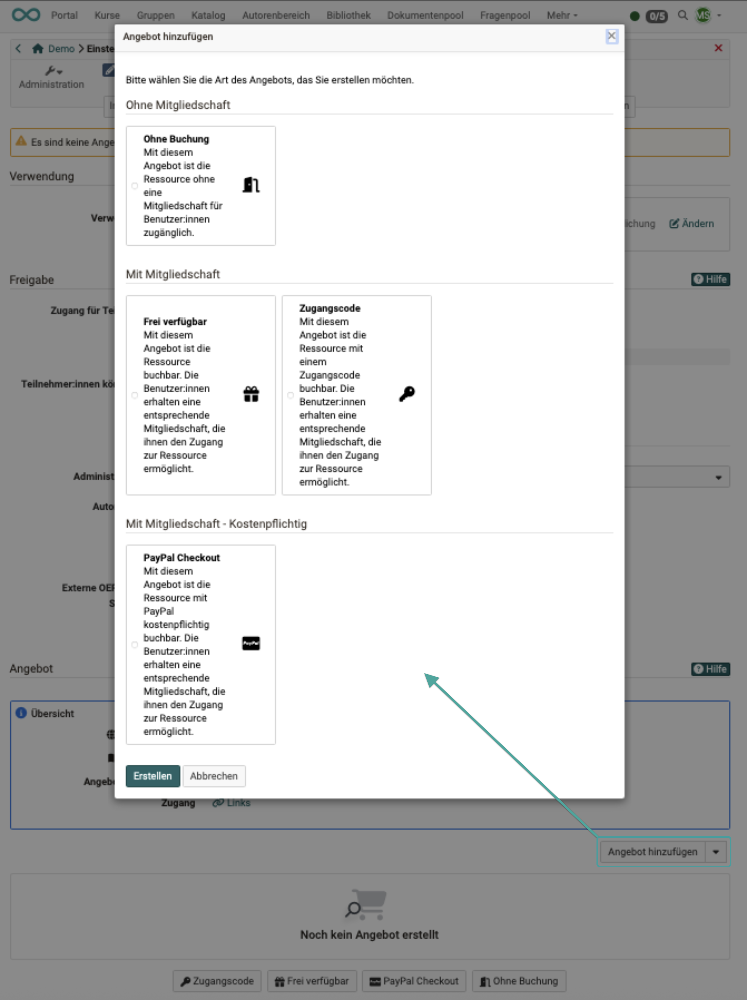{ class="shadow lightbox" title="Dialog Angebot hinzufügen" }

!!! info "Wichtig"

    Ist der Button "Angebot hinzufügen" inaktiv, steht das Feld "Zugang für Teilnehmer:innen" noch auf "Privat".

Wählen Sie die gewünschte Angebotsart.

Sie können mehrere Angebote erstellen. Sie können z.B. für eine bestimmte Organisationseinheit einen Kurs frei zugänglich machen, während er mit einem zweiten Angebot für andere kostenpflichtig angeboten wird.

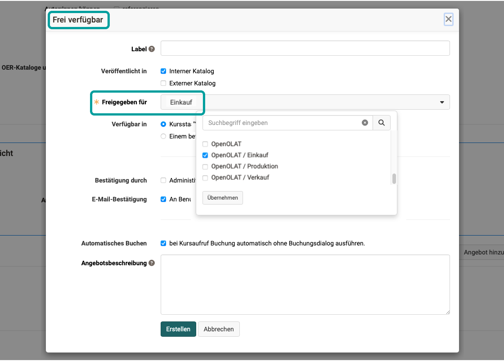{ class="shadow lightbox" title="Dialog Frei verfügbar" }
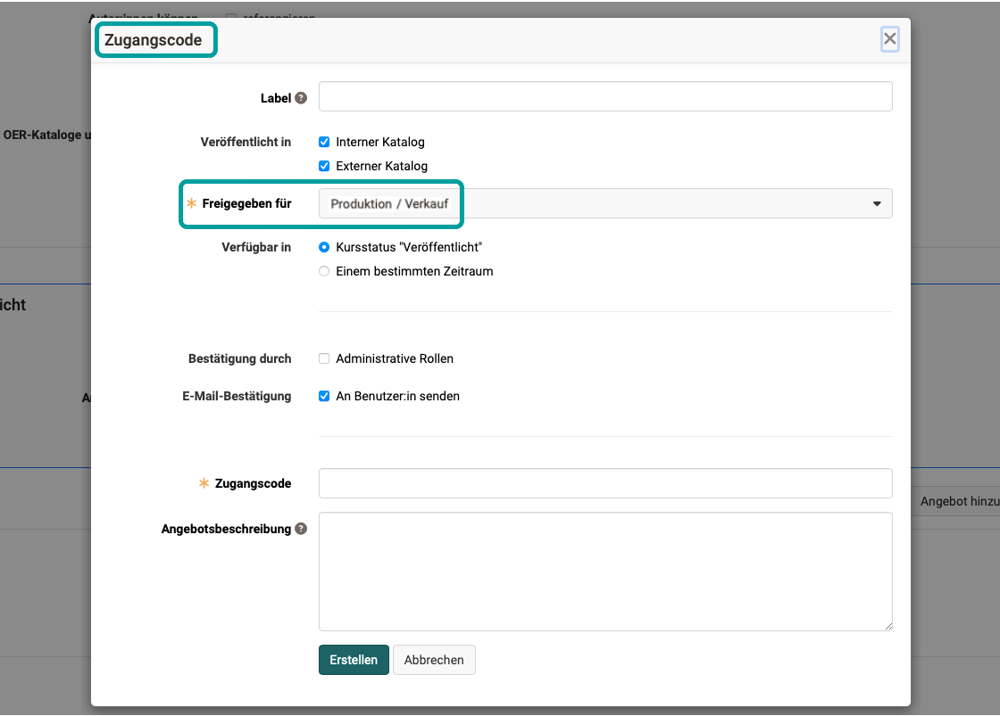{ class="shadow lightbox" title="Dialog Zugangscode" }
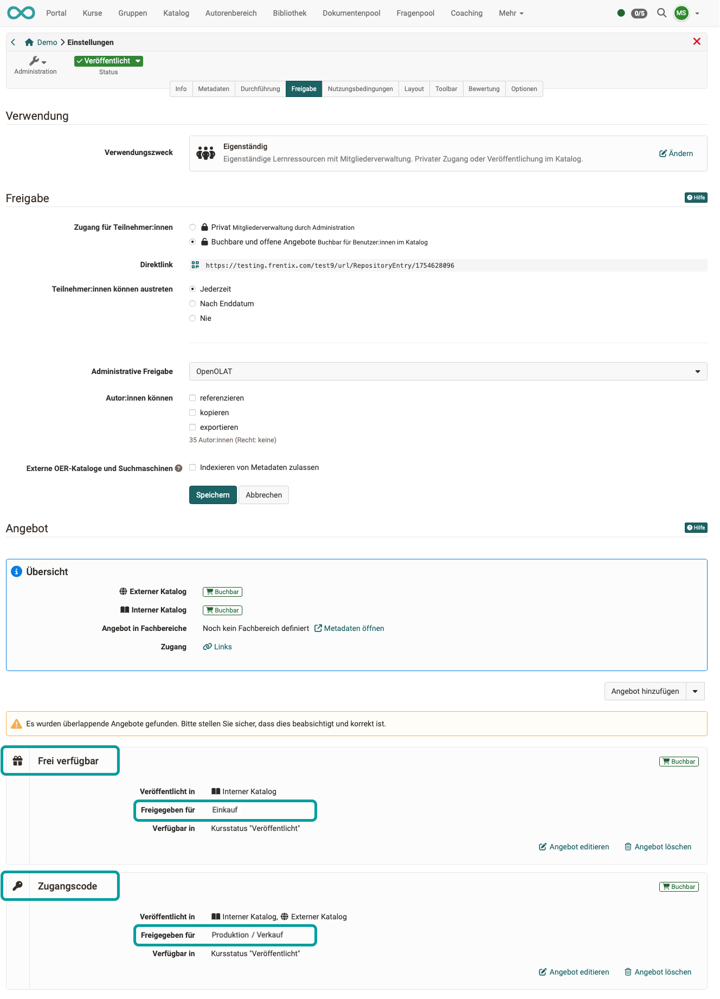{ class="shadow lightbox" title="Angebote im Tab Freigabe" }

[zum Seitenanfang ^](#catalog)

---

## Der Katalogaufbau {: #catalog_structure}

Die Gestaltung des Katalogs wird einerseits durch die Angebote der Besitzer:innen bestimmt und andererseits durch die Vorgaben der Administrator:innen.

Besitzer:innen des Kurses:

1. Kurs oder Lernressource im Autorenbereich erstellen.
2. Dem Kurs in den Metadaten Fachbereiche zuordnen: 
`Kurs > Administration > Einstellungen > Tab "Metadaten" > Feld "Fachbereiche / Katalog"`
3. Angebote erstellen: 
`Kurs > Administration > Einstellungen > Tab "Freigabe" > Button "Angebot hinzufügen"`
4. Bei Bedarf im Angebot unter "Freigegeben für" die Organisationen wählen, für die es gilt.

Administrator:innen in der System-Administration:

1. Die [Taxonomie](../../manual_admin/administration/Modules_Taxonomy.de.md) anlegen: 
`Administration > Module > Taxonomie`
2. Bei Bedarf [Organisationen](../../manual_admin/administration/Modules_Organisations.de.md) anlegen: 
`Administration > Module > Organisationen`
3. Den Katalog einschalten und die Taxonomie des Katalogs wählen: 
`Administration > Module > Katalog > Tab "Einstellungen"`
4. Launcher erstellen und den Katalog gestalten: 
`Administration > Module > Katalog > Tab "Startseite"`

Im Katalog V2 werden Abschnitte mit Katalogeinträgen (Kacheln, Karten) als Launcher bezeichnet.

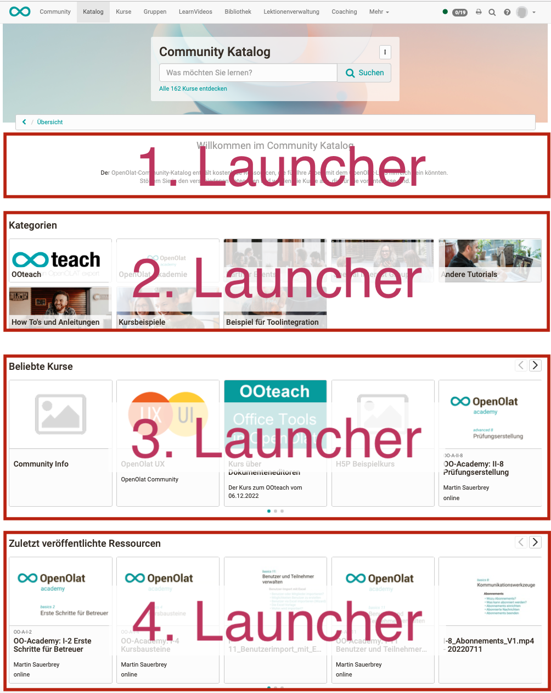{ class="shadow lightbox" title="Launcher auf der Startseite des Katalogs" }

Innerhalb der Launcher (diesen Abschnitten im Katalog) können die Katalogeinträge nach bestimmten Kriterien zusammengestellt werden (je nach Launchertyp und Launcherkonfiguration).
Sie werden deshalb als Launcher (engl. Starter, Startrampe) bezeichnet, weil in ihnen die Katalogeinträge (Kacheln, Karten) meistens dynamisch zusammengestellt werden.

**Launcher mit Unterordnern/Kategorien:** 
In einem Launcher vom Typ "Taxonomieebene" werden keine Kurse und Lernressourcen direkt angezeigt, die angezeigten Taxonomieebenen entsprechen vielmehr Ordnern, in denen dann erst die Kurse und Lernressourcen zu finden sind. Aufgelistet in einer Microsite, die sich beim Klick auf eine der Taxonomieebenen in einem Taxonomie-Launcher öffnet. 
(Beispiel: der Launcher "Kategorien" im Bild oben.)

[zum Seitenanfang ^](#catalog)

---

## Wie beeinflusse ich als Autor:in, in welchem Launcher mein Kurs angezeigt wird? {: #catalog_launcher_decision}

Alle Angebote, die die Kriterien für einen bestimmten Launcher erfüllen, werden in diesem Launcher angezeigt. Als Besitzer:in des Kurses beeinflussen Sie also die Anzeige, indem Sie

* die entsprechenden **Anzeigekriterien** in Ihrem Kurs angeben: `Kurs > Administration > Einstellungen`
* und entsprechende **Angebote** erstellen.

**Beispiel 1:**

Ein Launcher ist (von den Administrator:innen) nur für Mitglieder einer bestimmten Organisationseinheit vorgesehen und wird nur diesen angezeigt. Erstellen Sie als Autor:in ein Angebot, das nur für diese bestimmte Organisationseinheit gilt, erscheint es in diesem Launcher.

**Beispiel 2:**

In einem Launcher werden (von den Administrator:innen so festgelegt) nur Angebote angezeigt, die ein bestimmtes Stichwort der Taxonomie enthalten. Als Autor:in tragen Sie in den Metadaten Ihres Kurses den Taxonomiebegriff ein. Beim Erstellen eines Angebots sehen Sie, dass dieser Taxonomiebegriff zugeordnet ist. Das Angebot erscheint also automatisch in Launchern, die für Kurse mit diesem Taxonomiebegriff vorgesehen sind.

[zum Seitenanfang ^](#catalog)

---

## Checkliste {: #checklist}

- [x] Sind interner und/oder externer Katalog generell von den Administrator:innen instanzweit aktiviert?
- [x] Wurden Launcher eingerichtet, in denen Angebote gezeigt werden?
- [x] Wurden in den Kursen jeweils mindestens 1 Angebot erstellt?
- [x] Wurden den Kursen Taxonomiebegriffe zugeordnet?
- [x] Werden die Kurse im richtigen Launcher angezeigt?
- [x] Sind die Kurse für den Katalog bereits im Status "Veröffentlicht"?
- [x] Sollen manche Kurse vorerst bewusst noch im Status "Vorbereitung" bleiben?
- [x] Wurde die Reihenfolge der Launcher im Katalog korrekt festgelegt?
- [x] Wurden für die Kurse Durchführungszeiträume festgelegt?
- [x] Sollen die Angebote jeweils in beiden Katalogen (intern und extern) angezeigt werden?
- [x] Ist in den Angeboten festgelegt, dass sie nur für Mitglieder bestimmter Organisationseinheiten sichtbar sein sollen?
- [x] Wurde die Anzeige im Katalog mit verschiedenen Rollen (z.B. Zugehörigkeit zu einer bestimmten Organisationseinheit) geprüft?
- [x] Sollen Angebote nur während einem bestimmten Zeitraum im Katalog sichtbar sein?
- [x] Wurde in allen Kursen, die im Katalog angezeigt werden sollen, die Freigabe in den Kurseinstellungen auf "Buchbare und offene Angebote" gesetzt?
- [x] Sollen im Katalog auch Durchführungen aus dem Course Planner angeboten werden?
- [x] Sind bereits Kurse in den Durchführungen eingebunden? (Durchführungen können zunächst auch ohne eingebundenen Kurs angeboten werden.)
- [x] Sollen manche Kurse im Katalog kostenpflichtig angeboten werden? Ist ggf. das Zahlungsmodul aktiviert?

[zum Seitenanfang ^](#catalog)

---

## Weiterführende Informationen {: #further_information}

**Auf dieser Seite erwähnt** 
[Wie erstelle ich meinen ersten OpenOlat-Kurs? >](../my_first_course/my_first_course.de.md) 
[Katalog 2.0: Übersicht >](../../manual_user/area_modules/catalog2.0.de.md) 
[Extern verfügbarer Katalog >](../../manual_user/area_modules/catalog2.0_web.de.md) 
[Katalog 1.0 >](../../manual_user/area_modules/catalog1.0.de.md) 
[Kurseinstellungen >](../../manual_user/learningresources/Course_Settings.de.md) 
[Modul Katalog >](../../manual_admin/administration/Modules_Catalog_2.0.de.md) 
[Zugangskonfiguration / Freigabe >](../../manual_user/learningresources/Access_configuration.de.md) 
[Modul Taxonomie >](../../manual_admin/administration/Modules_Taxonomy.de.md) 
[Modul Organisationen >](../../manual_admin/administration/Modules_Organisations.de.md)

**Weiterführend** 
[Katalog 2.0 - Angebote >](../../manual_user/area_modules/catalog2.0_angebote.de.md) 
[Katalog 2.0 - Design >](../../manual_user/area_modules/catalog2.0_design.de.md) 
[Kurseinstellungen - Tab Metadaten >](../../manual_user/learningresources/Course_Settings_Metadata.de.md) 
[Angebotskonzepte >](../../manual_user/basic_concepts/Offer_Concepts.de.md)

[zum Seitenanfang ^](#catalog)
