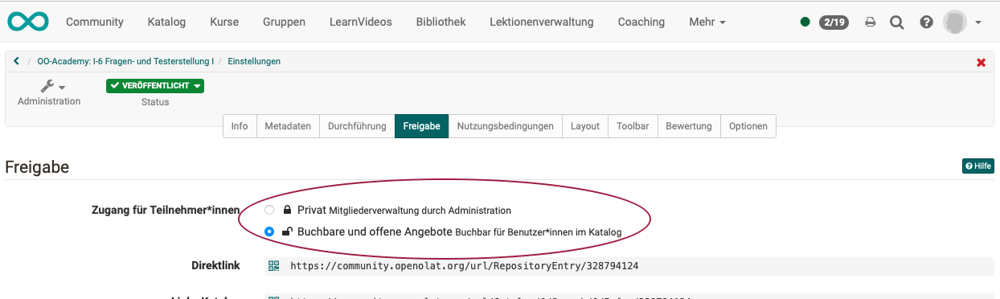

# Wie zeige ich meine Kurse im OpenOlat-Katalog?

## Wo finde ich den OpenOlat-Katalog?

OpenOlat-Benutzer sehen in der Kopfzeile meistens „Kurse“ und „Gruppen“, wenn sie Teilnehmer sind. Autoren sehen zusätzlich den „Autorenbereich“. Aber die Optionen in der Kopfzeile können variieren. Je nach Rolle oder aktivierten Modulen, können weitere Einträge in der Kopfzeile dazu kommen. So z.B. auch der Katalog. Wurde von ihrem Administrator der Katalog aktiviert, finden Sie den Eintrag „Katalog“ im Menü der Kopfzeile.	Wird kein Katalog im Menü angezeigt, wenden Sie sich bitte an Ihren Administrator.

{ class="shadow lightbox" }  

!!! tip "Hinweis"

    In OpenOlat gibt es 2 Versionen des Katalogs: Katalog 1.0 und Katalog 2.0
	Die nachstehenden Ausführungen beschreiben das Vorgehen im Katalog 2.0.

---

## Was kann ich im OpenOlat-Katalog anzeigen?

Der OpenOlat-Katalog listet <b>Kurzbeschreibungen zu Kursen und Lernressourcen</b> auf. Es können bereits auf der Startseite einzelne Kacheln angezeigt werden. Unter den Katagorien befinden sich Microsites, auf denen dann die Einzelbeschreibungen zu finden sind. 

{ class="shadow lightbox" } 

Die Angaben in den Kurzbeschreibungen werden jeweils den Angaben entnommen, die Autoren beim Erstellen eines Kurses oder einer Lernressource in den <b>Einstellungen</b> machen.
Meistens sind es Angaben, die Kursteilnehmer auch auf der Infoseite zu einem Kurs finden.

Die Gestaltung des Katalogs wird vom Administrator festgelegt. Wurde z.B. bestimmt, dass in den Katalogeinträgen eine Angabe zum Durchführungsformat angezeigt werden soll, holt sich OpenOlat diese Information aus den Angaben der Autorin / des Autors unter „Einstellungen“ und zeigt sie an der vorgesehenen Stelle auf der Katalogkachel an.

{ class="shadow lightbox" } 

Angaben, die im Katalog-Layout nicht vorgesehen sind, können also nicht von den Autor:innen völlig frei ergänzt werden. Das garantiert aber andererseits ein einheitliches geordnetes Aussehen des Katalogs. Wenden Sie sich an Ihren Administrator, wenn Sie Wünsche zur Gestaltung der Katalog-Kacheln haben.

---

## Wie wird entschieden, was im Katalog angezeigt wird?

Es werden nicht automatisch alle vorhandenen Kurse und Lernressourcen im Katalog aufgeführt. Ob ein Katalogeintrag erzeugt wird, entscheidet die Autorin oder der Autor des Kurses.

<b>Die Autorin / der Autor  muss dazu

a) den Kurs für den Katalog frei geben und

b) ein Angebot formulieren, mit dem der Kurs oder die Lernressource im Katalog beworben wird.
</b>

 
Wählen Sie Ihren Kurs und dann das Icon „Administration“. Dort finden Sie unter „Einstellungen“ auch den Reiter „Freigabe“.

{ class="shadow lightbox" }

Enthält Ihr Kurs als Buchungsmethode „privat“ bedeutet das, dass er nirgends im Katalog erscheinen soll. Im ersten Schritt müssen Sie also die Buchungsmethode „Buchbare und offene Angebote - Buchbar für Benutzer*innen im Katalog“ wählen und so die Anzeige Ihres Kurses im Katalog prinzipiell ermöglichen.

{ class="shadow lightbox" }

Ob und wo der Kurs im Katalog erscheint, wird dann im zweiten Schritt durch die Erstellung von Angeboten festgelegt. Im unteren Bereich können Sie ein oder mehrere Angebote für den Katalog erstellen.

{ class="shadow lightbox" }

!!! tip "Hinweis"

    Man könnte annehmen, dass nur Kurse mit dem Status „Veröffentlicht“ im Katalog enthalten sein können. Im Katalog 2.0 können jedoch auch bereits Angebote angezeigt werden, wenn die Kurse noch nicht veröffentlicht sind und erst ab einem bestimmten Zeitpunkt zugänglich werden.

---

## Angebote erstellen 

!!! tip "Hinweis"

    Vor OpenOlat 17 ist in den Einstellungen ein Reiter „Katalog“ enthalten und es konnten noch keine Angebote erstellt werden. In aktuelleren OpenOlat-Versionen werden die Einstellungen für die Anzeige im Katalog im Reiter „Freigabe“ gemacht. (In Form von Angeboten.)

Klicken Sie auf den Button „Angebot hinzufügen“, erhalten Sie eine Vorauswahl möglicher Angebotstypen.

{ class="shadow lightbox" }

!!! tip "Hinweis"

    Ist der Button „Angebot hinzufügen“ inaktiv, ist die Buchungsmethode noch als „privat“ eingestellt.

Wählen Sie den gewünschten Angebotstyp.

Sie können mehrere Angebote erstellen. Sie können z.B. für eine bestimmte Organisationseinheit einen Kurs frei zugänglich machen, während er mit einem zweiten Angebot für andere kostenpflichtig angeboten wird.

{ class="shadow lightbox" }
{ class="shadow lightbox" }
{ class="shadow lightbox" }

---

## Der Katalogaufbau 

Die Gestaltung des Katalogs wird einerseits durch die Angebote der Autor:innen bestimmt und andererseits durch die Vorgaben der Administratorin / des Administrators.

{ class="lightbox" }

Im Katalog V2 werden Abschnitte mit Katalogeinträgen (Kacheln, Karten) als Launcher bezeichnet.

{ class="shadow lightbox" }

Innerhalb der Launcher (diesen Abschnitten im Katalog) können die Katalogeinträge nach bestimmten Kriterien zusammengestellt werden (je nach Launchertyp und Launcherkonfiguration).
Sie werden deshalb als Launcher (engl. Starter, Startrampe) bezeichnet, weil in ihnen die Katalogeinträge (Kacheln, Karten) meistens dynamisch zusammengestellt werden.

---

## Wie beeinflusse ich als Autorin/Autor, in welchem Launcher mein Kurs angezeigt wird? 

Alle Angebote, die die Kriterien für einen bestimmten Launcher erfüllen, werden in diesem Launcher angezeigt. Als Autorin oder Autor beeinflussen Sie also die Anzeige, indem Sie 

* die entsprechenden Anzeigekriterien in Ihrem Kurs angeben (Angaben unter Administration > Einstellungen)
* und entsprechende Angebote erstellen.

<b>Beispiel 1:</b>

Ein Launcher ist (vom Administrator) nur für Mitglieder einer bestimmten Organisationseinheit vorgesehen und wird nur diesen angezeigt. Erstellen Sie als Autor:in ein Angebot, das nur für diese bestimmte Organisationseinheit gilt, erscheint es in diesem Launcher.

<b>Beispiel 2:</b>

In einem Launcher werden (vom Administrator so festgelegt) nur Angebote angezeigt, die ein bestimmtes Stichwort der Taxonomie enthalten. Als Autor tragen Sie in den Metadaten Ihres Kurses den Taxonomiebegriff ein. Beim Erstellen eines Angebots sehen Sie, dass dieser Taxonomiebegriff zugeordnet ist. Das Angebot erscheint also automatisch in Launchern, die für Kurse mit diesem Taxonomiebegriff vorgesehen sind.
