# How do I present my courses in the OpenOlat catalog? {: #catalog}

??? abstract "Objectives and content of this instruction"

    The following instruction explains to you, how you can insert a course into the catalog and offer it there.

??? abstract "Target group"

    [x] Authors [ ] Coaches  [ ] Participants

    [x] Beginners [x] Advanced users  [ ] Experts

??? abstract "Expected previous knowledge"

    * You have already created a course.
    * ["How do I create my first OpenOlat course?"](../my_first_course/my_first_course.md)

---

## Where do I find the OpenOlat catalog? {: #catalog_where}

### a) As a registered user

OpenOlat users mostly see "Courses" and "Groups" in the header if they are participants. Authors additionally see "Authoring". But the options in the header can vary. Depending on the role or activated modules, more entries can be added to the header, for example, the catalog. If the [catalog 2.0](../../manual_user/area_modules/catalog2.0.md) has been activated by your administrator, you will find the entry "Catalog" in the menu of the header.	If no catalog is displayed in the menu, please contact your administrator.

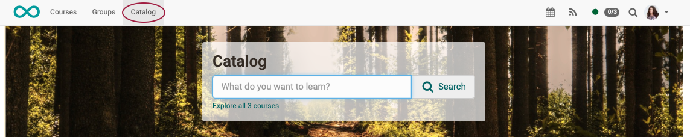{ class="shadow lightbox" }  

### b) Without registration

In OpenOlat, you can also store offers that are displayed in an external catalog. "External" means that the catalog is mirrored outside the "registration wall" and can be accessed there without registration. The initial version of the catalog (within the "registration wall"), which can only be accessed by registered users, must be a V2 catalog. A V1 catalog cannot be displayed as an external catalog.

Users can then select and book these courses. They will only be guided through the registration process after making a selection (in order to save their work).

For users already registered in OpenOlat, the booking order will be assigned to their existing account. The booking order will then be confirmed.

The external catalog can be offered on the login screen.
However, the link can also be incorporated elsewhere, e.g., into a website, or sent by e-mail. 
[Direct links to a specific offer](../../manual_user/area_modules/catalog2.0_web.md) can also be sent.

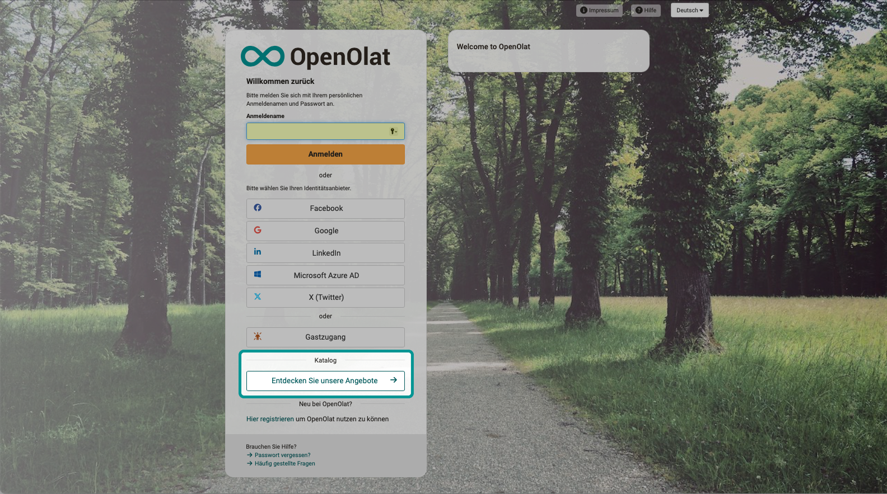{ class="shadow lightbox" } 

!!! tip "Note"

    In OpenOlat there are 2 versions of the catalog: [catalog 1.0](../../manual_user/area_modules/catalog1.0.md) and [catalog 2.0](../../manual_user/area_modules/catalog2.0.md).
	The following describes the procedure in **catalog 2.0.**

[To the top of the page ^](#catalog)

---

## What can I show in the OpenOlat catalog? {: #catalog_what}

The OpenOlat catalog lists **short descriptions of courses and learning resources**. Individual tiles can already be displayed on the start page. Under the **categories** are **microsites**, on which further individual descriptions (tiles) can be found.

{ class="shadow lightbox" } 

The information in the short descriptions is taken from the information that authors provide when creating a course or learning resource in the [settings](../../manual_user/learningresources/Course_Settings.md) (tab "Info" + tab "Metadata") 
In most cases, the information is the same information that course participants will find on the information page of the course.

The **layout** of the catalog is determined by the [administrator](../../manual_admin/administration/Modules_Catalog_2.0.md). If, for example, it has been determined that an indication of the execution format should be displayed in the catalog entries, OpenOlat retrieves this information from the author's details under "Settings" and displays it in the designated place on the catalog tile.

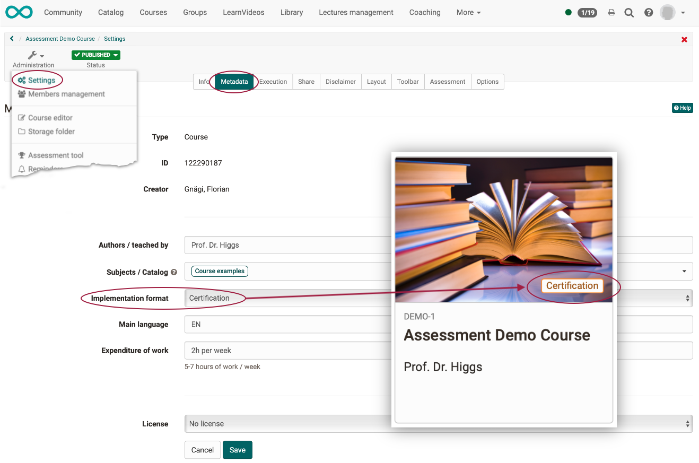{ class="shadow lightbox" } 

The author is therefore not completely free to add further information to the information specified in the catalog layout. On the other hand, this guarantees a uniform, orderly appearance of the catalog. Please contact your administrator if you have any wishes regarding the layout of the catalog tiles.

[To the top of the page ^](#catalog)

---

## How is it decided what to display in the catalog?  {: #catalog_decision}

Not all existing courses and learning resources are automatically listed in the catalog. The author of the course decides whether a catalog entry is created.

<b>The author must for this purpose

a) **release** the course for the catalog and

b) create an [offer](../../manual_user/learningresources/Access_configuration.md) that promotes the course or learning resource in the catalog.

Select your course and then the "Administration" icon. There you will also find the tab "Share" under "Settings".

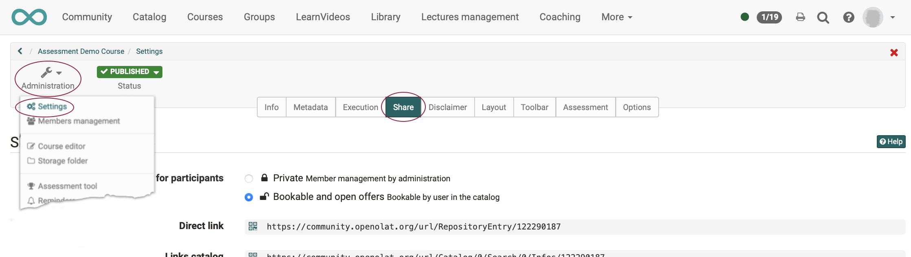{ class="shadow lightbox" }

If your course contains "Private" as offer type, it also means, that it should not appear anywhere in the catalog. So in the first step you have to select the offer type "Bookable and open offers - Bookable by users in the catalog" and thus enable the display of your course in the catalog in principle.

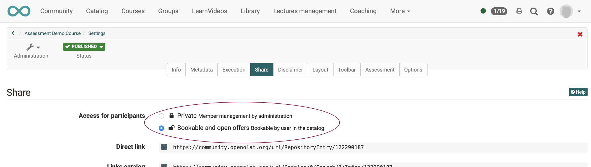{ class="shadow lightbox" }

Whether and where the course appears in the catalog is then determined in the second step by creating offers. In the lower area you can create one or more offers for the catalog.

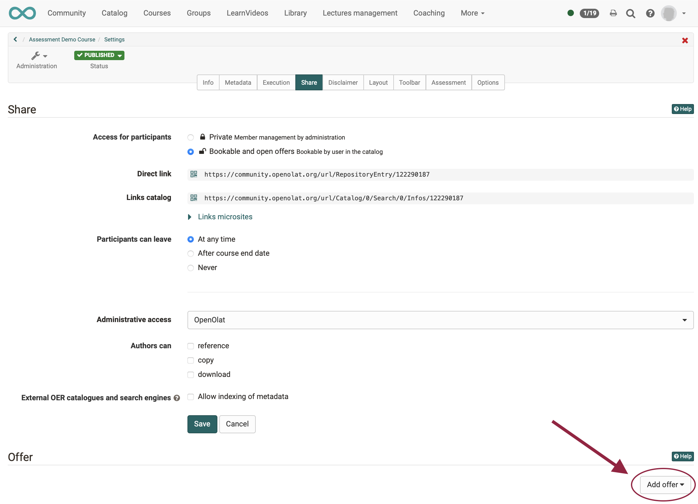{ class="shadow lightbox" }

!!! tip "Note"

    One might assume that only courses with the status "Published" can be included in the catalog. However, in catalog 2.0, offers can also be displayed even if the courses have not yet been published and will only become accessible from a certain point in time.

[To the top of the page ^](#catalog)

---

## Create offers {: #catalog_create_offer}

!!! tip "Note"

    Before OpenOlat 17 und generell bei der Verwendung des Katalog 1.0 , there was a tab "Catalog" in the settings and no offers could be created yet. 
    When using Catalog 2.0 from OpenOlat 17 onwards, the settings for the display in the catalog are made in the "Share" tab (in the form of offers).

If you click the "Add offer" button, you will get a pre-selection of possible offer types.

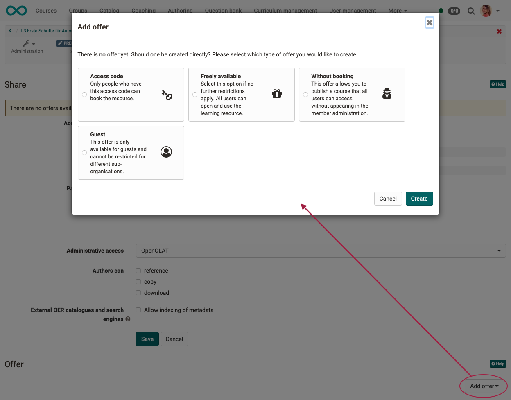{ class="shadow lightbox" }

!!! tip "Note"

    If the "Add offer" button is inactive, the offer type is still set as "private".

Choose the type of offer you want.

You can create multiple offers. For example, you can make one course freely available to a particular organizational unit, while making it available with a second offering to others for a fee.

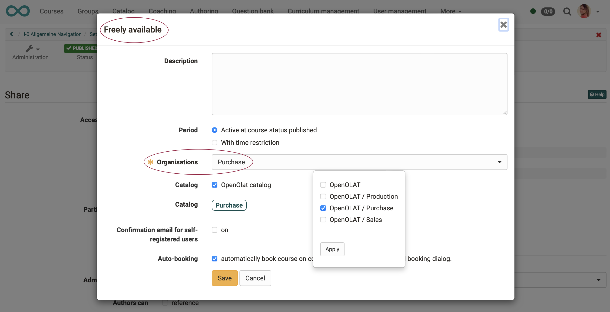{ class="shadow lightbox" }
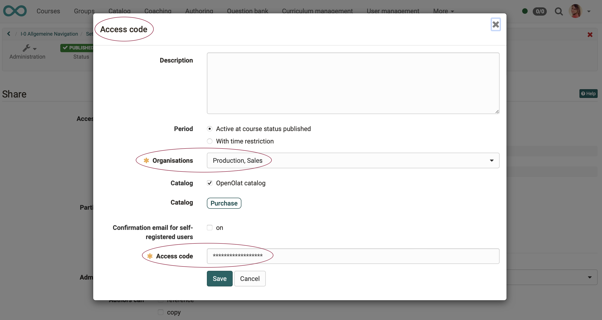{ class="shadow lightbox" }
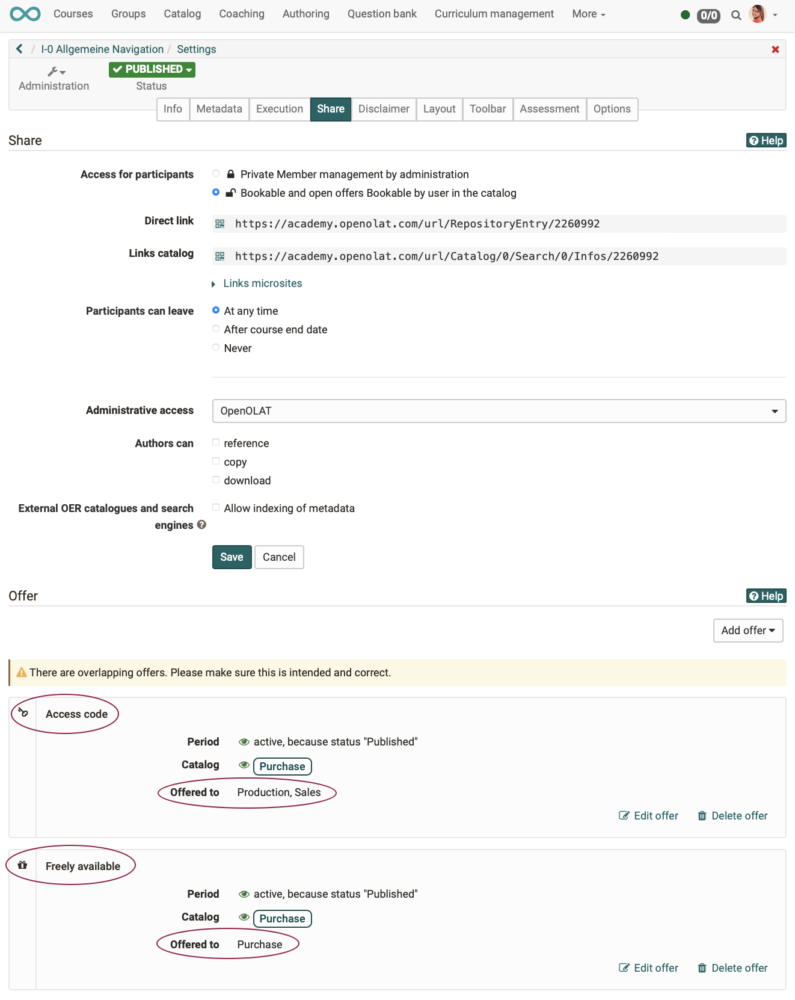{ class="shadow lightbox" }

[To the top of the page ^](#catalog)

---

## The catalog structure {: #catalog_structure}

The design of the catalog is determined on the one hand by the offers of the authors and on the other hand by the specifications of the administrator.

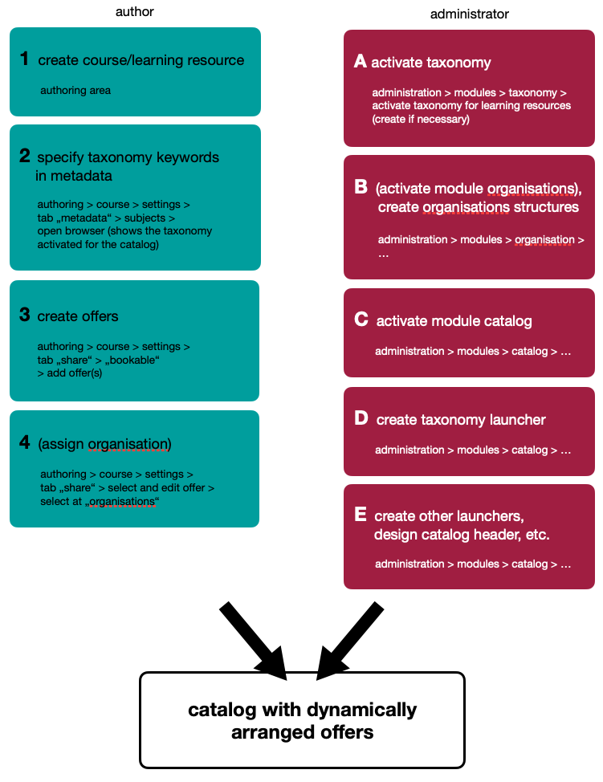{ class="lightbox" }

In catalog V2, sections with catalog entries (tiles, maps) are called launchers.

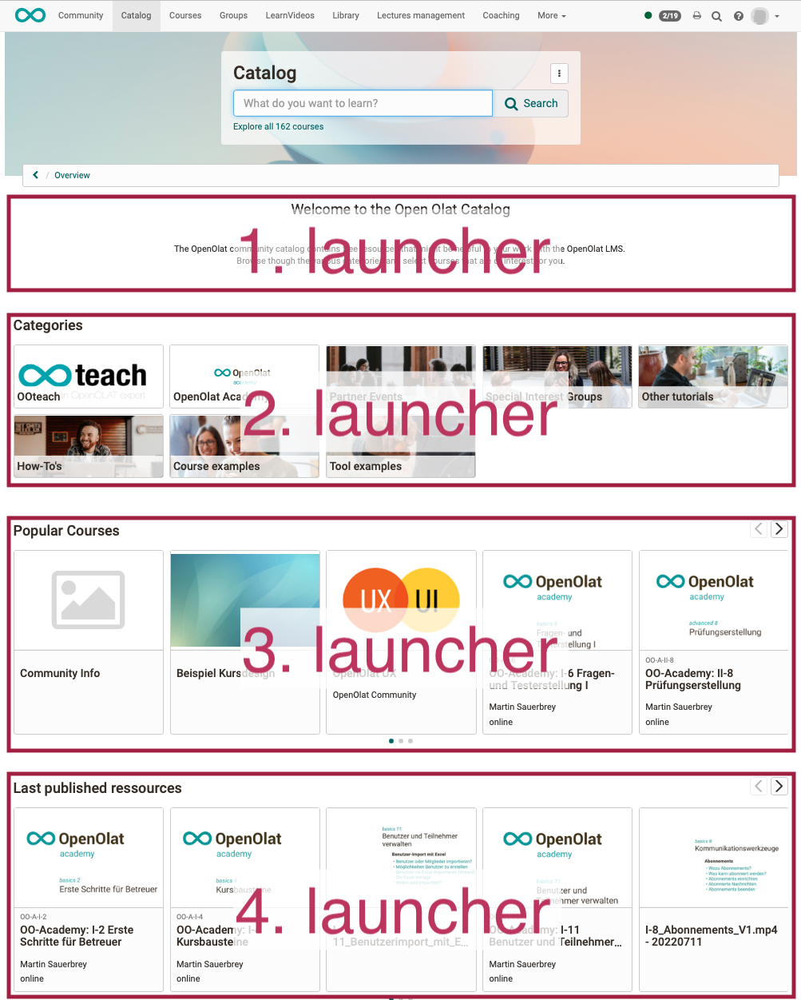{ class="shadow lightbox" }

Within the launchers (these sections in the catalog), the catalog entries can be compiled according to certain criteria (depending on the launcher type and launcher configuration).
They are called launchers because the catalog entries (tiles, cards) are usually dynamically compiled in them.

[To the top of the page ^](#catalog)

---

## As an author, how do I influence in which launcher my course is displayed? {: #catalog_launcher_decision}

All listings that meet the criteria for a particular launcher will be displayed in that launcher. So, as an author, you influence the display by 

* specifying the appropriate **display criteria** in your course (details under Administration > Settings)
* and creating appropriate **offers**.

**Example 1:**

A launcher is intended (by the administrator) only for members of a specific organizational unit and is displayed only to them. If you as author create an offer that is only valid for this specific organizational unit, it will appear in this launcher.

**Example 2:**

In a launcher, only offers that contain a specific taxonomy keyword are displayed (set this way by the administrator). As an author, you enter the taxonomy term in the metadata of your course. When you create an offer, you will see that this taxonomy term is assigned. Thus, the offer automatically appears in launchers that are intended for courses with this taxonomy term.

[To the top of the page ^](#catalog)

---

## Further information {: #further_information}

[Overview on catalog V2 >](../../manual_user/area_modules/catalog2.0.md) 
[Create offers >](../../manual_user/area_modules/catalog2.0_angebote.md) 
[Catalog design >](../../manual_user/area_modules/catalog2.0_design.md) 
[The external catalog >](../../manual_user/area_modules/catalog2.0_web.md) 
[Configure external catalog (administration manual) >](../../manual_admin/administration/Modules_Catalog_2.0.md) 

[To the top of the page ^](#catalog)