# How do I present my courses in the OpenOlat catalog? {: #catalog}

??? abstract "Objectives and content of this instruction"

    The following instruction explains to you, how you can insert a course into the catalog and offer it there.

??? abstract "Target group"

    [x] Authors [ ] Coaches  [ ] Participants

    [x] Beginners [x] Advanced users  [ ] Experts

??? abstract "Expected previous knowledge"

    * You have already created a course.
    * ["How do I create my first OpenOlat course?"](../my_first_course/my_first_course.md)

---

## Where do I find the OpenOlat catalog? {: #catalog_where}

### a) As a registered user {: #catalog_where_reg}

OpenOlat users mostly see "Courses" and "Groups" in the main navigation if they are participants. Authors additionally see "Authoring". But the sites in the main navigation can vary. Depending on the role or activated modules, more sites can be added to the main navigation, for example, the catalog. If administrators have activated the [catalog (version 2.0)](../../manual_user/area_modules/catalog2.0.md), you will find the site "Catalog" in the main navigation. If no catalog is displayed in the main navigation, please contact the administrators of your OpenOlat instance.

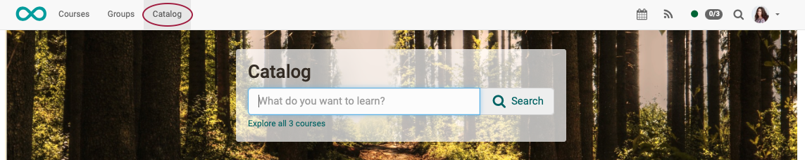{ class="shadow lightbox" title="Catalog in the main navigation" }

### b) Without registration (external Web catalog) {: #catalog_where_nonreg}

In OpenOlat, you can also store offers that are displayed in an external catalog. "External" means that the catalog is mirrored outside the "registration wall" and can be accessed there without registration. The initial version of the catalog (within the "registration wall"), which can only be accessed by registered users, must be a V2 catalog. A V1 catalog cannot be displayed as an external catalog.

Users can then select and book these courses. They will only be guided through the registration process after making a selection (in order to save their work).

For users already registered in OpenOlat, the booking order will be assigned to their existing account. The booking order will then be confirmed.

The external catalog can be offered on the login screen.
However, the link can also be incorporated elsewhere, e.g., into a website, or sent by email.
[Direct links to a specific offer](../../manual_user/area_modules/catalog2.0_web.md#web_catalog_direct_link) can also be sent.

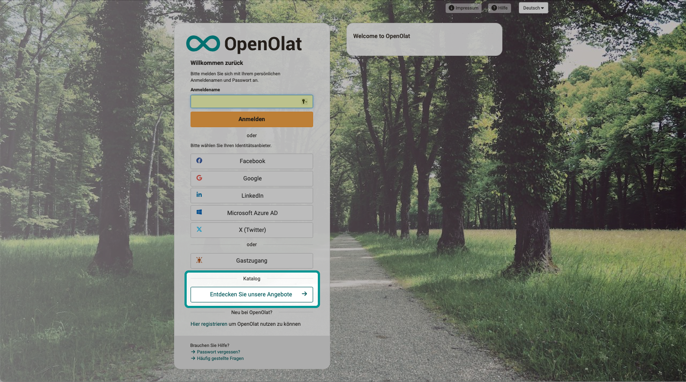{ class="shadow lightbox" title="Login page with access to the external catalog" }

[Further information on the external catalog >](../../manual_user/area_modules/catalog2.0_web.md)

!!! info "Important"

    In OpenOlat there are 2 versions of the catalog: [catalog 1.0](../../manual_user/area_modules/catalog1.0.md) and [catalog 2.0](../../manual_user/area_modules/catalog2.0.md).
    The following describes the procedure in **catalog 2.0**.

[To the top of the page ^](#catalog)

---

## What can I show in the OpenOlat catalog? {: #catalog_what}

The OpenOlat catalog lists **short descriptions of courses and learning resources**. Individual tiles can already be displayed on the start page. Under the **categories** are **microsites**, on which further individual descriptions (tiles) can be found.

{ class="shadow lightbox" title="Start page of a catalog" }

The information in the short descriptions is taken from the information that authors provide when creating a course or learning resource in the [settings](../../manual_user/learningresources/Course_Settings.md) (tab "Info" and tab "Metadata"). In most cases, it is the same information that participants find on the information page of the course.

The **layout** of the catalog is determined by the [administrators](../../manual_admin/administration/Modules_Catalog_2.0.md). If, for example, it has been determined that an indication of the implementation format should be displayed in the catalog entries, OpenOlat retrieves this information from the authors' details under "Settings" and displays it in the designated place on the catalog tile.

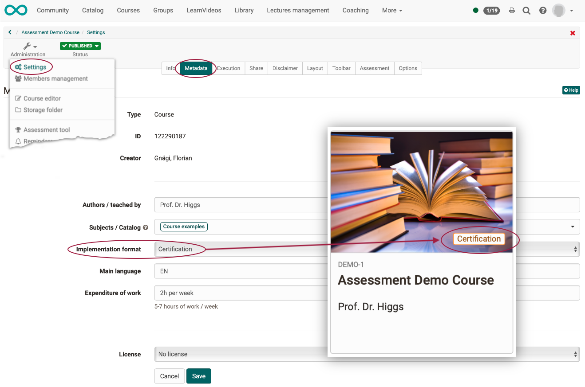{ class="shadow lightbox" title="Metadata tab in the course settings" }

Information that is not provided for in the catalog layout can therefore not be added completely freely by the authors in catalog 2.0. On the other hand, this guarantees a uniform, orderly appearance of the catalog. Please contact the administrators if you have any wishes regarding the layout of the catalog tiles.

[To the top of the page ^](#catalog)

---

## How is it decided what to display in the catalog? {: #catalog_decision}

Not all existing courses and learning resources are automatically listed in the catalog. Whether a catalog entry is created is decided by the owners of the course, that is, the authors who are entered as owner in the member management of the course. Learning resource managers can do this for all courses of their organisation.

For this purpose, the owners must

a) **share** the course for the catalog and

b) create an [offer](../../manual_user/learningresources/Access_configuration.md) that promotes the course or learning resource in the catalog.

You find the sharing in the administration of your course under: 
`Course > Administration > Settings > Tab "Share"`

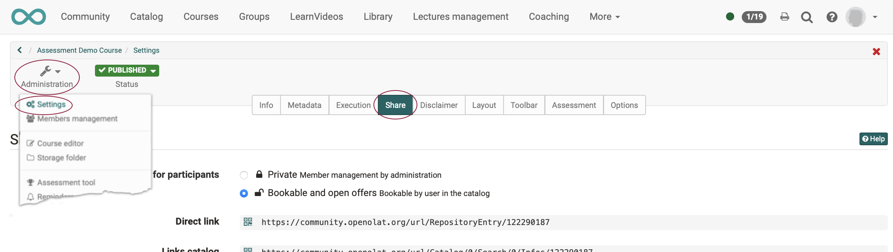{ class="shadow lightbox" title="Share tab in the course settings" }

If the field "Access for participants" is set to the option "Private", the course does not appear anywhere in the catalog. So in the first step, select the option "Bookable and open offers - Bookable by user in the catalog" and thus enable the display of your course in the catalog.

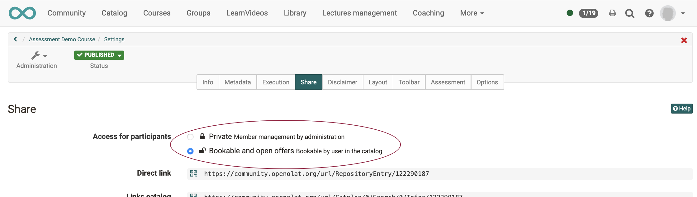{ class="shadow lightbox" title="Field Access for participants in the Share tab" }

Whether and where the course appears in the catalog is then determined in the second step by creating offers. In the lower area you can create one or more offers for the catalog.

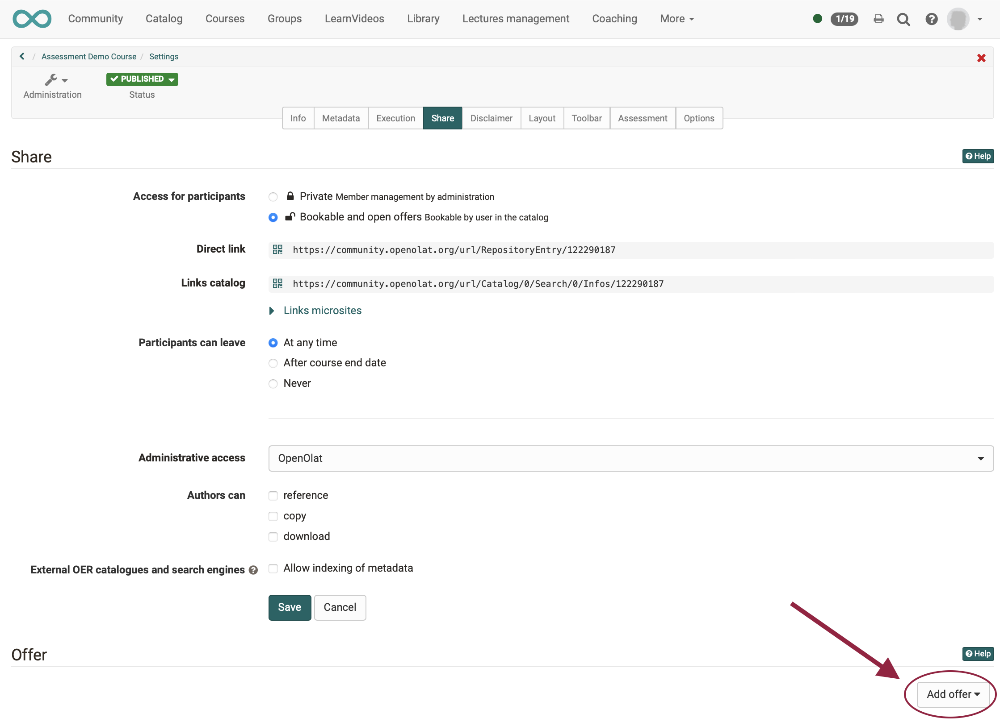{ class="shadow lightbox" title="Offer area in the Share tab" }

!!! info "Important"

    By default, an offer is available as soon as the course has the status "Published". If you select the option "Custom condition" under "Available if" in the offer, the offer can also be available in another course status or from a certain point in time, for example for a course that is still in preparation.

[To the top of the page ^](#catalog)

---

## Create offers {: #catalog_create_offer}

!!! info "Important"

    In catalog 1.0, the settings of a course contain the tab "Catalog", in which you assign the course to a catalog category.
    In catalog 2.0, you set the display in the catalog in the "Share" tab, in the form of offers.

If you click the "Add offer" button, you will get a pre-selection of possible offer types.

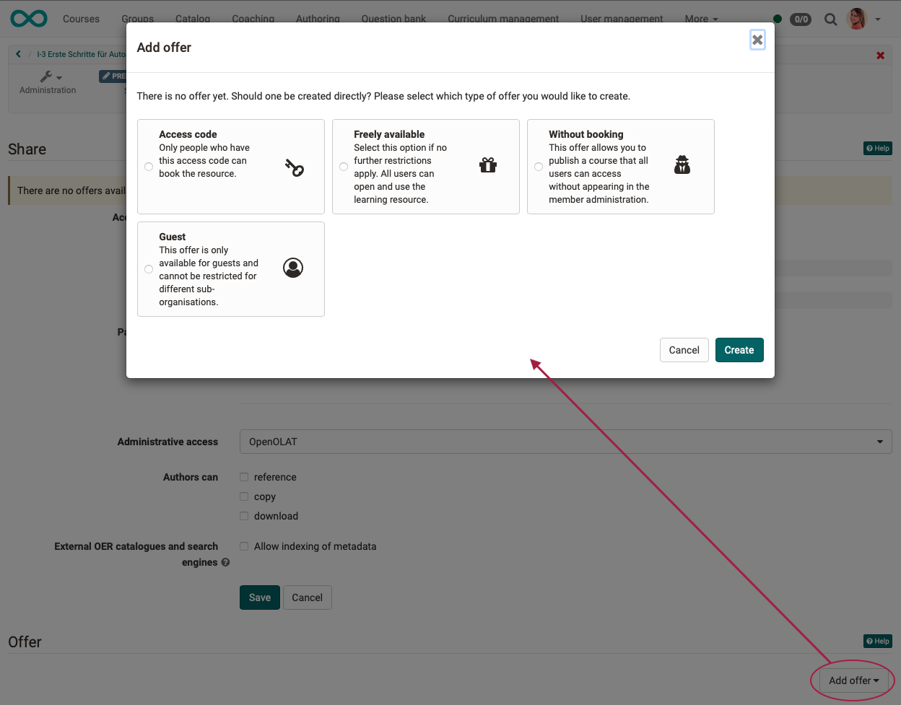{ class="shadow lightbox" title="Dialog Add offer" }

!!! info "Important"

    If the "Add offer" button is inactive, the field "Access for participants" is still set to "Private".

Choose the type of offer you want.

You can create multiple offers. For example, you can make a course freely available to a particular organizational unit, while offering it to others for a fee with a second offer.

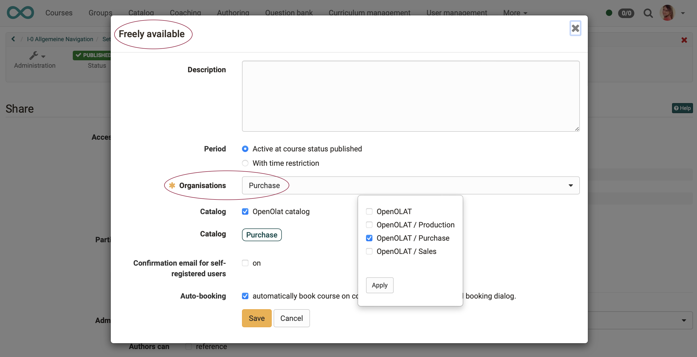{ class="shadow lightbox" title="Dialog Freely available" }
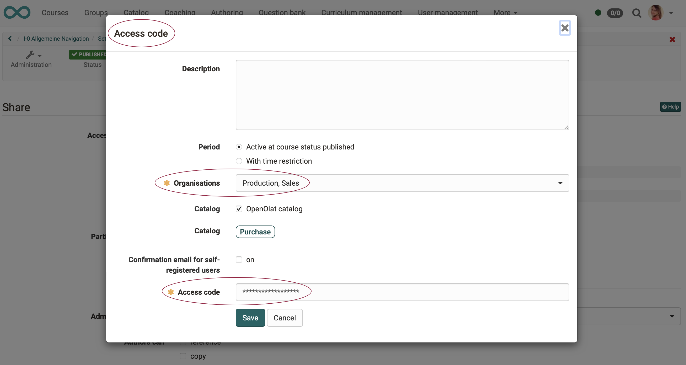{ class="shadow lightbox" title="Dialog Access code" }
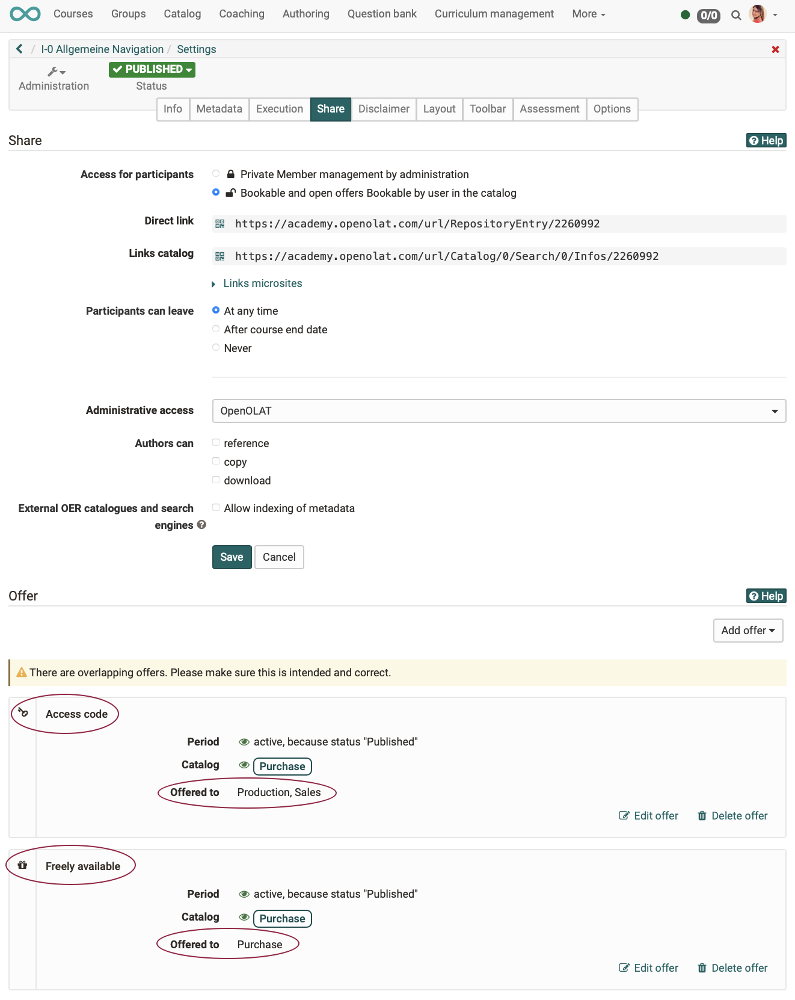{ class="shadow lightbox" title="Offers in the Share tab" }

[To the top of the page ^](#catalog)

---

## The catalog structure {: #catalog_structure}

The design of the catalog is determined on the one hand by the offers of the owners and on the other hand by the specifications of the administrators.

Owners of the course:

1. Create the course or learning resource in the authoring area.
2. Assign subjects to the course in the metadata: 
`Course > Administration > Settings > Tab "Metadata" > Field "Subjects / Catalog"`
3. Create offers: 
`Course > Administration > Settings > Tab "Share" > Button "Add offer"`
4. If necessary, select the organisations for which the offer applies under "Released for" in the offer.

Administrators in the system administration:

1. Create the [taxonomy](../../manual_admin/administration/Modules_Taxonomy.md): 
`Administration > Modules > Taxonomy`
2. If necessary, create [organisations](../../manual_admin/administration/Modules_Organisations.md): 
`Administration > Modules > Organisations`
3. Switch on the catalog and select the taxonomy of the catalog: 
`Administration > Modules > Catalog > Tab "Settings"`
4. Create launchers and design the catalog: 
`Administration > Modules > Catalog > Tab "Launch page"`

In catalog V2, sections with catalog entries (tiles, cards) are called launchers.

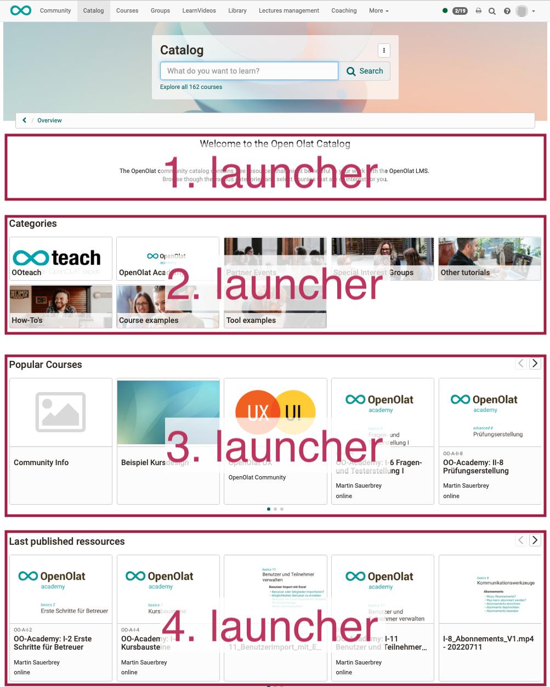{ class="shadow lightbox" title="Launchers on the start page of the catalog" }

Within the launchers (these sections in the catalog), the catalog entries can be compiled according to certain criteria (depending on the launcher type and launcher configuration).
They are called launchers (German: Starter, Startrampe) because the catalog entries (tiles, cards) are usually dynamically compiled in them.

**Launcher with subfolders/categories:** 
In a launcher of the type "Taxonomy level", courses and learning resources are not displayed directly; rather, the taxonomy levels shown correspond to folders in which the courses and learning resources can be found. They are listed on a microsite that opens when you click on one of the taxonomy levels in a taxonomy launcher. 
(Example: the launcher "Categories" in the image above.)

[To the top of the page ^](#catalog)

---

## As an author, how do I influence in which launcher my course is displayed? {: #catalog_launcher_decision}

All offers that meet the criteria for a particular launcher are displayed in that launcher. So, as an owner of the course, you influence the display by

* specifying the appropriate **display criteria** in your course: `Course > Administration > Settings`
* and creating appropriate **offers**.

**Example 1:**

A launcher is intended (by the administrators) only for members of a specific organizational unit and is displayed only to them. If you as author create an offer that is only valid for this specific organizational unit, it will appear in this launcher.

**Example 2:**

In a launcher, only offers that contain a specific taxonomy keyword are displayed (set this way by the administrators). As an author, you enter the taxonomy term in the metadata of your course. When you create an offer, you will see that this taxonomy term is assigned. Thus, the offer automatically appears in launchers that are intended for courses with this taxonomy term.

[To the top of the page ^](#catalog)

---

## Checklist {: #checklist}

- [x] Are internal and/or external catalogs generally activated system-wide by the administrators?
- [x] Have launchers been set up in which offers are shown?
- [x] Has at least 1 offer been created in each course?
- [x] Have taxonomy terms been assigned to the courses?
- [x] Are the courses displayed in the correct launcher?
- [x] Do the courses for the catalog already have the status "Published"?
- [x] Should some courses deliberately remain in the status "Preparation" for the time being?
- [x] Has the order of the launchers in the catalog been set correctly?
- [x] Have execution periods been set for the courses?
- [x] Should the offers be displayed in both catalogs (internal and external)?
- [x] Is it specified in the offers that they should only be visible to members of certain organizational units?
- [x] Has the display in the catalog been checked with different roles (e.g., membership in a specific organizational unit)?
- [x] Should offers only be visible in the catalog during a specific time period?
- [x] Has the sharing in the course settings been set to "Bookable and open offers" in all courses that are to be displayed in the catalog?
- [x] Should implementations from the Course Planner also be offered in the catalog?
- [x] Are courses already included in the implementations? (Implementations can initially also be offered without an included course.)
- [x] Should some courses in the catalog be offered for a fee? If so, is the payment module activated?

[To the top of the page ^](#catalog)

---

## Further information {: #further_information}

**Mentioned on this page** 
[How do I create my first OpenOlat course? >](../my_first_course/my_first_course.md) 
[Catalog 2.0: Overview >](../../manual_user/area_modules/catalog2.0.md) 
[Externally available catalog >](../../manual_user/area_modules/catalog2.0_web.md) 
[Catalog 1.0 >](../../manual_user/area_modules/catalog1.0.md) 
[Course Settings >](../../manual_user/learningresources/Course_Settings.md) 
[Module Catalog >](../../manual_admin/administration/Modules_Catalog_2.0.md) 
[Access configuration >](../../manual_user/learningresources/Access_configuration.md) 
[Module Taxonomy >](../../manual_admin/administration/Modules_Taxonomy.md) 
[Module Organisations >](../../manual_admin/administration/Modules_Organisations.md)

**Further reading** 
[Catalog 2.0 - Offers >](../../manual_user/area_modules/catalog2.0_angebote.md) 
[Catalog 2.0 - Design >](../../manual_user/area_modules/catalog2.0_design.md) 
[Course Settings - Tab Metadata >](../../manual_user/learningresources/Course_Settings_Metadata.md) 
[Offer concepts >](../../manual_user/basic_concepts/Offer_Concepts.md)

[To the top of the page ^](#catalog)
