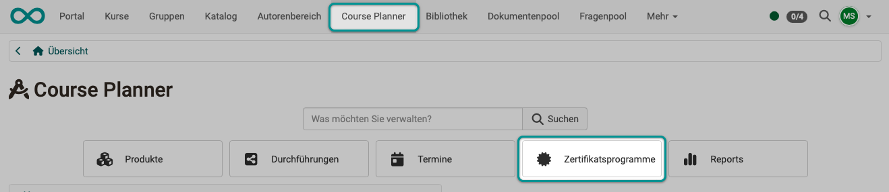
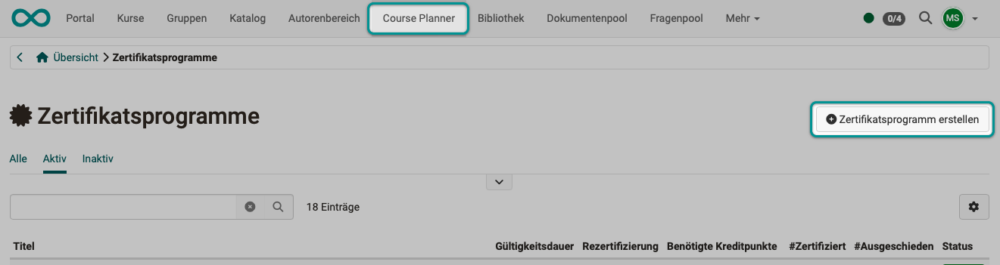
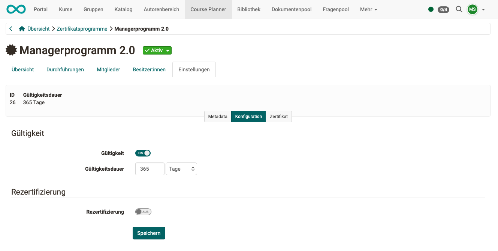
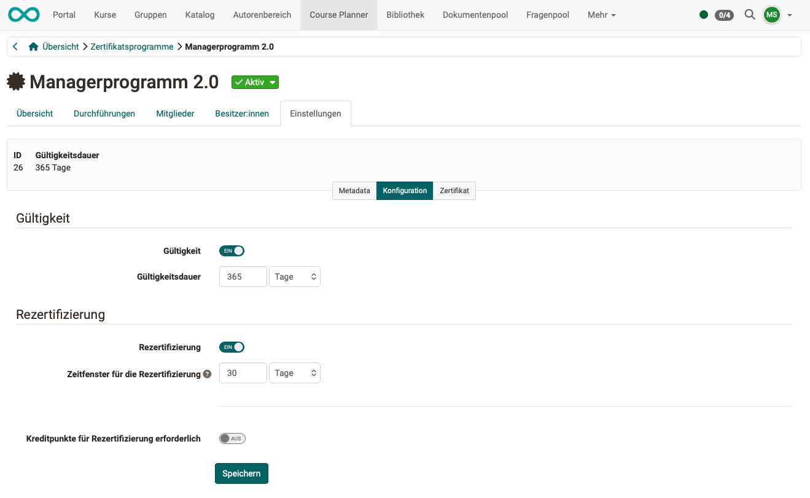
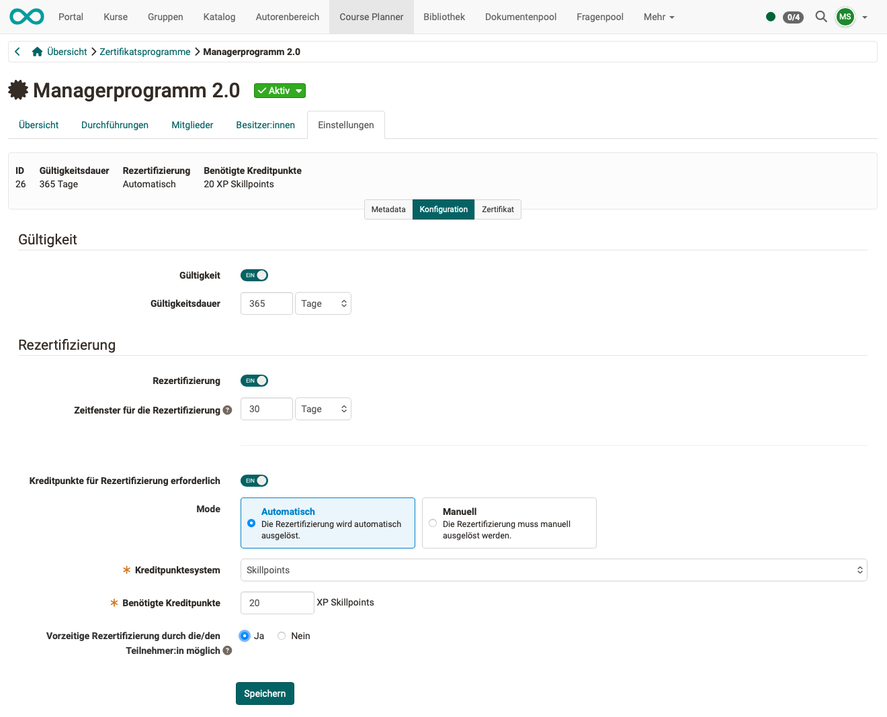
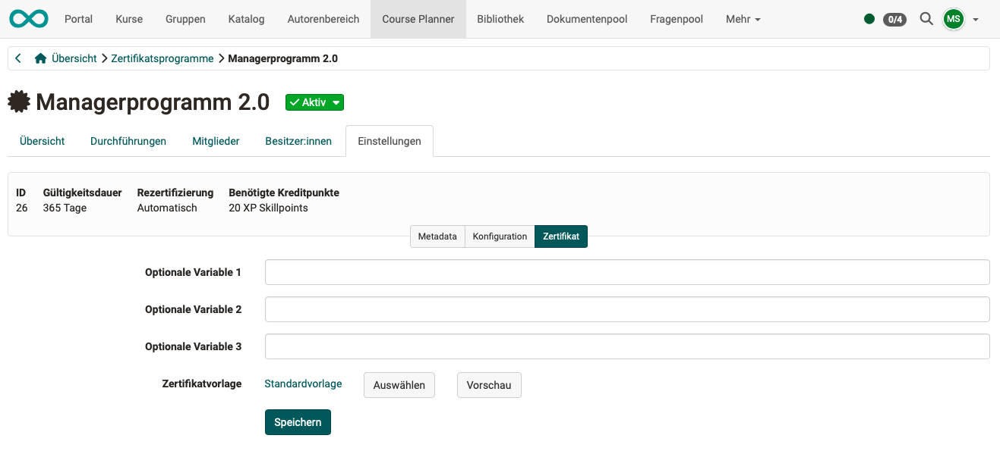
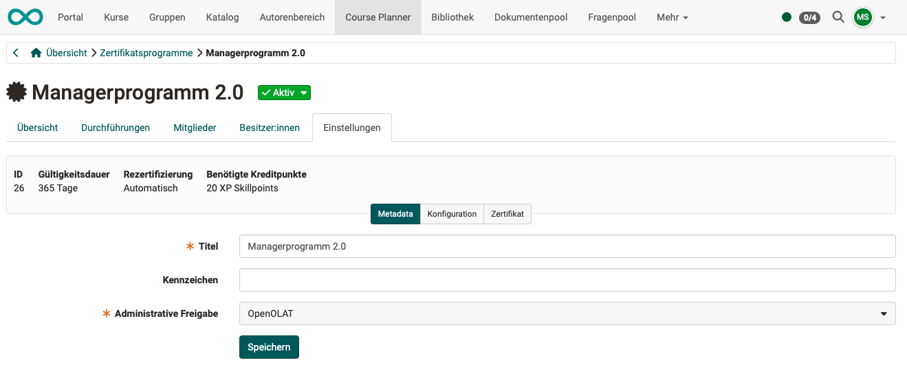

# Wie kann ich mit dem Course Planner Zertifikatsprogramme erstellen? {: #create_certification_programs}

??? abstract "Ziel und Inhalt dieser Anleitung"

    Die folgende Anleitung zeigt, wie Sie OpenOlat-Zertifikatsprogramme für verschiedene Zwecke erstellen.

??? abstract "Zielgruppe"

    [x] Autor:innen [x] Betreuer:innen  [ ] Teilnehmer:innen

    [ ] Anfänger:innen [x] Fortgeschrittene  [x] Expert:innen

??? abstract "Erwartete Vorkenntnisse"

    * Sie haben bereits Erfahrung als Autor:in.
    * Sie können ein OpenOlat-Produkt erstellen und bearbeiten.

##  Vorgehen

### Schritt 1:

Öffnen Sie in der Hauptnavigation (in der Kopfzeile) den Course Planner und darin den Button Zertifikatsprogramme.

{ class="shadow lightbox" }

[Zum Seitenanfang ^](#create_certification_programs)

---

### Schritt 2:

Erstellen Siie mit dem Button rechts oben ein neues Zertifikatsprogramm.

{ class="shadow lightbox" }

Beginnen Sie anschliessend mit der Einrichtung am besten hier: 
**Course Planner > Zertifikatsprogramme > Zertifikatsprogramm aus Liste auswählen > Tab "Einstellungen" > Button "Konfiguration"**

[Zum Seitenanfang ^](#create_certification_programs)

---

### Schritt 3: Gültigkeitsdauer

Wünschen Sie, dass das vergebene Zertifikat eine begrenzte Gültigkeitsdauer hat?

* Wenn nicht, kann der Toggle-Button "Gültigkeit" ausgeschaltet bleiben. 
(Das Zertifikat hat dann eine unbegrenzte Gültigkeit.)
* Soll die Gültigkeit begrenzt werden, aktivieren Sie den Toggle-Button. Geben Sie in diesem Fall dann die Gültigkeitsdauer in Tagen an.

{ class="shadow lightbox" }

[Zum Seitenanfang ^](#create_certification_programs)

---

### Schritt 4: Rezertifizierung?
Erst durch die Angabe einer Gültigkeitsdauer wird die Option zur Rezertifizierung auswählbar.

Wird die Rezertifizerung gewünscht, geben Sie ein Zeitfenster für die Rezertifizierung an. So wird festgelegt, wie lange die Teilnehmer:innnen Zeit haben, ihr Zertifikat zu erneuern nachdem es abgelaufen ist.

{ class="shadow lightbox" }

[Zum Seitenanfang ^](#create_certification_programs)

---

### Schritt 5: Kreditpunkte für die Rezertifizierung?

Wenn die Rezertifizierung aktiviert wurde, kann mit einem weiteren Toggle-Button entschieden werden, ob Kreditpunkte für die Rezertifizierung erforderlich sind. Wird dies gewünscht, machen Sie anschliessend Angaben dazu,

* ob die Rezertifizierung automatisch oder manuell ausgelöst werden soll.
* welches Kreditpunktesystem verwendet werden soll.
* wieviele Kreditpunkte benötigt werden, um ein Zertifikat zu erlangen.
* ob eine vorzeitige Rezertifizierung durch die Teilnehmenden möglich ist. (Teilnehmer:innen können dann ihr Zertifikat vorzeitig erneuern, auch wenn das Zertifikat noch gültig ist.)

{ class="shadow lightbox" }

[Zum Seitenanfang ^](#create_certification_programs)

---

### Schritt 6: Zertifikat auswählen

Bestimmen Sie nun unter dem Button "Zertifikat, welches pdf-Zertifikat verschickt wird.
Wählen Sie die passende Vorlage.

{ class="shadow lightbox" }

[Zum Seitenanfang ^](#create_certification_programs)

---

### Schritt 7: Metadaten

In den Metadaten können Sie Titel und Kennzeichen des Programms angeben und den administrativen Zugriff auf eine  bestimmte Organisationseinheiten eingrenzen.

{ class="shadow lightbox" }

[Zum Seitenanfang ^](#create_certification_programs)

---

### Schritt 8: Durchführung hinzufügen

Bedingung für die Erlangung eines Zertifikates ist das erfolgreiche Absolvieren einer der hier aufgelisteten Durchführungen (ODER-Verknüpfung, es genügt eine der hier aufgelisteten Durchführungen).
Fügen Sie also mit dem Button rechts oben eine Durchführung hinzu.

Falls Sie mehrere Durchführungen angeben möchten, beachten Sie: 
Ob es sich um mehrere Durchführungen des genau gleichen Produkts oder Kurses handelt, spielt keine Rolle. Deshalb ist die Auswahl mit Bedacht zu treffen um eine Gleichwertigkeit zu gewährleisten.

{ class="shadow lightbox" }

[Zum Seitenanfang ^](#create_certification_programs)

---

### Schritt 9: Mitglieder und Besitzer:innen hinzufügen

Sobald alle Bedingungen und Eigenschaften des Zertifikats geklärt sind, können Sie im Tab "Mitglieder" die Personen bestimmen, die es erwerben sollen.

Soll eine weitere Person dieses Zertifikatsprogramm bearbeiten können, ergänzen Sie diese Person im Tab "Besitzer:innen".

[Zum Seitenanfang ^](#create_certification_programs)

---

## Anwendungsfall 1: Datenschutz-Zertifikate mit Kreditpunkten  {: #use_case_1}

* Im Unternehmen müssen Zertifikate regelmässig aktualisiert werden.
* Mit OpenOlat sammeln Mitarbeitende automatisch Kreditpunkte, wenn sie Schulungen absolvieren. 
* Wird eine bestimmte Punktzahl erreicht, verlängert sich das Zertifikat von selbst. 
* Es braucht kein manuelles Nachfassen durch die Betreuer:innen.

[Zum Seitenanfang ^](#create_certification_programs)

---

## Anwendungsfall 2: Ausbildungsprogramme mit automatischer Rezertifizierung  {: #use_case_2}

* In Ausbildungsinstitutionen sammeln Lernende über mehrere Module hinweg Punkte, die zu einem Abschlusszertifikat führen.
* Nach Ablauf dieses Zertifikats kann es automatisch oder manuell verlängert werden, sobald neue Punkte hinzukommen.
* Mit diesem System soll kontinuierliches Lernen angestossen werden.

[Zum Seitenanfang ^](#create_certification_programs)

---

## Anwendungsfall 3: Führungskräfteentwicklung mit flexiblen Lernpfaden  {: #use_case_3}

* Führungskräfte absolvieren verschiedene Lernmodule und sammeln dabei Skillpoints.
* Erreichen sie den Schwellenwert, verlängert sich ihr Zertifikat automatisch.
* Wenn gewünscht, kann die Verlängerung auch durch eine manuelle Freigabe erfolgen, damit die Kontrolle jederzeit bei der Institution bleibt.

[Zum Seitenanfang ^](#create_certification_programs)

---

## Weitere Informationen {: #further_information}

[Course Planner: Zertifikatsprogramm >](../../manual_user/area_modules/Course_Planner_Certification_Programs.de.md) 
[Course Planner: Durchführungen >](../../manual_user/area_modules/Course_Planner_Implementations.de.md) 
[Zertifikate in Einzelkursen >](../learningresources/Course_Settings_Assessment_Certificate.de.md) 
[Zertifikate im persönlichen Menü >](../../manual_user/personal_menu/Certificates.de.md) 
[Kreditpunkte im persönlichen Menü >](../../manual_user/personal_menu/Credit_Points.de.md) 
[Kreditpunkte (Administration) >](../../manual_admin/administration/e-Assessment_Credit_Points.de.md) 

[Zum Seitenanfang ^](#create_certification_programs)