# Kommunikation während einer Prüfung {: #communication_during_exam}

??? abstract "Ziel und Inhalt dieser Anleitung"

    Sie haben bereits einen Kurs für eine Online-Prüfung vorbereitet und wollen die Prüfung in einem bestimmten Zeitfenster online durchführen. 
    Die folgende Anleitung zeigt Ihnen, welche Kommunikationsmöglichkeiten Ihnen während der Prüfung in OpenOlat zur Verfügung stehen.

??? abstract "Zielgruppe"

    [x] Autor:innen [x] Betreuer:innen  [ ] Teilnehmer:innen

    [ ] Anfänger:innen [x] Fortgeschrittene  [x] Expert:innen

??? abstract "Erwartete Vorkenntnisse"

    * ["Wie erstelle ich meinen ersten OpenOlat-Kurs?"](../my_first_course/my_first_course.de.md)
    * ["Wie gehe ich vor, wenn ich einen Test erstelle?"](../test_creation_procedure/test_creation_procedure.de.md)
    * Sie haben einen Kurs für eine Online-Prüfung vorbereitet.

---

## Kommunikationsbedürfnisse {: #needs}

Während einer Online-Prüfung können **verschiedene Kommunikationsbedürfnisse** auftreten:

* einzelne Teilnehmer:innen haben individuelle Probleme
* die Prüfungsaufsicht (Betreuer:in) möchte darauf hinweisen, dass nur noch 10 Minuten Zeit bleiben, um die Arbeit fertigzustellen
* die Betreuer:in beantwortet die Frage einer einzelnen Person
* die Betreuer:in erkennt durch eine Rückfrage, dass ein Hinweis an alle Prüfungsteilnehmer:innen erforderlich ist
* ...

OpenOlat hat für diese Situationen Kommunikationsmöglichkeiten, auch wenn der [Prüfungsmodus](../../manual_user/learningresources/Assessment_mode.de.md) aktiv ist und der [Safe Exam Browser](../../manual_user/learningresources/Assessment_mode.de.md#tab-safe-exam-browser) alle anderen Werkzeuge auf dem Computer deaktiviert.

Insbesondere sind dies **die beiden Kommunikationswerkzeuge**

* **Meldungen** (von Betreuer:innen an alle) und
* der **Betreuer:innen-Chat** (Prüfungs-Chat), 1:1 mit Betreuer:innen oder von Betreuer:innen an alle

 

[nach oben (Abschnitt Kommunikationsbedürfnisse) ^](#needs) 
[zum Seitenanfang ^](#communication_during_exam)

---

## 1. Als Kursbesitzer:in/Autor:in Kommunikationskanäle einrichten {: #author}

Möchten Sie Prüfungsteilnehmer:innen erlauben, während der Prüfung Fragen zu stellen? 
Das Werkzeug hierfür ist der **Betreuer:innen-Chat**. Sie stellen ihn als Kursbesitzer:in im Kurseditor ein: 
`Kurs > Administration > Kurseditor > Kursbaustein "Test" > Tab "Kommunikation"`

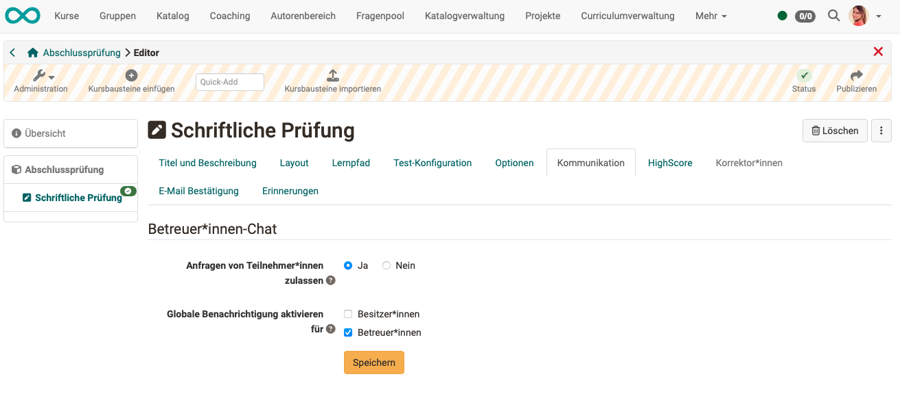{ class="shadow lightbox" title="Tab Kommunikation des Kursbausteins Test im Kurseditor" }

* **Anfragen von Teilnehmer:innen zulassen**: Mit "Ja" können Prüfungsteilnehmer:innen und Betreuer:innen Anfragen via Chat starten. Mit "Nein" starten nur Betreuer:innen einen Chat.
* **Globale Benachrichtigung aktivieren für**: Bei neuen Chat-Aktivitäten informiert OpenOlat die gewählten Kursrollen, Besitzer:innen oder Betreuer:innen, in der globalen Menüleiste. Voreingestellt sind die Betreuer:innen.

Der Betreuer:innen-Chat während Prüfungen funktioniert unabhängig davon, ob die allgemeine Chat-Funktion in der OpenOlat-Instanz aktiviert ist oder nicht.

[nach oben (Abschnitt Kursbesitzer:in/Autor:in) ^](#author) 
[zum Seitenanfang ^](#communication_during_exam)

---

## 2. Als Betreuer:in kommunizieren {: #coach}

### Wo finde ich die Kommunikationswerkzeuge?

* Wählen Sie im Menü den Test-**Kursbaustein**, der die Prüfung enthält.
* Als Betreuer:in sehen Sie nach dem Anklicken nicht den Test (wie die Teilnehmer:innen), sondern mehrere Tabs.
* Wählen Sie den **Tab "Kommunikation"**. Dort finden Sie die Werkzeuge zur Kommunikation zwischen Prüfungsaufsicht (Betreuer:innen) und Prüfungsteilnehmer:innen.

Im **oberen Bereich** "Meldung an alle Teilnehmer:innen" erstellen, bearbeiten und verwalten Sie die **Meldungen** an alle Prüfungsteilnehmer:innen, vor und während der Prüfung.

Im **unteren Bereich** "Betreuer:innen-Chat" sehen Sie im Überblick die **Chat**-Verläufe (1:1) mit den Prüfungsteilnehmer:innen.

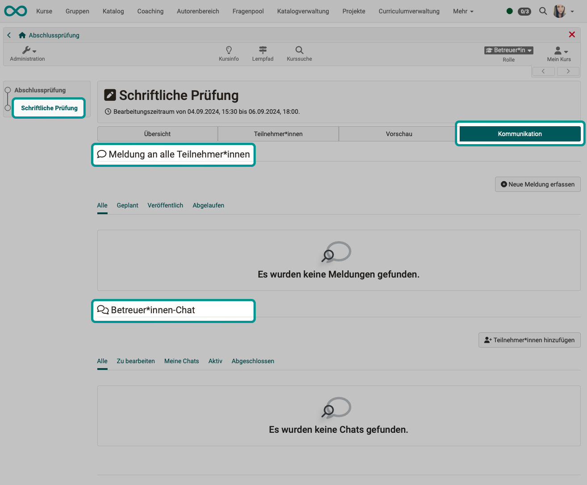{ class="shadow lightbox" title="Tab Kommunikation im Kursbaustein Test" }

!!! info "Mehrere Betreuer:innen"

    Bei mehreren Betreuer:innen kann jede von ihnen auf eine im Chat gestellte Frage von Prüfungsteilnehmer:innen antworten.

### Meldung an alle

Meldungen können von Betreuer:innen an alle Prüfungsteilnehmer:innen verschickt werden. Eine neue Meldung legen Sie mit dem Button "Neue Meldung erfassen" an.

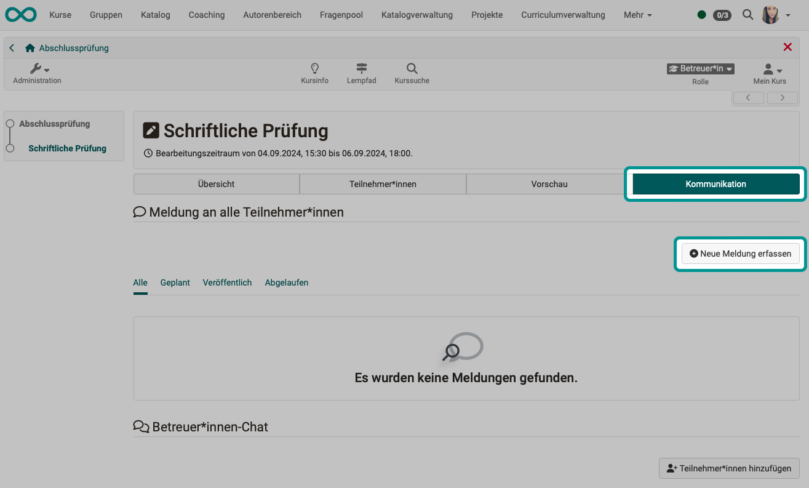{ class="shadow lightbox" title="Bereich Meldung an alle Teilnehmer:innen" }

Eine Meldung kann sofort veröffentlicht und bei den Prüfungsteilnehmer:innen angezeigt werden oder in einem ganz bestimmten Zeitfenster. Unter "Veröffentlichung" wählen Sie dafür "Sofort bis zum Ende des Tages" oder "Individueller Zeitplan" mit Veröffentlichungsdatum und Ablaufdatum. Das Zeitfenster der Veröffentlichung kann auch in der Zukunft liegen, so dass Meldungen vorbereitet werden können.

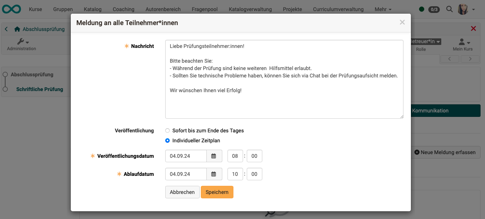{ class="shadow lightbox" title="Dialog Meldung an alle Teilnehmer:innen" }

### Fragen einzelner Teilnehmer:innen beantworten

Gehen Fragen von Prüfungsteilnehmer:innen ein, werden diese im unteren Bereich "Betreuer:innen-Chat" aufgelistet. 
Wartet eine Anfrage seit mehr als fünf Minuten auf eine Reaktion, ist die Zeile rot hinterlegt. Ein gelber Hintergrund signalisiert neue Anfragen. Hat eine Betreuer:in bereits reagiert, wird der Hintergrund weiss.

Zum Beantworten klicken Sie in der betroffenen Zeile in der Spalte "Aktion" auf **"Beitreten"**.

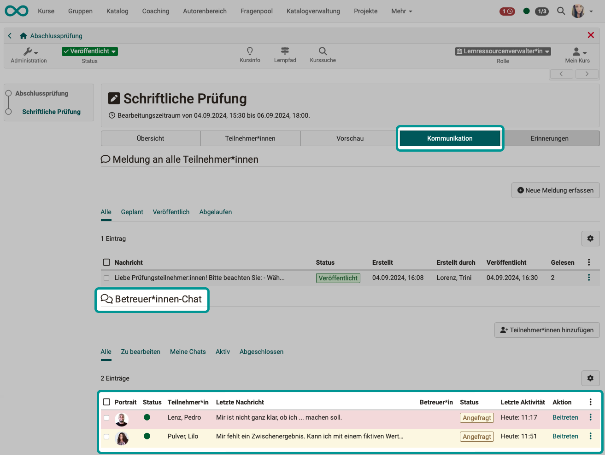{ class="shadow lightbox" title="Bereich Betreuer:innen-Chat im Tab Kommunikation" }

Bei mehreren Betreuer:innen entscheidet jede Betreuer:in selbst, ob sie einem Chat beitritt. 
Welche Betreuer:innen gerade im Chat mit einer Prüfungsteilnehmer:in sind, sehen alle Betreuer:innen (Prüfungsaufsicht) in der Spalte "Betreuer:in".

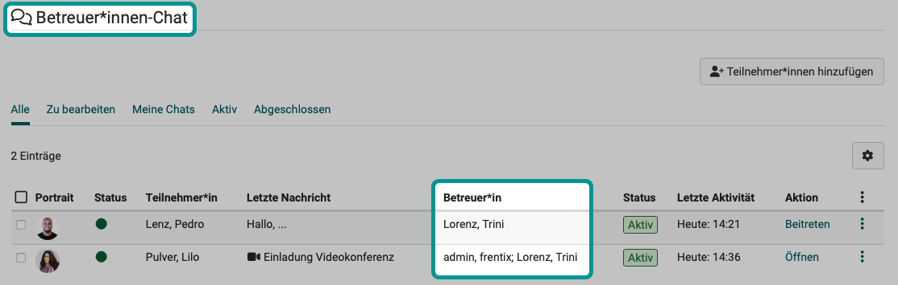{ class="shadow lightbox" title="Liste der Chats im Bereich Betreuer:innen-Chat" }

### Als Betreuer:in Kontakt zu Einzelpersonen aufnehmen

Wenn Sie als Betreuer:in während der Prüfung von sich aus zu einer **Einzelperson** Kontakt aufnehmen wollen, verwenden Sie den **Chat**. Klicken Sie auf den Button "Teilnehmer:innen hinzufügen".

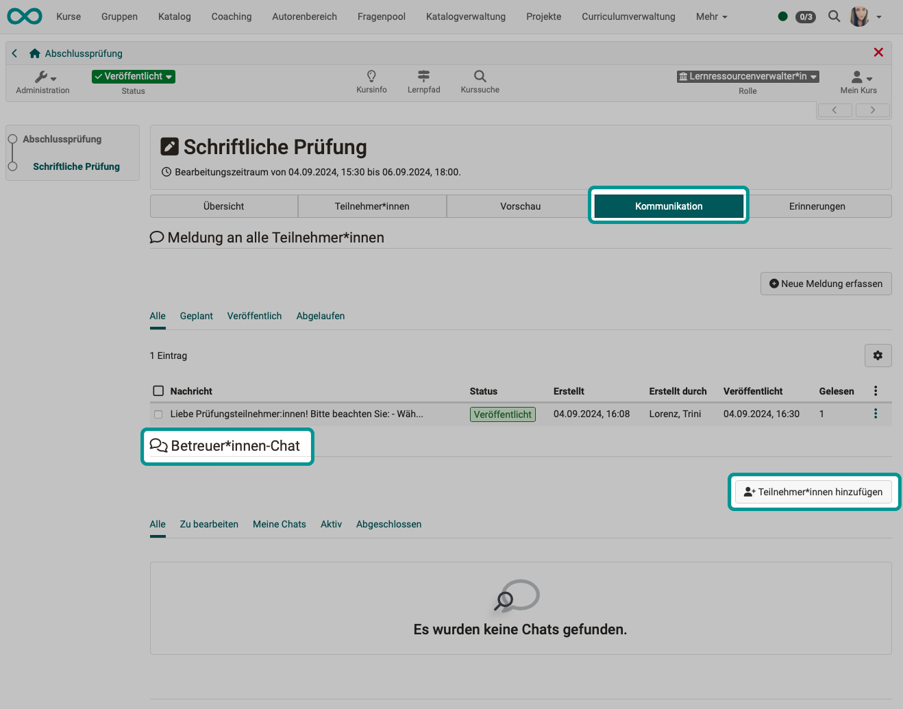{ class="shadow lightbox" title="Button Teilnehmer:innen hinzufügen im Tab Kommunikation" }

### Nachricht an mehrere Chats gleichzeitig

Für eine Nachricht an alle Prüfungsteilnehmer:innen erstellen Sie als Betreuer:in normalerweise eine **Meldung**. Es gibt jedoch auch Ausnahmefälle, in denen eine Antwort in allen **Chats** sinnvoll ist.

**Beispiel:** 
Mehrere Teilnehmer:innen schreiben: "In den Prüfungslagen hat es den Fehler xy". Sie erwarten als Betreuer:in deshalb unmittelbar weitere Chat-Nachrichten von weiteren 100 Prüfungsteilnehmer:innen. Deshalb möchten Sie eine Antwort gleich an alle Prüfungsteilnehmer:innen schicken mit einem Hinweis, "Achtung, wer es noch nicht gemerkt hat … Wir machen jetzt …".

Normalerweise müssten Sie in allen 1:1-Chats antworten und jeden Chat einzeln schliessen. Für diese Situation markieren Sie die betroffenen Chats in der Liste. Mit dem Button "Nachricht senden" schicken Sie eine Nachricht an alle markierten Chats, mit "Anfrage abschliessen" schliessen Sie sie gemeinsam. Für planbare, nicht spontane Informationen empfiehlt sich dagegen das Verschicken als Meldung.

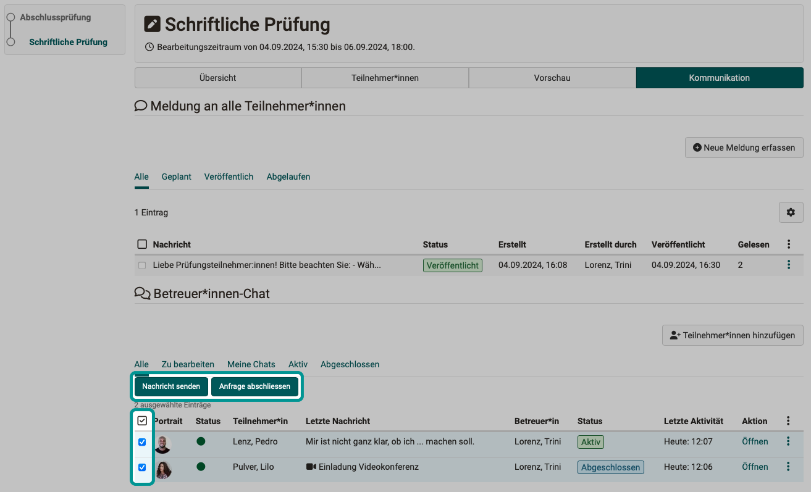{ class="shadow lightbox" title="Liste der Chats mit zwei markierten Chats" }

### Video-Chat

Manchmal ist es hilfreich, wenn Prüfungsaufsicht und Prüfungsteilnehmer:in sich kurz in einem 1:1-Video-Chat sehen können. Für den Video-Chat steht BigBlueButton oder Microsoft Teams zur Verfügung, sobald Administrator:innen eines davon für den Betreuer:innen-Chat freigegeben haben, siehe [Als Administrator:in Video-Chat aktivieren](#admin).

Einen Video-Chat können **nur Betreuer:innen starten**, mit "Videokonferenz starten" im Chatfenster unter dem Eingabefeld. 
Prüfungsteilnehmer:innen erhalten dann eine Einladung und können diese annehmen.

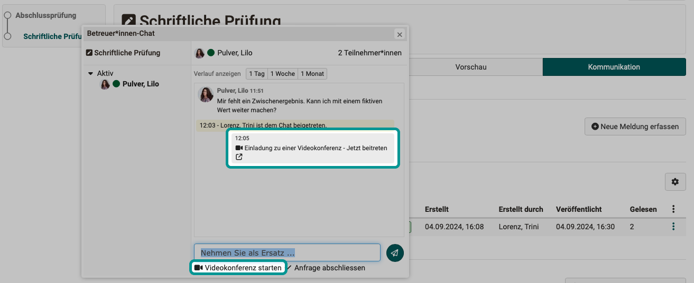{ class="shadow lightbox" title="Chatfenster Betreuer:innen-Chat" }

!!! info "Wichtig"

    Wenn eine Videokonferenz läuft und im Chat (1:1) gewechselt wird, wird die alte Videokonferenz abgebrochen. Es ist immer nur 1:1 möglich. So wird sichergestellt, dass nicht unbeabsichtigt andere Personen in einer Videokonferenz dabei sind.

### Betreuen mehrerer Prüfungen

Es ist möglich, dass Betreuer:innen mehrere gleichzeitig stattfindende Prüfungen betreuen. Zum Beispiel kann eine Fachexpert:in für Fachprobleme zur Verfügung stehen, während andere Betreuer:innen die organisatorischen Aufgaben der Prüfungsaufsicht übernehmen.

Damit diese Person nicht jeweils in die verschiedenen Kurse wechseln muss, um dort die Chats abzufragen, informiert OpenOlat sie bei neuen Chat-Aktivitäten in der globalen Menüleiste. Voraussetzung ist, dass ihre Kursrolle unter "Globale Benachrichtigung aktivieren für" gewählt ist, siehe [Als Kursbesitzer:in/Autor:in Kommunikationskanäle einrichten](#author).

Wenn die Prüfungen vorbei sind, sind allerdings auch diese Hinweise weg. Sie sind nur während der Prüfung vorhanden.

### Dokumentation der Meldungen und des Chat-Verlaufs

Da **Meldungen** eventuell für Rekurse relevant sind, lassen sie sich nur löschen, solange sie den Status "Geplant" haben. Nach dem Veröffentlichen können sie nur noch zurückgezogen werden. Eine zurückgezogene Meldung erhält den Status "Abgelaufen" und bleibt in der Liste erhalten.

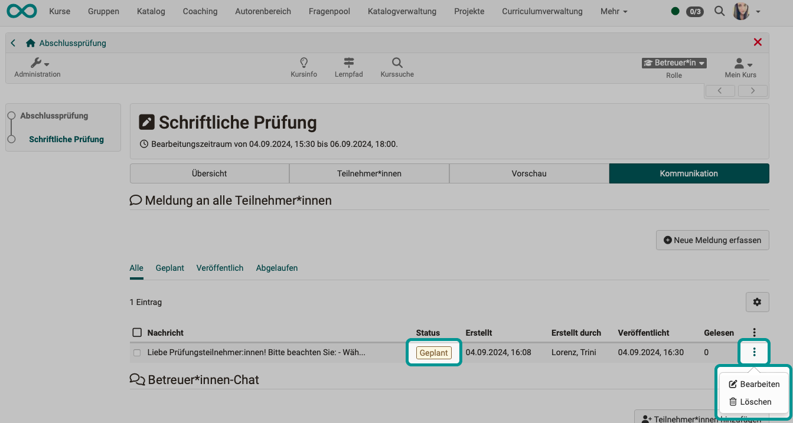{ class="shadow lightbox" title="Liste der Meldungen vor dem Veröffentlichen" }

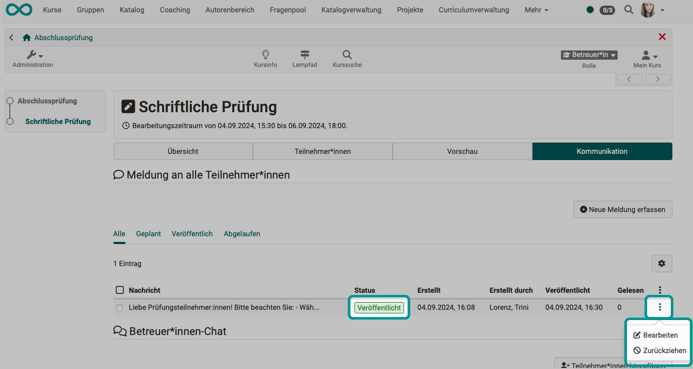{ class="shadow lightbox" title="Liste der Meldungen nach dem Veröffentlichen" }

Den Verlauf eines **Chats** archivieren Sie über das Menü mit den drei Punkten am Ende seiner Zeile: "Archivieren" lädt den Verlauf dieses einen Chats herunter. Für einen abgeschlossenen Chat bietet dasselbe Menü zusätzlich "Anfrage reaktivieren".

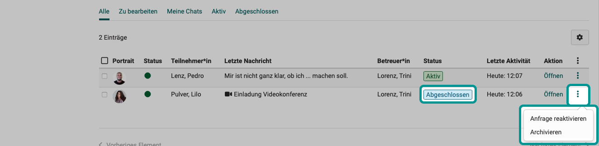{ class="shadow lightbox" title="Menü eines abgeschlossenen Chats" }

 

[nach oben (Abschnitt Betreuer:in) ^](#coach) 
[zum Seitenanfang ^](#communication_during_exam)

---

## 3. Als Prüfungsteilnehmer:in kommunizieren {: #participant}

### Meldungen der Prüfungsaufsicht

Meldungen können nur von Betreuer:innen (Prüfungsaufsicht) an die Prüfungsteilnehmer:innen geschickt werden. Der umgekehrte Weg ist nicht möglich. Für Anfragen der Prüfungsteilnehmer:innen dient der Betreuer:innen-Chat.

Meldungen erscheinen bei Prüfungsteilnehmer:innen in der Kopfzeile. Sie bleiben dort angezeigt, bis mit Klick auf den Button "Gelesen" eine Lesebestätigung abgegeben wurde.

Eine Meldung wird auch ausserhalb des Test-Kursbausteins angezeigt, z.B. wenn der Test noch nicht gestartet wurde.

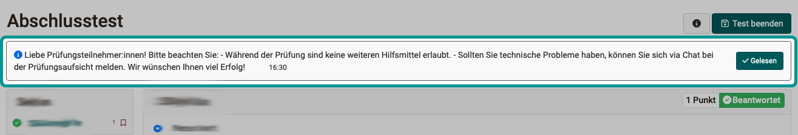{ class="shadow lightbox" title="Test aus Sicht der Prüfungsteilnehmer:innen" }

Nach abgegebener Lesebestätigung verschwinden Meldungen. Sie lassen sich aber jederzeit über das Info-Symbol in der Kopfzeile wieder anzeigen.

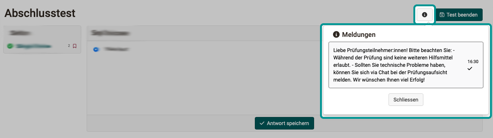{ class="shadow lightbox" title="Fenster Meldungen im laufenden Test" }

### Fragen an die Prüfungsaufsicht stellen

Hat die Kursbesitzer:in Anfragen von Teilnehmer:innen zugelassen, erscheint bei den Prüfungsteilnehmer:innen in der Kopfzeile ein Sprechblasen-Symbol. Dort kann ein **1:1-Chat** in einem separaten Chatfenster begonnen werden. Mit "Anfrage als erledigt markieren und schliessen" beenden Prüfungsteilnehmer:innen ihre Anfrage.

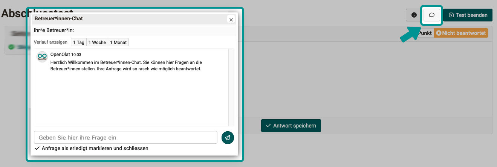{ class="shadow lightbox" title="Betreuer:innen-Chat im laufenden Test" }

[nach oben (Abschnitt Teilnehmer:in) ^](#participant) 
[zum Seitenanfang ^](#communication_during_exam)

---

## 4. Als Administrator:in Video-Chat aktivieren {: #admin}

Damit Betreuer:innen aus dem Betreuer:innen-Chat eine Videokonferenz starten können, geben Administrator:innen BigBlueButton oder Microsoft Teams für den Betreuer:innen-Chat frei. Eines der beiden Module genügt, es muss dabei selbst eingeschaltet sein. Aktivieren Sie dafür in der System-Administration unter "Aktivieren für" die Option "Betreuer:innen-Chat": 
`Administration > Externe Werkzeuge > BigBlueButton > Tab "Konfiguration"` 
`Administration > Externe Werkzeuge > Microsoft Teams > Tab "Konfiguration"`

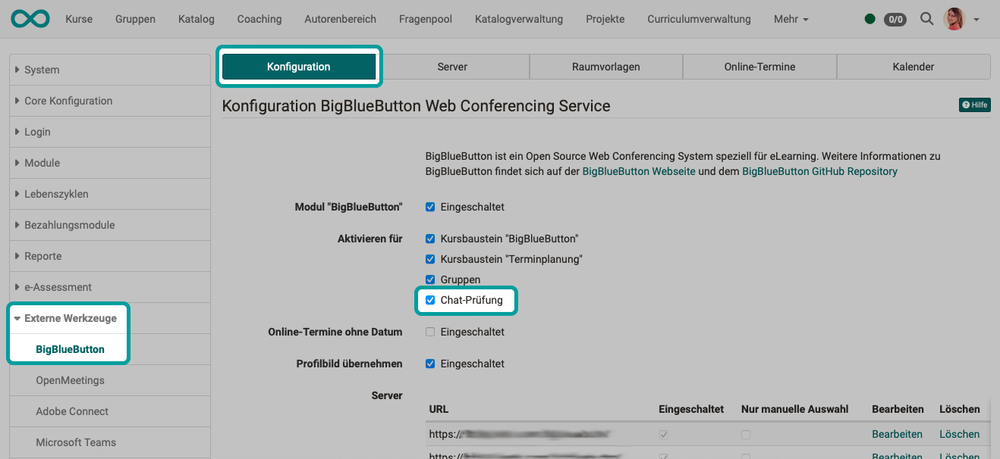{ class="shadow lightbox" title="Tab Konfiguration im Modul BigBlueButton" }

Die übrigen Einstellungen der beiden Module beschreiben die Seiten [Modul BigBlueButton](../../manual_admin/administration/BigBlueButton_module.de.md#tab_config) und [Modul Microsoft Teams](../../manual_admin/administration/Teams_module.de.md#activate_for).

[nach oben (Abschnitt Administrator:in) ^](#admin) 
[zum Seitenanfang ^](#communication_during_exam)

---

## Checkliste {: #checklist}

- [x] Sind mehrere Betreuer:innen an der Prüfung dabei?
- [x] Sollen Prüfungsteilnehmer:innen während der Prüfung Fragen an die Betreuer:innen stellen können?
- [x] Bestehen zwischen den Betreuer:innen Kommunikationsmöglichkeiten ausserhalb des Prüfungskurses?
- [x] Sollen Betreuer:innen während der Prüfung Meldungen an alle Prüfungsteilnehmer:innen schicken können?
- [x] Sind Texte für Meldungen zur Begrüssung, zum Hinweis auf das baldige Prüfungsende usw. vorbereitet und abgesprochen?
- [x] Kennen alle Personen der Prüfungsaufsicht die Kommunikationsmöglichkeiten während der Prüfung? (Meldungen und Betreuer:innen-Chat)

[zum Seitenanfang ^](#communication_during_exam)

## Weiterführende Informationen {: #further_information}

**Auf dieser Seite erwähnt** 
[Wie erstelle ich meinen ersten OpenOlat-Kurs? >](../my_first_course/my_first_course.de.md) 
[Wie gehe ich vor, wenn ich einen Test erstelle? >](../test_creation_procedure/test_creation_procedure.de.md) 
[Prüfungsverwaltung: Prüfungsmodus >](../../manual_user/learningresources/Assessment_mode.de.md) 
[Modul BigBlueButton >](../../manual_admin/administration/BigBlueButton_module.de.md) 
[Modul Microsoft Teams >](../../manual_admin/administration/Teams_module.de.md)

**Weiterführend** 
[Kursbaustein "Test" >](../../manual_user/learningresources/Course_Element_Test.de.md) 
[Wie bereite ich eine Online-Prüfung vor? >](../exam_preparation/exam_preparation.de.md) 
[Wie bereite ich eine Prüfung mit dem Safe Exam Browser (SEB) vor? >](../SEB/SEB.de.md)

**youtube** 
[Überblick Testing](<https://www.youtube.com/embed/fkqH41-8CaI>) 
[Wie funktionieren Tests in OpenOlat?](<https://www.youtube.com/embed/M0p3UKaEOlg>)

[Zum Seitenanfang ^](#communication_during_exam)
