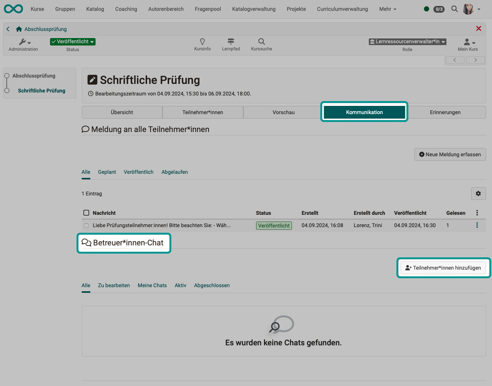

# Kommunikation während einer Prüfung {: #communication_during_exam}

??? abstract "Ziel und Inhalt dieser Anleitung"

    Sie haben bereits einen Kurs für eine Online-Prüfung vorbereitet und wollen die Prüfung in einem bestimmten Zeitfenster online durchführen. 
    Die folgende Anleitung zeigt Ihnen, welche Kommunikationsmöglichkeiten Ihnen während der Prüfung in OpenOlat zur Verfügung stehen.

??? abstract "Zielgruppe"

    [x] Autor:innen [x] Betreuer:innen  [ ] Teilnehmer:innen

    [ ] Anfänger:innen [x] Fortgeschrittene  [x] Experten/Expertinnen

??? abstract "Erwartete Vorkenntnisse"

    * ["Wie erstelle ich meinen ersten OpenOlat-Kurs?"](../my_first_course/my_first_course.de.md)
    * ["Wie gehe ich vor, wenn ich einen Test erstelle?"](../test_creation_procedure/test_creation_procedure.de.md)
    * Sie haben einen Kurs für eine Online-Prüfung vorbereitet.

---

## Kommunikationsbedürfnisse {: #needs}

Während einer Online-Prüfung können **verschiedene Kommunikationsbedürfnisse** auftreten:

* einzelne Teilnehmer:innen haben individuelle Probleme
* die Prüfungsaufsicht (Betreuer:in) möchte darauf hinweisen, dass nur noch 10 Minuten Zeit bleiben um die Arbeit fertig zu stellen
* der/die Betreuer:in beantwortet die Frage einer einzelnen Person
* der/die Betreuer:in erkennt durch eine Rückfrage, dass ein Hinweis an alle Prüfungsteilnehmer:innen erforderlich ist
* ... 

OpenOlat hat für diese Situationen Kommunikationsmöglichkeiten. Auch wenn der [Prüfungsmodus](../../manual_user/learningresources/Assessment_mode.de.md) aktiv ist und via [Safe Exam Browser](../../manual_user/learningresources/Assessment_mode.de.md#tab-safe-exam-browser) alle anderen Werkzeuge auf dem Computer deaktiviert sind.

Insbesondere sind dies **die beiden Kommunikationswerkzeuge**

* **Mitteilungen** (von Betreuer:innen an alle) und
* der **Prüfungs-Chat** (1:1 mit Betreuer:innen oder von Betreuer:innen an alle)

 

[nach oben (Abschnitt Kommunikationsbedürfnisse) ^](#needs) 
[zum Seitenanfang ^](#communication_during_exam)

---

## 1. Als Kursbesitzer:in/Autor:in Kommunikationskanäle einrichten {: #author}

Möchten Sie Prüfungsteilnehmer:innen erlauben, während der Prüfung Fragen zu stellen? 
Das Werkzeug hierfür ist der **Prüfungs-Chat**. Nehmen Sie als Kursbesitzer:in die Einstellung entsprechend vor. Ohne diese Freigabe durch den/die Kursbesitzer:in steht der Prüfungs-Chat nicht zur Verfügung.

**Kurseditor öffnen > Test-Kursbaustein wählen > Tab Kommunikation**

{ class="shadow lightbox" }  

Wenn Kursbesitzer:innen auch Chat-Betreuer:innen sein sollen, bekommen auch sie die Mitteilungen in der globalen Menüleiste angezeigt.

Der Betreuer:innen-Chat während Prüfungen funktioniert unabhängig davon, ob die allgemeine Chat-Funktion in der OpenOlat-Instanz aktiviert ist oder nicht.

[nach oben (Abschnitt Kursbesitzer:in/Autor:in) ^](#author) 
[zum Seitenanfang ^](#communication_during_exam)

---

## 2. Als Betreuer:in kommunizieren {: #coach}

### Wo finde ich die Kommunikationswerkzeuge?

* Wählen Sie im Menü den Test-**Kursbaustein**, der die Prüfung enthält.
* Als Betreuer:in sehen Sie nach dem Anklicken nicht den Test (wie die Teilnehmer:innen), sondern mehrere Tabs.
* Wählen Sie den **Tab „Kommunikation“**. Dort finden Sie die Werkzeuge zur Kommunikation zwischen Prüfungsaufsicht (Betreuer:innen) und Prüfungsteilnehmer:innen.

Im **oberen Bereich** erstellen, bearbeiten und verwalten Sie die **Mitteilungen** (1:many) vor und während der Prüfung.

Im **unteren Bereich** sehen Sie im Überblick die **Chat**-Verläufe (1:1) mit den Prüfungsteilnehmer:innen.

{ class="shadow lightbox" }  

!!! info "Mehrere Betreuer:innen"

    Bei mehreren Betreuer:innen kann jeder von ihnen auf eine im Chat gestellte Frage eines Prüfungsteilnehmers / einer Prüfungsteilnehmerin antworten.

### Mitteilung an alle

Mitteilungen können von Betreuer:innen an alle Prüfungsteilnehmer:innen verschickt werden (1:many).

{ class="shadow lightbox" } 

Eine Mitteilung kann sofort veröffentlicht und bei den Prüfungsteilnehmer:innen angezeigt werden oder in einem ganz bestimmten Zeitfenster. Das Zeitfenster der Veröffentlichung kann auch in der Zukunft liegen, so dass Mitteilungen vorbereitet werden können.

{ class="shadow lightbox" } 

!!! info "Kein Löschen von Mitteilungen"

    Da **Mitteilungen** eventuell für Rekurse relevant sind, können sie nach dem Veröffentlichen nicht mehr gelöscht werden, sondern nur zurückgezogen. (In der Historie sind sie dann immer noch vorhanden.)

### Fragen einzelner Teilnehmer:innen beantworten

Gehen Fragen von Prüfungsteilnehmer:innen ein, werden diese im unteren Abschnitt (1:1-Chats) aufgelistet. 
Ist eine Anfrage schon länger eingegangen, wird die Dringlichkeit einer Reaktion durch eine rote Einfärbung angezeigt. Ein gelber Hintergrund signalisiert neue Anfragen. Wurde bereits durch einen/eine Betreuer:in reagiert, wird der Hintergrund weiss.

Zum Beantworten/Beitritt zum Chat klicken Sie in der betroffenen Zeile in der Spalte "Aktion" auf **"Beitreten"**.

{ class="shadow lightbox" } 

Bei mehreren Betreuer:innen entscheidet jeder/jede Betreuer:in selbst, ob er/sie einem Chat beitritt. 
Welche Betreuer:innen gerade im Chat mit einem/einer Prüfungsteilnehmer:in sind, ist für alle Betreuer:innen (Prüfungsaufsicht) in einer separaten Spalte ersichtlich.

{ class="shadow lightbox" } 

### Als Betreuer:in Kontakt zu Einzelpersonen aufnehmen

Wenn Sie als Betreuer:in während der Prüfung von sich aus zu einer **Einzelperson** Kontakt aufnehmen wollen, verwenden Sie den **Chat**. Klicken Sie auf den Button „Teilnehmer:innen hinzufügen“.

{ class="shadow lightbox" } 

### Bulk-Action im Chat

Für eine Mitteilung an alle Prüfungsteilnehmer:innen erstellen Sie als Betreuer:in normalerweise eine **Mitteilung**. Es gibt jedoch auch Ausnahmefälle, in denen ein **Chat** mit allen sinnvoll ist.

**Beispiel:** 
Mehrere Teilnehmer:innen schreiben: „In den Prüfungslagen hat es einen Fehler xy.“ Sie erwarten als Betreuer:in deshalb unmittelbar weitere Chat-Nachrichten von weiteren 100 Prüfungsteilnehmer:innen. Deshalb möchten Sie eine Antwort gleich an alle Prüfungsteilnehmer schicken mit einem Hinweis, „Achtung, wer es noch nicht gemerkt hat … Wir machen jetzt …“.

Normalerweise müssten Sie in allen 1:1-Chats antworten und jeden Chat einzeln schliessen. Für diese Situation steht Ihnen als Betreuer:in auch eine Bulk-Action zur Verfügung: Sie können einen Broadcast an alle **im Chat** verschicken. (Für planbare, nicht spontane Informationen empfiehlt sich dagegen das Verschicken als Mitteilung.)

{ class="shadow lightbox" } 

### Video-Chat

Manchmal ist es hilfreich, wenn Prüfungsaufsicht und Prüfungsteilnehmer:in sich kurz in einem 1:1-Video-Chat sehen können.
(Big Blue Button (BBB) ist vorkonfiguriert und muss nur durch einen/eine Administrator:in aktiviert werden. Es kann aber auch Teams oder ein anderes Videokonferenz-Tool verwendet werden. 

Einen Video-Chat können **nur Betreuer:innen starten** (im Chatfenster am unteren Rand, unter dem Eingabefeld)).  Prüfungsteilnehmer:innen erhalten dann eine Einladung und können diese annehmen.

{ class="shadow lightbox" }  

!!! info "Hinweis"

    Wenn eine BBB-Session läuft und im Chat (1:1) gewechselt wird, wird die alte Videokonferenz abgebrochen. (Es ist immer nur 1:1 möglich. So wird sichergestellt, dass nicht unbeabsichtigt andere Personen in einer Videokonferenz dabei sind.)

### Betreuen mehrerer Prüfungen

Es ist möglich, dass Betreuer:innen mehrere gleichzeitg stattfindende Prüfungen betreuen. Z.B. kann ein/eine Fachexpert:in für Fachprobleme zur Verfügung stehen, während andere Betreuer:innen die organisatorischen Aufgaben der Prüfungsaufsicht übernehmen.

Damit in diesem Fall diese betreuende Person nicht jeweils in die verschiedenen Kurse muss, um jeweils dort die Prüfungs-Chats abzufragen, werden neue Chat-Beiträge im allgemeinen Chat der Toolbar angezeigt.

Wenn die Prüfungen vorbei sind, sind allerdings auch diese Chat-Messages weg. (Nur synchron vorhanden.)

### Dokumentation der Mitteilungen und des Chat-Verlaufs

Da **Mitteilungen** eventuell für Rekurse relevant sind, können sie nur bis zur Veröffentlichung gelöscht werden, nach dem Veröffentlichen nicht mehr, sondern nur noch zurückgezogen. (In der Historie sind sie dann immer noch vorhanden.)

{ class="shadow lightbox" }  

{ class="shadow lightbox" }  

??? Archivierung/Historie ansehen

Das Archivieren abgeschlossener **Chat**-Verläufe ist bisher nur für Einzelpersonen möglich.

{ class="shadow lightbox" }  

 

[nach oben (Abschnitt Betreuer:in) ^](#coach) 
[zum Seitenanfang ^](#communication_during_exam)

---

## 3. Als Prüfungsteilnehmer:in kommunizieren {: #participant}

### Mitteilungen der Prüfungsaufsicht

Mitteilungen (1:many) können nur von Betreuer:innen (Prüfungsaufsicht) an die Prüfungsteilnehmer:innen geschickt werden. Der umgekehrte Weg ist nicht möglich. Für Anfragen der Prüfungsteilnehmer:innen muss der Prüfungs-Chat genutzt werden.

Mitteilungen erscheinen bei Prüfungsteilnehmer:innen in der Kopfzeile. Sie bleiben dort angezeigt, bis mit Klick auf den Button eine Lesebestätigung abgegeben wurde.

Eine Mitteilung wird auch ausserhalb des Test-Kursbausteins angezeigt, z.B. wenn der Test noch nicht gestartet wurde.

{ class="shadow lightbox" }  

Nach abgegebener Lesebestätigung verschwinden Mitteilungen, sie können aber jederzeit durch Klick auf den Button in der Kopfzeile wieder angezeigt werden.

{ class="shadow lightbox" }  

### Fragen an die Prüfungsaufsicht stellen

Wurde von dem/der Kursbesitzer:in erlaubt, dass Prüfungsteilnehmer:innen Rückfragen stellen können, erscheint in der Kopfzeile ein Sprechblasen-Symbol in der Teilnehmeransicht. Dort kann ein **1:1-Chat** in einem separaten Chat-Fenster begonnen werden. 

{ class="shadow lightbox" }  

[nach oben (Abschnitt Teilnehmer:in) ^](#participant) 
[zum Seitenanfang ^](#communication_during_exam)

---

## 4. Als Administrator:in Video-Chat aktivieren {: #admin}

Damit Video-Chats möglich sind, muss z.B. BBB im Prüfungs-Chat erlaubt werden. (Es kann auch ein anderes Videokonferenz-Tool aktiviert werden, jedoch mindestens eines.)

**Administration > Externe Werkzeuge > BBB  (oder anderes Videokonferenz-Tool) > Tab Konfiguration > „Aktivieren für“ > Prüfungs-Chat**

{ class="shadow lightbox" }  

[nach oben (Abschnitt Administrator:in) ^](#admin) 
[zum Seitenanfang ^](#communication_during_exam)

---

## Weitere Informationen {: #links}

:octicons-device-camera-video-24: **Video-Einführung**: [Überblick Testing](<https://www.youtube.com/embed/fkqH41-8CaI>){:target="_blank”}

:octicons-device-camera-video-24: **Video-Einführung**: [Wie funktionieren Tests in OpenOlat?](<https://www.youtube.com/embed/M0p3UKaEOlg>){:target="_blank”}

Details zum [Prüfungsmodus >](../../manual_user/learningresources/Assessment_mode.de.md) 

Mehr zum [Safe Exam Browser >](../../manual_user/learningresources/Assessment_mode.de.md#tab-safe-exam-browser)

 

---

## Checkliste {: #checklist}

- [x] Sind mehrere Betreuer:innen an der Prüfung dabei?
- [x] Sollen Prüfungsteilnehmer:innen während der Prüfung Fragen an die Betreuer stellen können?
- [x] Bestehen zwischen den Betreuer:innen Kommunikationsmöglichkeiten ausserhalb des Prüfungskurses?
- [x] Sollen Betreuer:innen während der Prüfung Mitteilungen an alle Prüfungsteilnehmer:innen schicken können?
- [x] Sind Mitteilungstexte zur Begrüssung, Hinweis auf das baldige Prüfungsende, usw. vorbereitet und abgesprochen?
- [x] Kennen alle Personen der Prüfungsaufsicht die Kommunikationsmöglichkeiten während der Prüfung? (Mitteilungen und Prüfungs-Chat)

[zum Seitenanfang ^](#communication_during_exam)
