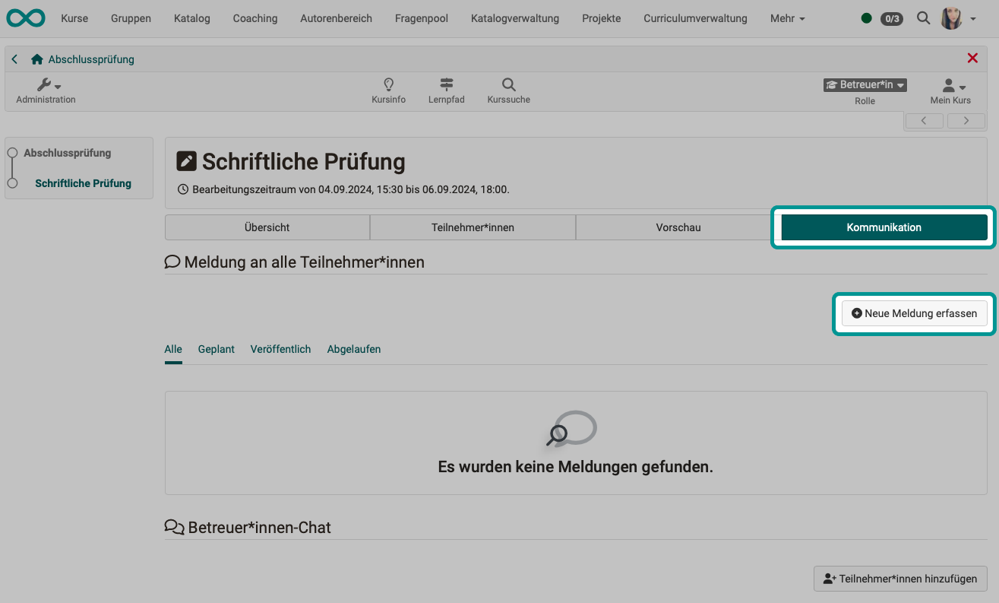
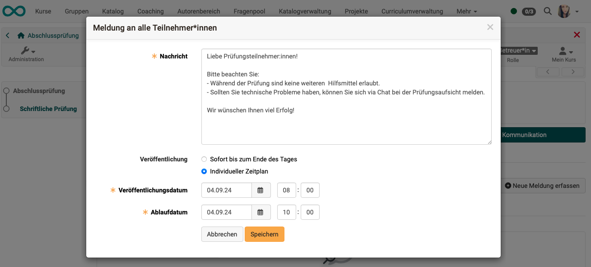
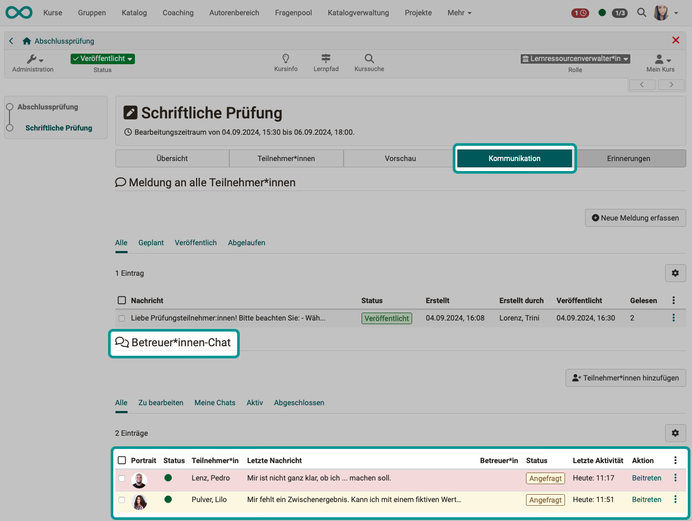
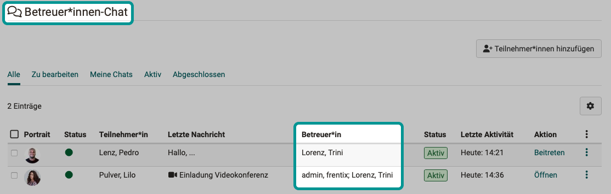
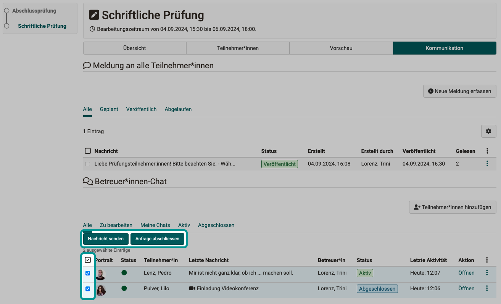
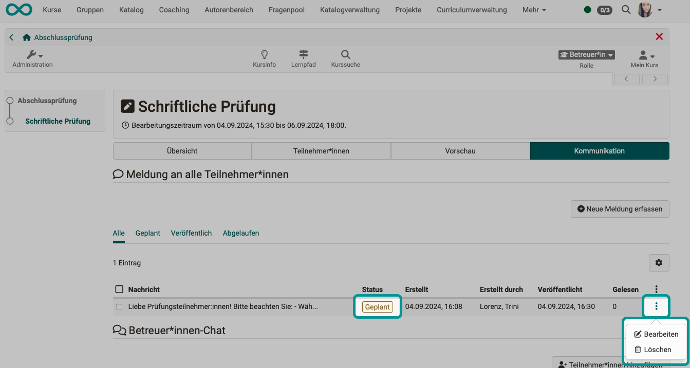
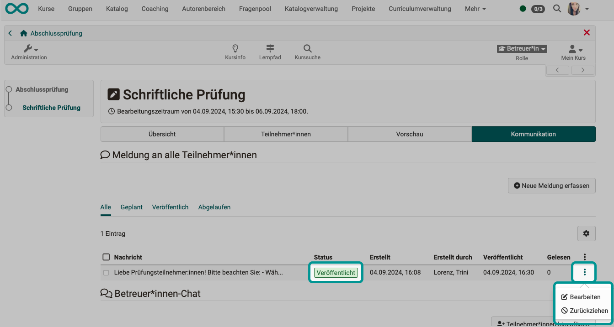
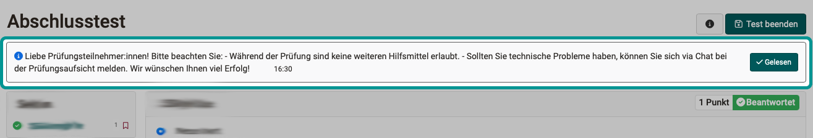

# Communication during an exam {: #communication_during_exam}

??? abstract "Objectives and content of this instruction"

    You have already prepared a course for an online exam and want to take the exam online within a certain time frame.
     
    The following instructions show you, which communication options are available to you during the test in OpenOlat.

??? abstract "Target group"

    [x] Authors [x] Coaches  [ ] Participants

    [ ] Beginners [x] Amateurs  [x] Experts

??? abstract "Expected previous knowledge"

    * ["How do I create my first OpenOlat course?"](../my_first_course/my_first_course.md)
    * ["How do I proceed when I create a test?"](../test_creation_procedure/test_creation_procedure.md)
    * You have already prepared a course for the online exam.

---

## Communication needs {: needs}

During an online exam, **various communication needs** may arise:

* individual participants have individual problems
* the examination coach would like to point out that there are only 10 minutes left to complete the work
* the coach answers the question of a single person
* the coach recognizes through a query that a note to all exam participants is required
* ...

OpenOlat has communication options for these situations. Even if [Assessment mode](../../manual_user/learningresources/Assessment_mode.md) is active and all other tools on the computer are deactivated via [Safe Exam Browser](../../manual_user/learningresources/Assessment_mode.md).

In particular, these are **the two communication tools**

* **Messages** (from coaches to everyone) and
* the **exam chat** (1:1 with coaches or from coaches to everyone)

 

[Up (Section Communication needs) ^](#needs) 
[To the top of the page ^](#communication_during_exam)

---

## 1. Set up communication channels as course owner/author {: #author}

Would you like to allow exam participants to ask questions during the exam? 
The tool for this is the **exam chat**. As the course owner, adjust the settings accordingly. Without this approval by the course owner, the exam chat is not available.

**Open course editor > Select test course element > Communication tab**

{ class="shadow lightbox" }  

If course owners are also to be chat coaches, they will also see the messages in the global menu bar.

The coach chat during exams works regardless of whether the general chat function is activated in the OpenOlat instance or not.

[Up (Section Course owner/author) ^](#author) 
[To the top of the page ^](#communication_during_exam)

---

## 2. Communicate as coach {: #coach}

### Where can I find the communication tools?

* In the menu, select the test **course element** that contains the exam.
* As a coach, you will not see the test after clicking on it (like the participants), but several tabs.
* Select the **"Communication"** tab. There you will find the tools for communication between coaches and exam participants.

In the **upper area** you create, edit and manage the **notifications** (1:many) before and during the exam.

In the **bottom area** you can see an overview of the **chat** histories (1:1) with the exam participants.

{ class="shadow lightbox" } 

!!! info "Multiple Coaches"

        If there are several coaches, each of them can answer a question asked by an exam participant in the chat.

### Message to all

Notifications can be sent by coaches to all exam participants (1:many).

{ class="shadow lightbox" } 

A notification can be published immediately and displayed to the exam participants or within a specific time window. The time window for publication can also be in the future so that notifications can be prepared.

{ class="shadow lightbox" } 

!!! info "No deletion of messages"

        Since **messages** may be relevant for appeals, they can no longer be deleted after publication, but only withdrawn. (They will still be available in the history).

### Answering questions from individual participants

If questions are received from exam participants, they will be listed in the section below (1:1 chats). 
If a request has been received for some time, the urgency of a response is indicated by a red background. A yellow background indicates new requests. If a coach has already responded, the background turns white.

To reply/join the chat, click on **"Join"** in the relevant row in the "Action" column.

{ class="shadow lightbox" } 

If there are several coaches, each coach decides for themself whether to join a chat. 
All coaches can see which coaches are currently chatting with an exam participant in a separate column.

{ class="shadow lightbox" } 

### Get in touch with individuals as a coach

If you as a coach want to contact a **individual** during the exam, use the **chat**. Click on the "Add participant" button.

{ class="shadow lightbox" } 

## Bulk action in the chat

As a coach, you normally create a **notification** for a message to all exam participants. However, there are also exceptional cases in which a **chat** with everyone makes sense.

**Example**: 
Several participants write: "There is error xy in the exam situations". As a coach, you therefore immediately expect further chat messages from another 100 exam participants. That's why you want to send a reply to all exam participants right away with a note saying, "Attention! Those who haven't noticed yet ... We are now doing ...".

Normally, you would have to reply to all 1:1 chats and close each chat individually. For this situation, a bulk action is also available to you as a coach: you can send a broadcast to everyone **in the chat**. (For plannable, non-spontaneous information, however, it is advisable to send it as a message.)

{ class="shadow lightbox" } 

### Video chat

Sometimes it is helpful if the coach and exam participant can see each other briefly in a 1:1 video chat. (Big Blue Button (BBB) is preconfigured and only needs to be activated by an administrator. However, Teams or another video conferencing tool can also be used.)

Only **coaches can start** a video chat (in the chat window at the bottom, below the input field).  Exam participants will then receive an invitation and can accept it.

{ class="shadow lightbox" }  

!!! info "Note"

    If a BBB session is running and is changed in the chat (1:1), the old video conference is canceled. (Only 1:1 is ever possible. This ensures that other people are not unintentionally present in a video conference).

### Supervising multiple exams

It is possible for coaches to supervise several examinations at the same time. For example, a subject expert can be available for technical problems, while other coaches take on the organizational tasks of exam supervision.

In this case, new chat posts are displayed in the general chat of the toolbar so that the coach does not have to go to the different courses to check the exam chats there.

However, when the exams are over, these chat messages are also gone. (Only available synchronously.)

### Documentation of messages and chat history

Since **messages** may be relevant for appeals, they can only be deleted until they are published, and can only be withdrawn after publication. (They are then still available in the history.)

{ class="shadow lightbox" }  

{ class="shadow lightbox" }  

???

tbd

Archiving completed **Chat** histories is currently only possible for individuals.

{ class="shadow lightbox" }  

 

[Up (Coach section) ^](#coach) 
[To the top of the page ^](#communication_during_exam)

---

## 3. Communicate as a participant {: #participant}

### Notifications from the coach

Messages (1:many) can only be sent by coaches to the examination candidates. The other way around is not possible. The exam chat must be used for inquiries from exam participants.

Messages appear in the header for exam participants. They remain there until a read confirmation has been submitted by clicking on the button.

A message is also displayed outside the test course element, e.g. if the test has not yet been started.

{ class="shadow lightbox" }  

Messages disappear after a read confirmation has been sent, but they can be displayed again at any time by clicking on the button in the header.

{ class="shadow lightbox" }  

### Asking the coach questions

If the course owner has allowed exam participants to ask questions, a speech bubble icon will appear in the participant view in the header. A **1:1 chat** can be started there in a separate chat window. 

{ class="shadow lightbox" }  

[Up (Participant section) ^](#participant) 
[To the top of the page ^](#communication_during_exam)

---

## 4. Activate as administrator video chat {: #admin}

In order for video chats to be possible, BBB, for example, must be allowed in the exam chat. (Another video conferencing tool can also be activated, but at least one).

**Administration > External tools > BBB  (or other video conference tools) > Tab Configuration > "Activate for" > Exam chat**

{ class="shadow lightbox" } 

[Up (Admin section) ^](#admin) 
[To the top of the page ^](#communication_during_exam)

## Further informations {: #links}

:octicons-device-camera-video-24: **German Video Introduction**: [Testing overview](<https://www.youtube.com/embed/fkqH41-8CaI>){:target="_blank”}

:octicons-device-camera-video-24: **German Video Introduction**: [How do exams work in OpenOlat?](<https://www.youtube.com/embed/M0p3UKaEOlg>){:target="_blank”}

Details on [Assessment mode](../../manual_user/learningresources/Assessment_mode.md) 
More about the [Safe Exam Browser >](../../manual_user/learningresources/Assessment_mode.md)

 

---

## Checklist {: #checklist}

- [x] Are there several coaches at the exam?
- [x] Should exam participants be able to ask coaches questions during the exam?
- [x] Are there opportunities for communication between the coaches outside of the examination course?
- [x] Should coaches be able to send messages to all exam participants during the exam?
- [x] Have messages of greeting, information about the imminent end of the exam, etc. been prepared and agreed?
- [x] Are all members of the coaches aware of the communication options during the examination? (messages and exam chat)

[To the top of the page ^](#communication_during_exam)