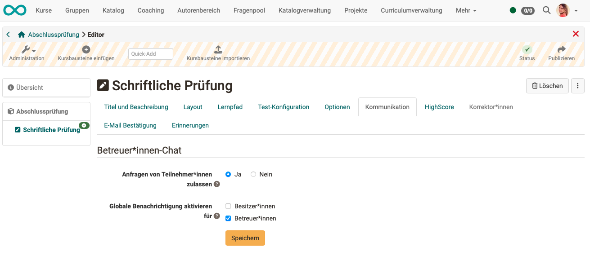
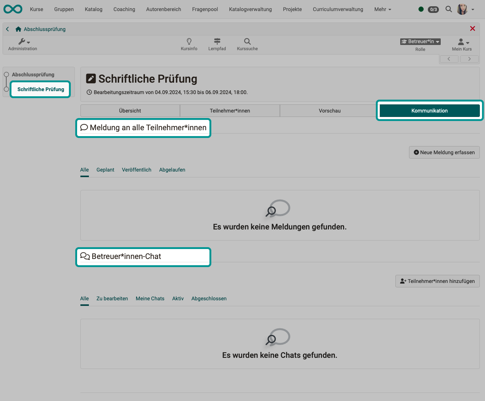

# Communication during an exam {: #communication_during_exam}

??? abstract "Objectives and content of this instruction"

    You have already prepared a course for an online exam and want to take the exam online within a certain time frame.
     
    The following instructions show you which communication options are available to you during the test in OpenOlat.

??? abstract "Target group"

    [x] Authors [x] Coaches  [ ] Participants

    [ ] Beginners [x] Amateurs  [x] Experts

??? abstract "Expected previous knowledge"

    * ["How do I create my first OpenOlat course?"](../my_first_course/my_first_course.md)
    * ["How do I proceed when I create a test?"](../test_creation_procedure/test_creation_procedure.md)
    * You have already prepared a course for the online exam.

---

## Communication needs {: needs}

During an online exam, **various communication needs** may arise:

* individual participants have individual problems
* the examination supervisor (coach) would like to point out that there are only 10 minutes left to complete the work
* the coach answers the question of a single person
* the coach recognizes through a query that a note to all exam participants is required
* ...

OpenOlat has communication options for these situations. Even if [Assessment mode](../../manual_user/learningresources/Assessment_mode.md) is active and all other tools on the computer are deactivated via [Safe Exam Browser](../../manual_user/learningresources/Assessment_mode.md).

In particular, these are **the two communication tools**

* **Messages** (from coaches to everyone) and
* the **exam chat** (1:1 with coaches or from coaches to everyone)

 

[Up (Section Communication needs) ^](#needs) 
[To the top of the page ^](#communication_during_exam)

---

## 1. Set up communication channels as course owner/author {: #author}

Would you like to allow exam participants to ask questions during the exam? 
The tool for this is the **exam chat**. As the course owner, make the settings accordingly. Without this approval by the course owner, the exam chat is not available.

**Open course editor > Select test course element > Communication tab**

{ class="shadow lightbox" }  

If course owners are also to be chat coaches, they will also see the messages in the global menu bar.

The coach chat during exams works regardless of whether the general chat function is activated in the OpenOlat instance or not.

[Up (Section Course owner/author) ^](#author)
[To the top of the page ^](#communication_during_exam)

---

## 2. Communicate as coach {: #coach}

### Where can I find the communication tools?

* In the menu, select the test **course element** that contains the exam.
* As a coach, you will not see the test after clicking on it (like the participants), but several tabs.
* Select the **"Communication"** tab. There you will find the tools for communication between exam supervisors (coaches) and exam participants.

In the **upper area** you create, edit and manage the **notifications** (1:many) before and during the exam.

In the **bottom area** you can see an overview of the **chat** histories (1:1) with the exam participants.

{ class="shadow lightbox" } 

## Links (German)

:octicons-device-camera-video-24: **Video Introduction**: [Überblick Testing](<https://www.youtube.com/embed/fkqH41-8CaI>){:target="_blank”}

:octicons-device-camera-video-24: **Video Introduction**: [Wie funktionieren Tests in OpenOlat?](<https://www.youtube.com/embed/M0p3UKaEOlg>){:target="_blank”}

 

---

## Checklist

- [x] tbd
