# Wie erstelle ich ein Content Package?

Die folgende Anleitung zeigt Ihnen, wie Sie importierte oder selbst erstellte Content Packages erstellen und in Ihren OpenOlat-Kurs einbinden.

---

## Was ist ein Content Package (CP)?

Ein Content Package (CP) wird im E-Learning genutzt, um Lerninhalte oder Tests als **in sich geschlossene Pakete** zu erstellen. 

Es ist ein **standardisiertes Format**. Dadurch können auch CP's von anderen Lernplattformen in OpenOlat importiert werden. Umgekehrt können Sie in OpenOlat erstellte CP's auch in anderen Lernplattformen verwenden, die das CP-Format unterstützen.

Das am weitesten verbreitete Format wurde von IMS Global definiert. Es wird eine XML-Manifestdatei namens imsmanifest.xml verwendet, die den Aufbau des Content Packages beschreibt. Diese Datei zur Strukturbeschreibung ist zusammen mit den Lerninhalten (HTML-Dateien, Bild-Dateien) in eine **ZIP-Datei** gepackt.

---

## Wo werden Content Packages verwendet?

Content Packages können sowohl in einen OpenOlat-Kursbaustein als auch separat verwendet werden. In der Regel werden CPs in einen Kurs eingebunden. Dabei kann ein und dasselbe CP in mehreren Kursen verwendet werden.

**Beispiel:** 
Erstellen Sie eine Einführung in Ihr Thema als Content Package. Sie können die Einführung dann sowohl in einem Kurs für Anfänger als auch zur Wiederholung in weiterführenden Kursen einbinden. Oder Sie verwenden das Content Package als eigenständige Lernressource.

 

Im Folgenden zeigen wir, wie ein Content Package innerhalb eines OpenOlat-Kurses eingebunden wird. Wenn Sie noch keinen Kurs erstellt haben, steht im Kapitel ["Wie erstelle ich meinen ersten OpenOlat-Kurs"](../my_first_course/my_first_course.de.md), wie Sie vorgehen müssen, bevor Sie mit Hilfe der folgenden Anleitung Ihr Content Package erstellen und einbinden.

---

## Wie kommt ein Content Package (CP) in OpenOlat?

Es gibt grundsätzlich zwei Möglichkeiten:

* Import eines CP oder
* Erstellung in OpenOlat

---

## Schritt 1: Kurseditor öffnen und Kursbaustein "CP-Lerninhalt" einfügen  

a) Gehen Sie in den **Autorenbereich** und suchen Sie dort den Kurs, in den der CP-Lerninhalt eingefügt werden soll.
  
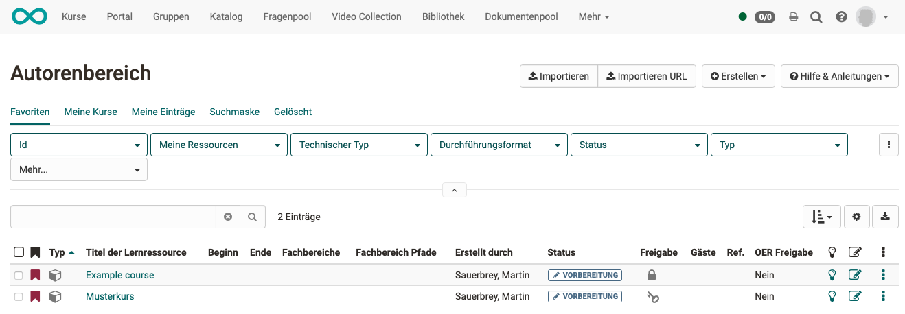{ class="shadow lightbox" }  

b) Öffnen Sie den gewünschten Kurs im **Kurseditor**, der sich im Menü "Administration" befindet.

c) Wählen Sie die Stelle im Kursmenü, an der der Baustein hinzugefügt werden soll. Kursbausteine werden immer unterhalb des aktuell ausgewählten Kursbausteins eingefügt. 

d) Klicken Sie in der Kopfzeile des Editors auf **"Kursbaustein einfügen"** oder nutzen Sie die Quick-Add Funktion und wählen Sie im Popup mit der Auswahlliste "CP-Lerninhalt".

Damit ist der Kursbaustein schon dem Kurs hinzugefügt.

e) Vergeben Sie nun noch einen passenden **Titel** im Tab "Titel und Beschreibung" und speichern Sie den Kursbaustein.  

!!! tip "Hinweis"

    Wenn Sie den Kurseditor bereits jetzt schliessen, wird im Menü kein Kursbaustein mit Content Package angezeigt, denn der Kursbaustein ist noch unvollständig. Es fehlt noch die Lernressource, das CP.

---

## Schritt 2: Content Package (Lernressource) erstellen  

a) Gehen Sie in den **Tab "Lerninhalt"** und klicken Sie auf „CP-Lerninhalt wählen, erstellen oder importieren“.

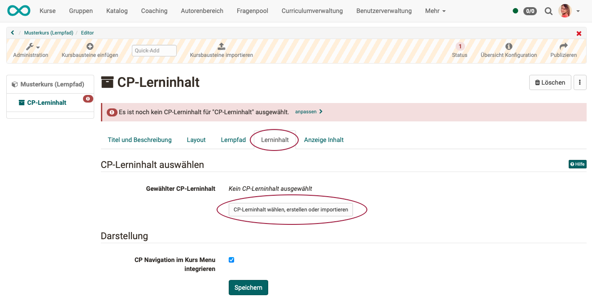{ class="shadow lightbox" }  

b) Hier können Sie nun 

* ein **neues** Content Package erstellen, 
* ein Content Package **hochladen**, das als Lernressource in OpenOlat bereits vorhanden ist
* oder ein Content Package **hochladen**, das Ihnen als zip-Datei vorliegt (z.B. durch einen Export aus einem anderen System).

Wir gehen im Folgenden davon aus, dass Sie ein **neues** Content Package erstellen möchten.
  
c) Klicken Sie auf den **Button "Erstellen"**. 

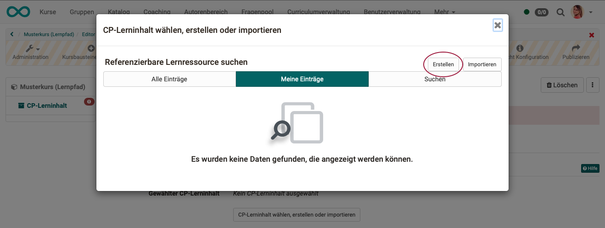{ class="shadow lightbox" }  

d) Geben Sie einen **Titel** für Ihre CP-Lernressource ein und bestätigen Sie mit <b>"Erstellen"</b>. 

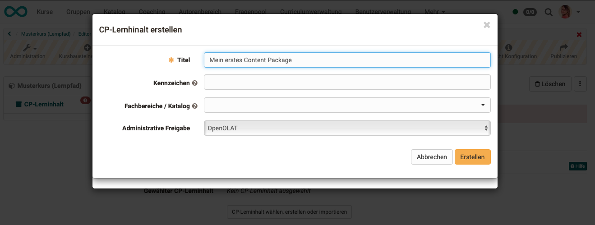{ class="shadow lightbox" } 

Fertig. Damit ist eine neue Lernressource angelegt und weitere Einstellungen sowie die konkrete Ausgestaltung können vorgenommen werden.

!!! tip "Tipp"

    Alternativ kann ein CP-Lerninhalt (so wie alle anderen Lernressourcen) auch im Autorenbereich erstellt und anschliessend im Kurseditor im Tab "Lerninhalt" in den gewünschten Kurs eingebunden werden. 
    
    Bei diesem Vorgehen wird deutlich, dass Lernressourcen kursübergreifende Elemente sind und die Einbindung im gewählten Kurs nur eine der Verwendungsmöglichkeiten darstellt. 
    
    Das gleiche Content Package kann in mehreren OpenOlat-Kursen eingebunden und auch kursunabhängig verwendet werden.

---

## Schritt 3: Content Package bearbeiten
 
!!! tip "Hinweis"

    In OpenOlat ist ein eigener Editor für Content Packages im IMS-Standard vorhanden. 
    Weitere Informationen zu IMS CP finden Sie unter der folgenden Adresse: http://www.imsglobal.org/content/packaging/
    
    Sie können zur Erstellung aber auch einen anderen Editor verwenden und dann die dort erstellte zip-Datei importieren.

<h3> a) Lernressource editieren (Vorschau öffnen)</h3>

Öffnen Sie den Kurseditor und klicken Sie im Tab "Lerninhalt" auf "Editieren".

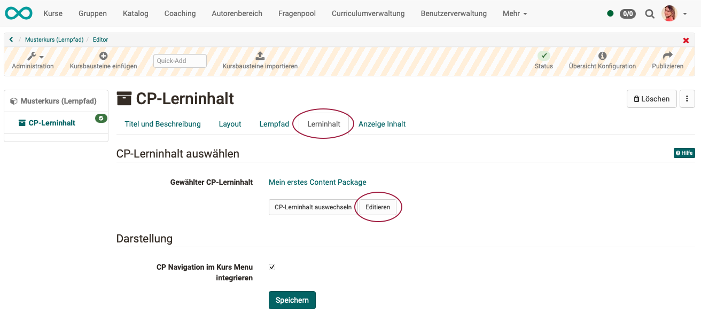{ class="shadow lightbox" } 

Sie gelangen damit auf die Vorschau Ihres Content Packages. Da es neu erstellt wurde, enthält es aktuell noch keine Seiten.

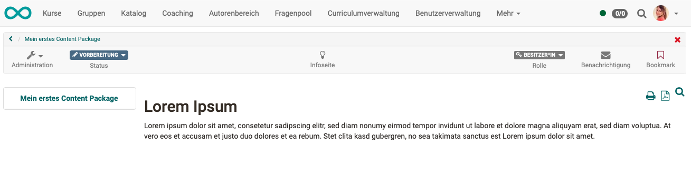{ class="shadow lightbox" } 

<h3> b) CP-Editor öffnen</h3>

Durch Klick auf **"Administration"** und dann **"Inhalt editieren"** gelangen Sie in den Bearbeitungs-Modus des CP-Editor. Die schraffierte Kopfzeile zeigt es Ihnen an. (Sie bearbeiten hier jedoch nicht einen Kurs, sondern eine Lernressource.)

Sie finden hier alle Werkzeuge zum Ergänzen von Inhalt in der CP-Lernressource:

* erstellen Sie neue Seiten innerhalb des Content Packages,
* ergänzen Sie Bilder,
* ergänzen Sie Links,
* ergänzen Sie Videos,
* ...

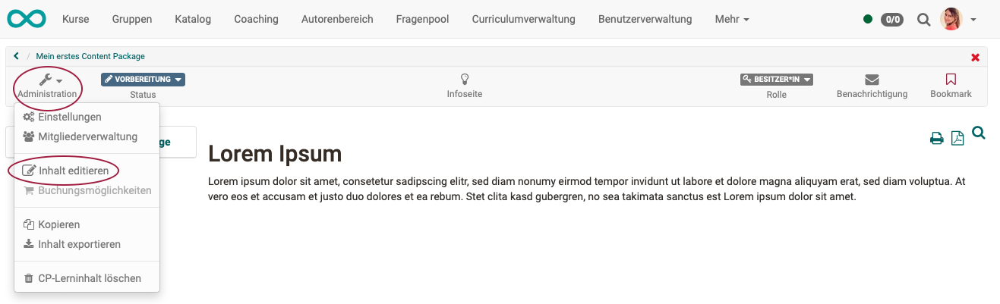{ class="shadow lightbox" } 

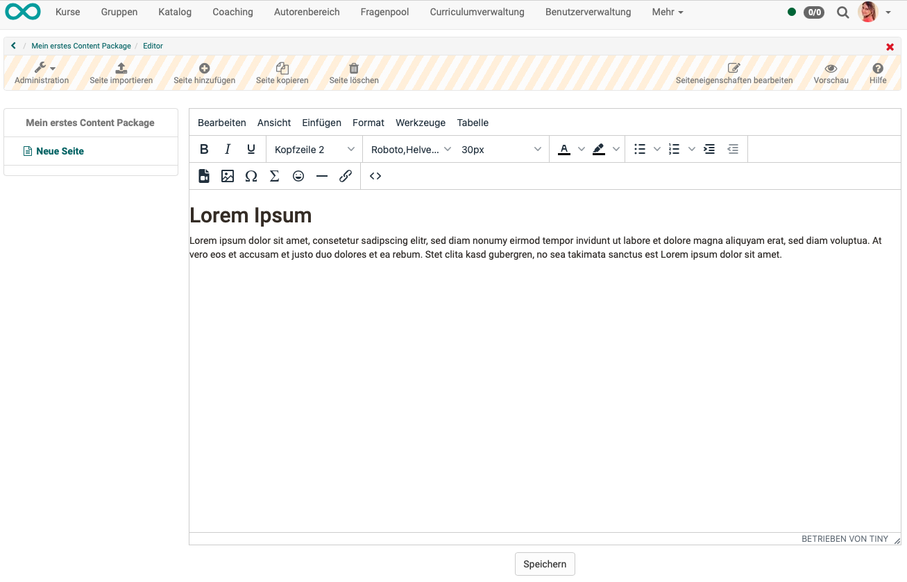{ class="shadow lightbox" } 

!!! tip "Hinweis"

    Vergessen Sie nicht, am unteren Rand des Editors auf **"Speichern"** zu klicken!

<h3> c) Editieren der Lernressource abschliessen</h3>

Haben Sie alle Inhalte in das Content Package eingefügt, verlassen Sie den Bearbeitungsmodus (schraffierte Kopfzeile), damit die Änderungen sichtbar werden. Klicken Sie dazu

* entweder auf **das kleine rote Kreuz** rechts oben
* oder auf die **Breadcrumb**.

Sie gelangen dann wieder zur Ansicht der Lernressource.

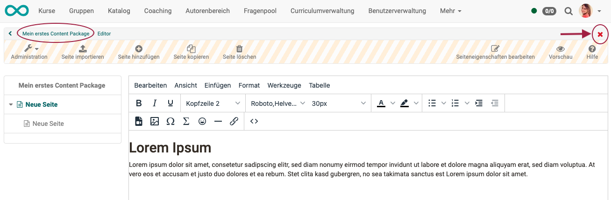{ class="shadow lightbox" } 

<h3> d) Weitere Einstellungen der CP-Lernressource </h3>

Sie befinden sich immer noch in der Lernressource. Zum **Kurs** und dem **Kursbaustein** CP-Lerninhalt ist es nochmals eine Stufe weiter zurück.

Bevor Sie auf diese Ebene zurück gehen, empfiehlt es sich, in der Lernressource zuerst noch weitere Einstellungen vorzunehmen. (Sie können die Einstellungen zur Lernressource aber auch später jederzeit wieder aufrufen.)

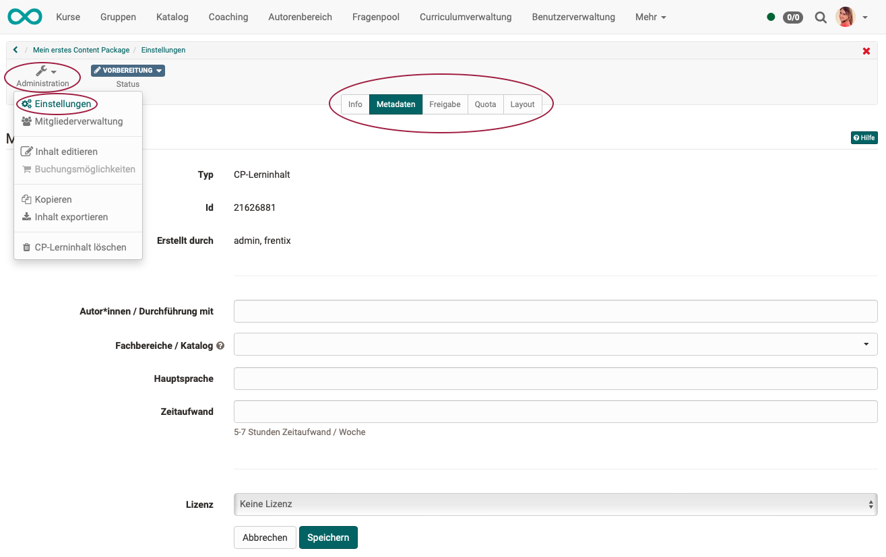{ class="shadow lightbox" } 

<h3> e) Navigation ins Kursmenü übernehmen</h3>

Innerhalb eines Content Packages existieren normalerweise verschiedene Seiten und auch Unterordner. Das bedeutet, innerhalb des Content Packages braucht und hat es eine Navigation.

Diese Navigation innerhalb des Content Packages kann in das Menü des OpenOlat-Kurses übernommen werden. So wird die Navigation für die Lernenden vereinfacht.

Gehen Sie dazu zurück zum **Kurseditor** und selektieren Sie den  Kursbaustein. Wählen Sie dort im Tab **"Lerninhalt"** die Option **"CP Navigation im Kurs Menu integrieren"**.

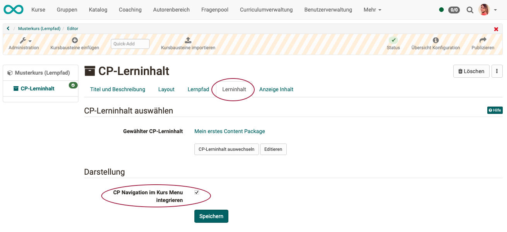{ class="shadow lightbox" } 

---

## Schritt 4: Kurs publizieren und Status auf "Veröffentlicht" ändern  
  
Gehen Sie dazu vor, wie in ["Wie erstelle ich meinen ersten OpenOlat-Kurs"](../my_first_course/my_first_course.de.md) beschrieben.

Das Content Package ist nun eingebunden und Kursteilnehmende können den Inhalt lesen.
