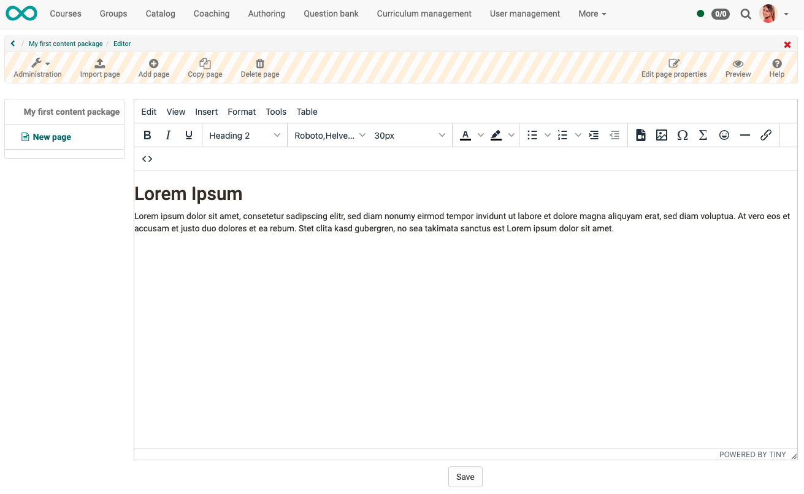

# How do I create a content package?

The following instructions show you how to create imported or self-created content packages and include them in your OpenOlat course.

---

## What is a Content Package (CP)?

A Content Package (CP) is used in e-learning to create learning content or tests as **self-contained package**.

It is a **standardized format**. This means that CP's from other learning platforms can also be imported into OpenOlat. Vice versa, you can use CP's created in OpenOlat in other learning platforms that support the CP format.

The most widely used format was defined by IMS Global. It uses an XML manifest file called imsmanifest.xml that describes the structure of the content package. This structure description file is packed together with the learning content (HTML files, image files) in a **ZIP file**.

---

## Where are Content Packages used?

Content Packages can be included in an OpenOlat course module or used separately. As a rule, CPs are integrated into a course. One and the same CP can be used in several courses.

**Example:** 
Create an introduction to your topic as a content package. You can then include the introduction both in a course for beginners and for repetition in more advanced courses. Or, use the content package as a stand-alone learning resource.

 

In the following we show how to include a content package within an OpenOlat course. If you have not yet created a course, the chapter ["How do I create my first OpenOlat course"](../my_first_course/my_first_course.md) tells you how to proceed before creating and embedding your content package using the following instructions.

---

## How does a Content Package (CP) get into OpenOlat?

There are basically two possibilities:

* import of a CP or
* creation in OpenOlat

---

## Step 1: Open course editor and insert course element "CP learning content"

a) Go to **Authoring** and search there for the course in which the CP learning content is to be inserted.
  
{ class="shadow lightbox" }  

b) Open the desired course in the **Course editor** located in the "Administration" menu.

c) Select the position in the course menu where the course element is to be added. Course elements are always inserted below the currently selected course element.

d) Click **"Insert course element"** in the editor header or use the Quick-Add function and select "CP learning content" in the popup with the selection list.

This means that the course element has already been added to the course.

e) Now enter a suitable **title** in the tab "Title and description" and save the course element.

!!! tip "Note"

    If you close the course editor already now, no course element with content package will be displayed in the menu because the course element is still incomplete. The learning resource, the CP, is still missing.

---

## Step 2: Create Content Package (Learning Resource) 

a) Go to the **Tab "Learning content"** and click on "Select, create or import CP learning content".

{ class="shadow lightbox" }  

b) Here you can now 

* create a **new** content package, 
* **upload** a content package that is already available as a learning resource in OpenOlat
* or **upload** a content package that you have as a zip file (e.g. by exporting it from another system).

In the following, we assume that you want to create a **new** content package.
  
c) Click the  **"Create" Button**. 

{ class="shadow lightbox" }  

d) Enter a **title** for your CP learning resource and confirm with **"Create "**.

{ class="shadow lightbox" } 

Done. Now a new learning resource is created and further settings as well as the concrete design can be made.

!!! tip "Hint"

    Alternatively, a CP learning content (like all other learning resources) can also be created in the authoring area and then integrated in the desired course in the course editor in the tab "Learning content". 
    
    This procedure makes it clear that learning resources are cross-course elements and their integration in the selected course is only one of the possible uses. 
    
    The same content package can be integrated in several OpenOlat courses and can also be used independently of the course.

---

## Step 3: Editing the Content Package
 
!!! tip "Note"

    In OpenOlat there is a separate editor for content packages in the IMS standard. 
    More information about IMS CP can be found at the following address: http://www.imsglobal.org/content/packaging/
    
    However, you can also use another editor to create it and then import the zip file created there.

<h3> a) Edit learning resource (open preview)</h3>

Open the course editor and click "Edit" in the "Learning Content" tab.

{ class="shadow lightbox" } 

This will take you to the preview of your content package. Since it is newly created, it does not currently contain any pages.

{ class="shadow lightbox" } 

<h3> b) Open the CP editor</h3>

By clicking **"Administration"** and then **"Edit content"** you reach the edit mode of the CP-Editor. The hatched header shows it to you. (However, you are not editing a course here, but a learning resource).

Sie finden hier alle Werkzeuge zum Ergänzen von Inhalt in der CP-Lernressource:
You will find here all tools for adding content to the CP learning resource:

* create new pages within the content package,
* add images,
* add links,
* add videos,
* ...

{ class="shadow lightbox" } 

{ class="shadow lightbox" } 

!!! tip "Hint"

    Don't forget to click **"Save"** at the bottom of the editor!

<h3> c) Complete editing of the learning resource</h3>

Once you have inserted all the content into the content package, exit the editing mode (hatched header) so that the changes become visible. To do this, click

* either on **the small red cross** in the upper right corner
* or on the **breadcrumb**.

You will then return to the learning resource view.

{ class="shadow lightbox" } 

<h3> d) Further settings of the CP learning resource </h3>

You are still in the learning resource. To the **course** and the **course module** CP learning content it is again one step further back.

Before you go back to this level, it is recommended to make further settings in the learning resource first. (However, you can always return to the learning resource settings later).

{ class="shadow lightbox" } 

<h3> e) Transfer navigation into the course menu</h3>

Within a content package there are usually different pages and also subfolders. That means, within the content package it needs and has a navigation.

This navigation within the content package can be transferred to the menu of the OpenOlat course. This simplifies the navigation for the learners.

Go back to the **Course Editor** and select the course element. In the tab **"Learning content"** select the option **"Show CP navigation within the course menu"**.

{ class="shadow lightbox" } 

---

## Step 4: Publish course and change status to "Published"
  
To do this, proceed as described in ["How do I create my first OpenOlat course"](../my_first_course/my_first_course.md).

The content package is now included and course participants can read the content.

