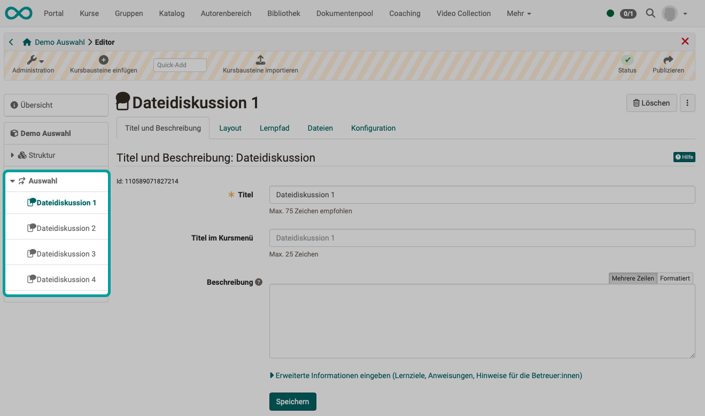
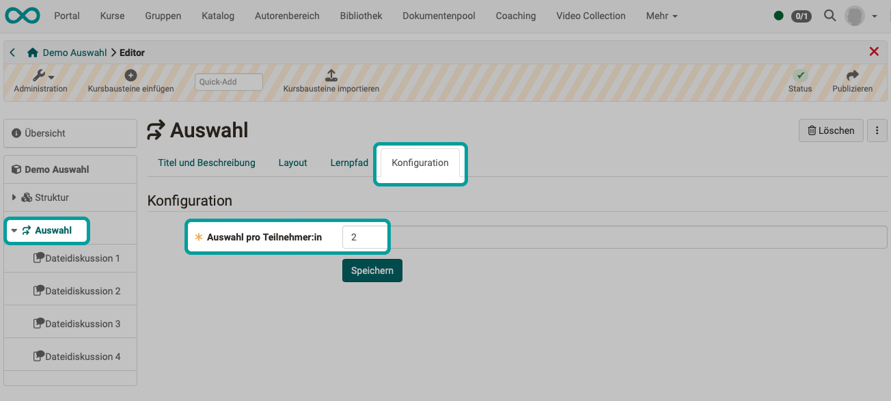

# Wie verwende ich den Kursbaustein Auswahl? {: #how_do_i_use_course_element_selection}

Diese Anleitung zeigt Ihnen, wie Sie in Ihrem Kurs den Teilnehmer:innen eine Wahlmöglichkeit zwischen verschiedenen Pflicht-Kursbausteinen einrichten.

!!! tip "Hinweis"

    Wenn die Teilnehmer:innen keine Pflicht-Kursbausteine erledigen sollen, sondern grundsätzlich freie Wahl haben, können Sie dies durch die Konfiguration "freiwillig" ermöglichen. 
    **Kurs im Kurseditor öffnen > Kursbausteinbaustein wählen > Tab Lernpfad > Option "freiwillig"**

## Welche Art Auswahl sollen die Kursteilnehmer:innen treffen können? {: #examples}

* Wahl zwischen verschiedenen Pflichtaufgaben
    - Die Teilnehmer:innen sollen x aus y Aufgaben erledigen müssen.
    - Typischerweise soll der gleiche Aufgabentyp (Kursbaustein-Typ) mehrfach angeboten werden.
    - Bei gleichem Aufgabentyp mit je gleicher Punktzahl kann die individuelle Aufgabenwahl auf faire Art für die Gesamtbewertung des Kurses berücksichtigt werden.
* Wahl zwischen verschiedenen Vertiefungsthemen
    - Die Kursteilnehmer:innen sollen 1 oder mehrere Themen bearbeiten müssen, aber selbst aus einer vorgegebenen Auswahl ein oder mehrere Themen wählen können.
    - Wurde das Vertiefungsthema gewählt, kann es durch die Kursteilnehmer:innen nicht mehr gewechselt werden. (Lediglich Betreuer:innen können dies noch.)
* Wahl zwischen verschiedenen komplexeren Arbeitsaufträgen (Projektarbeiten) innerhalb eines Kurses
    - Unterhalb des Kursbausteins "Auswahl" werden in Strukturbausteinen oder mit Kursbausteinen "Aufgabe" ganze Pakete mit Arbeitsaufträgen und Material bereit gestellt.
    - Die Kursteilnehmer:innen können ein Thema wählen, das sie dann bearbeiten müssen.
    - Jedem/jeder Kursteilnehmer:in werden dann **nur** diejenigen Kursbausteine im Kursmenü angezeigt, die zum gewählten Thema gehören. 

##  Voraussetzung

Der Kursbaustein "Auswahl" wird innerhalb eines OpenOlat-Kurses eingebunden. Wenn Sie noch keinen Kurs erstellt haben, steht im Kapitel "[Wie erstelle ich meinen ersten OpenOlat-Kurs](../my_first_course/my_first_course.de.md)", wie Sie vorgehen müssen, bevor Sie mit Hilfe der folgenden Anleitung diesen Kursbaustein einfügen.

## Schritt 1: Kurseditor öffnen und Kursbaustein "Auswahl" einfügen 

a) Gehen Sie in den **Autorenbereich** und suchen Sie dort den Kurs, in den der Kursbaustein "Auswahl" eingefügt werden soll.
  

b) Öffnen Sie den gewünschten Kurs im **Kurseditor** (Menü "Administration" > Kurseditor).

c) Wählen Sie die Stelle im Kursmenü, an der der Baustein hinzugefügt werden soll. Kursbausteine werden immer unterhalb des aktuell ausgewählten Kursbausteins eingefügt. 

d) Klicken Sie in der Kopfzeile des Editors auf **"Kursbaustein einfügen"** oder nutzen Sie die Quick-Add Funktion und wählen Sie im Popup mit der Auswahlliste den Kursbaustein "Auswahl".

Damit ist der Kursbaustein schon dem Kurs hinzugefügt.

e) Vergeben Sie nun noch einen passenden **Titel** im Tab "Titel und Beschreibung" und speichern Sie den Kursbaustein.  

!!! tip "Hinweis"

    Wenn Sie den Kurseditor bereits jetzt schliessen, wird im Menü der Kursbaustein zwar angezeigt, aber er ist noch unvollständig. Es fehlen noch die Kursbausteine, aus denen die Kursteilnehmer:innen auswählen sollen. Diese Kursbausteine müssen Sie als Autor:in noch bereit stellen. Es erscheint ein entsprechender Warnhinweis.

[zum Seitenanfang ^](#how_do_i_use_course_element_selection)

---

## Schritt 2: Die wählbaren Kursbausteine zur Verfügung stellen  

a) Klicken Sie in der Kopfzeile des Editors auf **"Kursbaustein einfügen"** oder nutzen Sie die Quick-Add Funktion und wählen Sie im Popup mit der Auswahlliste die Kursbausteine, die Sie zur Auswahl anzeigen wollen.

b) Ziehen Sie nacheinander die Kursbausteine mit gedrückter Maustaste auf den Auswahl-Kursbaustein. Dadurch werden sie dem Auswahl-Kursbaustein untergeordnet. Die später für die Teilnehmer:innen verfügbare Auswahl bezieht sich auf diese untergeordneten Bausteine.

**Beispiel: Für die Teilnehmer:innen stehen später 4 Kursbausteine zur Auswahl**

{ class="shadow lightbox" }  

[zum Seitenanfang ^](#how_do_i_use_course_element_selection)

---

## Schritt 3: Konfiguration des Kursbausteins "Auswahl"  

a) Wählen Sie links im Kursmenü den Kursbaustein "Auswahl" und bestimmen Sie nacheinander in den zugehörigen Tabs die Konfiguration.

b) Im Tab "Konfiguration" bestimmen Sie, wie viele der untergeordneten Kursbausteine die Kursteilnehmer:innen später auswählen müssen.

**Beispiel: Die Kursteilnehmer:innen müssen 2 der 4 angebotenen Kursbausteine "Dateidiskussion" auswählen und bearbeiten**

{ class="shadow lightbox" }  

Im Kursrun* werden die beiden gewählten Kursbausteine nach der Wahl in das Kursmenü eingefügt. Die Teilnehmer:innen haben also in diesem Abschnitt ein indiviuelles Kursmenü.  
Siehe [Der Kursbaustein "Auswahl", Abschnitt "Auswahl treffen"](../../manual_user/learningresources/Course_Element_Selection.de.md#selection_participant) 

(*Kursrun = Modus "aktiver Kurs", im Unterschied zum Kurs, der im Editor geöffnet ist)

!!! info "Hinweis zur Konfiguration der zugeordneten Kursbausteine"

    In den zugeordneten Kursbausteinen ist im Tab "Lernpfad" jeweils die Option "Ausnahme" voreingestellt und kann nicht geändert werden.
    Siehe [Der Kursbaustein "Auswahl", Abschnitt "Auswahl einrichten"](../../manual_user/learningresources/Course_Element_Selection.de.md#selection_setup)

c) Abschließend muss der Kurs **publiziert** und der Kurseditor geschlossen werden, damit die Änderungen sichtbar werden. 

[zum Seitenanfang ^](#how_do_i_use_course_element_selection)

---

## Schritt 4: Kurs publizieren und Kurs-Status auf "Veröffentlicht" ändern  
  
Gehen Sie dazu vor, wie in ["Wie erstelle ich meinen ersten OpenOlat-Kurs"](../my_first_course/my_first_course.de.md) beschrieben.

Der Kursbaustein "Auswahl" ist nun eingebunden und Kursteilnehmende können aus mehreren Kursbausteinen selbst Pflicht-Bausteine wählen.

[zum Seitenanfang ^](#how_do_i_use_course_element_selection)

---

## Weitere Informationen

[Wie erstelle ich meinen ersten OpenOlat-Kurs](../my_first_course/my_first_course.de.md) 
[Der Kursbaustein "Auswahl"](../../manual_user/learningresources/Course_Element_Selection.de.md)

 

[zum Seitenanfang ^](#how_do_i_use_course_element_selection)

---

