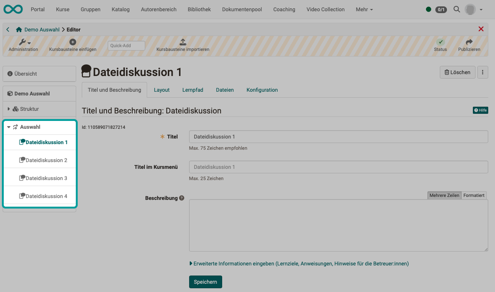
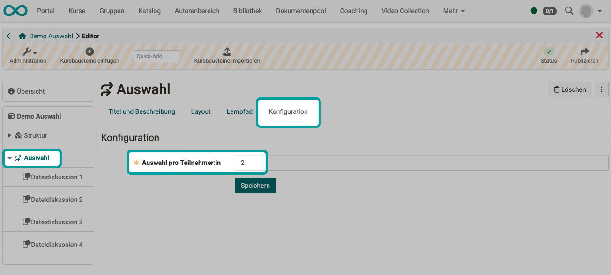

# How do I use course element selection? {: #how_do_i_use_course_element_selection}

This guide shows you how to give participants in your course the option of choosing between different compulsory course elements.

!!! tip "Note"

    If you do not want participants to complete any compulsory course elements, but rather have a free choice, you can enable this by configuring "voluntary". 
    **Open course in course editor > Select course element > Tab Learning path > Option "voluntary"**

## What kind of choices should course participants be able to make? {: #examples}

* Choice between various mandatory tasks
    - The participants have to complete x out of y tasks.
    - Typically, the same task type (course element type) should be offered several times.
    - With the same type of task, each with the same number of points, the individual choice of task can be taken into account in a fair way for the overall assessment of the course.
* Choice between various in-depth topics
    - Course participants are required to work on one or more topics, but can choose one or more topics from a given selection.
    - Once the specialization topic has been selected, it can no longer be changed by the course participants. (Only coaches can still do this.)
* Choice between various more complex assignments (project work) within a course
    - Below the "Selection" course element, entire packages with work assignments and material are provided in structure elements or with "Task" course elements.
    - Course participants can choose a topic that they then have to work on.
    - Each course participant will then **only** be shown those course elements in the course menu that belong to the selected topic. 

##  Requirement

The course element "Selection" is integrated within an OpenOlat course. If you have not yet created a course, the chapter explains "[How do I create my first OpenOlat course?](../my_first_course/my_first_course.de.md)" how to proceed before you insert this course element with the help of the following instructions.

## Step 1: Open course editor and insert "Selection" course element 

a) Go to the **Author area** and search for the course in which the course element "Selection" is to be inserted.
  

b) Open the desired course in the **Course editor** (menu "Administration" > Course editor).

c) Select the position in the course menu where the course element should be added. Course elements are always inserted below the currently selected course element. 

d) Click on **"Insert course element"** in the header of the editor or use the Quick-Add function and select the course element "Selection" in the pop-up with the selection list.

This means that the course element has already been added to the course.

e) Now assign a suitable **title** in the "Title and description" tab and save the course element.  

!!! tip "Note"

    If you close the course editor now, the course element will be displayed in the menu, but it will still be incomplete. The course modules from which the course participants are to choose are still missing. As the author, you still have to provide these course elements. A corresponding warning will appear.

[To the top of the page ^](#how_do_i_use_course_element_selection)

---

## Step 2: Provide the selectable course elements  

a) Click on **"Insert course element"** in the header of the editor or use the Quick-Add function and select the course elements you want to display for selection in the pop-up with the selection list.

b) Hold down the mouse button and drag the course elements one after the other onto the selected course element. This makes them subordinate to the selection course element. The selection available to participants later refers to these subordinate modules.

**Example: Participants will later be able to choose from 4 course modules**

{ class="shadow lightbox" }  

[To the top of the page ^](#how_do_i_use_course_element_selection)

---

## Step 3: Configuration of the "Selection" course element  

a) Select the course element "Selection" in the course menu on the left and determine the configuration in the corresponding tabs one after the other.

b) In the "Configuration" tab, you determine how many of the subordinate course elements the course participants have to select later.

**Example: Course participants must select and complete 2 of the 4 "File discussion" course elements offered**

{ class="shadow lightbox" }  

In the Course run*, the two selected course elements are added to the course menu after selection. The participants therefore have an individual course menu in this section.  
See [Course element "Selection", Section "Make a selection"](../../manual_user/learningresources/Course_Element_Selection.md) 

(*Course run = Mode "active course", in contrast to the course that is open in the editor)

!!! info "Note on the configuration of the assigned course elements"

    In the assigned course elements, the "Exception" option is preset in the "Learning path" tab and cannot be changed.
    See [The course element "Selection", Section "Make a selection"](../../manual_user/learningresources/Course_Element_Selection.md)

c) Finally, the course must be **published** and the course editor closed so that the changes are visible. 

[To the top of the page ^](#how_do_i_use_course_element_selection)

---

## Step 4: Publish course and change course status to "Published"  
  
To do this, proceed as described in ["How do I create my first OpenOlat course?"](../my_first_course/my_first_course.md).

The course element "Selection" is now integrated and course participants can choose compulsory elements from several course elements.

[To the top of the page ^](#how_do_i_use_course_element_selection)

---

## Further informations

[How do I create my first OpenOlat course](../my_first_course/my_first_course.de.md) 
[Course element "Selection"](../../manual_user/learningresources/Course_Element_Selection.de.md)

 

[To the top of the page ^](#how_do_i_use_course_element_selection)

---

