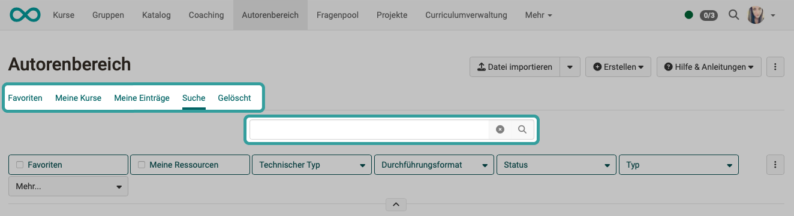
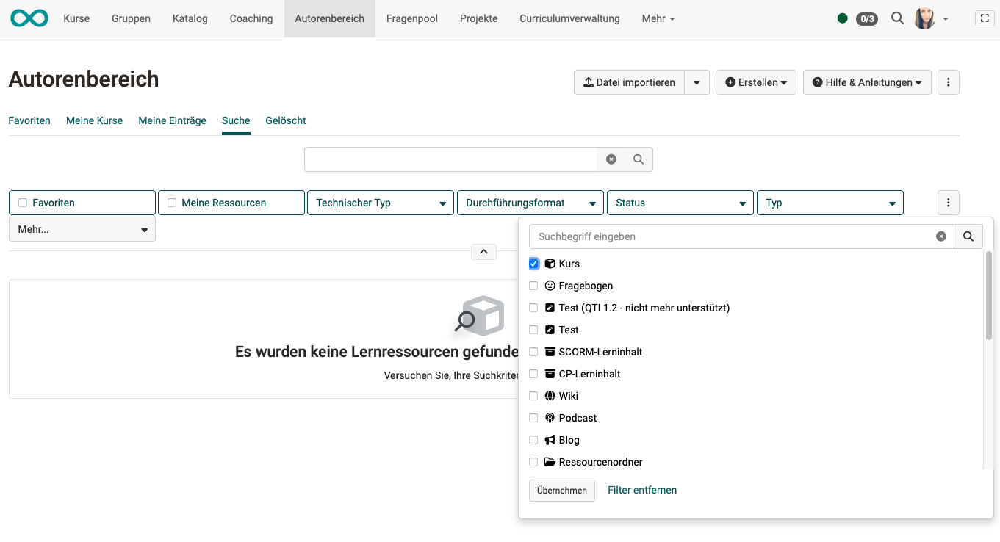

# Wie erstelle ich eine Excel-Liste aller vorhandenen Kurse? {: #course_list}

??? abstract "Ziel und Inhalt dieser Anleitung"

    Sie haben bereits mehrere Kurse erstellt und benötigen eine Übersicht als Excel-Tabelle (auch der noch nicht veröffentlichten). Hier eine kurze Anleitung.

??? abstract "Zielgruppe"

    [x] Autor:innen [x] Betreuer:innen  [ ] Teilnehmer:innen

    [x] Anfänger:innen [x] Fortgeschrittene  [ ] Experten/Expertinnen

??? abstract "Erwartete Vorkenntnisse"

    * ["Wie erstelle ich meinen ersten OpenOlat-Kurs?"](../my_first_course/my_first_course.de.md)
   

---

Im Autorenbereich lassen sich alle erstellen Kurse (auch die noch nicht veröffentlichten) durchsuchen, filtern und sortieren. Für manche Zwecke benötigt es jedoch den Export einer Übersichtsliste als Excel-Datei. Gehen Sie dazu in den folgenden Schritten vor.

## Schritt 1: Autorenbereich öffnen

Um den Autorenbereich in Ihrem Hauptmenü angezeigt zu bekommen, müssen Sie Autorenrechte besitzen. Wenden Sie sich an Ihre Administrator:innen, falls Ihnen der Autorenbereich nicht angezeigt wird.

## Schritt 2: Suche der Kurse

* Verwenden Sie die Tabs "Favoriten", "Meine Kurse" oder "Meine Einträge", wenn diese Filter bereits eine Vorauswahl nach Ihren Vorstellungen enthalten.
* Verwenden Sie den Tab "Suche", wenn nicht nur die eigenen Kurse angezeigt werden sollen.
* Mit dem Suchfeld können Sie nach Namen oder Namensfragementen suchen. Wenn Sie mehrere Begriffe mit Leerzeichen getrennt eingeben, werden sie mit einem logischen ODER verknüpft, d.h. mindestens einer der Begriffe kommt dann in den aufgelisteten Kursnamen und Lernressourcen vor.
* Starten Sie die Suche mit Klick auf das Lupensysmbol oder durch Drücken der Eingabetaste.

{ class="shadow lightbox"}

[zum Seitenanfang ^](#course_list)

## Schritt 3: Filtern der Suchergebnisse

Setzen Sie den Filter "Typ = Kurs". 
Übernehmen Sie ihn mit Klick auf den Button "Übernehmen" am unteren Rand des Popups.

{ class="shadow lightbox"}

[zum Seitenanfang ^](#course_list)

## Schritt 4: Reihenfolge festlegen

Die im Schritt 5 erzeugte Excelliste enthält die Zeilen in der gleichen Reihenfolge, wie sie in OpenOlat angezeigt werden. Bereiten Sie deshalb die Liste in OpenOlat entsprechend vor.

Klicken Sie auf die Spaltentitel, um die angezeigte Liste auf- oder absteigend zu sortieren.

Wenn Sie eine andere Sortierung benötigen, hilft es Ihnen vielleicht, weitere Spalten einzublenden und nach diesen zu sortieren. Für das Einblenden weiterer Spalten klicken Sie auf das Zahnrad-Icon rechts oben über der Liste.

## Schritt 5: Erstellen einer Excel-Liste

Klicken Sie auf den Download-Button rechts oben über der Liste und speichern Sie die Excel-Liste.

{ class="shadow lightbox"}

[zum Seitenanfang ^](#course_list)
