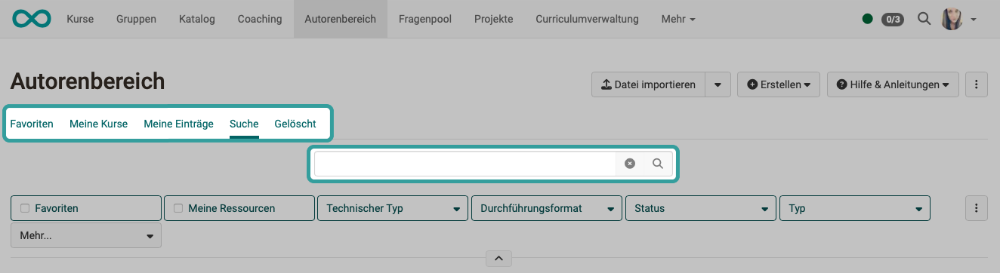
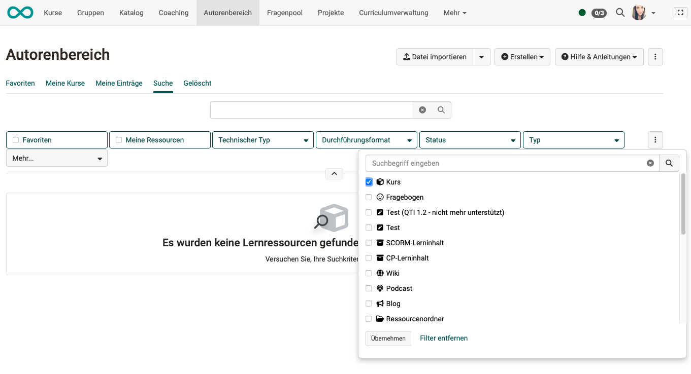

# How do I create an Excel list of all available courses? {: #course_list}

??? abstract "Goal and content of these instructions"

    You have already created several courses and need an overview as an Excel spreadsheet (including those not yet published). Here is a short guide.

??? abstract "Target group"

    [x] Authors [x] Coaches  [ ] Participants

    [x] Beginners [x] Amateurs  [ ] Experts

??? abstract "Erwartete Vorkenntnisse"

    * ["How do I create my first OpenOlat course? "](../my_first_course/my_first_course.md)
   

---

In the Authoring area, all created courses (including those not yet published) can be searched, filtered and sorted. For some purposes, however, it is necessary to export an overview list as an Excel file. To do this, follow the steps below.

## Step 1: Open "Authoring"

To display the Authoring area in your main menu, you must have author rights. Contact your administrator if the Authoring area is not displayed.

## Step 2: Search of the courses

* Use the "Favorites", "My courses" or "My entries" tabs if these filters already contain a preselection according to your preferences.
* Use the "Search" tab if you want to display more than just your own courses.
* You can use the search field to search for names or name query terms. If you enter several terms separated by spaces, they will be linked with a logical OR, i.e. at least one of the terms will appear in the course names and learning resources listed.
* Start the search by clicking on the magnifying glass icon or by pressing the Enter key.

{ class="shadow lightbox"}

[To the top of the page ^](#course_list)

## Step 3: Filtering of the search

Set the filter "Type = Course ". 
Accept it by clicking on the "Accept" button at the bottom of the pop-up.

{ class="shadow lightbox"}

[To the top of the page ^](#course_list)

## Step 4: Set sequence

The Excel list created in step 5 contains the lines in the same order as they are displayed in OpenOlat. Therefore, prepare the list in OpenOlat accordingly.

Click on the column titles to sort the displayed list in ascending or descending order.

If you require a different sorting, it may help to show additional columns and sort by them. To show additional columns, click on the cogwheel icon at the top right above the list.

## Step 5: Creating an Excel list

Click on the download button at the top right above the list and save the Excel list.

{ class="shadow lightbox"}

[To the top of the page ^](#course_list)

