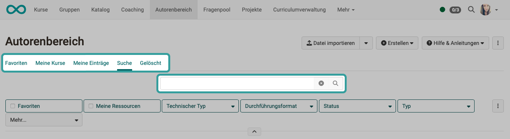
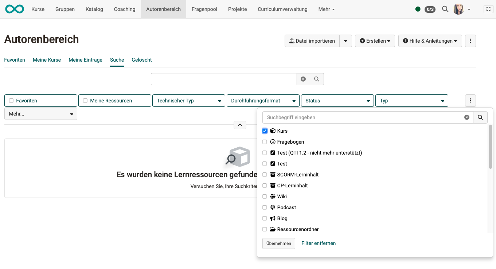
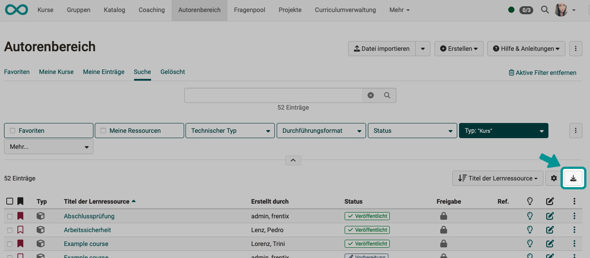

# How do I create an Excel list of all available courses? {: #course_list}

??? abstract "Goal and content of these instructions"

    You have already created several courses and need an overview as an Excel spreadsheet (including those not yet published). Here is a short guide.

??? abstract "Target group"

    [x] Authors [x] Coaches  [ ] Participants

    [x] Beginners [x] Advanced users  [ ] Experts

??? abstract "Expected previous knowledge"

    * ["How do I create my first OpenOlat course?"](../my_first_course/my_first_course.md)

---

In the Authoring area, all created courses (including those not yet published) can be searched, filtered and sorted. For some purposes, however, it is necessary to export an overview list as an Excel file. To do this, follow the steps below.

## Step 1: Open "Authoring" {: #open_authoring}

The main navigation shows you the Authoring area if you have the role Author. Learning resource managers, principals and administrators also see it. Contact your administrator if the Authoring area is not displayed.

## Step 2: Search of the courses {: #search_courses}

* Use the "Favourites", "My courses" or "My entries" tabs if these filters already contain a preselection according to your preferences.
* Use the "Search form" tab if you want to display more than just your own courses.
* With the search field you find learning resources whose title or reference contains the entered text. If you enter several words, OpenOlat searches for exactly this sequence of words.
* Start the search by clicking on the magnifying glass icon or by pressing the Enter key.

Courses in the trash are listed in the "Deleted" tab.

{ class="shadow lightbox" title="Search form tab in Authoring" }

[To the top of the page ^](#course_list)

## Step 3: Filtering of the search {: #filter_results}

Set the filter "Type = Course". 
Apply it by clicking on the "Apply" button at the bottom of the pop-up.

The "My courses" tab shows courses only. There, this step is not needed.

{ class="shadow lightbox" title="Type filter in Authoring" }

[To the top of the page ^](#course_list)

## Step 4: Set order {: #set_order}

The Excel list created in step 5 contains the lines in the same order as they are displayed in OpenOlat. Therefore, prepare the list in OpenOlat accordingly.

Click on the column titles to sort the displayed list in ascending or descending order. Alternatively, choose the sort criterion with the sort button at the top right above the list. It shows the active criterion, for example "Title of learning resource".

If you require a different sorting, it may help to show additional columns and sort by them. To show additional columns, click on the cogwheel icon "Customize columns" at the top right above the list.

[To the top of the page ^](#course_list)

## Step 5: Creating an Excel list {: #create_list}

Click on the "Download" button (icon with an arrow pointing down) at the top right above the list and save the Excel list.

{ class="shadow lightbox" title="Filtered course list in Authoring" }

[To the top of the page ^](#course_list)

## Further information {: #further_information}

**Mentioned on this page** 
[How do I create my first OpenOlat course? >](../my_first_course/my_first_course.md)

**Further reading** 
[Authoring - Overview >](../../manual_user/area_modules/Authoring.md) 
[Working with tables >](../../manual_user/basic_concepts/Table_Concept.md) 
[Delete (a course or learning resource) >](../../manual_user/learningresources/Course_Delete.md)

[To the top of the page ^](#course_list)
