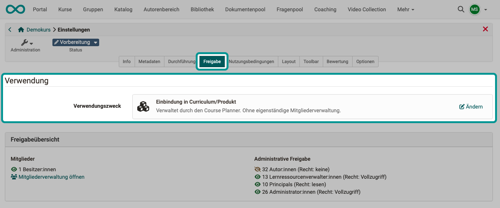

# Wie kann ich mit dem Course Planner Kursdurchführungen planen und durchführen? {: #plan_and_run_courses_with_course_planner}

!!! warning "Attention"

    This article is still under construction.

??? abstract "Ziel und Inhalt dieser Anleitung"

    Diese Anleitung zeigt Ihnen, wie Sie mit dem Course Planner automatisiert und effizient vom Angebot ausgehend Kurse planen und erstellen.

??? abstract "Zielgruppe"

    [x] Autor:innen [ ] Betreuer:innen  [ ] Teilnehmer:innen

    [ ] Anfänger:innen [x] Fortgeschrittene  [x] Experten/Expertinnen

??? abstract "Erwartete Vorkenntnisse"

    * ["Wie erstelle ich meinen ersten OpenOlat-Kurs?"](../my_first_course/my_first_course.de.md) 
    * Vertrautheit mit Basiskonzepten von OpenOlat

    https://docs.openolat.org/de/manual_user/basic_concepts/

---

## Was kann der Course Planner? {: #x}

Ziel ist es, automatisiert und effizient vom Angebot ausgehend Kurse zu erstellen und durchzuführen.

Mit dem Course Planner kann die **Planungsarbeit** von der **Inhaltserstellung** (im Autorenbereich) getrennt werden.

Sie können natürlich auch ohne Course Planner OpenOlat-Kurse erstellen. Mit dem Course Planner steht Ihnen jedoch ein Werkzeug zur Verfügung, das die organisatorischen Aufgaben zusammenführt.

##  Wo finde ich den Course Planner? {: #x}

Wenn Sie Autorenrechte besitzen, finden Sie den Course Planner als Menüpunkt der Hauptnavigation in der Kopfzeile.  

{ class="shadow lightbox" }  

!!! info "Voraussetzung"

    Um den Course Planner verwenden zu können, muss er von einem/einer Administrator:in aktiviert worden sein. Steht die Option nicht im Menü der Kopfzeile zur Verfügung, wenden Sie sich bitte an Ihren/Ihre Administrator:in.

## Schritt 1: Curriculum/Produkt erstellen  {: #x}

Öffnen Sie in den Course Planner und wählen Sie dort den Button "Curricula/Produkte".

Ein Curriculum kann mehrere Kurse umfassen. 

Ein Produkt ist...

Wenn Sie ein neues Curriculum erstellen, können Sie es auch auf die Verwendung innerhalb einer bestimmten Organisationseinheit beschränken, falls bei Ihnen das Modul "Organisationen" aktiviert ist.  

[zum Seitenanfang ^](#plan_and_run_courses_with_course_planner)

---

## Schritt 1b: Curriculum importieren  {: #x}

Soll ein bereits bestehendes Curriculum für Ihre Planung verwendet werden, können Sie auch Curricula importieren. Klicken Sie dazu auf die 3 Punkte neben dem Button "Curriculum erstellen".

{ class="shadow lightbox" }  

[zum Seitenanfang ^](#plan_and_run_courses_with_course_planner)

---

## Schritt 2: Planung einer Durchführung {: #x}

Durchführung erstellen

[zum Seitenanfang ^](#plan_and_run_courses_with_course_planner)

---

## Schritt 3: Termine {: #x}

Durchführung erstellen

[zum Seitenanfang ^](#plan_and_run_courses_with_course_planner)

---

## Schritt 4: Ausschreibung der Durchführung  {: #x}

Wählen Sie links im Kursmenü  

[zum Seitenanfang ^](#plan_and_run_courses_with_course_planner)

---

## Schritt 5: Verwendungszweck des Kurses angeben {: #x}
  
a) Gehen Sie in den Autorenbereich und wählen Sie Ihren Kurs.

b) Unter **Administration > Einstellungen > Tab Freigabe** wählen Sie als Verwendungszweck **Einbindung in Curriculum/Produkt**.

{ class="shadow lightbox" } 

!!! info "Was bewirkt diese Einstellung?"

    Mit Angabe dieses Verwendungszwecks werden die Teilnehmer:innen nun vom Course Planner verwaltet und nicht mehr in der Mitgliederverwaltung des Kurses. Würden direkt im Kurs nun noch Mitglieder hinzugefügt, entstünde eine Doppelspurigkeit (Mitglied direkt im Kurs und Mitglied im Curriculum/Produkt). Deshalb ist beim Verwendungszweck "Einbindung in Curriculum/Produkt" die Mitgliederverwaltung im Kurs selbst auf die Kursbesitzer:innen beschränkt, die den Kurs bearbeiten können.

[zum Seitenanfang ^](#plan_and_run_courses_with_course_planner)

---

## Schritt 6: Teilnehmer:innen {: #x}
  
Mitgliederverwaltung

[zum Seitenanfang ^](#plan_and_run_courses_with_course_planner)

---

## Schritt 7: Kontrolle (Reports) {: #x}
  
Wählen Sie in der Übersicht des Course Planners den Button "Reports".

screen

[zum Seitenanfang ^](#plan_and_run_courses_with_course_planner)

## Schritt 8: Automatisierte Kurserstellung

Wenn der Kurs tatsächlich stattfindet, kann auch erst dann ein dazugehöriger OpenOlat-Kurs aus einer Kursvorlage erstellt werden.

---

## Weitere Informationen {: #further_information}

[Wie erstelle ich meinen ersten OpenOlat-Kurs >](../my_first_course/my_first_course.de.md) 
[Course Planner: Übersicht >](../../manual_user/area_modules/Course_Planner.de.md) 
[Course Planner: Curricula/Produkte >](../../manual_user/area_modules/Course_Planner_Products.de.md) 
[Course Planner: Durchführungen >](../../manual_user/area_modules/Course_Planner_Implementations.de.md) 
[Course Planner: Termine >](../../manual_user/area_modules/Course_Planner_Events.de.md) 
[Course Planner: Reports >](../../manual_user/area_modules/Course_Planner_Reports.de.md) 
[Wie kann ich mit dem Course Planner einen Bildungsgang planen und durchführen? >](../course_planner_curriculum/course_planner_curriculum.de.md) 
[Course Planner aktivieren (Admin) >](../../manual_admin/administration/Modules_Course_Planner.de.md) 

[zum Seitenanfang ^](#plan_and_run_courses_with_course_planner)

