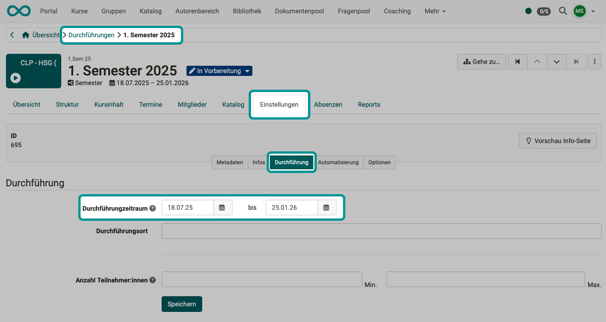
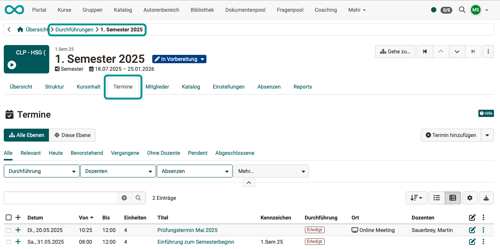
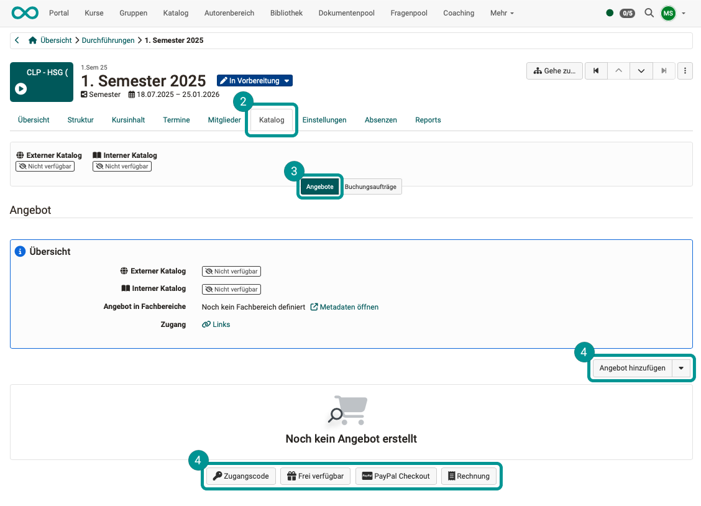
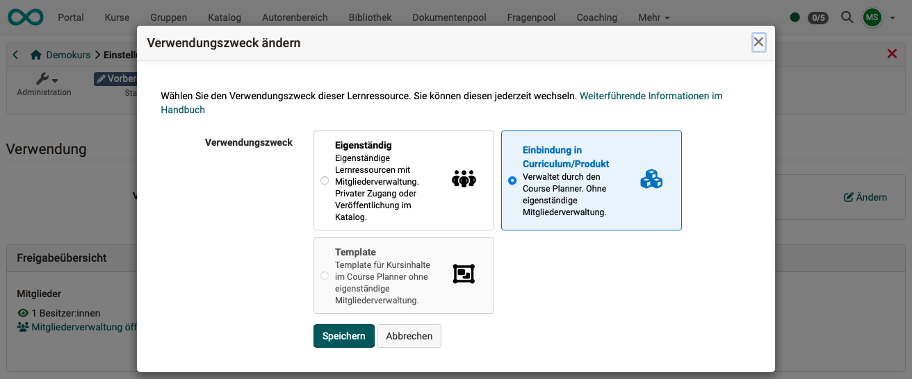
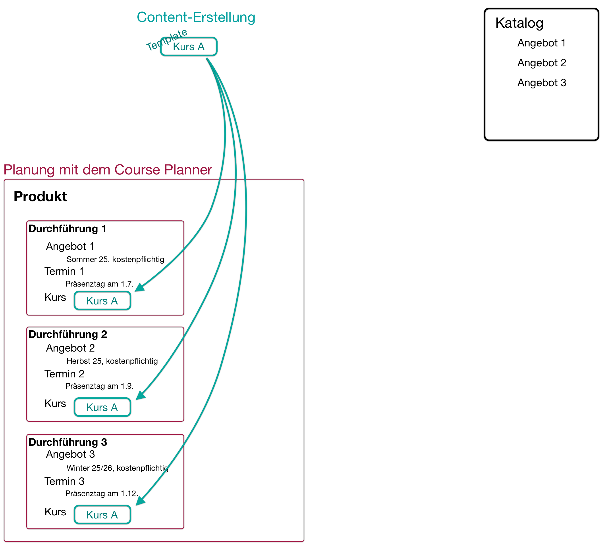
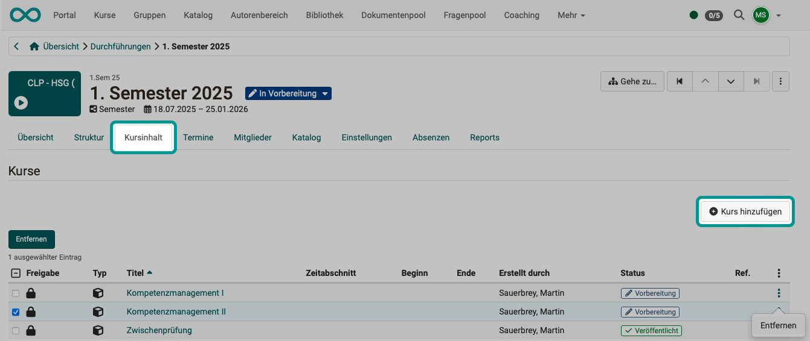
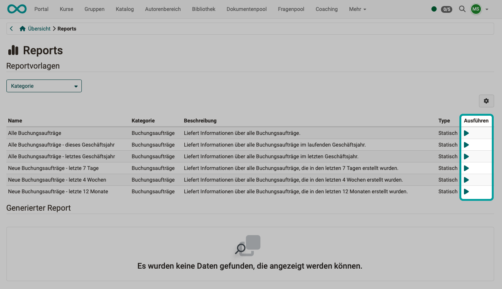
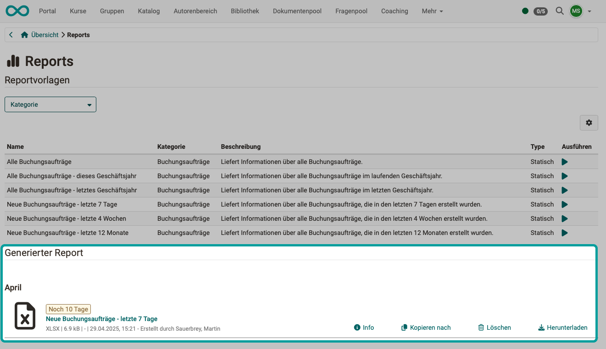
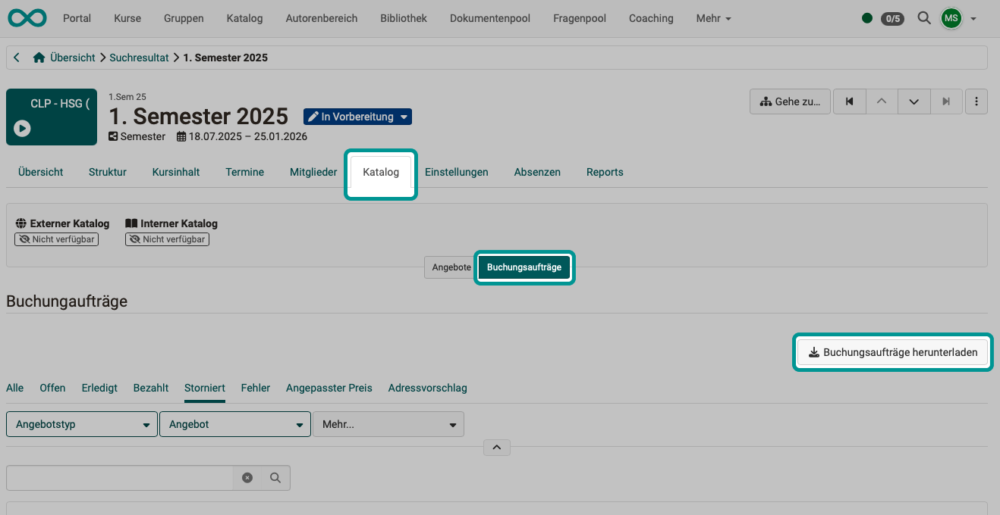
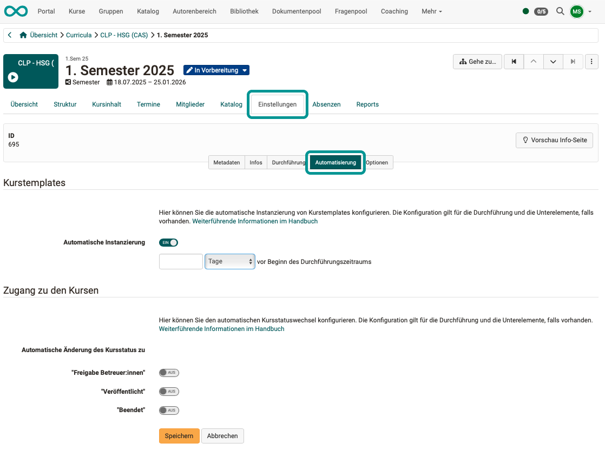

# Wie kann ich mit dem Course Planner Kursdurchführungen planen und durchführen? {: #plan_and_run_courses_with_course_planner}

!!! warning "Attention"

    This article is still under construction.

??? abstract "Ziel und Inhalt dieser Anleitung"

    Diese Anleitung zeigt Ihnen, wie Sie mit dem Course Planner automatisiert und effizient vom Angebot ausgehend Kurse planen und erstellen.

??? abstract "Zielgruppe"

    [x] Autor:innen [ ] Betreuer:innen  [ ] Teilnehmer:innen

    [ ] Anfänger:innen [x] Fortgeschrittene  [x] Experten/Expertinnen

??? abstract "Erwartete Vorkenntnisse"

    * ["Wie erstelle ich meinen ersten OpenOlat-Kurs?"](../my_first_course/my_first_course.de.md) 
    * [Vertrautheit mit Basiskonzepten von OpenOlat >](../manual_user/basic_concepts.de.md) 

---

## Was kann der Course Planner? {: #purpose}

Mit dem Course Planner kann die **Planungsarbeit** von der **Inhaltserstellung** (im Autorenbereich) getrennt werden.

**Kursplaner:innen** können schon vor Fertigstellung der Inhalte (Kurse) durch **Autor:innen** die gesamte organisatorische Planung vornehmen:

* Planung mehrfacher Durchführungen des gleichen Kurses zu verschiedenen Zeiten
* Planung von Bildungsgängen mit mehreren Kursen (und jeweils mehreren Durchführungen)
* Erstellung von Angeboten im Katalog
* Reports zu den bereits eingegangenen Buchungen
* Planung von Terminen im Zusammenhang mit den verschiedenen Durchführungen (z.B. für Präsenzveranstaltungen oder Prüfungen)
* ...
* Terminierung einer automatischen Instanzierung der Kurse

Sie können natürlich auch ohne Course Planner OpenOlat-Kurse erstellen. Mit dem Course Planner steht Ihnen jedoch ein Werkzeug zur Verfügung, das die organisatorischen Aufgaben zusammenführt.

##  Wo finde ich den Course Planner? {: #access}

Wenn Sie die **Rolle Kursplaner:in** besitzen, finden Sie den Course Planner als Menüpunkt der Hauptnavigation in der **Kopfzeile**.  

{ class="shadow lightbox" }  

!!! info "Voraussetzung"

    Um den Course Planner verwenden zu können, muss er von einem/einer Systemdministrator:in aktiviert worden sein. Steht die Option nicht im Menü der Kopfzeile zur Verfügung, wenden Sie sich bitte an Ihren/Ihre Systemadministrator:in.

[zum Seitenanfang ^](#plan_and_run_courses_with_course_planner)

---

## Schritt 1: Produkt erstellen  {: #create_product}

tbd
Was ist ein Produkt
?? Wir unterscheiden ein Produkt (z.B. ein Kurs, der mehrfach angeboten werden kann) von einer Durchführung.

- Produkt erstellen und planen (z.B. Sprachkurs "Spanisch für Anfänger")
- Durchführungen (z.B. "Spanisch für Anfänger, Frühjahr 2025", "Spanisch für Anfänger, Herbst 2025")

Öffnen Sie den Course Planner und wählen Sie dort den Button "Produkte". Sie können dort ein bereits vorhandenes Produkt aus der Liste auswählen oder eines neu erstellen. Dieses soll dann mehrfach in verschiedenen Durchführungen angeboten werden.

{ class="shadow lightbox" }  

Mehr dazu finden Sie im Benutzerhandbuch unter 
[Produkte >](../../manual_user/area_modules/Course_Planner_Products.de.md#create_products)

In der nachstehenden Anleitung beschränken wir uns zunächst auf einen einzelnen Kurs. Eine Anleitung mit mehreren Kursen finden Sie in einem weiteren How-To:  
[Wie kann ich mit dem Course Planner einen **Bildungsgang** planen und durchführen? >](../course_planner_curriculum/course_planner_curriculum.de.md)

[zum Seitenanfang ^](#plan_and_run_courses_with_course_planner)

---

## Schritt 2: Produkt-Verantwortliche bestimmen {: #define_product_owners}

Im neu erstellten Produkt finden Sie verschiedene Register/Tabs, unter denen Sie nun das Produkt konfigurieren können. Wählen Sie zunächst den **Tab "Besitzer:innen"**. Dort finden Sie die Möglichkeit, (produkt-)Besitzer:innen hinzuzufügen.

Als Ersteller:in des Produkts haben Sie bereits die Bearbeitungsrechte. Wenn Sie die Planung und Administration des Produkts nicht selbst und alleine machen wollen, sollten Sie hier eine verantwortliche Person als Besitzer:in bestimmen.

{ class="shadow lightbox" } 

**Warum kann ich hier nur Besitzer:innen eintragen? Warum nicht auch Teilnehmer:innen?**

Die Idee ist, dass ein aus mehreren Kursen bestehendes Produkt, nicht nur einmalig von einer Gruppe Teilnehmer:innen besucht wird. Vielmehr soll es für ein Produkt **mehrere Durchführungen** mit gleichem oder sehr ähnlichem Inhalt, aber unterschiedlichen Teilnehmer:innen und Betreuer:innen geben.

Besitzer:innen haben das Recht, das Produkt (die "Originalversion", die "Kopiervorlage") zu bearbeiten. Es macht keinen Sinn, auch die Teilnehmer:innen zu Mitgliedern der "Kopiervorlage" zu machen. Sie wären ja dann in allen Durchführungen eines Produkts als Teilnehmer:innen dabei.

!!! info "Hinweis"

    Im Course Planner haben Sie in der Rolle **Kursplaner:in** vollen Zugriff auf alle Produkte. 
    **Besitzer:innen** eines Produkts haben dagegen nur Zugriff auf ihr jeweiliges Produkt.

[zum Seitenanfang ^](#plan_and_run_courses_with_course_planner)

---

## Schritt 3: Planung/Erstellung einer Durchführung {: #implementations}

Wählen Sie nun den **Tab "Durchführung"** und erstellen Sie eine neue Durchführung.

{ class="shadow lightbox" } 

Unter dem Button "Erstellen" finden Sie eine Auswahl an [Elementtypen](../../manual_admin/administration/Modules_Course_Planner.de.md#define_element_types), die von Ihrem/Ihrer Administrator:in festgelegt wurden. 

{ class="shadow lightbox" } 

Alle geplanten Durchführungen dieses Produkts finden Sie anschliessend in der Liste unter diesem Tab. Sie können jede Durchführung wählen und Sie entsprechend Ihren Wünschen anpassen.

Statt neue Durchführungen mit dem Button über der Liste zu erstellen, können Sie auch von einer bereits geplanten und modifizierten Durchführung eine Kopie erzeugen. Die Kopiermöglichkeit finden Sie unter den 3 Punkten am Ende einer Zeile.

{ class="shadow lightbox" } 

[zum Seitenanfang ^](#plan_and_run_courses_with_course_planner)

---

## Schritt 4: Termine {: #events}

Für die Planung von Terminen ist zu unterscheiden:

### Schritt 4a: Zeitraum einer Durchführung 
Wenn eine neue Durchführung erstellt und eingerichtet worden ist (der Ablauf / das "Programm" der Durchführung festgelegt ist), müssen die verschiedenen Durchführung noch terminiert werden.

Es wird ein Durchführungszeitraum (Termin, wann eine Durchführung stattfindet) angegeben. Diese Angaben werden jeweils bei der Konfiguration einer Durchführung gemacht: 
**Durchführung wählen > Tab Einstellungen > Tab Durchführung**

{ class="shadow lightbox" } 

[zum Seitenanfang ^](#plan_and_run_courses_with_course_planner)

---

### Schritt 4b: Termine im Rahmen einer Durchführung

Wenn eine neue Durchführung erstellt und eingerichtet worden ist, und auch deren Durchführungszeitraum festgelegt wurde, können nun innerhalb einer Durchführung stattfindende Termine geplant und angelegt werden: 
**Durchführung wählen > Tab Einstellungen > Tab Termine**

Mit dem Button "Termin hinzufügen" rechts über der Tabelle fügen Sie weitere Termine hinzu. 

{ class="shadow lightbox" } 

!!! info "Technischer Hintergrund"

    Solange noch keine Kurse eingebunden sind, hängen die Termine jeweils an einer Durchführung. Sobald ein Kurs zur Durchführung hinzugefügt wurde (Schritt 7, Schritt 10), werden die Termine den Kursen zugeordnet.

[zum Seitenanfang ^](#plan_and_run_courses_with_course_planner)

---

### Schritt 4c: Übersicht über Termine aus allen Durchführungen

Wenn mehrere Durchführung erstellt und eingerichtet worden sind, existieren zu jeder Durchführung Termine. Um eine Gesamtübersicht zu erhalten, wählen Sie im **Produkt** den Tab "Termine". Auch dort können die einzelnen Termine bearbeitet werden. Sie haben dort zunächst die Übersicht und entscheiden sich dann für eine der Durchführungen.

{ class="shadow lightbox" } 

Der Termin kann sich auf die gesamte Durchführung eines Produkts beziehen oder nur auf einen Teil der Durchführung des Produkts. Wählen Sie das gewünschte Element aus dem angezeigten Strukturbaum.

{ class="shadow lightbox" } 

Nachdem das zu terminierende Element der Durchführung gewählt ist, konfigurieren Sie den Termin, d.h. Sie nehmen die entsprechenden Einstellungen vor. 

{ class="shadow lightbox" } 

 **Titel**: 
Mit diesem Titel wird der Termin an verschiedenen Stellen angezeigt.

 **Kennzeichen**: 
Der zusätzliche Identifier dient der Eindeutigkeit eines Termins, falls es Termine mit gleichem Titel gibt.

 **Datum**: 
Tag und Uhrzeit (Beginn und Ende)

 **Einheit**: 
Wurde z.B. ein Vormittag von 8.00-12.00 Uhr vorgesehen, kann er beispielsweise in 4 Einheiten zu je 50 Minuten unterteilt werden. (Dazwischen jeweils Pausen.) 

 **Ort**: 
Wo findet der Termin statt, fall physische Präsenz geplant ist.

 **Online-Meeting**: 
Der Course Planner ermöglicht die Verwaltung und Pflege von Terminen für Online-Meetings bereits in der Planungsphase direkt am Produkt bzw. auf der Durchführung - auch ohne bereits hinterlegte Kursinhalte. Es können Online-Meetings mit BigBlueButton und Teams eingerichtet werden. (Es hängt davon ab, was bei Ihnen in OpenOlat eingerichtet ist.) 
Die hinterlegten Termine werden später bei der Verknüpfung der Durchführung mit einem Kurs
auf diesen appliziert und sind dann auch im Kurs verfügbar.

 **Dozenten**: 
Um Dozenten auswählen zu können, müssen zuerst Betreuer:innen als Mitglieder hinzugefügt werden.

 **Beschreibung**: 
Der hier eingegebene Text ist für eine den Titel ergänzende, etwas ausführlichere Beschreibung vorgesehen.

 **Vorbereitung/Nachbereitung**: 
Im hier eingegebenen Text können Aufgaben zur Vor- und Nachbereitung des Termins beschrieben werden.

 **Präsenz**: 
Wird bestimmt, dass eine Präsenzpflicht besteht, kann später im Absenzenmanagement verwaltet werden, ob eine Person anwesend war oder entschuldigt bzw. unentschuldigt gefehlt hat.

Mehr zu den Terminen finden Sie im Benutzerhandbuch: 
[Course Planner: Termine >](../../manual_user/area_modules/Course_Planner_Events.de.md)

[zum Seitenanfang ^](#plan_and_run_courses_with_course_planner)

---

## Schritt 5: Ausschreibung der Durchführung  {: #offer}

Sie können bereits in der Planungsphase einen Kurs im Katalog anbieten und z.B. durch die Interessenten selbst buchen lassen.

 Wählen Sie im Course Planner die Durchführung, die Sie im Katalog anbieten möchten.

 Wählen Sie den Tab "Katalog".

 Wählen Sie den Tab "Angebote".

 Erstellen Sie ein neues [Angebot](../../manual_user/area_modules/catalog2.0_angebote.de.md).

{ class="shadow lightbox" } 

[zum Seitenanfang ^](#plan_and_run_courses_with_course_planner)

---

## Schritt 6: Verwendungszweck in den Kursen angeben {: #embedding}

In jedem Kurs kann unter 
**Administration > Einstellungen > Tab Freigabe > Abschnitt "Verwendung"** 
ein Verwendungszweck gewählt werden. Zur Auswahl stehen

- Eigenständig
- Einbindung in Produkt -> Für die Verwendung im Course Planner zu wählen.
- Template

{ class="shadow lightbox" } 

!!! info "Was bewirkt die Einstellung "Einbindung in Produkt"?"

    Mit Angabe des Verwendungszwecks "Einbindung in Produkt" werden die Teilnehmer:innen nun vom Course Planner verwaltet und nicht mehr in der Mitgliederverwaltung des Kurses. Würden direkt im Kurs nun noch Mitglieder hinzugefügt, entstünde eine Doppelspurigkeit (Mitglied direkt im Kurs **und** Mitglied im Produkt). Deshalb ist beim Verwendungszweck "Einbindung in Produkt" die Mitgliederverwaltung im Kurs selbst auf die Kursbesitzer:innen beschränkt, die den Kurs bearbeiten können.

**Teilschritt 1, Variante A** 
Im Course Planner sind alle in einer Durchführung verwendeten Kurse ersichtlich bzw. können hinzugefügt werden im **Tab Kursinhalt** einer Durchführung. (Siehe Schritt 7)

Sie können dort einen Kurs direkt anwählen und die vorstehend beschriebene Einstellung zum Verwendungszweck vornehmen. 

**Teilschritt 1, Variante B** 
Gehen Sie in den **Autorenbereich** und wählen Sie nacheinander die Kurse, die Bestandteil Ihres Produkts sein sollen.

**Teilschritt 2** 
Unter **Administration > Einstellungen > Tab Freigabe** wählen Sie als Verwendungszweck **Einbindung in Produkt**.

{ class="shadow lightbox" } 

Der beschriebene Weg zur Angabe des Verwendungszwecks, kann auch zur Kontrolle verwendet werden. 
Soll ein Kurs in einer Durchführung verwendet werden und er hat nicht den Verwendungszweck "Einbindung in Produkt", erscheint eine Warnmeldung.

!!! info "Tipp"

    Wird der Course Planner umfassend eingesetzt, bietet es sich an, den Standard-Verwendungszweck für neue Kurse in der Systemadministration auf "Einbindung in Produkt" einzustellen. 
    Wenden Sie sich dafür an Ihre:n Systemadministrator:in.  
    Die Voreinstellung erfolgt in **Administration > Module > Course Planner > Tab Course Planner** 

[zum Seitenanfang ^](#plan_and_run_courses_with_course_planner)

---

## Schritt 7: Inhalte hinzufügen {: #add_content}

Wie eingangs erwähnt, dient der Course Planner dazu, die **Planungsarbeit** von der **Inhaltserstellung** (im Autorenbereich) zu trennen. Das Hinzufügen der Inhalte zu den Durchführungen kann auch erst erfolgen, wenn die Durchführungen bereits geplant sind.

{ class="shadow lightbox" } 

Um einer Durchführung Inhalt (Kurse) hinzuzufügen, wählen Sie in einer Durchführung den **Tab "Kursinhalt"**.

{ class="shadow lightbox" } 

!!! tip "Hinweis"

    Wie ein Kurs von einem Template ausgehend automatisch zu einem bestimmten Termin erstellt werden kann, ist in Schritt 10 beschrieben.

[zum Seitenanfang ^](#plan_and_run_courses_with_course_planner)

---

## Schritt 8: Teilnehmer:innen {: #add_members}
  
Die Teilnehmer:innen werden als **Mitglieder** zu einer der **Durchführungen** des Produkts hinzugefügt.
Warum sie Mitglieder einer Durchführung und nicht Mitglieder eines Produkts werden, wurde bereits in 
[Schritt 2](#define_owners) erklärt.

Die Mitgliederverwaltung finden Sie deshalb unter **Tab Durchführungen** im Menü der **3 Punkte am Ende einer Zeile** (= Durchführung).

{ class="shadow lightbox" } 

[zum Seitenanfang ^](#plan_and_run_courses_with_course_planner)

---

## Schritt 9: Übersicht über die Buchungsaufträge verschaffen {: #reports}

### Report-Dateien erstellen

Wählen Sie in der Übersicht des Course Planners den Button "Reports".

{ class="shadow lightbox" }

Sie können dort aus verschiedenen Vorlagen auswählen, anhand derer Sie Excel-Dateien mit den aktuellen Daten zu den eingegangenen Buchungsaufträgen erstellen können. 

Klicken Sie zum Erstellen eines Reports auf einen der Pfeile in der Spalte "Ausführen". 

{ class="shadow lightbox" }

Die so erstellten Excel-Dateien finden Sie im unteren Bereich des Screens aufgelistet.
Sie können kopiert und heruntergeladen werden.

{ class="shadow lightbox" } 

### Über den Katalog eingegangene Buchungsaufträge

Eine Excel-Datei mit allen Buchungsaufträgen, die über den Katalog eingegangen sind, können Sie sich auf folgende Weise herunterladen: 
**Durchführung wählen > Tab Katalog > Tab Buchungsaufträge**

{ class="shadow lightbox" } 

[zum Seitenanfang ^](#plan_and_run_courses_with_course_planner)

---

## Schritt 10: Automatisierte Kurserstellung {: #automatic_course_creation}

Wenn der Kurs tatsächlich stattfinden wird (z.B. nachdem genügend Buchungsaufträge eingegangen sind), kann auch erst dann ein dazugehöriger OpenOlat-Kurs aus einer Kursvorlage (Template) erstellt werden. (Siehe Schritt 7)

Eine Kursvorlage muss in  **Administration > Einstellungen > Freigabe** als Verwendungszweck die Angabe **Template** haben.

Die Vorbereitung der automatisierten Instanzierung (Kurserstellung aus dem Template) finden Sie hier:  
**Durchführung wählen > Tab "Einstellungen" > Tab "Automatisierung**

{ class="shadow lightbox" } 

Sie können bestimmen, wann die automatisierte Instanzierung erfolgen soll. 
Damit einhergehend besteht auch die Möglchkeit, den Kursstatus automatisch zu ändern.

[zum Seitenanfang ^](#plan_and_run_courses_with_course_planner)

---

## Weitere Informationen {: #further_information}

[Wie erstelle ich meinen ersten OpenOlat-Kurs >](../my_first_course/my_first_course.de.md) 
[Course Planner: Übersicht >](../../manual_user/area_modules/Course_Planner.de.md) 
[Course Planner: Produkte >](../../manual_user/area_modules/Course_Planner_Products.de.md) 
[Course Planner: Durchführungen >](../../manual_user/area_modules/Course_Planner_Implementations.de.md) 
[Course Planner: Termine >](../../manual_user/area_modules/Course_Planner_Events.de.md) 
[Course Planner: Reports >](../../manual_user/area_modules/Course_Planner_Reports.de.md) 
[Wie kann ich mit dem Course Planner einen Bildungsgang planen und durchführen? >](../course_planner_curriculum/course_planner_curriculum.de.md) 
[Course Planner aktivieren (Admin) >](../../manual_admin/administration/Modules_Course_Planner.de.md) 

[zum Seitenanfang ^](#plan_and_run_courses_with_course_planner)

