# Wie kann ich mit dem Course Planner Kursdurchführungen planen und durchführen? {: #plan_and_run_courses_with_course_planner}

!!! warning "Attention"

    This article is still under construction.

??? abstract "Ziel und Inhalt dieser Anleitung"

    Diese Anleitung zeigt Ihnen, wie Sie mit dem Course Planner automatisiert und effizient vom Angebot ausgehend Kurse planen und erstellen.

??? abstract "Zielgruppe"

    [x] Autor:innen [ ] Betreuer:innen  [ ] Teilnehmer:innen

    [ ] Anfänger:innen [x] Fortgeschrittene  [x] Experten/Expertinnen

??? abstract "Erwartete Vorkenntnisse"

    * ["Wie erstelle ich meinen ersten OpenOlat-Kurs?"](../my_first_course/my_first_course.de.md) 
    * Vertrautheit mit Basiskonzepten von OpenOlat

    https://docs.openolat.org/de/manual_user/basic_concepts/

---

## Was kann der Course Planner? {: #purpose}

Ziel ist es, automatisiert und effizient vom Angebot ausgehend Kurse zu erstellen und durchzuführen.

Mit dem Course Planner kann die **Planungsarbeit** von der **Inhaltserstellung** (im Autorenbereich) getrennt werden.

Sie können natürlich auch ohne Course Planner OpenOlat-Kurse erstellen. Mit dem Course Planner steht Ihnen jedoch ein Werkzeug zur Verfügung, das die organisatorischen Aufgaben zusammenführt.

##  Wo finde ich den Course Planner? {: #access}

Wenn Sie Autorenrechte besitzen, finden Sie den Course Planner als Menüpunkt der Hauptnavigation in der Kopfzeile.  

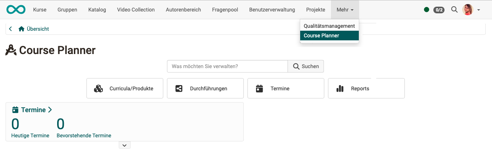{ class="shadow lightbox" }  

!!! info "Voraussetzung"

    Um den Course Planner verwenden zu können, muss er von einem/einer Administrator:in aktiviert worden sein. Steht die Option nicht im Menü der Kopfzeile zur Verfügung, wenden Sie sich bitte an Ihren/Ihre Administrator:in.

[zum Seitenanfang ^](#plan_and_run_courses_with_course_planner)

---

## Schritt 1: Curriculum/Produkt erstellen  {: #create_curriculum}

Öffnen Sie in den Course Planner und wählen Sie dort den Button "Curricula/Produkte". Sie können dort ein bereits vorhandenes Curriculum/Produkt aus der Liste auswählen oder ein Curriculum neu erstellen.

Ein Curriculum/Produkt kann mehrere Kurse umfassen. In der nachstehenden Anleitung beschränken wir uns zunächst auf einen Kurs. Eine Anleitung mit mehreren Kursen finden Sie in einer weiteren Anleitung (Link)

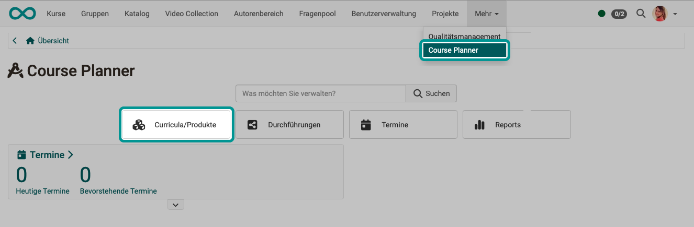{ class="shadow lightbox" }  

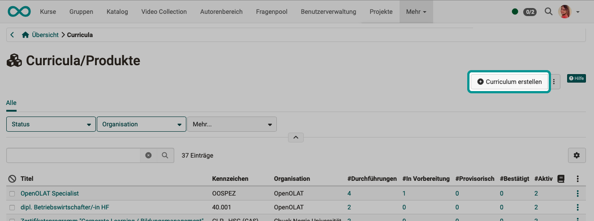{ class="shadow lightbox" }  

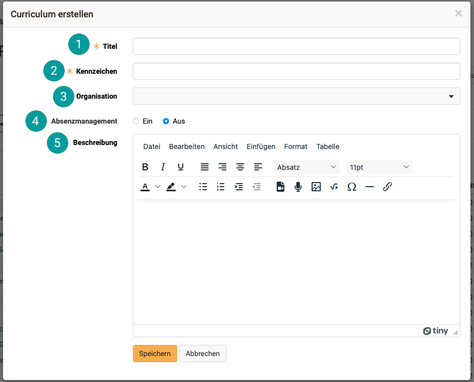{ class="shadow lightbox" }

 **Titel**: 
Die Angabe eines Titels ist zwingend erforderlich. 

 **Kennzeichen**: 
Das Kennzeichen ist ebenfalls ein Pflichtfeld. (Es wird als Identifier zur Unterscheidung bei Elementen mit gleichem Titel verwendet.)

 **Organisationen**: 
Wenn Sie ein neues Curriculum erstellen, können Sie es auch auf die Verwendung innerhalb einer bestimmten Organisationseinheit beschränken, falls bei Ihnen das Modul "Organisationen" aktiviert ist.  

 **Absenzenmanagement**: 
Mit dieser Auswahl bestimmen Sie, ob das Absenzenmanagement für dieses Curriculum/Produkt verwendet werden soll. (Voraussetzung ist, dass es von einem/einer Administrator:in grundsätzlich aktiviert und für die Kursautor:innen verfügbar gemacht wurde.) 

 **Beschreibung**: 
In diesem kleinen Editor für die Beschreibung können Sie neben Text, Bildern und Links auch Videos einfügen oder direkt durch Klick auf den Mikrofon-Button ein Audio aufnehmen.

[zum Seitenanfang ^](#plan_and_run_courses_with_course_planner)

---

## Schritt 1b: Curriculum importieren  {: #import_curriculum}

Soll ein bereits bestehendes Curriculum für Ihre Planung verwendet werden, können Sie auch Curricula importieren. Klicken Sie dazu auf die 3 Punkte neben dem Button "Curriculum erstellen".

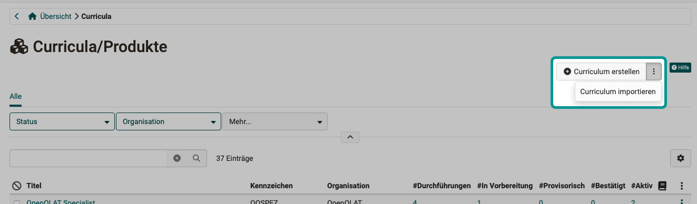{ class="shadow lightbox" }  

[zum Seitenanfang ^](#plan_and_run_courses_with_course_planner)

---

## Schritt 2: Verantwortliche bestimmen {: #define_owners}

Im neu erstellten Curriculum finden Sie verschiedene Register/Tabs, unter denen Sie nun das Curriculum konfigurieren können. Wählen Sie zunächst den **Tab "Besitzer:innen"**. Dort finden Sie die Möglichkeit, Curriculumbesitzer:innen hinzuzufügen.

Als Ersteller:in des Curriculums haben Sie bereits die Bearbeitungsrechte. Wenn Sie die Planung und Administration des Curriculums nicht selbst und alleine machen wollen, sollten Sie hier eine verantwortliche Person als Curriculumsbesitzer:in bestimmen.

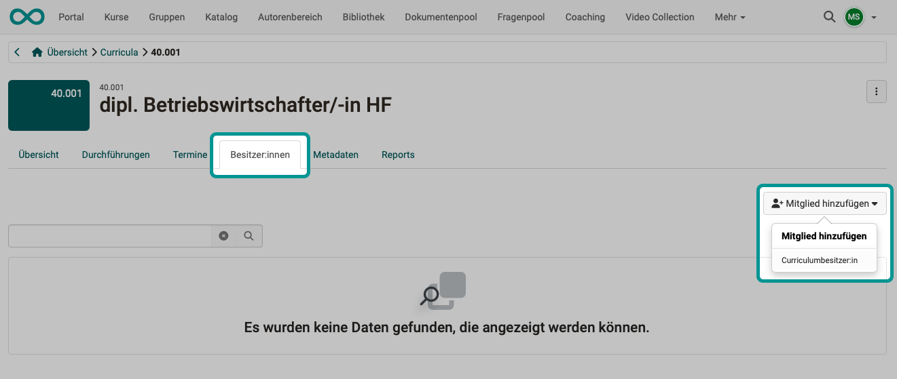{ class="shadow lightbox" } 

**Warum kann ich hier nur Besitzerinnen eintragen? Warum nicht auch Teilnehmer:innen?**

Die Idee ist, dass ein aus mehreren Kursen bestehendes Curriculum, nicht nur einmalig von einer Gruppe Teilnehmer:innen besucht wird. Vielmehr soll es für ein Curriculum **mehrere Durchführungen** mit gleichem oder sehr ähnlichem Inhalt, aber unterschiedlichen Teilnehmer:innen und Betreuer:innen geben.

Curriculumsbesitzer:innen haben das Recht, das Curriculum (die "Originalversion", die "Kopiervorlage") zu bearbeiten. Es macht keinen Sinn, auch die Teilnehmer:innen zu Mitgliedern der "Kopiervorlage" zu machen. Sie wären ja dann in allen Durchführungen eines Curriculums als Teilnehmer:innen dabei.

!!! info "Hinweis"

    Im Course Planner haben Sie in der Rolle **Curriculumverwalter:in** vollen Zugriff auf alle Curricula. 
    **Curriculumbesitzer:innen** haben dagegen nur Zugriff auf ihr jeweiliges Curriculum.

[zum Seitenanfang ^](#plan_and_run_courses_with_course_planner)

---

## Schritt 3: Planung/Erstellung einer Durchführung {: #implementations}

Wählen Sie nun den **Tab "Durchführung"** und erstellen Sie eine neue Durchführung.

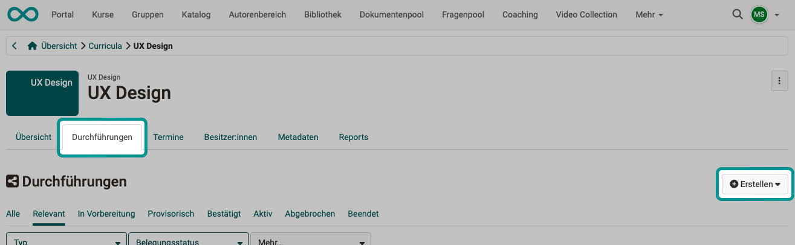{ class="shadow lightbox" } 

Unter dem Button "Erstellen" finden Sie eine Auswahl an [Elementtypen](../../manual_admin/administration/Modules_Course_Planner.de.md#define_element_types), die von Ihrem/Ihrer Administrator:in festgelegt wurden. 

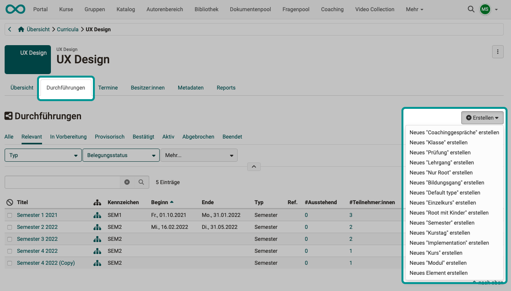{ class="shadow lightbox" } 

Alle geplanten Durchführungen dieses Curriculums finden Sie anschliessend in der Liste unter diesem Tab. Sie können jede Durchführung wählen und Sie entsprechend Ihren Wünschen anpassen.

Statt neue Durchführungen mit dem Button über der Liste zu erstellen, können Sie auch von einer bereits geplanten und modifizierten Durchführung eine Kopie erzeugen. Die Kopiermöglichkeit finden Sie unter den 3 Punkten am Ende einer Zeile.

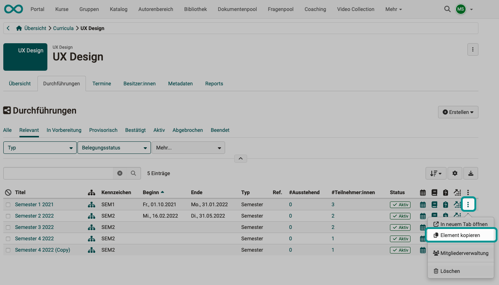{ class="shadow lightbox" } 

[zum Seitenanfang ^](#plan_and_run_courses_with_course_planner)

---

## Schritt 4: Termine {: #events}

Nachdem eine Durchführung erstellt und eingerichtet worden ist (der Ablauf / das "Programm" der Durchführung festgelegt ist), muss sie noch terminiert werden. Dazu wählen Sie im Curriculum den **Tab "Termine"**.

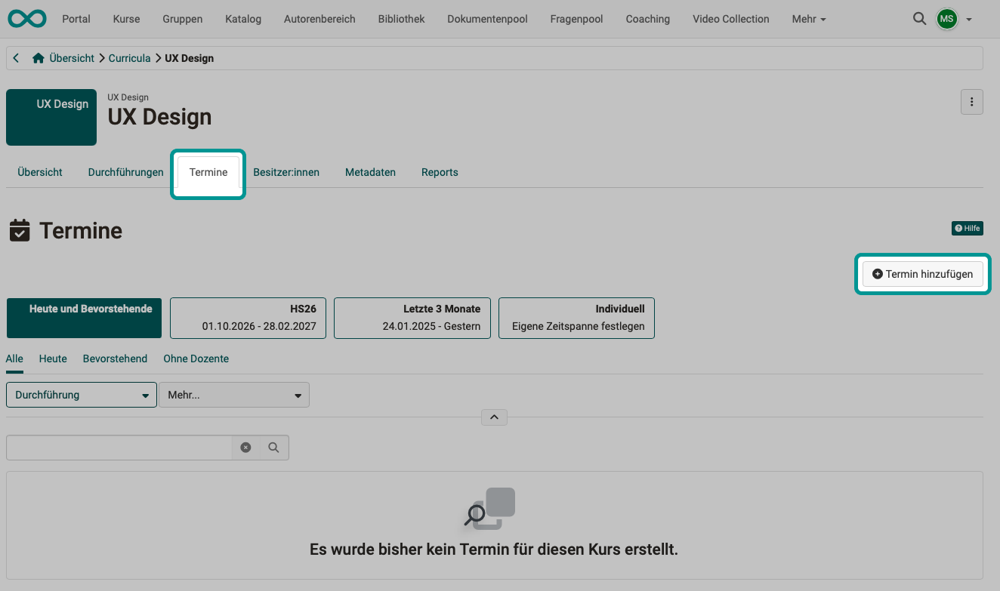{ class="shadow lightbox" } 

tbd

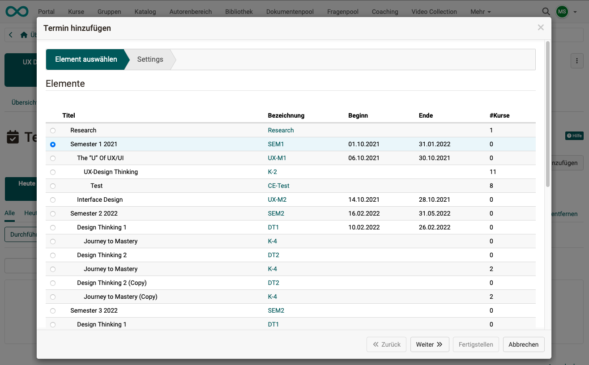{ class="shadow lightbox" } 

tbd

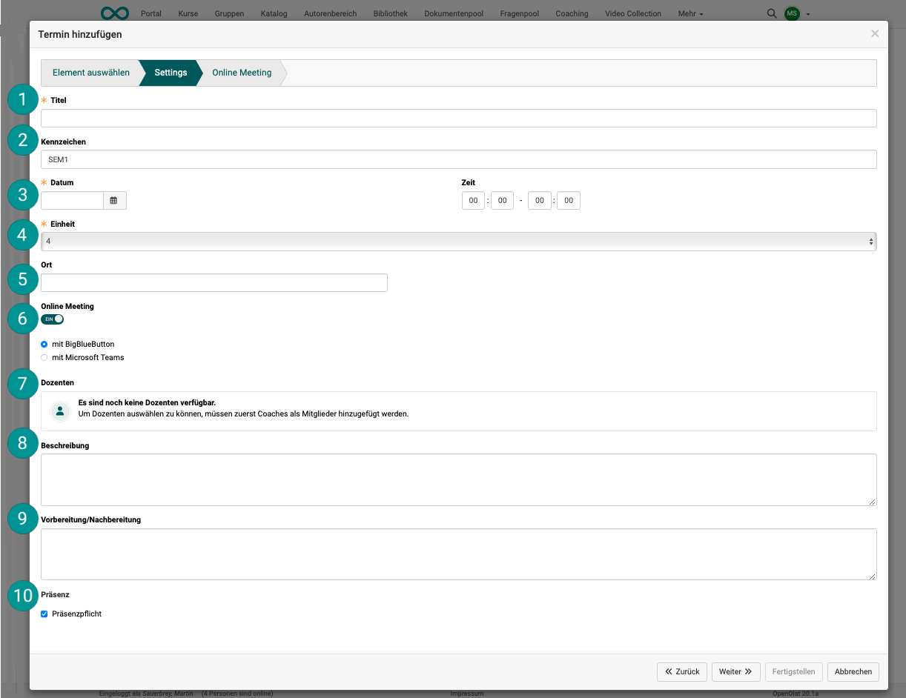{ class="shadow lightbox" } 

 **Titel**: 
tbd

 **Kennzeichen**: 
tbd

 **Datum**: 
tbd

 **Einheit**: 
tbd

 **Ort**: 
tbd

 **Online-Meeting**: 
tbd

 **Dozenten**: 
tbd

 **Beschreibung**: 
tbd

 **Vorbereitung/Nachbereitung**: 
tbd

 **Präsenz**: 
tbd

Mehr zu den Terminen finden Sie im Benutzerhandbuch: 
[Course Planner: Termine >](../../manual_user/area_modules/Course_Planner_Events.de.md)

[zum Seitenanfang ^](#plan_and_run_courses_with_course_planner)

---

## Schritt 5: Ausschreibung der Durchführung  {: #x}

Wählen Sie   

[zum Seitenanfang ^](#plan_and_run_courses_with_course_planner)

---

## Schritt 6: Verwendungszweck des Kurses angeben {: #embedding}
  
a) Gehen Sie in den **Autorenbereich** und wählen Sie den Kurs, der Bestandteil Ihres Curriculums sein soll.

b) Unter **Administration > Einstellungen > Tab Freigabe** wählen Sie als Verwendungszweck **Einbindung in Curriculum/Produkt**.

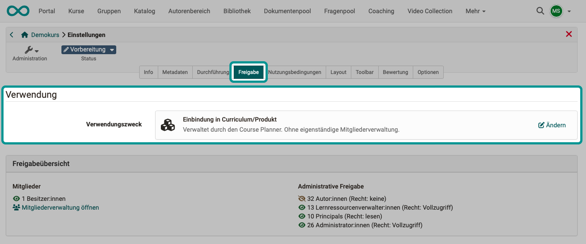{ class="shadow lightbox" } 

!!! info "Was bewirkt diese Einstellung?"

    Mit Angabe dieses Verwendungszwecks werden die Teilnehmer:innen nun vom Course Planner verwaltet und nicht mehr in der Mitgliederverwaltung des Kurses. Würden direkt im Kurs nun noch Mitglieder hinzugefügt, entstünde eine Doppelspurigkeit (Mitglied direkt im Kurs **und** Mitglied im Curriculum/Produkt). Deshalb ist beim Verwendungszweck "Einbindung in Curriculum/Produkt" die Mitgliederverwaltung im Kurs selbst auf die Kursbesitzer:innen beschränkt, die den Kurs bearbeiten können.

[zum Seitenanfang ^](#plan_and_run_courses_with_course_planner)

---

## Schritt 7: Inhalte hinzufügen {: #add_content}

Kurserstellung mit dem Course Planner
- Funktionsweise
- Template-Erstellung
- Erstellung aus Vorlage
- Automatisierung

Kurs/Inhalt bereit stellen => einer Durchführung zuordnen, z.B. Kurstemplate instanzieren

[zum Seitenanfang ^](#plan_and_run_courses_with_course_planner)

---

## Schritt 8: Teilnehmer:innen {: #add_members}
  
Die Teilnehmer:innen werden als **Mitglieder** zu einer der **Durchführungen** des Curriculums hinzugefügt.
Warum sie Mitglieder einer Durchführung und nicht Mitglieder eines Curriculums werden, wurde bereits in 
[Schritt 2](#define_owners) erklärt.

Die Mitgliederverwaltung finden Sie deshalb unter **Tab Durchführungen** im Menü der **3 Punkte am Ende einer Zeile** (= Durchführung).

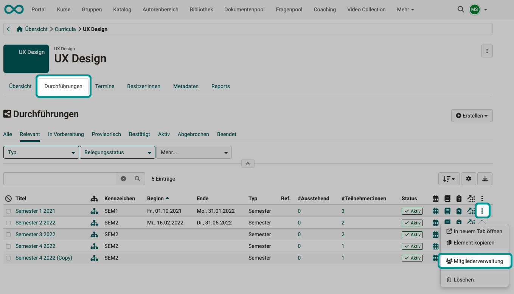{ class="shadow lightbox" } 

[zum Seitenanfang ^](#plan_and_run_courses_with_course_planner)

---

## Schritt 9: Kontrolle (Reports) {: #reports}
  
Wählen Sie in der Übersicht des Course Planners den Button "Reports".

screen

[zum Seitenanfang ^](#plan_and_run_courses_with_course_planner)

---

## Schritt 10: Automatisierte Kurserstellung {: #automatic_course_creation}

Wenn der Kurs tatsächlich stattfindet, kann auch erst dann ein dazugehöriger OpenOlat-Kurs aus einer Kursvorlage erstellt werden.

[zum Seitenanfang ^](#plan_and_run_courses_with_course_planner)

---

## Weitere Informationen {: #further_information}

[Wie erstelle ich meinen ersten OpenOlat-Kurs >](../my_first_course/my_first_course.de.md) 
[Course Planner: Übersicht >](../../manual_user/area_modules/Course_Planner.de.md) 
[Course Planner: Curricula/Produkte >](../../manual_user/area_modules/Course_Planner_Products.de.md) 
[Course Planner: Durchführungen >](../../manual_user/area_modules/Course_Planner_Implementations.de.md) 
[Course Planner: Termine >](../../manual_user/area_modules/Course_Planner_Events.de.md) 
[Course Planner: Reports >](../../manual_user/area_modules/Course_Planner_Reports.de.md) 
[Wie kann ich mit dem Course Planner einen Bildungsgang / ein Curriculum planen und durchführen? >](../course_planner_curriculum/course_planner_curriculum.de.md) 
[Course Planner aktivieren (Admin) >](../../manual_admin/administration/Modules_Course_Planner.de.md) 

[zum Seitenanfang ^](#plan_and_run_courses_with_course_planner)

