# Wie kann ich mit dem Course Planner Kursdurchführungen planen und durchführen? {: #plan_and_run_courses_with_course_planner}

??? abstract "Ziel und Inhalt dieser Anleitung"

    Diese Anleitung zeigt Ihnen, wie Sie mit dem Course Planner automatisiert und effizient vom Angebot ausgehend Kurse planen und erstellen.

??? abstract "Zielgruppe"

    [x] Autor:innen [ ] Betreuer:innen  [ ] Teilnehmer:innen

    [ ] Anfänger:innen [x] Fortgeschrittene  [x] Expert:innen

??? abstract "Erwartete Vorkenntnisse"

    * ["Wie erstelle ich meinen ersten OpenOlat-Kurs?"](../my_first_course/my_first_course.de.md) 
    * [Vertrautheit mit Basiskonzepten von OpenOlat >](../../manual_user/basic_concepts/index.de.md) 

---

## Was kann der Course Planner? {: #purpose}

Mit dem Course Planner kann die **Planungsarbeit** von der **Inhaltserstellung** (im Autorenbereich) getrennt werden.

**Kursplaner:innen** können schon vor Fertigstellung der Inhalte (Kurse) durch **Autor:innen** die gesamte organisatorische Planung vornehmen:

* Planung mehrfacher Durchführungen des gleichen Kurses zu verschiedenen Zeiten
* Planung von Produkten mit mehreren Kursen (und jeweils mehreren Durchführungen)
* Erstellung von Angeboten im Katalog
* Reports zu den bereits eingegangenen Buchungsaufträgen
* Planung von Terminen im Zusammenhang mit den verschiedenen Durchführungen (z.B. für Präsenzveranstaltungen oder Prüfungen)
* Terminierung einer automatischen Instanziierung der Kurse

Sie können natürlich auch ohne Course Planner OpenOlat-Kurse erstellen. Mit dem Course Planner steht Ihnen jedoch ein Werkzeug zur Verfügung, das die organisatorischen Aufgaben zusammenführt.

##  Wo finde ich den Course Planner? {: #access}

Wenn Sie die **Rolle Kursplaner:in** besitzen, finden Sie den Course Planner als Bereich in der **Hauptnavigation**.

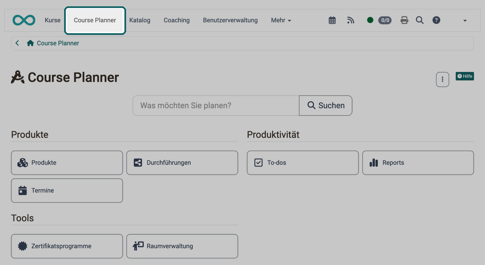{ class="shadow lightbox" title="Hauptnavigation und Startseite des Course Planners · 2026.10.09" }

!!! info "Voraussetzung"

    Um den Course Planner verwenden zu können, muss ihn eine Systemadministrator:in aktiviert haben. Steht der Bereich nicht in der Hauptnavigation zur Verfügung, wenden Sie sich bitte an Ihre Systemadministration.

[zum Seitenanfang ^](#plan_and_run_courses_with_course_planner)

---

## Schritt 1: Produkt erstellen  {: #create_product}

Wir unterscheiden ein [Produkt](../../manual_user/area_modules/Course_Planner_Products.de.md#create_product) (z.B. einen Kurs, der mehrfach angeboten werden kann) von einer [Durchführung](../../manual_user/area_modules/Course_Planner_Implementations.de.md).

Beispiel: 
- Als Produkt wird ein Sprachkurs "Spanisch für Anfänger" erstellt und geplant.
- Durchführungen finden dann statt als "Spanisch für Anfänger, Frühjahr 2025", "Spanisch für Anfänger, Herbst 2025", usw.

Öffnen Sie den Course Planner und wählen Sie dort den Button "Produkte". Sie können dort ein bereits vorhandenes Produkt aus der Liste auswählen oder eines neu erstellen. Dieses soll dann mehrfach in verschiedenen Durchführungen angeboten werden.

Mehr dazu finden Sie im Benutzerhandbuch unter: 
[Produkte >](../../manual_user/area_modules/Course_Planner_Products.de.md#create_product)

!!! note "Hinweis"

    In der nachstehenden Anleitung beschränken wir uns zunächst auf einen einzelnen Kurs. Es ist darüber hinaus auch möglich, in einer Durchführung mehrere Kurse einzubinden.

[zum Seitenanfang ^](#plan_and_run_courses_with_course_planner)

---

## Schritt 2: Produktbesitzer:innen bestimmen {: #define_product_owners}

Im neu erstellten Produkt finden Sie verschiedene Tabs, unter denen Sie nun das Produkt konfigurieren können. Wählen Sie zunächst den **Tab "Besitzer:innen"**. Dort fügen Sie mit dem Button "Produktbesitzer:in hinzufügen" Produktbesitzer:innen hinzu.

Als Ersteller:in des Produkts haben Sie bereits die Bearbeitungsrechte. Wenn Sie die Planung und Administration des Produkts nicht selbst und alleine machen wollen, sollten Sie hier eine verantwortliche Person als Produktbesitzer:in bestimmen.

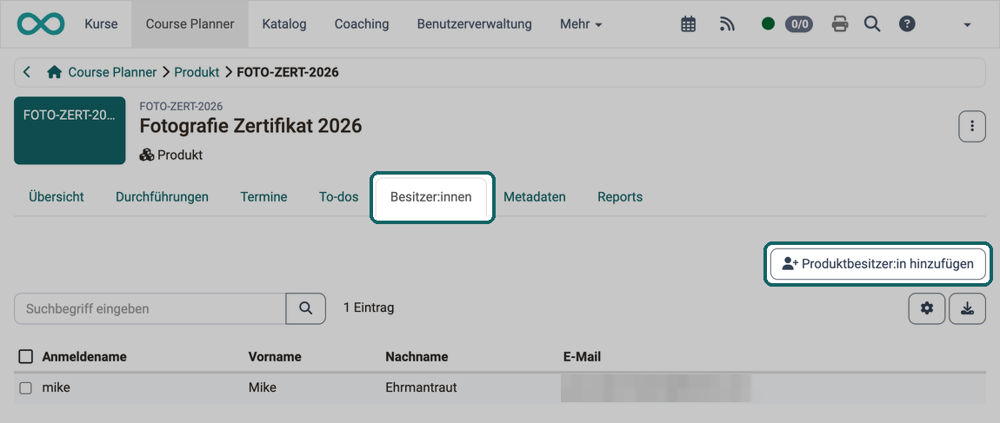{ class="shadow lightbox" title="Tab Besitzer:innen eines Produkts · 2026.10.09" }

**Warum kann ich hier nur Besitzer:innen eintragen? Warum nicht auch Teilnehmer:innen?**

Die Idee ist, dass ein aus mehreren Kursen bestehendes Produkt, nicht nur einmalig von einer Gruppe Teilnehmer:innen besucht wird. Vielmehr soll es für ein Produkt **mehrere Durchführungen** mit gleichem oder sehr ähnlichem Inhalt, aber unterschiedlichen Teilnehmer:innen und Betreuer:innen geben.

Besitzer:innen haben das Recht, das Produkt (die "Originalversion", die "Kopiervorlage") zu bearbeiten. Es macht keinen Sinn, auch die Teilnehmer:innen zu Mitgliedern der "Kopiervorlage" zu machen. Sie wären ja dann in allen Durchführungen eines Produkts als Teilnehmer:innen dabei.

!!! info "Wichtig"

    Im Course Planner haben Sie in der Rolle **Kursplaner:in** vollen Zugriff auf alle Produkte. 
    **Besitzer:innen** eines Produkts haben dagegen nur Zugriff auf ihr jeweiliges Produkt.

[zum Seitenanfang ^](#plan_and_run_courses_with_course_planner)

---

## Schritt 3: Planung/Erstellung einer Durchführung {: #implementations}

Wählen Sie nun den **Tab "Durchführungen"** und erstellen Sie eine neue Durchführung.

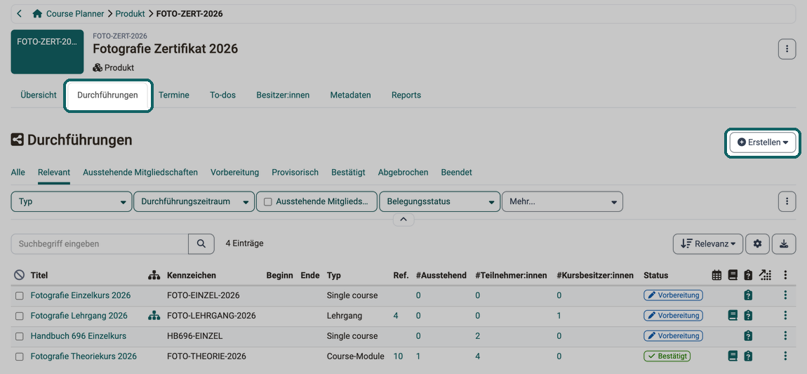{ class="shadow lightbox" title="Tab Durchführungen eines Produkts · 2026.10.09" }

Unter dem Button "Erstellen" finden Sie eine Auswahl an [Elementtypen](../../manual_admin/administration/Modules_Course_Planner.de.md#tab_element_types), die in der System-Administration festgelegt wurden.

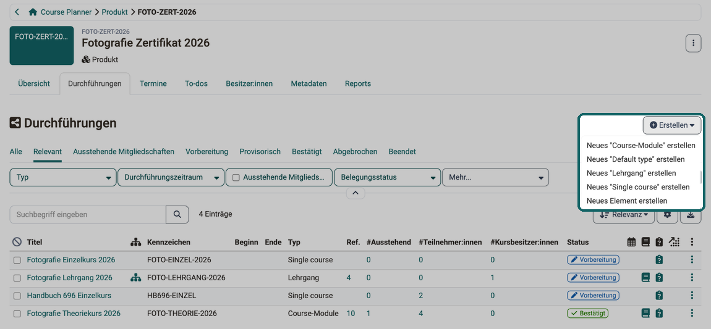{ class="shadow lightbox" title="Tab Durchführungen eines Produkts · 2026.10.09" }

Alle geplanten Durchführungen dieses Produkts finden Sie anschliessend in der Liste unter diesem Tab. Sie können jede Durchführung wählen und sie entsprechend Ihren Wünschen anpassen.

Statt neue Durchführungen mit dem Button über der Liste zu erstellen, können Sie auch von einer bereits geplanten und modifizierten Durchführung eine Kopie erzeugen. Die Aktion "Element kopieren" finden Sie im Menü der 3 Punkte am Ende einer Zeile.

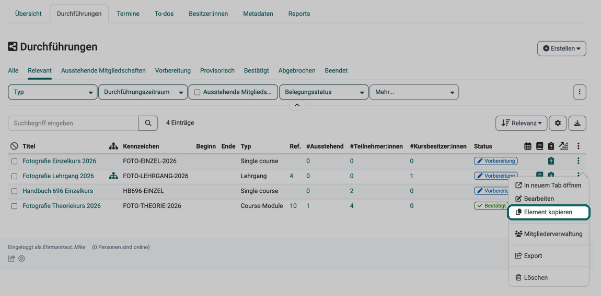{ class="shadow lightbox" title="Liste der Durchführungen eines Produkts · 2026.10.09" }

[zum Seitenanfang ^](#plan_and_run_courses_with_course_planner)

---

## Schritt 4: Termine {: #events}

Für die Planung von Terminen ist zu unterscheiden:

### Schritt 4a: Zeitraum einer Durchführung
Wenn eine neue Durchführung erstellt und eingerichtet worden ist (der Ablauf / das "Programm" der Durchführung festgelegt ist), muss die Durchführung noch terminiert werden.

Den Durchführungszeitraum, also wann eine Durchführung stattfindet, legen Sie bei der Konfiguration der Durchführung fest: 
`Course Planner > Durchführungen > "Titel der Durchführung" > Tab "Einstellungen" > Unter-Tab "Durchführung"`

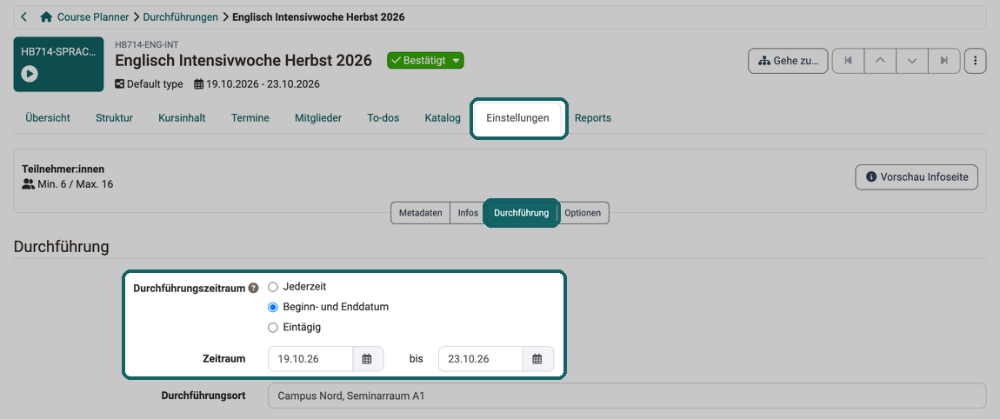{ class="shadow lightbox" title="Tab Einstellungen einer Durchführung · 2026.10.09" }

[zum Seitenanfang ^](#plan_and_run_courses_with_course_planner)

---

### Schritt 4b: Termine im Rahmen einer Durchführung

Wenn eine neue Durchführung erstellt und eingerichtet worden ist, und auch deren Durchführungszeitraum festgelegt wurde, können nun innerhalb einer Durchführung stattfindende Termine geplant und angelegt werden: 
`Course Planner > Durchführungen > "Titel der Durchführung" > Tab "Termine"`

Mit dem Button "Termin hinzufügen" rechts über der Tabelle fügen Sie weitere Termine hinzu.

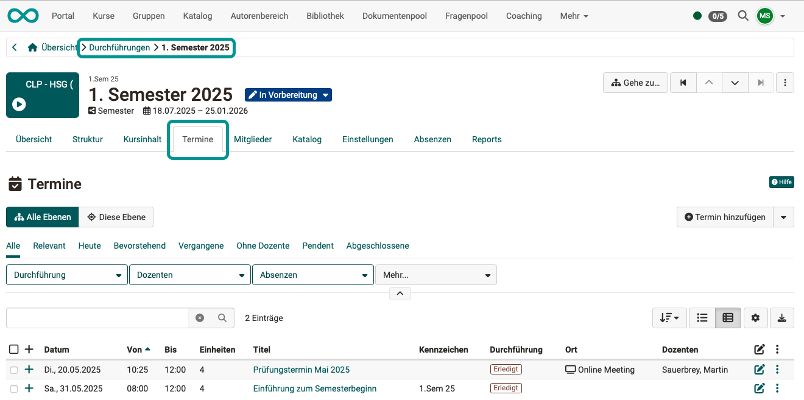{ class="shadow lightbox" title="Tab Termine einer Durchführung" }

!!! info "Technischer Hintergrund"

    Solange noch keine Kurse eingebunden sind, hängen die Termine jeweils an einer Durchführung. Sobald ein Kurs zur Durchführung hinzugefügt wurde (Schritt 7, Schritt 10), werden die Termine den Kursen zugeordnet.

[zum Seitenanfang ^](#plan_and_run_courses_with_course_planner)

---

### Schritt 4c: Übersicht über Termine aus allen Durchführungen

Wenn mehrere Durchführungen erstellt und eingerichtet worden sind, existieren zu jeder Durchführung Termine. Um eine Gesamtübersicht zu erhalten, wählen Sie im **Produkt** den Tab "Termine". Auch dort können die einzelnen Termine bearbeitet und mit dem Button "Termin hinzufügen" neue Termine angelegt werden.

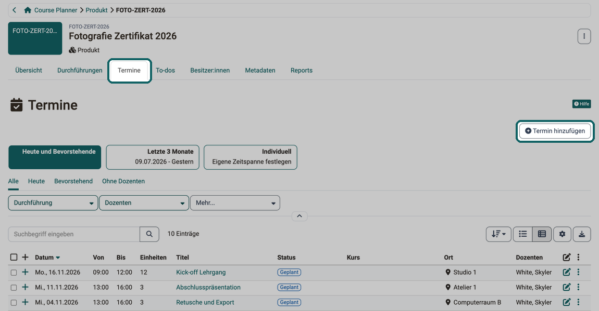{ class="shadow lightbox" title="Tab Termine eines Produkts · 2026.10.09" }

Der Termin kann sich auf die gesamte Durchführung eines Produkts beziehen oder nur auf einen Teil der Durchführung des Produkts. Wählen Sie im ersten Schritt des Dialogs das gewünschte Element aus dem angezeigten Strukturbaum. Hat das Element Kurse, stehen sie darunter im Bereich "Durchführen in": Wählen Sie dort den Kurs, in dem der Termin stattfindet. Der erste Kurs ist vorausgewählt.

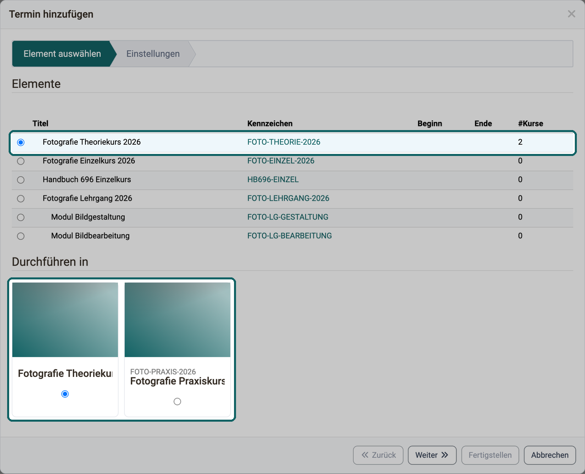{ class="shadow lightbox" title="Dialog Termin hinzufügen · 2026.10.09" }

Nachdem das zu terminierende Element der Durchführung gewählt ist, konfigurieren Sie den Termin im Schritt "Einstellungen", d.h. Sie nehmen die entsprechenden Einstellungen vor.

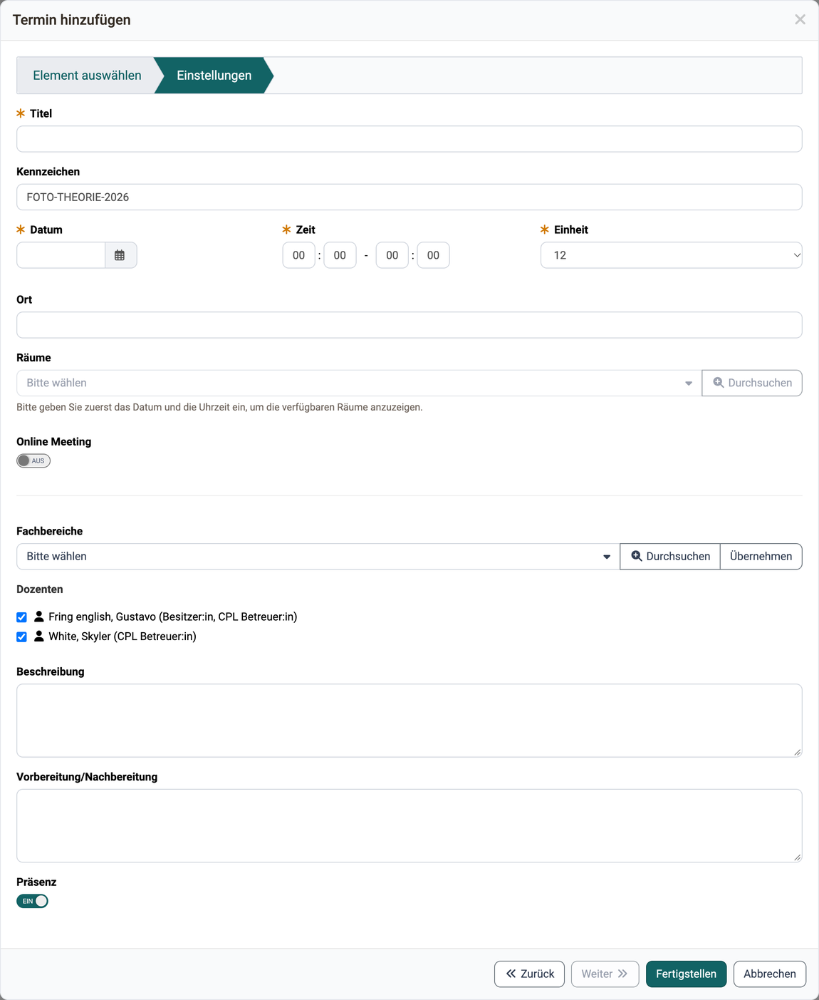{ class="shadow lightbox" title="Dialog Termin hinzufügen · 2026.10.09" }

#### Titel {: #event_title}

Mit diesem Titel wird der Termin an verschiedenen Stellen angezeigt.

#### Kennzeichen {: #event_reference}

Die zusätzliche Kennung dient der Eindeutigkeit eines Termins, falls es Termine mit gleichem Titel gibt.

#### Datum {: #event_date}

Tag und Uhrzeit (Beginn und Ende).

#### Einheit {: #event_unit}

Wurde z.B. ein Vormittag von 8.00-12.00 Uhr vorgesehen, kann er beispielsweise in 4 Einheiten zu je 50 Minuten unterteilt werden. (Dazwischen jeweils Pausen.)

#### Ort {: #event_location}

Wo findet der Termin statt, falls physische Präsenz geplant ist.

#### Räume {: #event_rooms}

Ist das Modul "Räume" aktiviert, weisen Sie dem Termin einen oder mehrere Räume zu. Die Auswahl wird erst aktiv, wenn Datum und Zeit eingetragen sind, und zeigt dann, welche Räume in diesem Zeitraum verfügbar sind. Mehr dazu unter [Course Planner: Termine >](../../manual_user/area_modules/Course_Planner_Events.de.md#room_booking)

#### Online Meeting {: #event_online_meeting}

Der Course Planner ermöglicht die Verwaltung und Pflege von Terminen für Online-Meetings bereits in der Planungsphase direkt am Produkt bzw. auf der Durchführung, auch ohne bereits hinterlegte Kursinhalte. Es können Online-Meetings mit BigBlueButton und Teams eingerichtet werden. (Es hängt davon ab, was bei Ihnen in OpenOlat eingerichtet ist.) 
Die hinterlegten Termine werden später bei der Verknüpfung der Durchführung mit einem Kurs auf diesen appliziert und sind dann auch im Kurs verfügbar.

#### Fachbereiche {: #event_subjects}

Ordnen Sie den Termin einem oder mehreren Fachbereichen zu. Mit dem Button "Übernehmen" übernehmen Sie die Fachbereiche der Durchführung und des gewählten Kurses. Das Feld erscheint nur, wenn in Ihrer OpenOlat-Instanz Fachbereiche eingerichtet sind.

#### Dozenten {: #event_teachers}

Um Dozenten auswählen zu können, müssen zuerst Betreuer:innen als Mitglieder hinzugefügt werden.

#### Beschreibung {: #event_description}

Der hier eingegebene Text ist für eine den Titel ergänzende, etwas ausführlichere Beschreibung vorgesehen.

#### Vorbereitung/Nachbereitung {: #event_preparation}

Im hier eingegebenen Text können Aufgaben zur Vor- und Nachbereitung des Termins beschrieben werden.

#### Präsenz {: #event_compulsory}

Wird bestimmt, dass eine Präsenzpflicht besteht, kann später im Absenzmanagement verwaltet werden, ob eine Person anwesend war oder entschuldigt bzw. unentschuldigt gefehlt hat.

Mehr zu den Terminen finden Sie im Benutzerhandbuch: 
[Course Planner: Termine >](../../manual_user/area_modules/Course_Planner_Events.de.md)

[zum Seitenanfang ^](#plan_and_run_courses_with_course_planner)

---

## Schritt 5: Ausschreibung der Durchführung  {: #offer}

Sie können bereits in der Planungsphase einen Kurs im Katalog anbieten und z.B. durch die Interessenten selbst buchen lassen.

1. Wählen Sie im Course Planner die Durchführung, die Sie im Katalog anbieten möchten.
2. Wählen Sie den Tab "Katalog".
3. Wählen Sie den Teilbereich "Angebote".
4. Erstellen Sie mit dem Button "Angebot hinzufügen" ein neues [Angebot](../../manual_user/area_modules/catalog2.0_angebote.de.md).

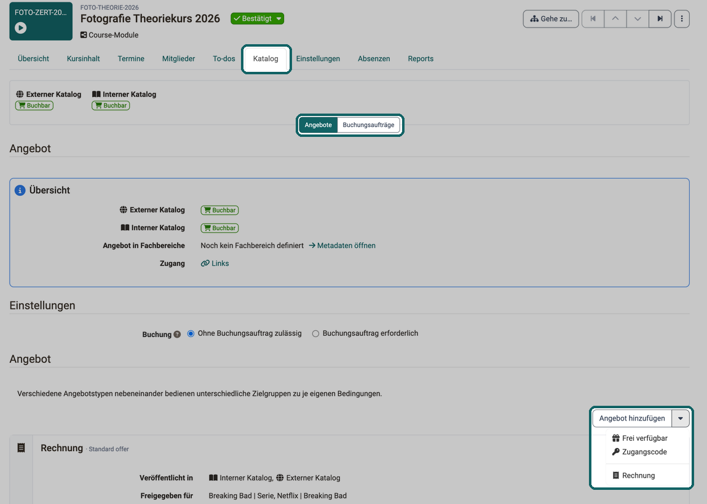{ class="shadow lightbox" title="Tab Katalog einer Durchführung · 2026.10.09" }

[zum Seitenanfang ^](#plan_and_run_courses_with_course_planner)

---

## Schritt 6: Verwendungszweck in den Kursen angeben {: #embedding}

Der Verwendungszweck eines Kurses legt fest, ob der Kurs eigene Mitglieder führt oder ob der Course Planner sie verwaltet. Sie finden ihn in jedem Kurs unter: 
`Kurs > Administration > Einstellungen > Tab "Freigabe" > Abschnitt "Verwendung"` 
Mit dem Button "Ändern" öffnet sich der Dialog "Verwendungszweck ändern". Ein Kurs kennt drei Verwendungszwecke:

- **Eigenständig**: Der Kurs führt seine Mitglieder selbst. Im Dialog "Kurs hinzufügen" einer Durchführung erscheint er nicht.
- **Verwendung im Course Planner**: für Kurse, die Sie direkt in eine Durchführung einbinden. Die Mitglieder kommen aus der Durchführung, im Kurs selbst verwalten Sie nur noch die Besitzer:innen.
- **Template**: für Kurstemplates, aus denen der Course Planner für jede Durchführung einen eigenen Kurs instanziiert (siehe Schritt 10). Ein Template hat keine Teilnehmenden.

Den vierten Verwendungszweck "Einbindung" bietet der Dialog nur anderen Lernressourcen als Kursen an. Der Dialog zeigt oben unter "Aktueller Verwendungszweck" den heutigen Wert und darunter unter "Verwendungszweck ändern in" die übrigen Verwendungszwecke zur Auswahl.

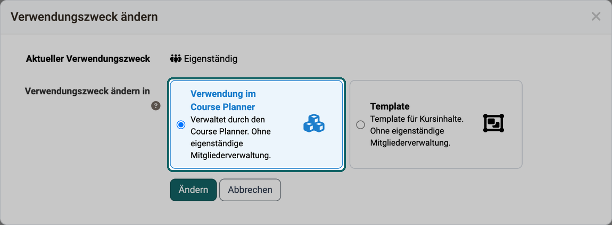{ class="shadow lightbox" title="Dialog Verwendungszweck ändern · 2026.10.09" }

!!! info "Was bewirkt der Verwendungszweck «Verwendung im Course Planner»?"

    Mit dem Verwendungszweck "Verwendung im Course Planner" werden die Teilnehmer:innen vom Course Planner verwaltet und nicht mehr in der Mitgliederverwaltung des Kurses. Würden direkt im Kurs noch Mitglieder hinzugefügt, entstünde eine Doppelspurigkeit (Mitglied direkt im Kurs **und** Mitglied im Produkt). Deshalb ist bei diesem Verwendungszweck die Mitgliederverwaltung im Kurs selbst auf die Kursbesitzer:innen beschränkt, die den Kurs bearbeiten können.

**Teilschritt 1, Variante A** 
Im Course Planner sind alle in einer Durchführung verwendeten Kurse im **Tab "Kursinhalt"** einer Durchführung ersichtlich und können dort hinzugefügt werden. (Siehe Schritt 7)

Sie können dort einen Kurs direkt anwählen und die vorstehend beschriebene Einstellung zum Verwendungszweck vornehmen.

**Teilschritt 1, Variante B** 
Gehen Sie in den **Autorenbereich** und wählen Sie nacheinander die Kurse, die Bestandteil Ihres Produkts sein sollen.

**Teilschritt 2** 
Wählen Sie im Kurs unter `Kurs > Administration > Einstellungen > Tab "Freigabe"` als Verwendungszweck **Verwendung im Course Planner**.

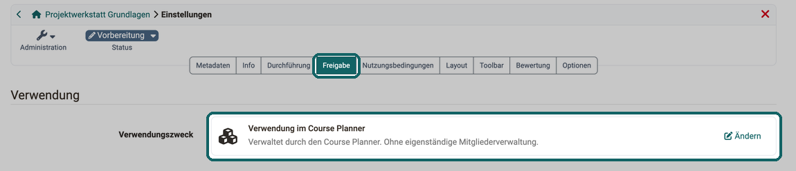{ class="shadow lightbox" title="Tab Freigabe der Kurseinstellungen · 2026.10.09" }

Der beschriebene Weg zur Angabe des Verwendungszwecks dient auch zur Kontrolle. Steckt ein Kurs mit dem Verwendungszweck "Eigenständig" bereits in einer Durchführung, zeigt sein Tab "Freigabe" eine Warnmeldung: Dieser Verwendungszweck wird für Kurse im Course Planner nicht empfohlen.

Im Dialog "Kurs hinzufügen" der Durchführung gibt es dagegen keine Meldung. Ein Kurs ohne den Verwendungszweck "Verwendung im Course Planner" erscheint dort gar nicht. Fehlt ein Kurs in der Liste, prüfen Sie deshalb zuerst seinen Verwendungszweck (siehe [Schritt 7](#add_course_dialog)).

Mehr zum Abschnitt Verwendung finden Sie im Benutzerhandbuch unter: 
[Kurseinstellungen - Tab Freigabe >](../../manual_user/learningresources/Course_Settings_Share.de.md#section_usage)

!!! tip "Tipp"

    Wird der Course Planner umfassend eingesetzt, bietet es sich an, den Verwendungszweck für neue Kurse in der System-Administration auf "Verwendung im Course Planner" einzustellen. 
    Wenden Sie sich dafür an Ihre Systemadministration. 
    Die Voreinstellung "Verwendungszweck für neue Kurse" finden Sie unter: `Administration > Module > Course Planner > Tab "Einstellungen"`

### Wenn sich der Verwendungszweck nicht ändern lässt {: #embedding_locked}

Wollen Sie einen Kurs, der schon im Einsatz war, im Course Planner verwenden, ist die Option "Verwendung im Course Planner" im Dialog "Verwendungszweck ändern" oft nicht anwählbar. Der Dialog nennt den Grund über der Auswahl. Drei Gründe sperren den Wechsel von "Eigenständig" zu "Verwendung im Course Planner":

- Der Kurs hat Mitglieder ausser den Besitzer:innen, also Betreuer:innen oder Teilnehmer:innen.
- Eine Gruppe des Kurses ist auch in einem anderen Kurs eingebunden.
- Der "Zugang für Teilnehmer:innen" im Tab "Freigabe" steht nicht auf "Privat".

Hat der Kurs Mitglieder, kopieren Sie ihn mit `Kurs > Administration > Kopieren` und stellen die Kopie um. Die Kopie entsteht ohne Betreuer:innen, Teilnehmer:innen und Gruppenmitglieder.

Mehr zum Kopieren finden Sie im Benutzerhandbuch unter: 
[Kopieren (eines Kurses) >](../../manual_user/learningresources/Course_Copy.de.md)

[zum Seitenanfang ^](#plan_and_run_courses_with_course_planner)

---

## Schritt 7: Inhalte hinzufügen {: #add_content}

Wie eingangs erwähnt, dient der Course Planner dazu, die **Planungsarbeit** von der **Inhaltserstellung** (im Autorenbereich) zu trennen. Das Hinzufügen der Inhalte zu den Durchführungen kann auch erst erfolgen, wenn die Durchführungen bereits geplant sind.

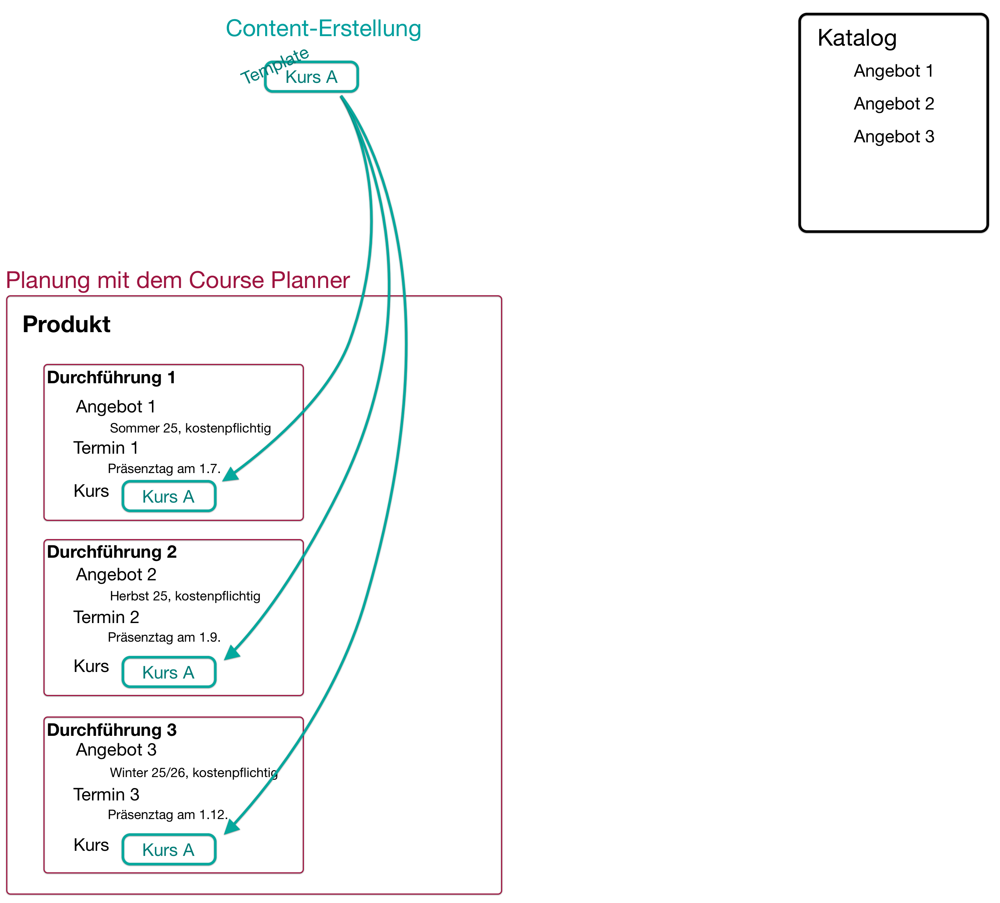{ class="shadow lightbox" title="Planung mit dem Course Planner" }

Um einer Durchführung Inhalt (Kurse) hinzuzufügen, wählen Sie in einer Durchführung den **Tab "Kursinhalt"** und klicken auf den Button "Kurs hinzufügen".

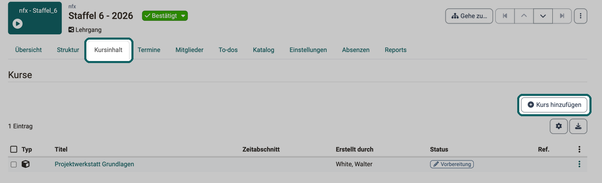{ class="shadow lightbox" title="Tab Kursinhalt einer Durchführung · 2026.10.09" }

!!! note "Hinweis"

    Wie ein Kurs von einem Kurstemplate ausgehend automatisch zu einem bestimmten Termin erstellt werden kann, ist in Schritt 10 beschrieben.

### Welche Kurse der Dialog "Kurs hinzufügen" zeigt {: #add_course_dialog}

Suchen Sie im Dialog "Kurs hinzufügen" einen Kurs, der nicht in der Liste steht, nennt OpenOlat keinen Grund. Drei Bedingungen entscheiden, welche Kurse der Dialog anbietet:

1. **Verwendungszweck:** Der Dialog zeigt nur Kurse mit dem Verwendungszweck "Verwendung im Course Planner" (siehe [Schritt 6](#embedding)). Kurse mit dem Verwendungszweck "Eigenständig" oder "Template" erscheinen hier nie. Ein Template fügen Sie mit dem Button "Kurstemplate hinzufügen" hinzu (siehe Schritt 10).
2. **Organisation:** Neben Ihren eigenen Kursen zeigt der Dialog Kurse, deren Administrative Freigabe die Organisation des Produkts oder eine ihrer Unterorganisationen enthält. Dazu kommen Kurse, die Sie über eine Rolle in der Organisation des Kurses verwalten, etwa als Lernressourcenverwalter:in. Die Freigabe wirkt nur nach unten: Ist ein Kurs nur für eine übergeordnete Organisation des Produkts freigegeben, erscheint er nicht. Ergänzen Sie dann im Kurs die Organisation des Produkts unter `Kurs > Administration > Einstellungen > Tab "Freigabe" > Administrative Freigabe`. Das Feld nimmt mehrere Organisationen auf.
3. **Tab:** Der Dialog öffnet auf dem Tab "Meine Kurse", und dieser zeigt nur Kurse, deren Besitzer:in Sie sind. Kurse anderer Besitzer:innen finden Sie im Tab "Suche". Dieser Tab öffnet ohne Treffer: Geben Sie einen Suchbegriff ein, oder klicken Sie direkt auf "Suchen". Der Tab "Favoriten" zeigt die Kurse, die Sie als Favorit markiert haben.

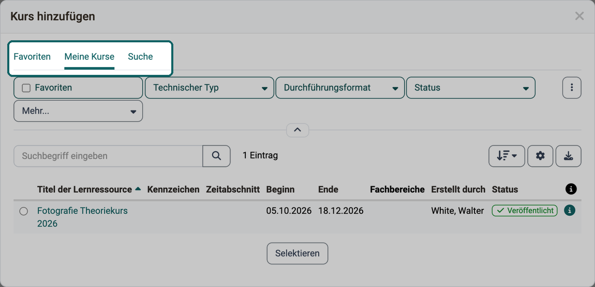{ class="shadow lightbox" title="Dialog Kurs hinzufügen einer Durchführung · 2026.10.09" }

!!! tip "Kurs nicht in der Liste?"

    - Steht der Verwendungszweck des Kurses auf "Verwendung im Course Planner"?
    - Sind Sie Besitzer:in des Kurses, oder enthält seine Administrative Freigabe die Organisation des Produkts oder eine ihrer Unterorganisationen?
    - Haben Sie für Kurse anderer Besitzer:innen in den Tab "Suche" gewechselt?

[zum Seitenanfang ^](#plan_and_run_courses_with_course_planner)

---

## Schritt 8: Teilnehmer:innen {: #add_members}

Die Teilnehmer:innen werden als **Mitglieder** zu einer der **Durchführungen** des Produkts hinzugefügt.
Warum sie Mitglieder einer Durchführung und nicht Mitglieder eines Produkts werden, wurde bereits in
[Schritt 2](#define_product_owners) erklärt.

Die Mitgliederverwaltung finden Sie deshalb im **Tab "Durchführungen"** des Produkts im Menü der **3 Punkte am Ende einer Zeile** (= Durchführung), Eintrag "Mitgliederverwaltung". In der geöffneten Durchführung führt der Tab "Mitglieder" ebenfalls dorthin.

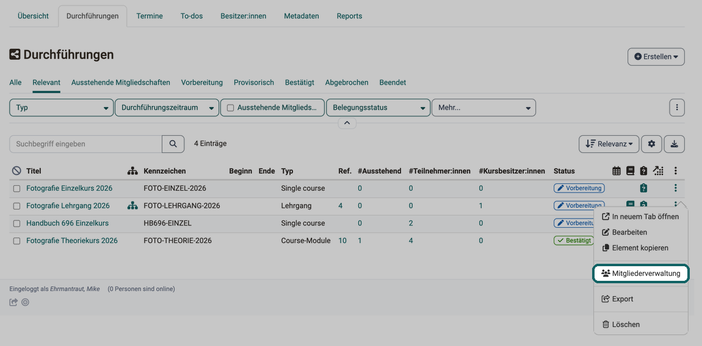{ class="shadow lightbox" title="Liste der Durchführungen eines Produkts · 2026.10.09" }

[zum Seitenanfang ^](#plan_and_run_courses_with_course_planner)

---

## Schritt 9: Übersicht über die Buchungsaufträge verschaffen {: #reports}

### Report-Dateien erstellen

Wählen Sie in der Übersicht des Course Planners den Button "Reports".

Sie können dort aus verschiedenen Vorlagen auswählen, anhand derer Sie Excel-Dateien mit den aktuellen Daten zu den eingegangenen Buchungsaufträgen erstellen können.

Klicken Sie zum Erstellen eines Reports auf einen der Pfeile in der Spalte "Ausführen".

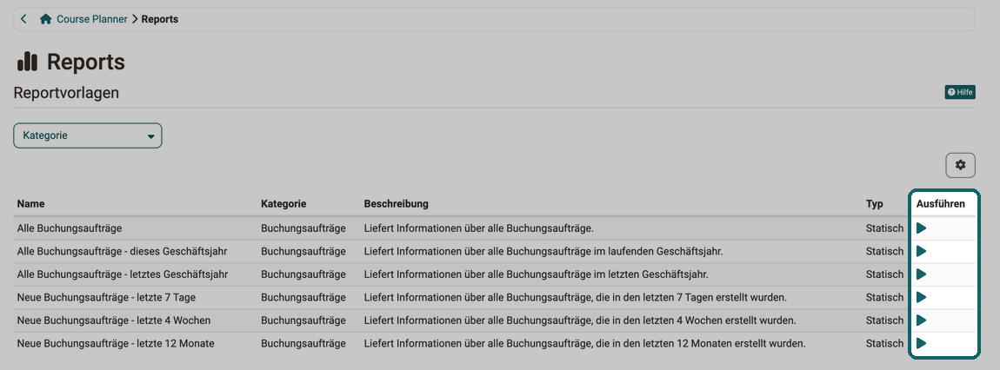{ class="shadow lightbox" title="Seite Reports im Course Planner · 2026.10.09" }

Die so erstellten Excel-Dateien finden Sie im unteren Bereich des Screens aufgelistet.
Sie können kopiert, gelöscht und heruntergeladen werden.

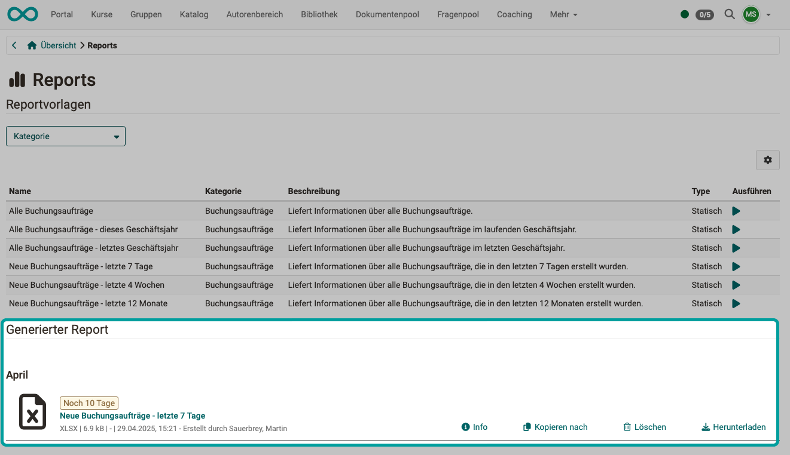{ class="shadow lightbox" title="Seite Reports im Course Planner" }

### Über den Katalog eingegangene Buchungsaufträge

Eine Excel-Datei mit allen Buchungsaufträgen, die über den Katalog eingegangen sind, laden Sie mit dem Button "Buchungsaufträge herunterladen" herunter: 
`Course Planner > Durchführungen > "Titel der Durchführung" > Tab "Katalog" > Buchungsaufträge`

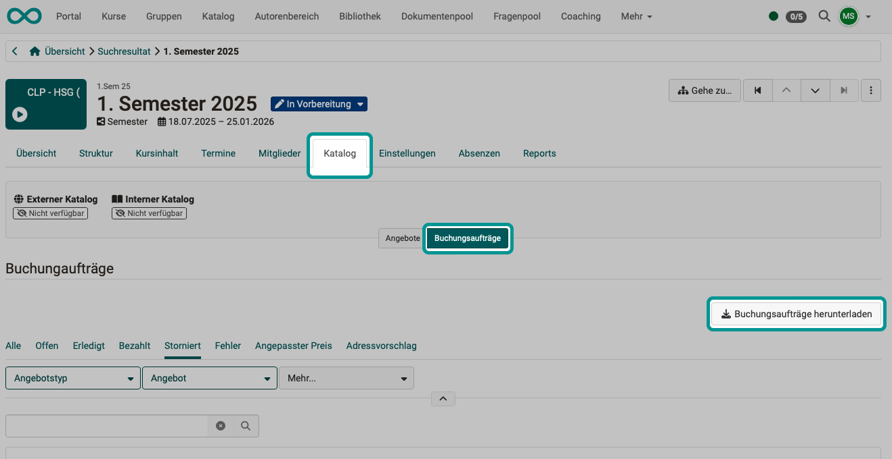{ class="shadow lightbox" title="Tab Katalog einer Durchführung" }

[zum Seitenanfang ^](#plan_and_run_courses_with_course_planner)

---

## Schritt 10: Automatisierte Kurserstellung {: #automatic_course_creation}

Wenn der Kurs tatsächlich stattfinden wird (z.B. nachdem genügend Buchungsaufträge eingegangen sind), kann auch erst dann ein dazugehöriger OpenOlat-Kurs aus einem Kurstemplate erstellt werden. (Siehe Schritt 7)

Ein Kurstemplate ist ein Kurs mit dem Verwendungszweck **Template**: 
`Kurs > Administration > Einstellungen > Tab "Freigabe" > Abschnitt "Verwendung"` 
Im Tab "Kursinhalt" der Durchführung fügen Sie es mit dem Button "Kurstemplate hinzufügen" hinzu. Den Button gibt es nur, wenn der Elementtyp der Durchführung bei "Max. Kursreferenzen" auf "1 Template/Kurs" steht.

Die Vorbereitung der automatisierten Instanziierung (Kurserstellung aus dem Kurstemplate) finden Sie hier: 
`Course Planner > Durchführungen > "Titel der Durchführung" > Tab "Einstellungen" > Unter-Tab "Automatisierung"`

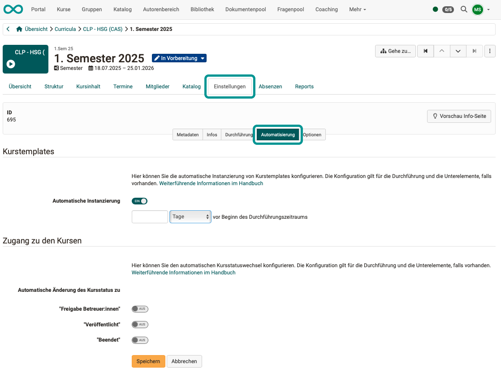{ class="shadow lightbox" title="Tab Einstellungen einer Durchführung" }

Sie können bestimmen, wann die automatisierte Instanziierung erfolgen soll. 
Damit einhergehend besteht auch die Möglichkeit, den Kursstatus automatisch zu ändern.

Mehr zur Automatisierung finden Sie im Benutzerhandbuch unter: 
[Course Planner: Durchführungen >](../../manual_user/area_modules/Course_Planner_Implementations.de.md#tab_settings_automation)

[zum Seitenanfang ^](#plan_and_run_courses_with_course_planner)

---

## Weiterführende Informationen {: #further_information}

**Auf dieser Seite erwähnt** 
[Wie erstelle ich meinen ersten OpenOlat-Kurs? >](../my_first_course/my_first_course.de.md) 
[Basiskonzepte >](../../manual_user/basic_concepts/index.de.md) 
[Course Planner: Produkte >](../../manual_user/area_modules/Course_Planner_Products.de.md) 
[Course Planner: Durchführungen >](../../manual_user/area_modules/Course_Planner_Implementations.de.md) 
[Modul Course Planner >](../../manual_admin/administration/Modules_Course_Planner.de.md) 
[Course Planner: Termine >](../../manual_user/area_modules/Course_Planner_Events.de.md) 
[Katalog 2.0 - Angebote >](../../manual_user/area_modules/catalog2.0_angebote.de.md) 
[Kurseinstellungen - Tab Freigabe >](../../manual_user/learningresources/Course_Settings_Share.de.md) 
[Kopieren (eines Kurses) >](../../manual_user/learningresources/Course_Copy.de.md)

**Weiterführend** 
[Course Planner: Übersicht >](../../manual_user/area_modules/Course_Planner.de.md) 
[Course Planner: Reports >](../../manual_user/area_modules/Course_Planner_Reports.de.md)

[zum Seitenanfang ^](#plan_and_run_courses_with_course_planner)

