# How do I plan and run courses with the Course Planner? {: #plan_and_run_courses_with_course_planner}

??? abstract "Purpose and content of this guide"

    This guide shows you how to use Course Planner to automatically and efficiently plan and create courses based on the offering.

??? abstract "Target group"

    [x] Authors [ ] Coaches  [ ] Participants

    [ ] Beginners [x] Amateurs  [x] Experts

??? abstract "Erwartete Vorkenntnisse"

    * ["How do I create my first OpenOlat Course?"](../my_first_course/my_first_course.md) 
    * [Familiarity with basic concepts of OpenOlat >](../../manual_user/basic_concepts/index.md) 
   

---

## Was kann der Course Planner? {: #purpose}

With the Course Planner, **planning work** can be separated from **content creation** (in the authoring area).

**Course planners** can carry out all organizational planning even before the content (courses) has been completed by **authors**:

* Planning multiple instances of the same course at different times
* Planning of educational programs with multiple courses (and multiple instances of each course)
* Creation of offers in the catalog
* Reports on booking orders already received
* Scheduling appointments related to the various activities (e.g., for in-person events or exams)
* Scheduling automatic course instantiation
* ...

Of course, you can also create OpenOlat courses without Course Planner. However, Course Planner provides you with a tool that brings together all the organizational tasks.

##  Where can I find the Course Planner? {: #access}

If you have the **role of Course Planner**, you will find the Course Planner as a menu item in the main navigation bar in the **header**.  

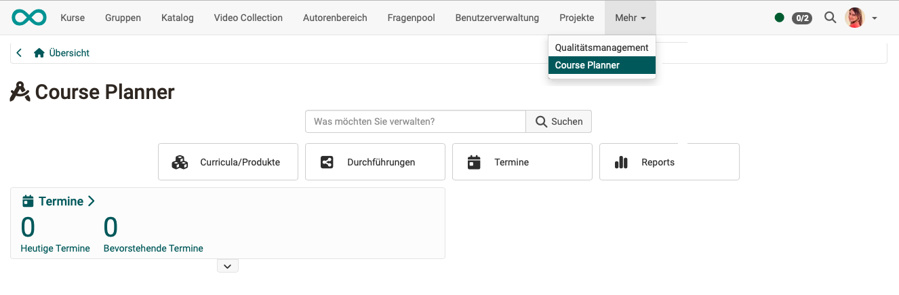{ class="shadow lightbox" }  

!!! info "Requirement"

    In order to use the Course Planner, it must have been activated by a system administrator. If the option is not available in the header menu, please contact your system administrator.

[To the top of the page ^](#plan_and_run_courses_with_course_planner)

---

## Step 1: Create product  {: #create_product}

We distinguish between a [product](../../manual_user/area_modules/Course_Planner_Products.md#create_products) (e.g., a course that can be offered multiple times) and an [implementation](../../manual_user/area_modules/Course_Planner_Implementations.md).

Example: 
- A language course entitled "Spanish for Beginners" is being developed and planned as a product.
- Courses will then be held as "Spanish for Beginners, Spring 2025," "Spanish for Beginners, Fall 2025," etc.

Open the Course Planner and select the "Products" button. There you can select an existing product from the list or create a new one. This product will then be offered multiple times in different versions.

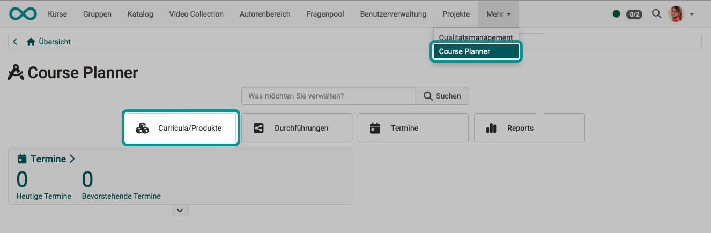{ class="shadow lightbox" }  

You can find out more about this in the user manual under [Products >](../../manual_user/area_modules/Course_Planner_Products.md#create_products)

!!! info "Note"

    In the following instructions, we will initially limit ourselves to a single course. It is also possible to integrate several courses into a single implementation.

[To the top of the page ^](#plan_and_run_courses_with_course_planner)

---

## Step 2: Determine product managers {: #define_product_owners}

In the newly created product, you will find various tabs where you can now configure the product. First, select the **"Owners" tab**. There you will find the option to add (product) owners.

As the creator of the product, you already have editing rights. If you do not want to do the planning and administration of the product yourself and alone, you should designate a responsible person as the owner here.

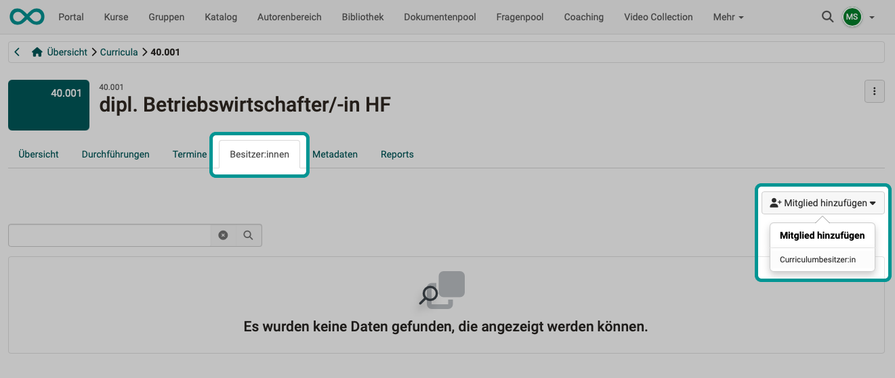{ class="shadow lightbox" } 

**Why can I only enter owners here? Why not participants as well?**

The idea is that a product consisting of several courses is not only attended once by a group of participants. Rather, there should be **several instances** of a product with the same or very similar content, but with different participants and coaches.

Owners have the right to edit the product (the "original version," the "copy template"). It does not make sense to also make participants members of the "copy template". They would then be participants in all implementations of a product.

!!! info "Note"

    In Course Planner, you have full access to all products in the role of **Course Planner**.
    **Owners** of a product, on the other hand, only have access to their respective product.

[To the top of the page ^](#plan_and_run_courses_with_course_planner)

---

## Step 3: Planning/creating an implementation {: #implementations}

Now select the **"Implementation" tab** and create a new implementation.

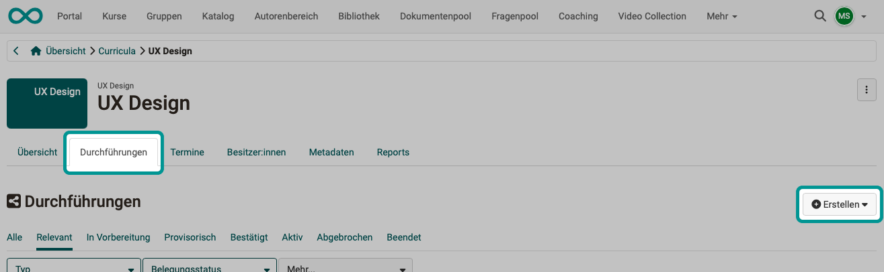{ class="shadow lightbox" } 

Under the "Create" button, you will find a selection of [element types](../../manual_admin/administration/Modules_Course_Planner.md#define_element_types) that have been defined by your administrator. 

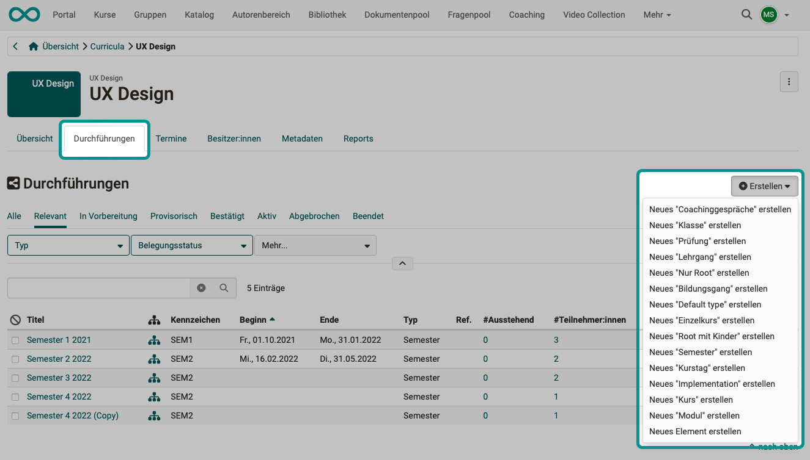{ class="shadow lightbox" } 

All planned implementations of this product can be found in the list under this tab. You can select any implementation and customize it according to your requirements.

Instead of creating new runs using the button above the list, you can also create a copy of a run that has already been planned and modified. The copy option can be found under the three dots at the end of a line.

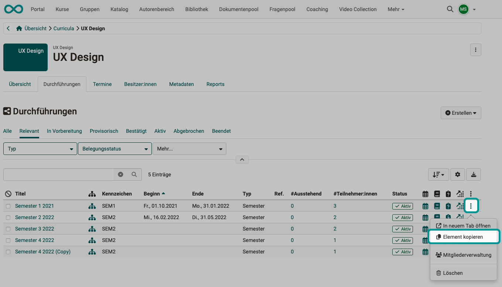{ class="shadow lightbox" } 

[To the top of the page ^](#plan_and_run_courses_with_course_planner)

---

## Step 4: Events {: #events}

When planning events, a distinction must be made between:

### Step 4a: Implementation period 
Once a new implementation has been created and set up (the process/program for the implementation has been defined), the various implementations still need to be scheduled.

An implementation period (date when an implementation takes place) is specified. This information is provided when configuring an implementation:
**Select Implementation > Settings tab > Implementation tab**

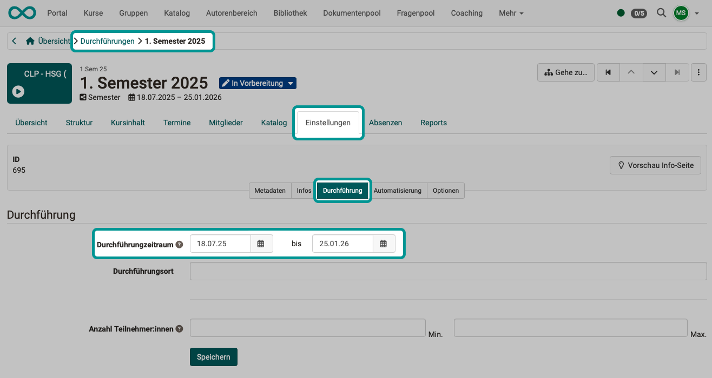{ class="shadow lightbox" } 

[To the top of the page ^](#plan_and_run_courses_with_course_planner)

---

### Step 4b: Dates within the scope of implementation

Once a new implementation has been created and set up, and its implementation period has been defined, events that take place within an implementation can now be planned and created:
**Select Implementation > Settings tab > Events tab**

Use the "Add event" button to the right above the table to add further events. 

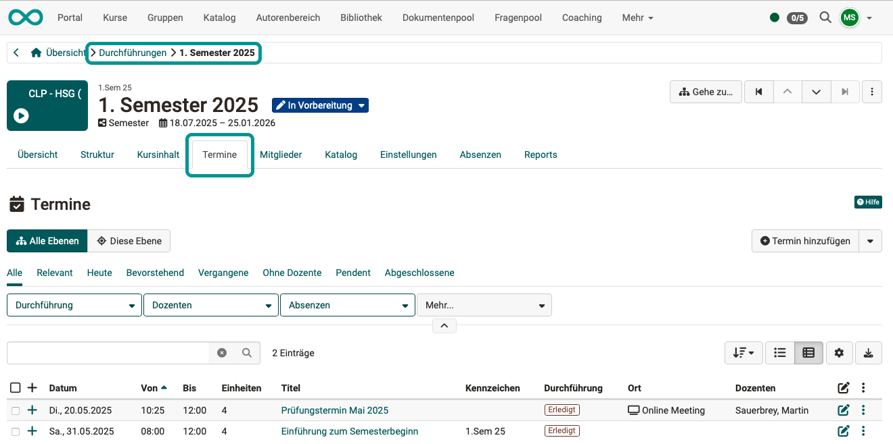{ class="shadow lightbox" } 

!!! info "Technischer Hintergrund"

    As long as no courses have been added yet, the dates are linked to a specific implementation. As soon as a course has been added to the implementation (step 7, step 10), the dates are assigned to the courses.

[To the top of the page ^](#plan_and_run_courses_with_course_planner)

---

### Step 4c: Overview of dates from all implementations

If several implementations have been created and set up, there will be dates for each implementation. To get an overview, select the "Dates" tab in the **Product**. You can also edit the individual dates there. First, you will see an overview, and then you can select one of the implementations.

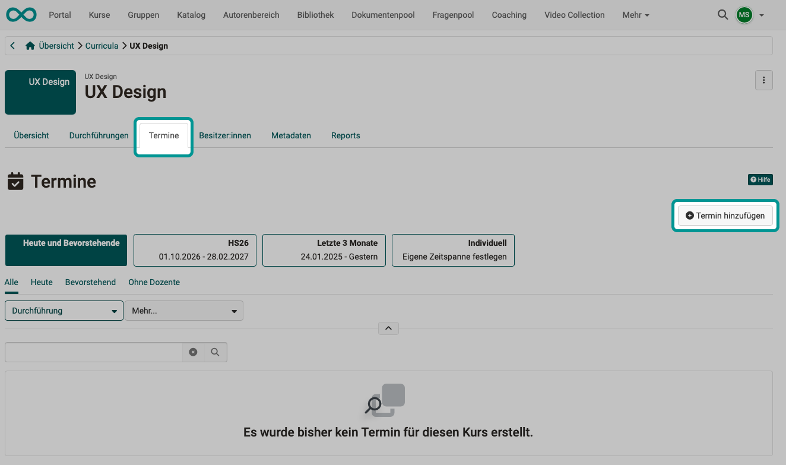{ class="shadow lightbox" } 

The date can refer to the entire implementation of a product or only to part of the implementation of the product. Select the desired element from the structure tree displayed.

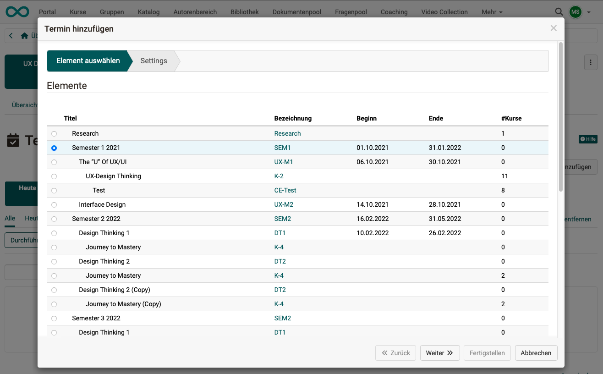{ class="shadow lightbox" } 

Once the element of the implementation to be scheduled has been selected, configure the schedule, i.e., make the appropriate settings. 

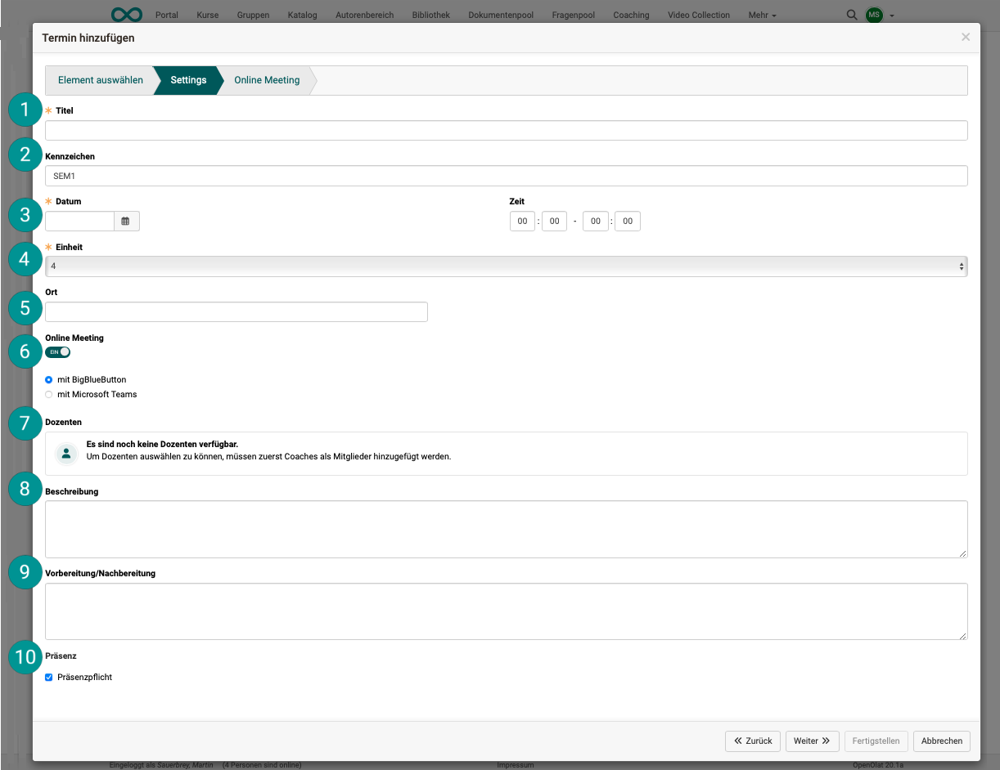{ class="shadow lightbox" } 

 **Title**: 
This title is used to display the event in various locations.

 **Characteristics**: 
The additional identifier serves to uniquely identify an event in case there are events with the same title.

 **Date**: 
Date and time (start and end)

 **Unit**: 
If, for example, a morning session from 8:00 a.m. to 12:00 p.m. has been scheduled, it can be divided into four units of 50 minutes each (with breaks in between). 

 **Place**: 
Where will the meeting take place if physical attendance is planned?

 **Online Meeting**: 
The Course Planner allows you to manage and maintain events for online meetings directly in the planning phase, either in the product itself or during implementation—even without any course content having been stored yet. Online meetings can be set up with BigBlueButton and Teams. (This depends on what is set up in OpenOlat for you.) 
The stored dates are later applied to the course when linking the implementation to a course and are then also available in the course.

 **Lecturers**: 
In order to select lecturers, supervisors must first be added as members.

 **Description**: 
The text entered here is intended to supplement the title with a more detailed description.

 **Preparation/Follow-up**: 
The text entered here can be used to describe tasks for preparing for and following up on the event.

 **Presence**: 
If attendance is determined to be mandatory, absence management can be used later to manage whether a person was present or absent with or without excuse.

You can find more information about the dates in the user manual: 
[Course Planner: Events >](../../manual_user/area_modules/Course_Planner_Events.md)

[To the top of the page ^](#plan_and_run_courses_with_course_planner)

---

## Step 5: Offer of the implementation  {: #offer}

You can offer a course in the catalog as early as the planning phase and, for example, allow interested parties to book it themselves.

 In the Course Planner, select the course you would like to offer in the catalog.

 Select the "Catalog" tab.

 Select the "Offers" tab.

 Create a new [Offer](../../manual_user/area_modules/catalog2.0_angebote.md).

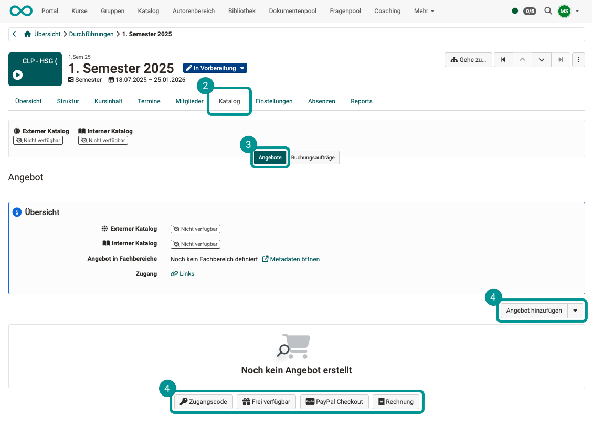{ class="shadow lightbox" } 

[To the top of the page ^](#plan_and_run_courses_with_course_planner)

---

## Step 6: Specify the intended use in the courses {: #embedding}

In each course, under 
**Administration > Settings > Tab Share > Section "Usage"** 
a purpose of use must be selected. The following options are available:

- Independent
- Integration into product -> Select for use in Course Planner.
- Template

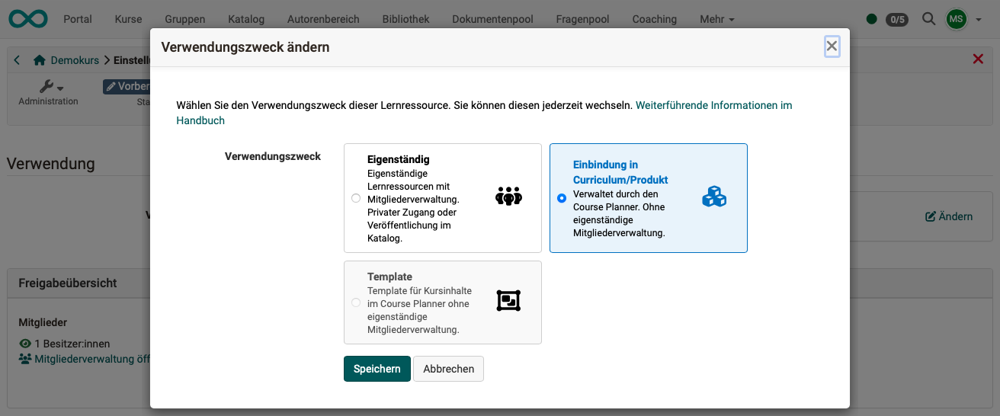{ class="shadow lightbox" } 

!!! info “What does the "Integration into product" setting do?”

    By specifying the intended use "Integration into product," participants are now managed by the Course Planner and no longer in the course's member management system. If members were added directly in the course, this would result in duplication (member directly in the course **and** member in the product). For this reason, when the intended use is "Integration into product," member management in the course itself is restricted to the course owners who can edit the course.

**Substep 1, Variant A** 
All courses used in a run can be viewed in the Course Planner or added in the **Course Content** tab of a run. (See step 7)

You can select a course directly there and make the settings described above for the intended use. 

**Substep 1, Variant B** 
Go to the **Author Area** and select the courses that you want to include in your product one by one.

**Substep 2** 
Under **Administration > Settings > Sharing tab**, select **Integration into product** as the intended use.

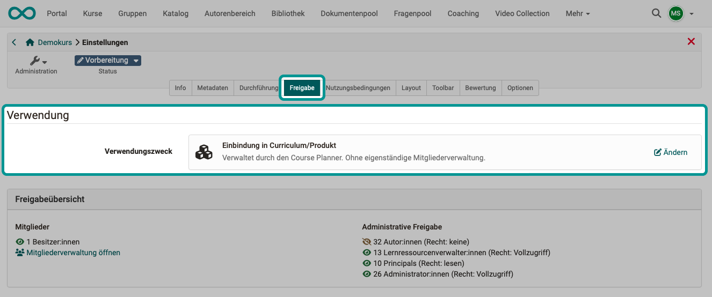{ class="shadow lightbox" } 

The method described for specifying the intended use can also be used for verification purposes. 
If a course is to be used in an implementation and it does not have the intended use "Integration into product," a warning message appears.

!!! info "Hint"

    If the Course Planner is used extensively, it is advisable to set the default usage for new courses in the system administration to "Integration into product".
    Please contact your system administrator for assistance. 
    The default setting is located in **Administration > Modules > Course Planner > Course Planner tab**. 

[To the top of the page ^](#plan_and_run_courses_with_course_planner)

---

## Step 7: Add content {: #add_content}

As mentioned at the beginning, the Course Planner serves to separate the **planning work** from the **content creation** (in the authoring area). Content can only be added to the sessions once the sessions have been planned.

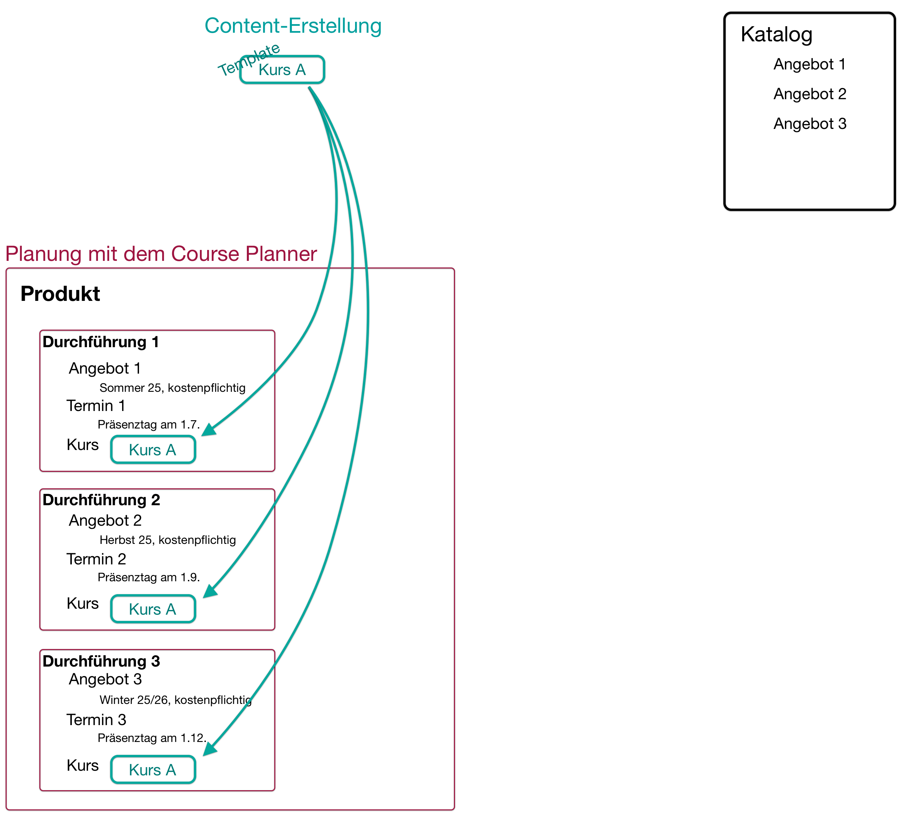{ class="shadow lightbox" } 

To add content (courses) to an instance, select the **Course Content** tab in an instance.

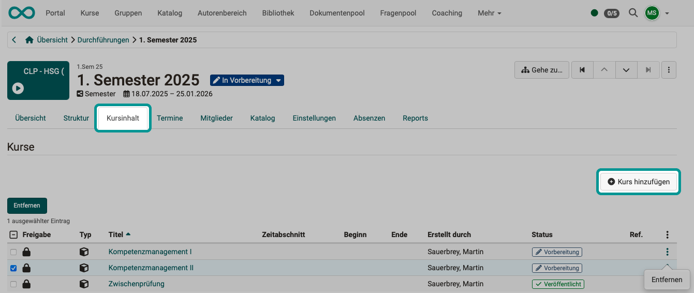{ class="shadow lightbox" } 

!!! tip "Note"

    Step 10 describes how a course can be automatically created from a template on a specific date.

[To the top of the page ^](#plan_and_run_courses_with_course_planner)

---

## Step 8: Participants {: #add_members}

Participants are added as **members** to one of the **implementations** of the product.
Why they become members of an implementation and not members of a product has already been explained in [Step 2](#define_owners).

You can therefore find member management under **Tab Executions** in the menu of the **3 dots at the end of a line** (= execution).

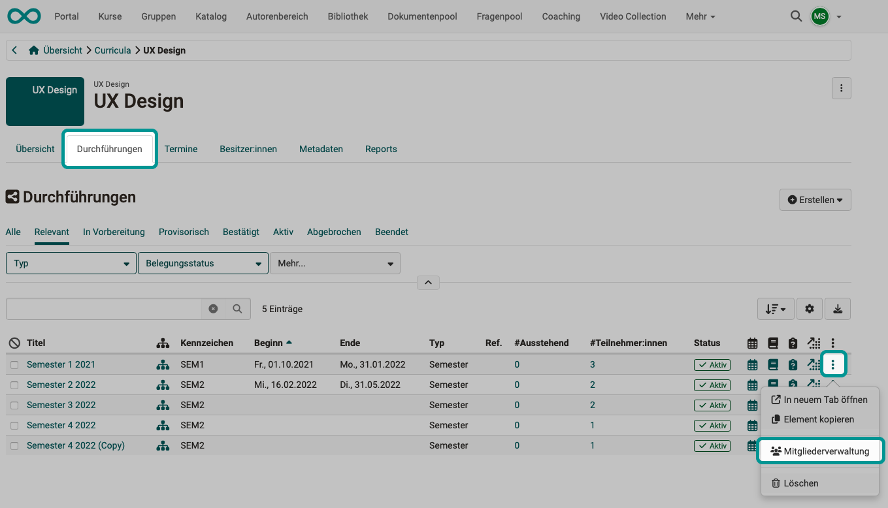{ class="shadow lightbox" } 

[To the top of the page ^](#plan_and_run_courses_with_course_planner)

---

## Step 9: Get an overview of the booking orders {: #reports}

### Creating report files

Select the "Reports" button in the Course Planner overview.

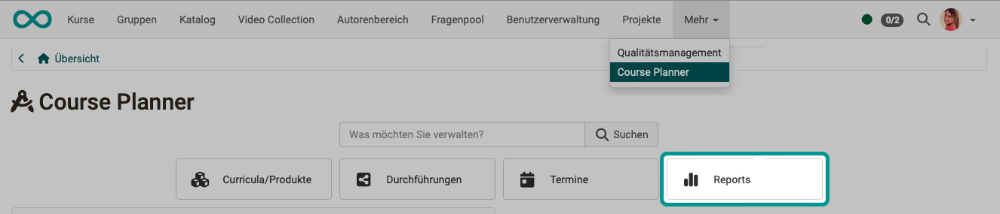{ class="shadow lightbox" }

There you can choose from various templates that you can use to create Excel files with the current data on the booking orders received. 

To create a report, click one of the arrows in the "Execute" column. 

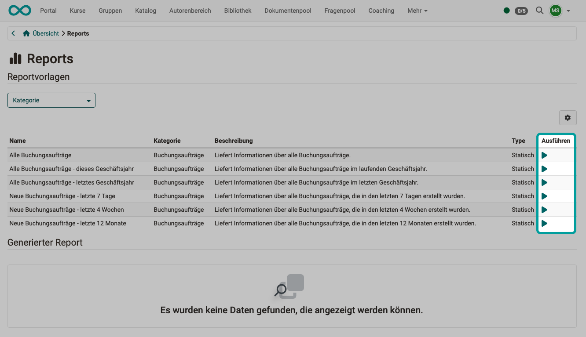{ class="shadow lightbox" }

The Excel files created in this way are listed at the bottom of the screen.
They can be copied and downloaded.

{ class="shadow lightbox" } 

### Booking orders received via the catalog

You can download an Excel file containing all booking orders received via the catalog in the following way:
**Select implementation > Tab Catalog > Tab Booking Offers**

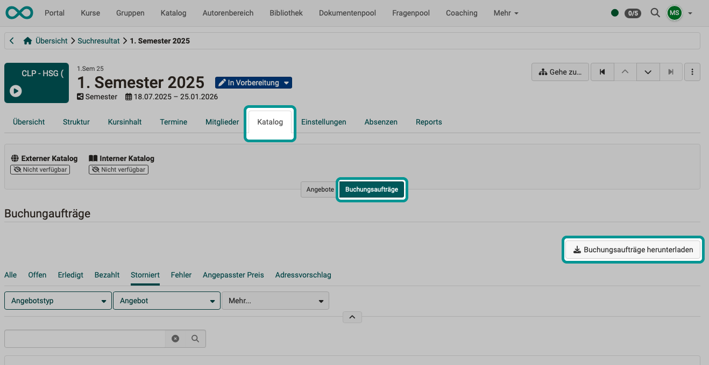{ class="shadow lightbox" } 

[To the top of the page ^](#plan_and_run_courses_with_course_planner)

---

## Step 10: Automated course creation {: #automatic_course_creation}

If the course is actually going to take place (e.g., after enough bookings have been received), only then can a corresponding OpenOlat course be created from a course template. (See step 7)

A course template must have **Template** specified as its intended use in **Administration > Settings > Share**.

You can find instructions on how to prepare automated instantiation (course creation from the template) here: 
**Select Implementation > Settings > Automation tab**

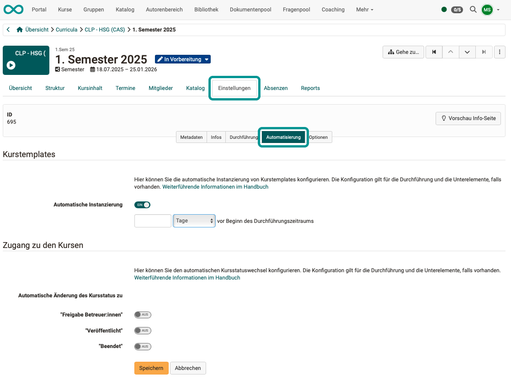{ class="shadow lightbox" } 

You can determine when automated instantiation should take place. 
This also includes the option to automatically change the course status.

[To the top of the page ^](#plan_and_run_courses_with_course_planner)

---

## Further information {: #further_information}

[How do I create my first OpenOlat course](../my_first_course/my_first_course.md) 
[Course Planner: Overview >](../../manual_user/area_modules/Course_Planner.md) 
[Course Planner: Curricula/Products >](../../manual_user/area_modules/Course_Planner_Products.md) 
[Course Planner: Implementations >](../../manual_user/area_modules/Course_Planner_Implementations.md) 
[Course Planner: Events >](../../manual_user/area_modules/Course_Planner_Events.md) 
[Course Planner: Reports >](../../manual_user/area_modules/Course_Planner_Reports.md) 
[Activate the Course Planner (administrator) >](../../manual_admin/administration/Modules_Course_Planner.md) 

[To the top of the page ^](#plan_and_run_courses_with_course_planner)

