# How do I plan and run courses with the Course Planner? {: #plan_and_run_courses_with_course_planner}

??? abstract "Purpose and content of this guide"

    This guide shows you how to use Course Planner to automatically and efficiently plan and create courses based on the offering.

??? abstract "Target group"

    [x] Authors [ ] Coaches  [ ] Participants

    [ ] Beginners [x] Advanced users  [x] Experts

??? abstract "Expected previous knowledge"

    * ["How do I create my first OpenOlat Course?"](../my_first_course/my_first_course.md) 
    * [Familiarity with basic concepts of OpenOlat >](../../manual_user/basic_concepts/index.md) 

---

## What can the Course Planner do? {: #purpose}

With the Course Planner, **planning work** can be separated from **content creation** (in the authoring area).

**Course planners** can carry out all organizational planning even before the content (courses) has been completed by **authors**:

* Planning multiple implementations of the same course at different times
* Planning of products with multiple courses (and multiple implementations of each)
* Creation of offers in the catalog
* Reports on booking orders already received
* Planning events related to the various implementations (e.g., for in-person events or exams)
* Scheduling automatic instantiation of the courses

Of course, you can also create OpenOlat courses without Course Planner. However, Course Planner provides you with a tool that brings together all the organizational tasks.

##  Where can I find the Course Planner? {: #access}

If you have the **role of Course planner**, you will find the Course Planner as a site in the **main navigation**.

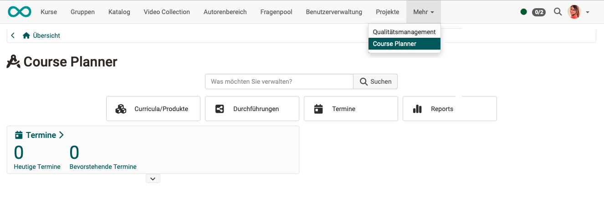{ class="shadow lightbox" title="Main navigation and start page of the Course Planner" }

!!! info "Requirement"

    In order to use the Course Planner, a system administrator must have activated it. If the site is not available in the main navigation, please contact your system administration.

[To the top of the page ^](#plan_and_run_courses_with_course_planner)

---

## Step 1: Create product  {: #create_product}

We distinguish between a [product](../../manual_user/area_modules/Course_Planner_Products.md#create_product) (e.g., a course that can be offered multiple times) and an [implementation](../../manual_user/area_modules/Course_Planner_Implementations.md).

Example: 
- A language course entitled "Spanish for Beginners" is created and planned as a product.
- Implementations will then take place as "Spanish for Beginners, Spring 2025," "Spanish for Beginners, Fall 2025," etc.

Open the Course Planner and select the "Products" button. There you can select an existing product from the list or create a new one. This product will then be offered multiple times in different implementations.

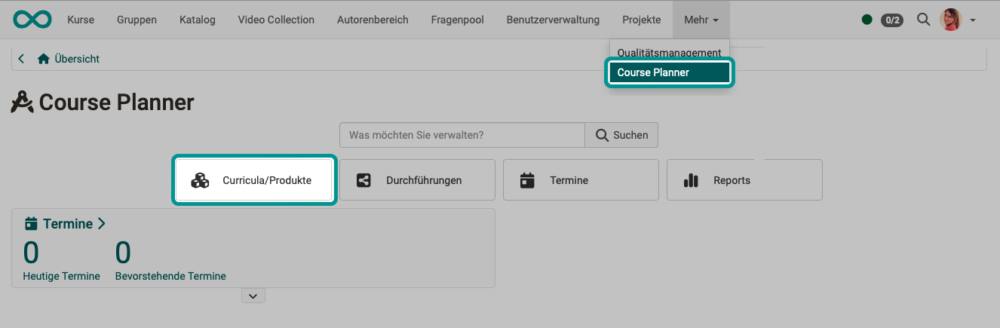{ class="shadow lightbox" title="Start page of the Course Planner" }

You can find out more about this in the user manual under: 
[Products >](../../manual_user/area_modules/Course_Planner_Products.md#create_product)

!!! note "Note"

    In the following instructions, we will initially limit ourselves to a single course. It is also possible to integrate several courses into a single implementation.

[To the top of the page ^](#plan_and_run_courses_with_course_planner)

---

## Step 2: Determine product owners {: #define_product_owners}

In the newly created product, you will find various tabs where you can now configure the product. First, select the **"Owners" tab**. There you add product owners with the "Add member" button.

As the creator of the product, you already have editing rights. If you do not want to do the planning and administration of the product yourself and alone, you should designate a responsible person as the product owner here.

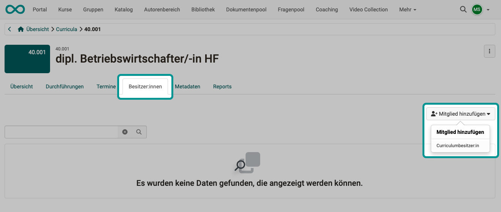{ class="shadow lightbox" title="Owners tab of a product" }

**Why can I only enter owners here? Why not participants as well?**

The idea is that a product consisting of several courses is not only attended once by a group of participants. Rather, there should be **several implementations** of a product with the same or very similar content, but with different participants and coaches.

Owners have the right to edit the product (the "original version," the "copy template"). It does not make sense to also make participants members of the "copy template". They would then be participants in all implementations of a product.

!!! info "Important"

    In Course Planner, you have full access to all products in the role of **Course planner**. 
    **Owners** of a product, on the other hand, only have access to their respective product.

[To the top of the page ^](#plan_and_run_courses_with_course_planner)

---

## Step 3: Planning/creating an implementation {: #implementations}

Now select the **"Implementations" tab** and create a new implementation.

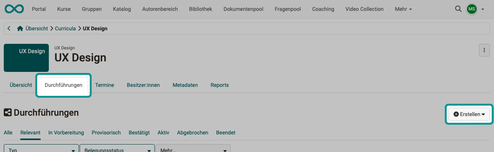{ class="shadow lightbox" title="Implementations tab of a product" }

Under the "Create" button, you will find a selection of [element types](../../manual_admin/administration/Modules_Course_Planner.md#tab_element_types) that have been defined in the system administration.

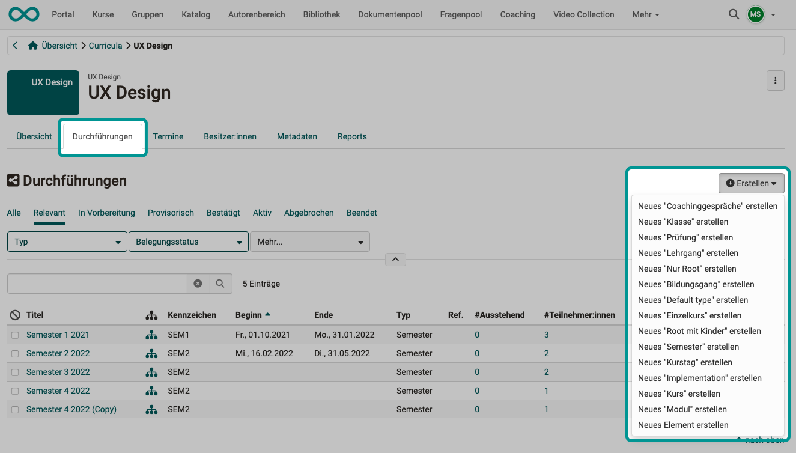{ class="shadow lightbox" title="Implementations tab of a product" }

All planned implementations of this product can then be found in the list under this tab. You can select any implementation and customize it according to your requirements.

Instead of creating new implementations using the button above the list, you can also create a copy of an implementation that has already been planned and modified. The action "Copy element" can be found in the menu of the three dots at the end of a line.

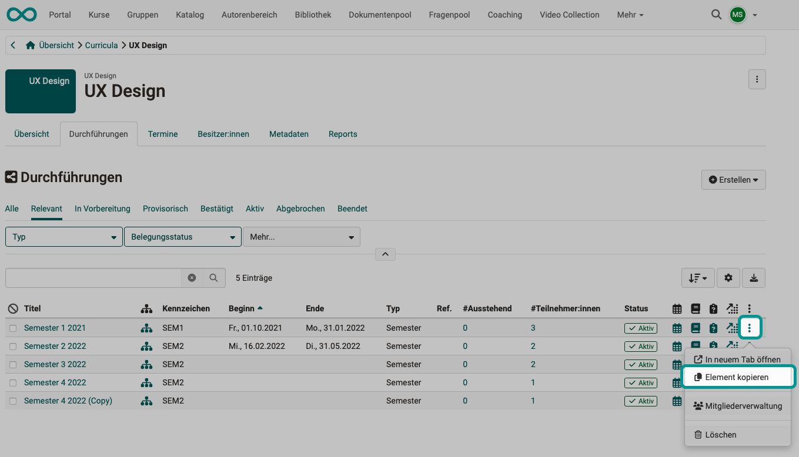{ class="shadow lightbox" title="List of implementations of a product" }

[To the top of the page ^](#plan_and_run_courses_with_course_planner)

---

## Step 4: Events {: #events}

When planning events, a distinction must be made between:

### Step 4a: Implementation period
Once a new implementation has been created and set up (the process/program for the implementation has been defined), the implementation still needs to be scheduled.

You define the execution period, that is when an implementation takes place, when configuring the implementation: 
`Course Planner > Implementations > "Title of the implementation" > Tab "Settings" > Sub-tab "Execution"`

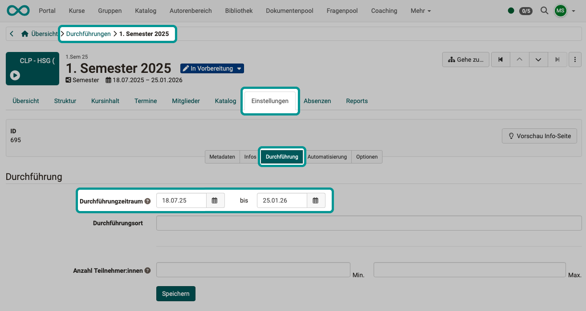{ class="shadow lightbox" title="Settings tab of an implementation" }

[To the top of the page ^](#plan_and_run_courses_with_course_planner)

---

### Step 4b: Events within an implementation

Once a new implementation has been created and set up, and its execution period has been defined, events that take place within an implementation can now be planned and created: 
`Course Planner > Implementations > "Title of the implementation" > Tab "Events"`

Use the "Add event" button to the right above the table to add further events.

{ class="shadow lightbox" title="Events tab of an implementation" }

!!! info "Technical background"

    As long as no courses have been added yet, the events are linked to an implementation. As soon as a course has been added to the implementation (step 7, step 10), the events are assigned to the courses.

[To the top of the page ^](#plan_and_run_courses_with_course_planner)

---

### Step 4c: Overview of events from all implementations

If several implementations have been created and set up, there will be events for each implementation. To get an overview, select the "Events" tab in the **product**. There you can also edit the individual events and create new ones with the "Add event" button.

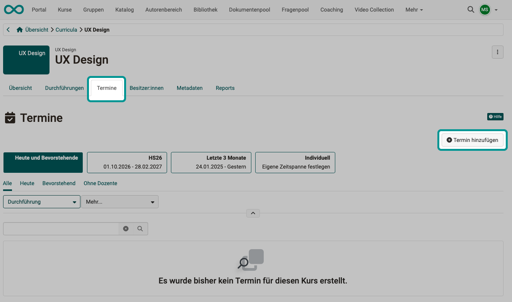{ class="shadow lightbox" title="Events tab of a product" }

The event can refer to the entire implementation of a product or only to part of the implementation of the product. In the first step of the dialog, select the desired element from the structure tree displayed.

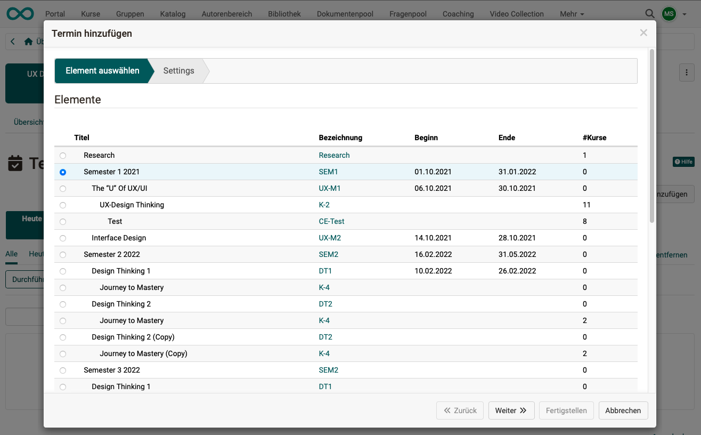{ class="shadow lightbox" title="Add event dialog" }

Once the element of the implementation to be scheduled has been selected, configure the event, i.e., make the appropriate settings.

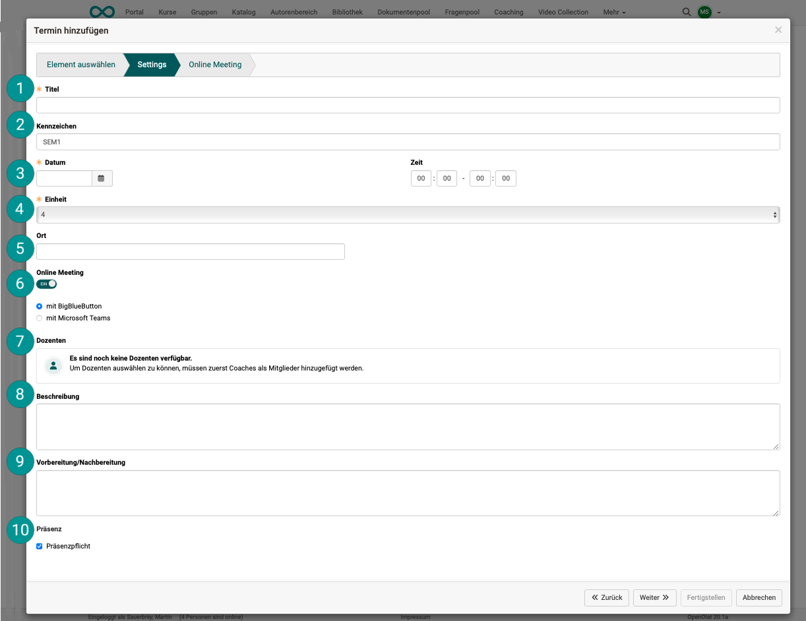{ class="shadow lightbox" title="Add event dialog" }

#### Title {: #event_title}

This title is used to display the event in various locations.

#### Reference {: #event_reference}

The additional identifier serves to uniquely identify an event in case there are events with the same title.

#### Date {: #event_date}

Date and time (start and end).

#### Unit {: #event_unit}

If, for example, a morning session from 8:00 a.m. to 12:00 p.m. has been scheduled, it can be divided into four units of 50 minutes each (with breaks in between).

#### Location {: #event_location}

Where the event takes place, if physical attendance is planned.

#### Online meeting {: #event_online_meeting}

The Course Planner allows you to manage and maintain events for online meetings directly in the planning phase, on the product or on the implementation, even without any course content having been stored yet. Online meetings can be set up with BigBlueButton and Teams. (This depends on what is set up in OpenOlat for you.) 
The stored events are later applied to the course when linking the implementation to a course and are then also available in the course.

#### Teacher {: #event_teachers}

In order to select teachers, coaches must first be added as members.

#### Description {: #event_description}

The text entered here is intended to supplement the title with a more detailed description.

#### Preparation/Follow up {: #event_preparation}

The text entered here can be used to describe tasks for preparing for and following up on the event.

#### Compulsory {: #event_compulsory}

If attendance is determined to be mandatory, the absence management can be used later to manage whether a person was present or absent with or without excuse.

You can find more information about the events in the user manual: 
[Course Planner: Events >](../../manual_user/area_modules/Course_Planner_Events.md)

[To the top of the page ^](#plan_and_run_courses_with_course_planner)

---

## Step 5: Offer of the implementation  {: #offer}

You can offer a course in the catalog as early as the planning phase and, for example, allow interested parties to book it themselves.

1. In the Course Planner, select the implementation you would like to offer in the catalog.
2. Select the "Catalog" tab.
3. Select the "Offers" section.
4. Create a new [offer](../../manual_user/area_modules/catalog2.0_angebote.md) with the "Add offer" button.

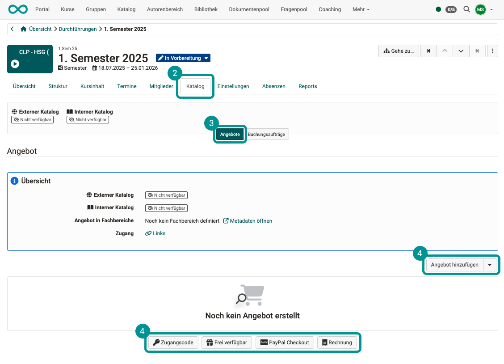{ class="shadow lightbox" title="Catalog tab of an implementation" }

[To the top of the page ^](#plan_and_run_courses_with_course_planner)

---

## Step 6: Specify the usage in the courses {: #embedding}

The usage of a course defines whether the course keeps members of its own or whether the Course Planner manages them. You can find it in every course under: 
`Course > Administration > Settings > Tab "Share" > Section "Usage"` 
The "Change" button opens the "Change usage" dialog. A course knows three usages:

- **Standalone**: The course manages its members itself. It does not appear in the "Add course" dialog of an implementation.
- **Use in Course Planner**: for courses that you add directly to an implementation. The members come from the implementation; in the course itself you only manage the owners.
- **Template**: for course templates from which the Course Planner instantiates a course of its own for every implementation (see step 10). A template has no participants.

The dialog offers the fourth usage "Embedding" only for learning resources other than courses.

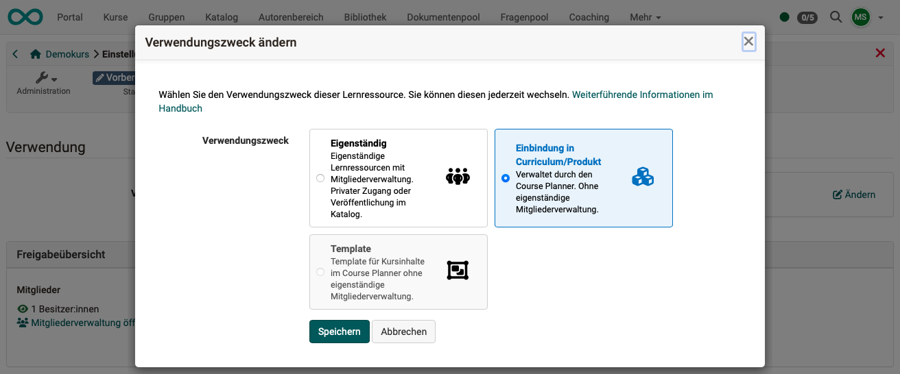{ class="shadow lightbox" title="Change usage dialog" }

!!! info "What does the usage «Use in Course Planner» do?"

    With the usage "Use in Course Planner", participants are managed by the Course Planner and no longer in the course's member management. If members were added directly in the course, this would result in duplication (member directly in the course **and** member in the product). For this reason, with this usage the member management in the course itself is restricted to the course owners who can edit the course.

**Substep 1, Variant A** 
In the Course Planner, all courses used in an implementation can be viewed and added in the **"Content" tab** of an implementation. (See step 7)

You can select a course directly there and make the settings described above for the usage.

**Substep 1, Variant B** 
Go to the **authoring area** and select the courses that you want to include in your product one by one.

**Substep 2** 
In the course, under `Course > Administration > Settings > Tab "Share"`, select **Use in Course Planner** as the usage.

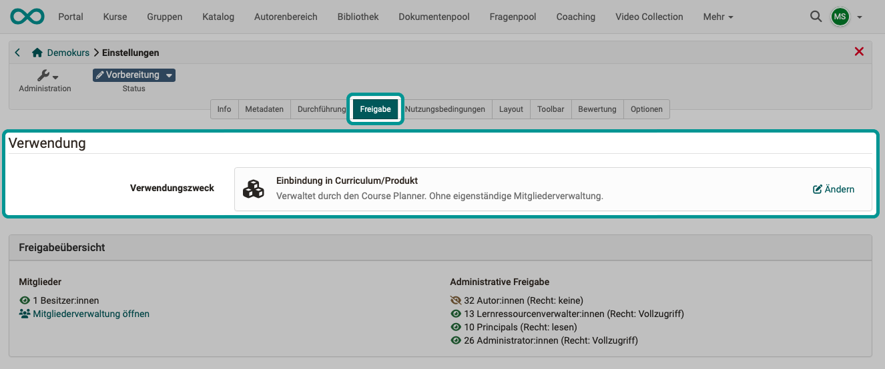{ class="shadow lightbox" title="Share tab of the course settings" }

The method described for specifying the usage also serves for verification. If a course with the usage "Standalone" is already part of an implementation, its "Share" tab shows a warning message: this usage is not recommended for courses in the Course Planner.

The "Add course" dialog of the implementation, however, shows no message. A course without the usage "Use in Course Planner" does not appear there at all. If a course is missing from the list, check its usage first (see [step 7](#add_course_dialog)).

You can find more about the Usage section in the user manual under: 
[Course settings - Tab Share >](../../manual_user/learningresources/Course_Settings_Share.md#section_usage)

!!! tip "Tip"

    If the Course Planner is used extensively, it is advisable to set the usage for new courses in the system administration to "Use in Course Planner". 
    Please contact your system administration for assistance. 
    The default setting "Usage for new courses" can be found under: `Administration > Modules > Course Planner > Tab "Settings"`

### If the usage cannot be changed {: #embedding_locked}

If you want to use a course in the Course Planner that has already been in use, the option "Use in Course Planner" in the "Change usage" dialog is often not selectable. The dialog shows the reason above the selection. Three reasons block the change from "Standalone" to "Use in Course Planner":

- The course has members other than the owners, that is coaches or participants.
- A group of the course is also embedded in another course.
- The "Access for participants" in the "Share" tab is not set to "Private".

If the course has members, copy it with `Course > Administration > Copy` and change the usage of the copy. The copy is created without coaches, participants and group members.

You can find more about copying in the user manual under: 
[Copy (a course) >](../../manual_user/learningresources/Course_Copy.md)

[To the top of the page ^](#plan_and_run_courses_with_course_planner)

---

## Step 7: Add content {: #add_content}

As mentioned at the beginning, the Course Planner serves to separate the **planning work** from the **content creation** (in the authoring area). Content can also be added to the implementations only once the implementations have already been planned.

{ class="shadow lightbox" title="Planning with the Course Planner" }

To add content (courses) to an implementation, select the **"Content" tab** in an implementation and click the "Add course" button.

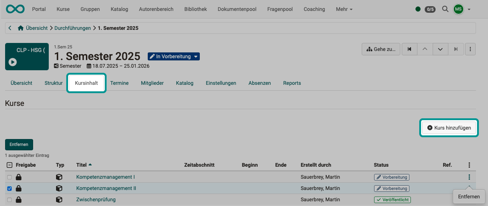{ class="shadow lightbox" title="Content tab of an implementation" }

!!! note "Note"

    Step 10 describes how a course can be automatically created from a course template on a specific date.

### Which courses the "Add course" dialog shows {: #add_course_dialog}

If you are looking for a course in the "Add course" dialog that is not in the list, OpenOlat gives no reason. Three conditions decide which courses the dialog offers:

1. **Usage:** The dialog only shows courses with the usage "Use in Course Planner" (see [step 6](#embedding)). Courses with the usage "Standalone" or "Template" never appear here. You add a template with the "Add course template" button (see step 10).
2. **Organisation:** In addition to your own courses, the dialog shows courses whose administrative access contains the organisation of the product or one of its sub-organisations. Added to these are courses that you manage through a role in the course's organisation, for example as learning resource manager. The access only works downwards: if a course is only shared with a parent organisation of the product, it does not appear. In that case, add the organisation of the product in the course under `Course > Administration > Settings > Tab "Share" > Administrative access`. The field accepts several organisations.
3. **Tab:** The dialog opens on the "My courses" tab, and this tab only shows courses you own. You find courses of other owners in the "Search form" tab. This tab opens without results: enter a search term, or click "Search" directly. The "Favourites" tab shows the courses you have marked as favourites.

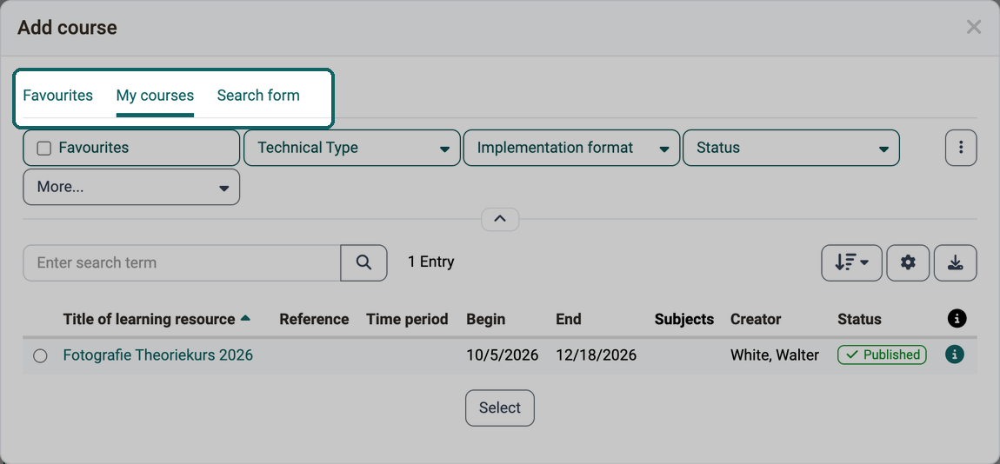{ class="shadow lightbox" title="Add course dialog of an implementation · 2026.10.09" }

!!! tip "Course not in the list?"

    - Is the usage of the course set to "Use in Course Planner"?
    - Are you an owner of the course, or does its administrative access contain the organisation of the product or one of its sub-organisations?
    - Have you switched to the "Search form" tab for courses of other owners?

[To the top of the page ^](#plan_and_run_courses_with_course_planner)

---

## Step 8: Participants {: #add_members}

Participants are added as **members** to one of the **implementations** of the product.
Why they become members of an implementation and not members of a product has already been explained in
[Step 2](#define_product_owners).

You can therefore find the member management in the **"Implementations" tab** of the product in the menu of the **three dots at the end of a line** (= implementation), entry "Members management". In the opened implementation, the "Members" tab leads there as well.

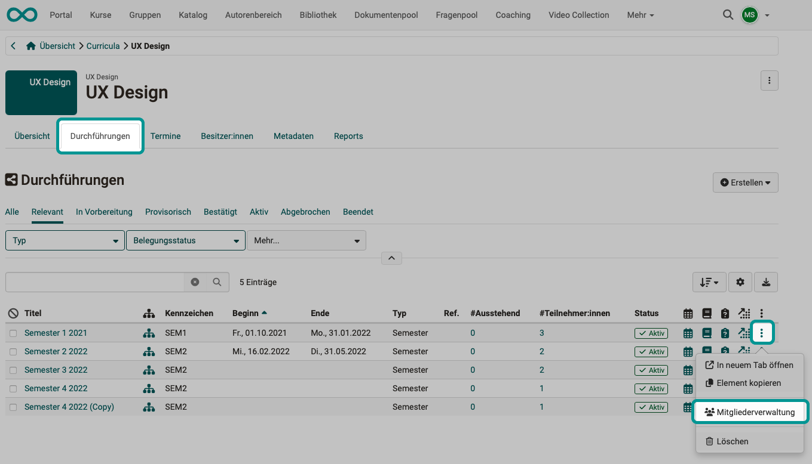{ class="shadow lightbox" title="List of implementations of a product" }

[To the top of the page ^](#plan_and_run_courses_with_course_planner)

---

## Step 9: Get an overview of the booking orders {: #reports}

### Creating report files

Select the "Reports" button in the Course Planner overview.

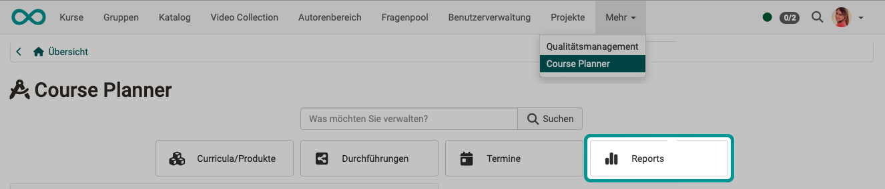{ class="shadow lightbox" title="Start page of the Course Planner" }

There you can choose from various templates that you can use to create Excel files with the current data on the booking orders received.

To create a report, click one of the arrows in the "Run" column.

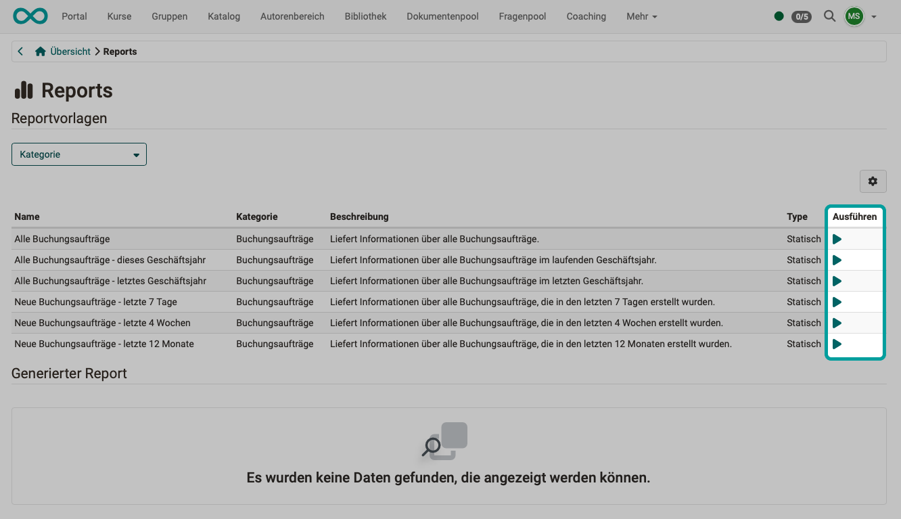{ class="shadow lightbox" title="Reports page in the Course Planner" }

The Excel files created in this way are listed at the bottom of the screen.
They can be copied, deleted and downloaded.

{ class="shadow lightbox" title="Reports page in the Course Planner" }

### Booking orders received via the catalog

You download an Excel file containing all booking orders received via the catalog with the "Export booking orders" button: 
`Course Planner > Implementations > "Title of the implementation" > Tab "Catalog" > Booking orders`

{ class="shadow lightbox" title="Catalog tab of an implementation" }

[To the top of the page ^](#plan_and_run_courses_with_course_planner)

---

## Step 10: Automated course creation {: #automatic_course_creation}

If the course is actually going to take place (e.g., after enough booking orders have been received), only then can a corresponding OpenOlat course be created from a course template. (See step 7)

A course template is a course with the usage **Template**: 
`Course > Administration > Settings > Tab "Share" > Section "Usage"` 
In the "Content" tab of the implementation, you add it with the "Add course template" button.

You can find the preparation of the automated instantiation (course creation from the course template) here: 
`Course Planner > Implementations > "Title of the implementation" > Tab "Settings" > Sub-tab "Automation"`

{ class="shadow lightbox" title="Settings tab of an implementation" }

You can determine when automated instantiation should take place. 
This also includes the option to automatically change the course status.

You can find more about the automation in the user manual under: 
[Course Planner: Implementations >](../../manual_user/area_modules/Course_Planner_Implementations.md#tab_settings_automation)

[To the top of the page ^](#plan_and_run_courses_with_course_planner)

---

## Further information {: #further_information}

**Mentioned on this page** 
[How do I create my first OpenOlat course? >](../my_first_course/my_first_course.md) 
[Basic concepts >](../../manual_user/basic_concepts/index.md) 
[Course Planner: Products >](../../manual_user/area_modules/Course_Planner_Products.md) 
[Course Planner: Implementations >](../../manual_user/area_modules/Course_Planner_Implementations.md) 
[Module Course Planner >](../../manual_admin/administration/Modules_Course_Planner.md) 
[Course Planner: Events >](../../manual_user/area_modules/Course_Planner_Events.md) 
[Catalog 2.0 - Offers >](../../manual_user/area_modules/catalog2.0_angebote.md) 
[Course settings - Tab Share >](../../manual_user/learningresources/Course_Settings_Share.md) 
[Copy (a course) >](../../manual_user/learningresources/Course_Copy.md)

**Further reading** 
[Course Planner: Overview >](../../manual_user/area_modules/Course_Planner.md) 
[Course Planner: Reports >](../../manual_user/area_modules/Course_Planner_Reports.md)

[To the top of the page ^](#plan_and_run_courses_with_course_planner)

