# Wie erstelle ich eine Formular-Lernressource? {: #create_form}

## 1. Was ist in OpenOlat ein Formular? {: #step1}

Ein OpenOlat-Formular ist eine Seite, die von Benutzer:innen interaktiv ausgefüllt werden kann. Typischerweise sind Fragen zu beantworten, indem etwas angekreuzt wird oder eine Antwort als Text eingegeben wird.

Die Angaben können anonym oder personenbezogen gespeichert werden.

Berechtigte Personen haben Zugriff auf die gemachten Angaben und können Auswertungen abrufen.

Formular-Lernressourcen erstellen Personen mit der Rolle Autor:in im Autorenbereich.

---

## 2. Kursbaustein und Lernressource {: #step2}

Ein OpenOlat-Kurs ist aus Kursbausteinen zusammengesetzt. Die meisten Kursbausteine sind Behälter, in die eine Lernressource eingefügt wird.

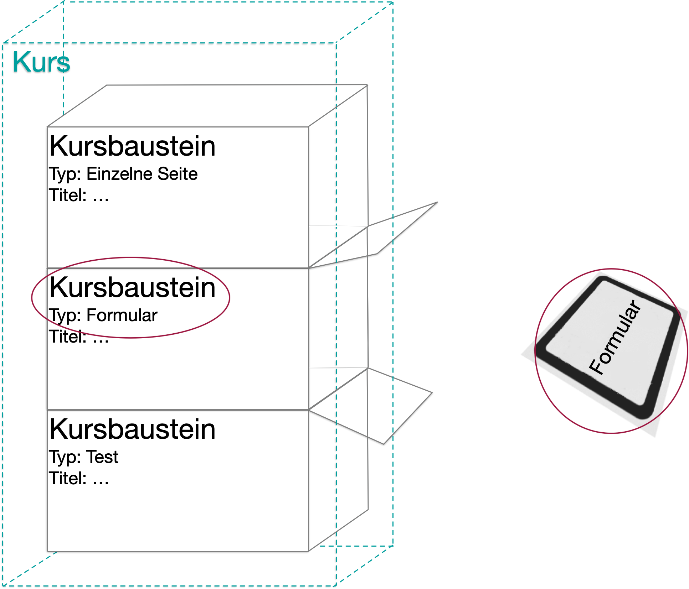{ width=300px class="lightbox" title="Kursbaustein und Lernressource" }

**Achtung!** 
Es gibt eine Formular-**Lernressource** und einen Formular-**Kursbaustein**. Diese beiden sind auseinander zu halten. Eine Formular-Lernressource kann in OpenOlat an unterschiedlichen Stellen verwendet werden (siehe nächster Abschnitt).

In dieser Anleitung wird die Erstellung der Formular-**Lernressource** beschrieben.
Für die Verwendung der Lernressource in verschiedenen Kursbausteinen gibt es weitere Anleitungen.

!!! note "Hinweis"

    In früheren OpenOlat-Versionen wurden Formular-Lernressourcen als **Fragebogen** bezeichnet. Sie basierten auf dem Standard QTI 1.2, der inzwischen nicht mehr unterstützt wird.

[Zum Seitenanfang ^](#create_form)

---

## 3. Wo werden Formular-Lernressourcen verwendet?  {: #step3}

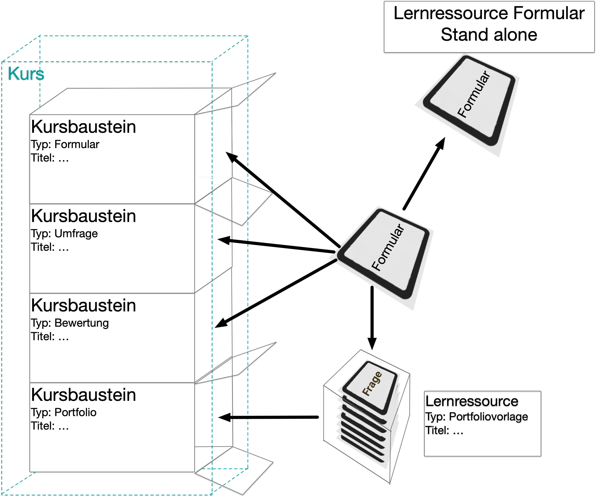{ width=400px class="lightbox" title="Verwendungsorte einer Formular-Lernressource" }

a) Formular-Lernressource im **Kursbaustein Formular**

b) Formular-Lernressource im **Kursbaustein Umfrage**

c) Formular-Lernressource im **Kursbaustein Bewertung**

d) Formular-Lernressource **im Portfolio**

e) Formular-Lernressource **Stand-alone**

[Zum Seitenanfang ^](#create_form)

---

## 4. Was kann ein Formular?  {: #step4}

<h3> a) Wie sieht ein Formular aus?</h3>

In Formularen stehen verschiedene Fragetypen zur Verfügung: 

* Rubrik 
* Einzelauswahl
* Mehrfachauswahl
* Texteingabe
* Datei hochladen 

Je nach Zielsetzung können damit Formulare ganz unterschiedlich gestaltet werden. Hier ein Beispiel in der Teilnehmeransicht:

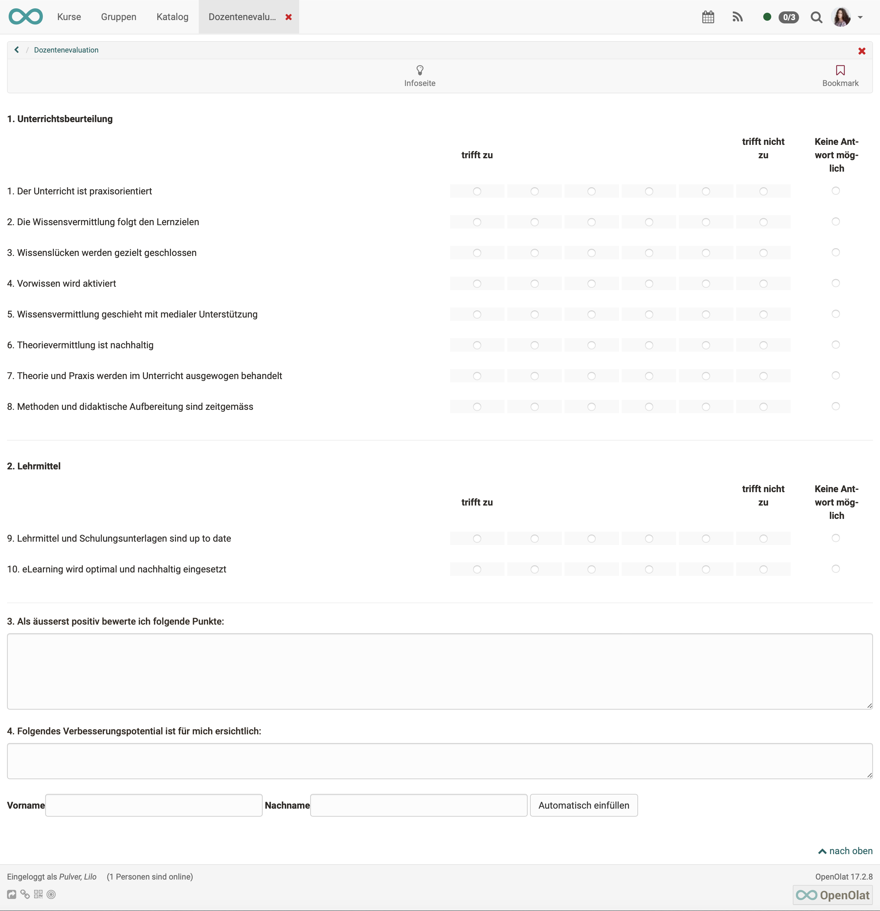{ class="shadow lightbox" title="Formular in der Teilnehmeransicht" }

 

<h3> b) Woraus besteht ein Formular?</h3>	

Jedes Formular besteht aus einer Seite mit einer oder mehreren Fragen bzw. anderen Elementen (z.B. Titel). Die einzelnen Elemente können im Editor angewählt und dann bearbeitet werden. Teilweise wird ein Popup (Inspektor-Fenster) mit Einstellmöglichkeiten dazu angezeigt.

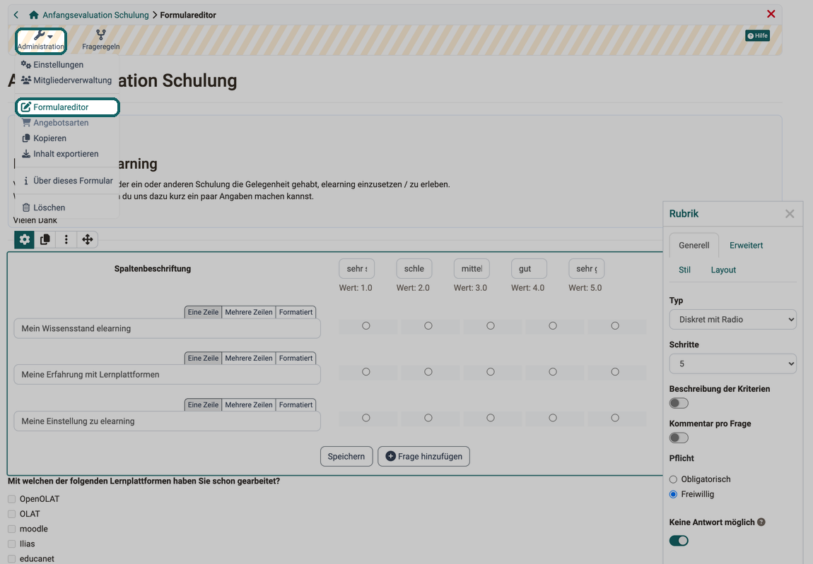{ class="shadow lightbox" title="Rubrik-Element im Formulareditor · 2026.09.28" }

 

<h3> c) Wie funktioniert ein Formular? </h3>

Wenn Teilnehmende eine Antwort in das Formular eingegeben haben, werden die Eingaben pro Teilnehmer:in gespeichert. 
Ausnahme: Es wurde eine anonyme Umfrage erstellt.

Die Antworten können von berechtigten Personen eingesehen werden. 
Wer berechtigt ist, kann konfiguriert werden, siehe [8. Formulare konfigurieren](#step8).

Klicken Betreuer:innen im Kurs auf genau den gleichen Kursbaustein mit Formular, dann sehen sie zunächst nicht das Formular (wie die Teilnehmenden), sondern einen automatisch erstellten Report. Für die Details kann auf die einzelnen Formulare zugegriffen werden. 

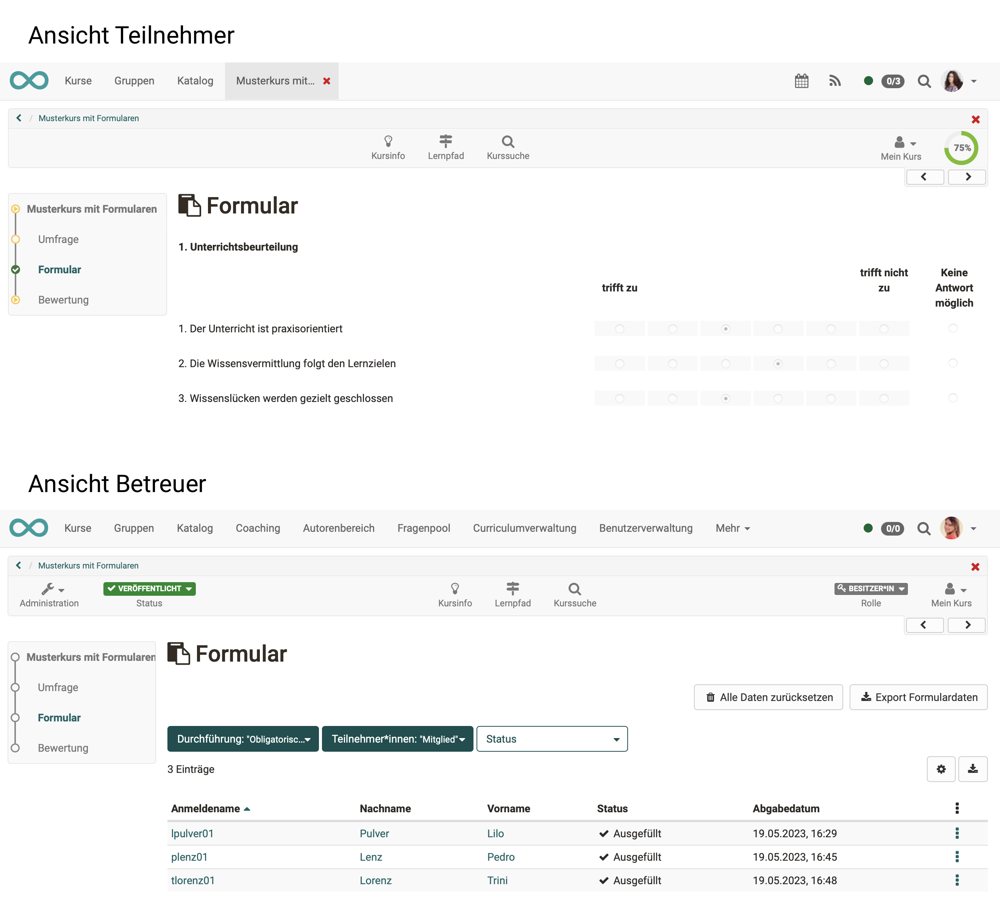{ class="shadow lightbox" title="Kursbaustein Formular aus Sicht der Teilnehmenden und der Betreuenden" }

!!! info "Frageregeln"

    Eine **Verzweigung** ist über **Frageregeln** ebenfalls möglich: "Wenn Frage xy so beantwortet, dann ..."

    Sie finden das Icon zur Erstellung der Regeln in der Kopfzeile des Formulareditors.

    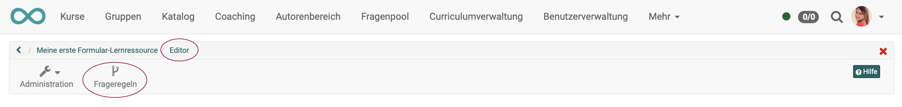{ class="shadow lightbox" title="Kopfzeile des Formulareditors" }

[Zum Seitenanfang ^](#create_form)

---

## 5. Formulare erstellen/editieren  {: #step5}

Für das Erstellen von Formular-Lernressourcen steht ein **spezieller Editor** zur Verfügung. Er kann von verschiedenen Stellen aus aufgerufen werden:

<h3>a) Autorenbereich > neues Formular erstellen</h3>

Sie können eine Formular-Lernressource direkt im Autorenbereich erstellen. Anschliessend können Sie beim Editieren eines Kurses auf diese vorbereitete Formular-Lernressource zugreifen und sie in einen Kursbaustein einbinden.

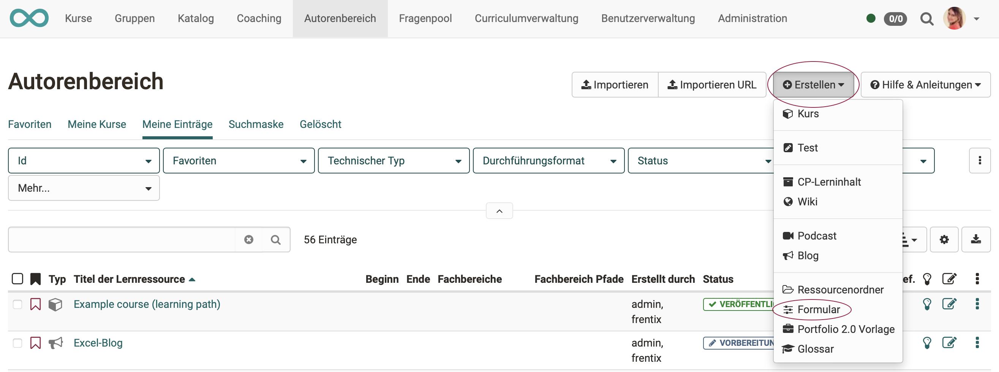{ class="shadow lightbox" title="Autorenbereich" } 

 

<h3>b) Autorenbereich > Tab "Meine Einträge" > vorhandenes Formular wählen > Formulareditor</h3>

Besteht die Formular-Lernressource schon, ist aber noch leer? Da wir dann eine Formular-**Lernressource** editieren, ist sie im Autorenbereich unter dem Tab "Meine Einträge" zu finden. (Unter "Meine Kurse" werden nur Kurse aufgeführt.) Nutzen Sie zur Suche in grossen Datenbeständen die Filter.

Zum Editieren klicken Sie auf den Titel und öffnen dann `Administration > Formulareditor`. Alternativ wählen Sie im Menü mit den 3 Punkten am Ende der Zeile den Eintrag "Formulareditor".

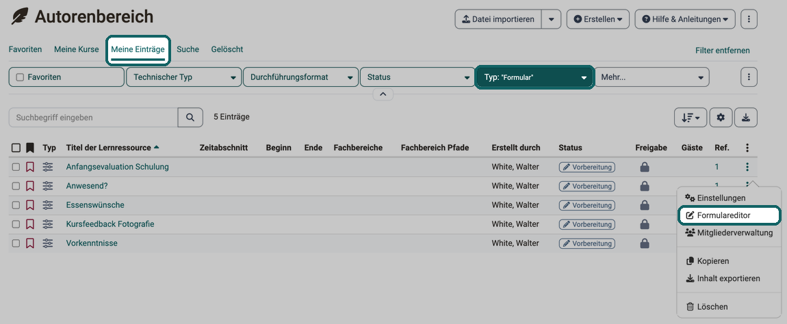{ class="shadow lightbox" title="Tab Meine Einträge im Autorenbereich · 2026.09.28" } 

 

<h3>c) Kurseditor > Kursbaustein > Tab für Lerninhalt (z.B. Tab "Umfrage") > Button "Wählen, erstellen oder importieren" </h3>

Wenn Sie im Kurseditor einen Kursbaustein eingefügt haben (z.B. den Kursbaustein "Umfrage"), dann muss dort unter dem Tab "Umfrage" eine Lernressource eingefügt werden. Ist keine Formular-Lernressource vorbereitet, kann auch direkt hier eine neue Formular-Lernressource erstellt werden.

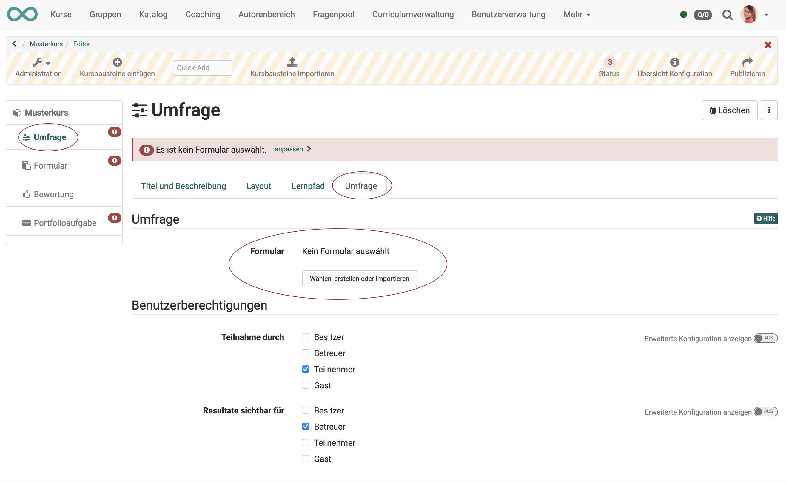{ class="shadow lightbox" title="Kursbaustein Umfrage ohne Formular" } 

 

<h3>d) Kurseditor > Kursbaustein > Tab für Lerninhalt > Button "Bearbeiten"</h3>

Falls bereits eine Formular-Lernressource in den Kursbaustein eingebunden ist, kann auch vom Kurseditor aus der Editor für die Formular-Bearbeitung geöffnet werden. 

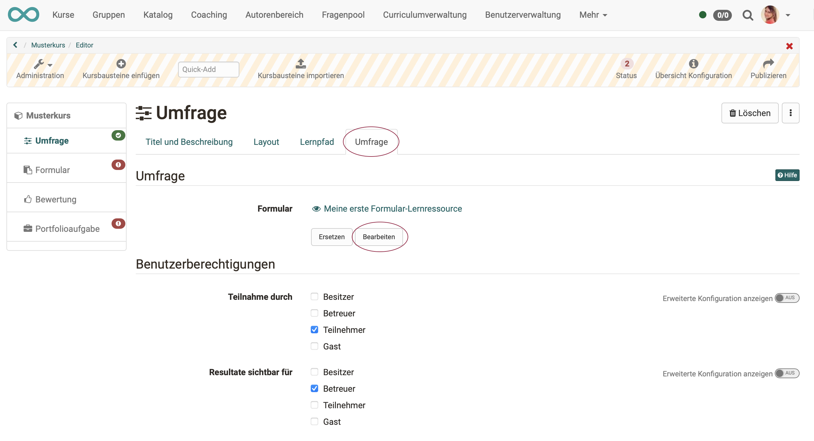{ class="shadow lightbox" title="Kursbaustein Umfrage mit Formular" } 

!!! tip "Tipp"

    Da die Lernressource Formular sehr unterschiedlich verwendet werden kann, ist es sinnvoll schon bei der Vergabe des Titels die spätere Verwendung zur berücksichtigen, z.B. ein passendes Kürzel voranzustellen. Das erleichtert später das Auffinden und Zuordnen.

!!! tip "Tipp"

    Wenn Sie eine ganz neue Formular-Lernressource erstellen, werden Sie nach der Aufforderung zur Titeleingabe zum Screen mit Einstellungen geführt.
    Hier können Sie optional gleich Einstellungen vornehmen, z.B. eine Lizenz hinterlegen. Sie können aber auch später jederzeit wieder darauf zugreifen. Mehr dazu unter [8. Formulare konfigurieren](#step8).

!!! info "Wichtig"

    Wurde ein Formular bereits benutzt (von Teilnehmenden ausgefüllt), bestehen Einschränkungen bei der Bearbeitung. (Siehe unten: [9. Formulare ändern](#step9))

[Zum Seitenanfang ^](#create_form)

---

## 6. Formulare im Editor gestalten  {: #step6}

Sobald Sie über `Administration > Formulareditor` den Formulareditor geöffnet haben, sehen Sie das vorgegebene **Layout** mit einer Spalte. Über den Button "Neues Layout einfügen" fügen Sie weitere Layouts ein.  
Ein Layout meint hier ein **Raster**. Sie können mehrere solcher Layouts hintereinander einfügen.

{ class="shadow lightbox" title="Neue Formular-Lernressource im Formulareditor · 2026.09.28" } 
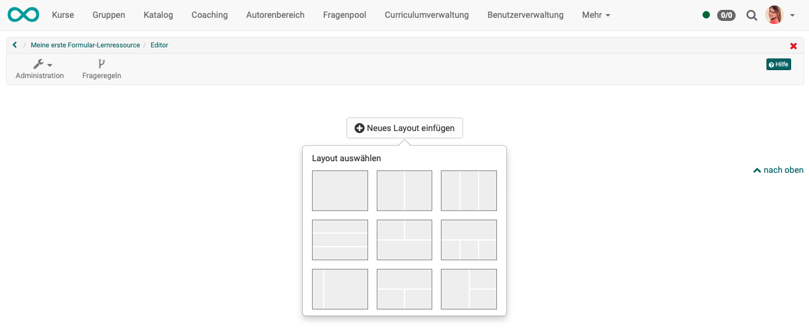{ class="shadow lightbox" title="Layoutauswahl im Formulareditor" } 

 

In die Felder des Layouts können nun die Inhalte eingefügt werden (Titel, Single Choice-Fragen, usw.).

Wenn Sie das Layout nachträglich ändern wollen, können Sie das Auswahlwerkzeug jederzeit wieder mit Klick auf das kleine Zahnrad öffnen.

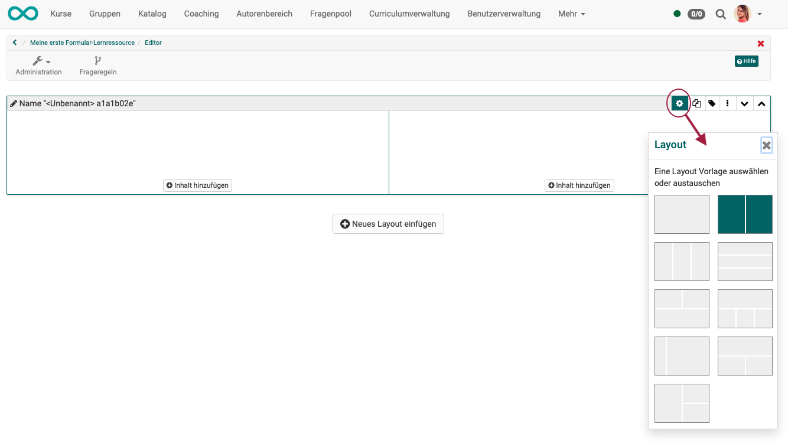{ class="shadow lightbox" title="Fenster Layout im Formulareditor" } 

 

Im nachstehenden Beispiel wurde das Layout z.B. von zweispaltig auf einspaltig geändert.

Fügen Sie nun Titel, Paragraphen (Abschnitte) und die verschiedenen Fragen hinzu. Starten Sie am besten mit einem Titel und fügen Sie mit dem Element "Paragraph" einen kurzen Einstiegstext hinzu um die Teilnehmenden entsprechend zu informieren.

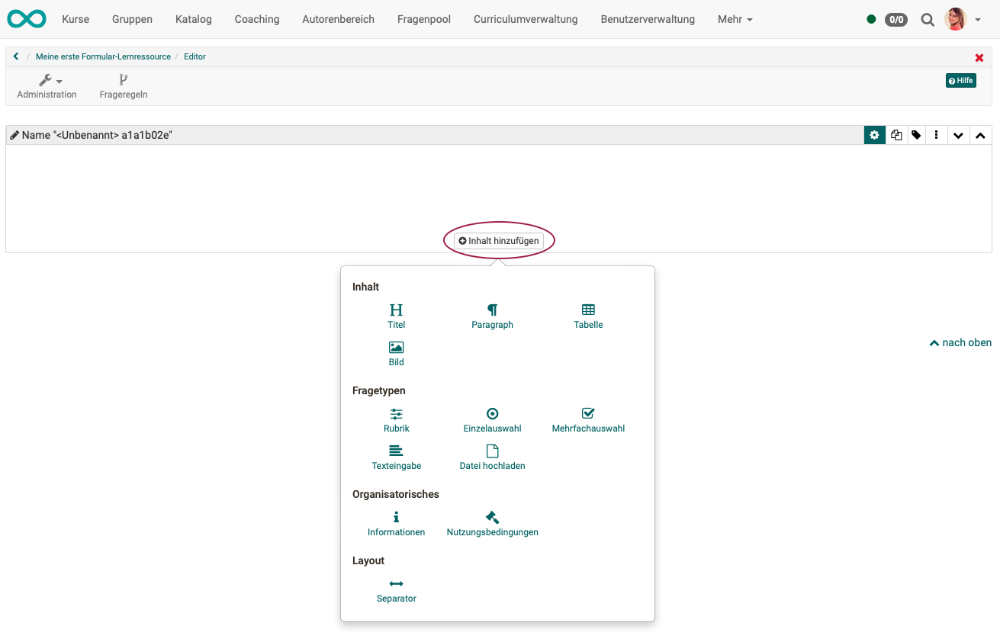{ class="shadow lightbox" title="Auswahl Inhalt hinzufügen im Formulareditor" } 

 

Klicken Sie jeweils auf "Inhalt hinzufügen" und verwenden Sie dann die angebotenen Optionen. 
Zum Beispiel für ein "Titel"-Element.

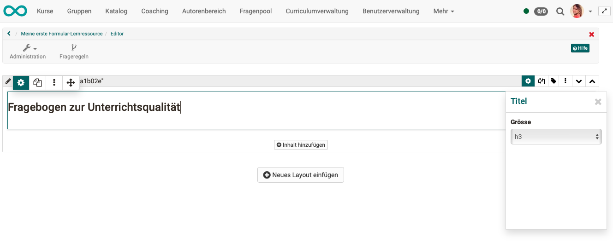{ class="shadow lightbox" title="Titel-Element im Formulareditor" } 

Bei einem "Rubrik"-Element sind die Optionen wesentlich vielfältiger. Es gilt aber immer das gleiche Vorgehensprinzip:

* Wählen Sie ein Element.
* Die angezeigten Optionen gelten für das aktuell selektierte Element.

Erkunden Sie die vielen Optionen!

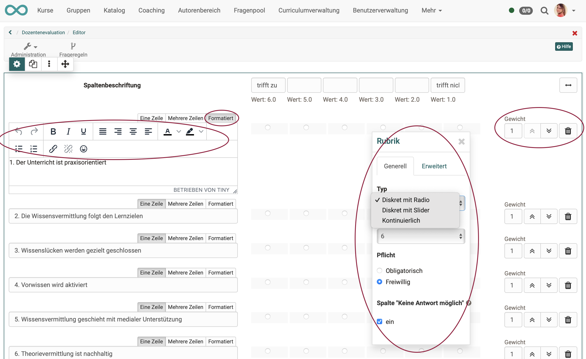{ class="shadow lightbox" title="Optionen eines Rubrik-Elements" } 

 

<h3>Editieren beenden </h3>

* Wiederholen Sie den Vorgang, bis das Formular fertiggestellt ist.
* Alternativ zum Button "Inhalt hinzufügen" können Sie auch bei einem bereits hinzugefügten Inhalt auf das Icon mit den 3 Punkten klicken und dann "davor hinzufügen" oder "danach hinzufügen" wählen. Sie sehen wieder die Auswahl aller Elemente. 
* Falls Sie wiederkehrende Elemente verwenden wollen, können Sie diese auch duplizieren.
* Wollen Sie die Reihenfolge der Elemente ändern, können Sie diese einfach per drag and drop verschieben.

Wenn Sie fertig sind **schliessen Sie den Editor indem Sie auf den Titel des Formulars in der Krümelnavigation klicken**. Das Formular ist jetzt gespeichert und Sie sehen das Formular aus der Perspektive der Teilnehmenden.

[Zum Seitenanfang ^](#create_form)

---

## 7. Formulare testen  {: #step7}

Um als Autor:in ein Formular zu testen, wechseln Sie zur Teilnehmeransicht:

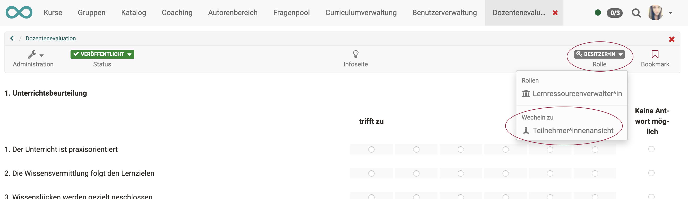{ class="shadow lightbox" title="Rollenwechsel in der Formular-Lernressource" } 

 

!!! warning "Eingeschränkte Bearbeitungsmöglichkeit nach Datenerfassung"

    Wenn andere (Nicht-Besitzer:innen) testen, werden deren eingegebene Daten gespeichert und ein Formular ist danach nur noch eingeschränkt änderbar. Dadurch werden nachträgliche Manipulation ausgeschlossen.

    Haben andere bereits Daten ins Formular eingegeben, erstellen Sie am besten eine Kopie der Lernressource oder des Kursbausteins und arbeiten mit dieser weiter.

 

!!! tip "Tipp, wenn ein 'Nicht zugänglich' erscheint"

    Wenn Sie als Autorin oder Autor einen Kurs publiziert haben (also den Kurseditor verlassen), kommt es oft vor, dass der Kursbaustein mit der Formular-Lernressource nicht zugänglich ist.

    Oft liegt es daran, dass Autorinnen und Autoren das Formular gemäss der voreingestellten Konfiguration nicht selbst ausfüllen dürfen. (Weil sie Besitzer:innen, aber keine Teilnehmenden sind.)

    Mit dem Rollenwechsel zur Teilnehmeransicht im Editor umgehen Sie dies.

[Zum Seitenanfang ^](#create_form)

---

## 8. Formulare konfigurieren  {: #step8}

<h3>Wo werden Konfigurationen vorgenommen?</h3>

Schon beim Erstellen einer neuen Formular-Lernressource gelangen Sie nach der Angabe eines Titels zu den Einstellungen. Sie können dort die Lernressource konfigurieren.
Oft überspringt man diese Eingabefelder zunächst. Die Einstellungen können jederzeit wieder aufgerufen werden und bearbeitet werden.

Auch beim Erstellen der Fragen haben Sie Einstellungen vorgenommen. Sie haben einzelne Fragen konfiguriert. Die Konfigurationen können also auf unterschiedlichen Ebenen vorgenommen werden:

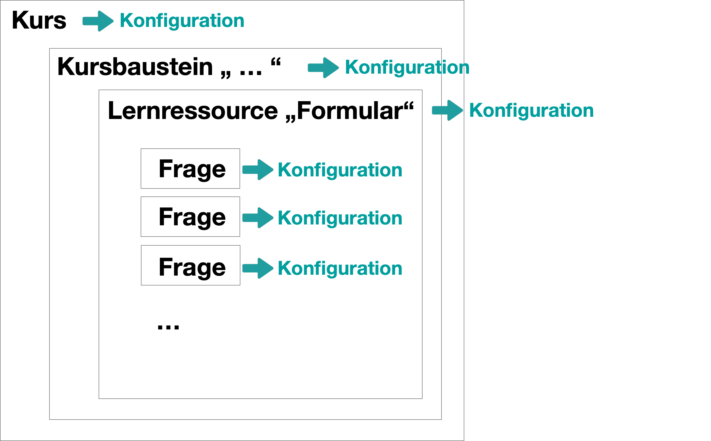{ width=450px class="lightbox" title="Ebenen der Konfiguration" }

**Konfiguration des Kurses:** 
`Kurs > Administration > Einstellungen`

**Konfiguration des Kursbausteins:** 
`Kurs > Administration > Kurseditor > "Kursbaustein" > Tabs des Kursbausteins`

**Konfiguration der Lernressource:** 
`Autorenbereich > "Formular-Lernressource" > Administration > Einstellungen`

**Konfiguration einer Frage:** 
Öffnen Sie das Formular im Formulareditor: `Administration > Formulareditor`. Mit Klick auf ein Element wechseln Sie in den Editiermodus, und die zugehörigen Optionen erscheinen.

 

<h3>Was kann konfiguriert werden?</h3>

Eine vollständige Aufzählung aller Konfigurationsmöglichkeiten über alle Ebenen hinweg wäre an dieser Stelle zu umfangreich. Die wichtigsten Möglichkeiten betreffen

* das Aussehen des Formulars und der Fragen
* wer das Formular ausfüllen darf
* in welchem Zeitraum das Formular ausgefüllt werden kann
* ob die Angaben anonym erfasst werden oder personalisiert 
* wer die Eintragungen und Auswertungen sehen darf
* ...

!!! info "Anonym oder personalisiert?"

    Sie können Formulare anonym oder mit Angabe des Names ausfüllen lassen.
    Standardmässig werden keine personalisierten Angaben erfasst. Durch Hinzufügen eines Elements "Informationen" wird die Anonymität aufgehoben und eine personenbezogene Auswertung ermöglicht.
    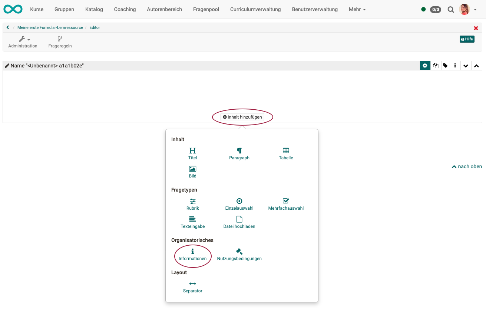{ class="shadow lightbox" title="Element Informationen im Formulareditor" } 

!!! tip "Hinweis zur Freigabe"

    Wenn Sie das Formular in Kursbausteinen verwenden wollen, brauchen Sie den Tab "Freigabe" der Lernressource Formular **nicht** weiter einzurichten. Die Einrichtung des Tabs "Freigabe" ist vorrangig relevant, wenn Sie die Lernressource stand-alone verwenden wollen.

!!! tip "Zu beachten, wenn der Lernpfad verwendet wird"

    Verwenden Sie den Lernpfad? Wenn ja, achten Sie darauf, dass nicht die Konfiguration vorhergehender Kursbausteine oder des obersten Kursknotens die Bearbeitung unerwünscht einschränkt. Z.B. durch sequenzielle Lernschritte oder wenn der vorhergehende Kursbaustein zwingend abgearbeitet werden muss, bevor man zum Formular gelangt.

[Zum Seitenanfang ^](#create_form)

---

## 9. Formulare ändern  {: #step9}

Sobald eine Formular-Lernressource in einen Kursbaustein eingebunden wurde und eine Teilnehmer:in das Formular ausgefüllt hat, existieren Daten.
Das heisst aber auch, dass das Formular nach der ersten Benutzung nicht mehr verändert werden darf. Das würde sonst beliebige nachträgliche Manipulationen ermöglichen.

**Sobald ein Formular im Kurs eingebunden und aufgerufen wurde, kann das Formular deshalb nur noch eingeschränkt geändert werden.**

**Nicht mehr möglich** ist z.B. das Ergänzen von weiteren Fragen oder Frageregeln.

**Möglich** ist z.B. noch die Änderung des Namens einer Rubrik:

* Klicken Sie im Formulareditor die betreffende Rubrik an, um sie zu editieren.
* Wählen Sie im Inspektor-Popup den Tab "Erweitert".
* Ändern Sie im Feld "Name" den Namen der Rubrik. Ebenfalls änderbar bleiben "Anzeige des Namens", "Positive Bewertung" und die Wertebereiche "Ungenügend", "Neutral" und "Gut". Das Feld "Skalentyp" ist gesperrt.

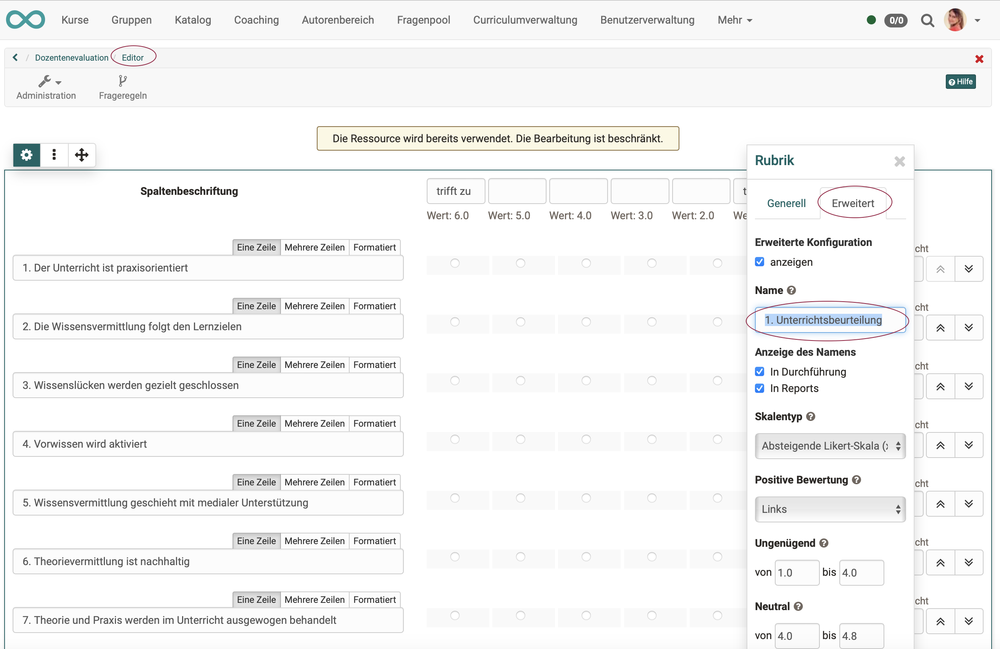{ class="shadow lightbox" title="Formulareditor bei bereits verwendetem Formular" }

[Zum Seitenanfang ^](#create_form)

---

## Beispiele

### Beispiel 1: Umfrage zur Unterrichtsqualität {: #example1}

Merkmale:

* oft Single Choice, um zu eindeutiger Stellungnahme zu nötigen
* anonym

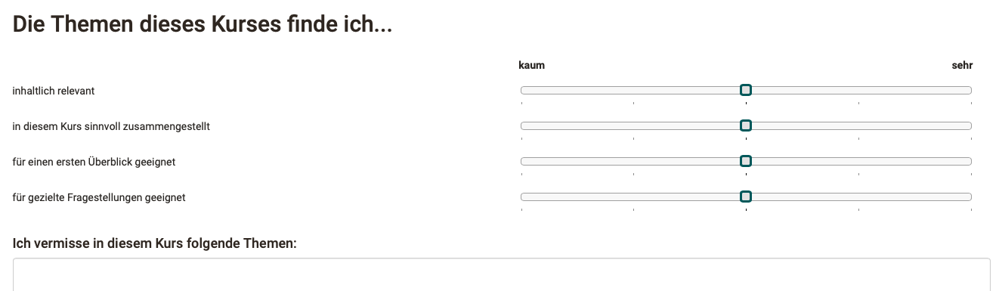{ class="shadow lightbox" title="Beispiel Umfrage zur Unterrichtsqualität" }

[OpenOlat-Lernressource zum Download](assets/OOAcademy_FB_V1.zip)

---

### Beispiel 2: Mitarbeiterbefragung {: #example2}

Merkmale:

* personalisiert
* oft Texteingabe, z.B. persönliche Ziele der Mitarbeitenden
* weniger Fragen mit Antwort richtig / falsch

---

### Beispiel 3: Umfrage zur Kundenzufriedenheit {: #example3}

Merkmale:

* oft Ampelsystem, da es die Beantwortung vereinfacht und wenig Aufwand für Kund:innen bedeutet

---

### Beispiel 4: Beurteilung der mündlichen Präsentation in Englisch {: #example4}

Merkmale:

* personalisiert
* themenunabhängige Beurteilungskriterien
* Formularoptionen müssen für die beurteilenden Prüfer:innen schnell erfassbar sein

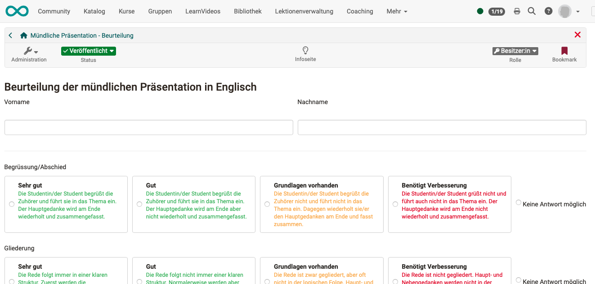{ class="shadow lightbox" title="Beispiel Beurteilung einer Präsentation" }

[OpenOlat-Lernressource zum Download](assets/Muendliche_Praesentation__Beurteilung.zip)

---

### Beispiel 5: Rubrik im Peer Review {: #example5}

Merkmale:

* Formular enthält (ausser Titel u.ä) meist nur 1 Rubrik-Element

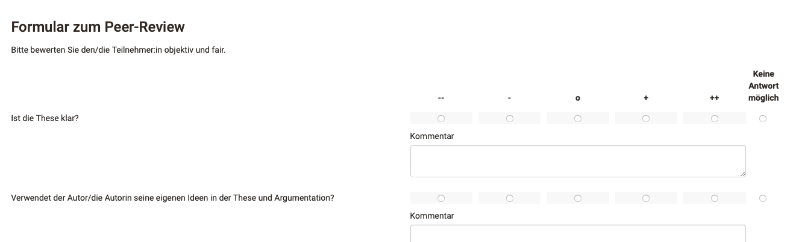{ class="shadow lightbox" title="Beispiel Formular zum Peer-Review" }

[OpenOlat-Lernressource zum Download](assets/Musterformular_PeerReview.zip)

[Zum Seitenanfang ^](#create_form)

---

## Weiterführende Informationen {: #further_information}

**Weiterführend** 
[Allgemeines zu Formularen >](../../manual_user/learningresources/Forms_General_Information.de.md) 
[Der Formulareditor >](../../manual_user/learningresources/Form_Editor.de.md) 
[Formular-Elemente >](../../manual_user/learningresources/Form_Elements.de.md) 
[Das Formular-Element Rubrik >](../../manual_user/learningresources/Form_Element_Rubric.de.md) 
[Frageregeln in Formularen >](../../manual_user/learningresources/Form_Question_Rules.de.md) 
[Formulare in Kursen >](../../manual_user/learningresources/Forms_in_Courses.de.md) 
[Kursbaustein "Formular" >](../../manual_user/learningresources/Course_Element_Form.de.md) 
[Kursbaustein "Umfrage" >](../../manual_user/learningresources/Course_Element_Survey.de.md) 
[Formular als Rubrik-Bewertung >](../../manual_user/learningresources/Forms_in_Rubric_Scoring.de.md) 
[Kursbaustein "Aufgabe" >](../../manual_user/learningresources/Course_Element_Task.de.md) 
[Formular in der Portfolio 2.0 Vorlage >](../../manual_user/learningresources/Forms_in_the_ePortfolio_template.de.md) 
[Wie führe ich ein Peer-Review durch? >](../peer_review/peer_review.de.md)

[Zum Seitenanfang ^](#create_form)
