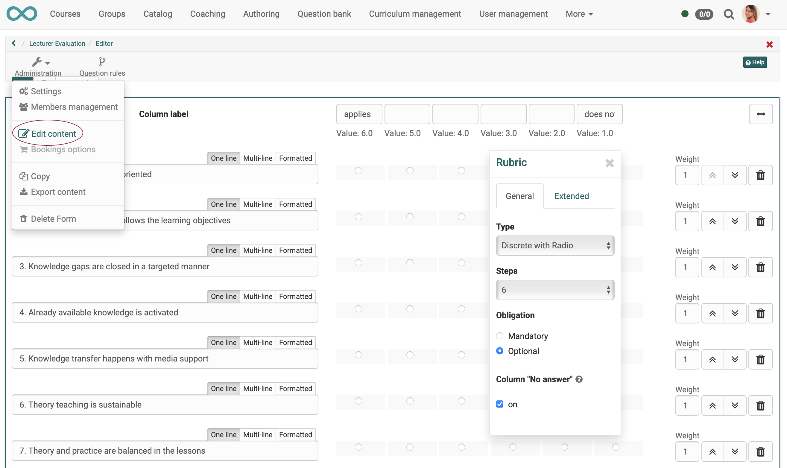
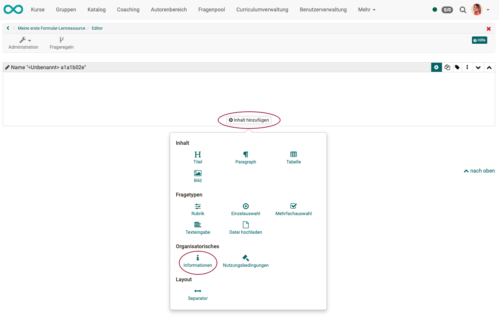
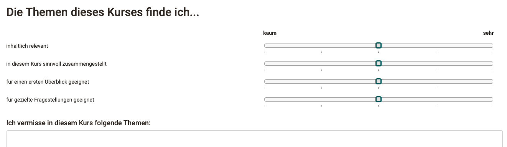
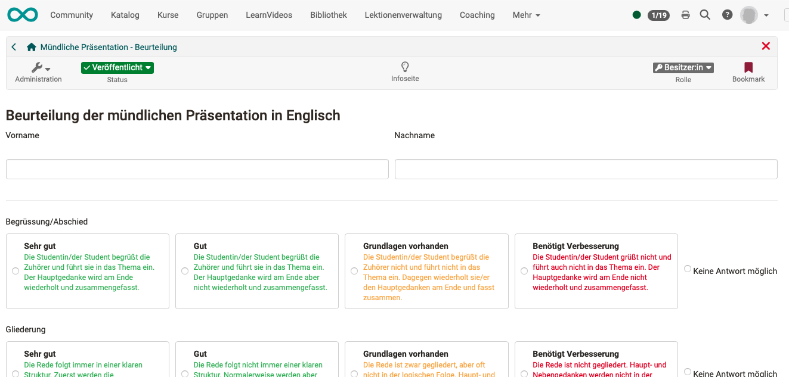

# How do I create a form learning resource?

## 1. What is a form in OpenOlat? {: #step1}

An OpenOlat form is a page that can be filled out interactively by users. Typically, questions are to be answered by ticking something or entering an answer as text.

The information can be stored anonymously or on a personal basis.

Authorized persons have access to the information provided and can call up (collective) assessments.

---

## 2. Course element and learning resource {: #step2}

An OpenOlat course is composed of course elements. Most course elements are containers into which a learning resource is inserted.

{ width=300px class="lightbox" }

**Attention!** 
There is a form **learning resource** and a form **course element**. These two are to be kept apart. A form learning resource can be used in different places in OpenOlat (see next section).

This tutorial describes how to create the form **learning resource**.
There are further instructions for using the learning resource in different course elements.

!!! tip "Note"

    In previous OpenOlat versions, form learning resources were called **questionnaires**. They were based on the QTI 1.2 standard, which is now no longer supported.

[To the top of the page ^](#create_form)

---

## 3. Where are form learning resources used?

{ width=400px class="lightbox" }

a) Form learning resource in **course element Form**.

b) Form learning resource in **course element Survey**.

c) Form learning resource in **course element Assessment**.

d) Form learning resource **in a portfolio**

e) Form learning resource **Stand alone**

[To the top of the page ^](#create_form)

---

## 4. What is a form capable of?  {: #step4}

<h3> a) How does a form look like?</h3>

Various question types are available in forms:

* Rubric 
* Single selection
* Multiple selection
* Text input
* File upload 

Depending on the objective, forms can be designed quite differently with it. Here is an example in participant view:

{ class="shadow lightbox" }

 

<h3> b) What does a form consist of?</h3>

Each form consists of a page with one or more questions or other elements (e.g. title). The individual elements can be selected in the editor and then be edited. In some cases, a pop-up (inspector window) with setting options is displayed.

{ class="shadow lightbox" }

<h3> c) How does a form work? </h3>

If participants have entered a response in the form, the entries are saved per participant. 
Exception: An anonymous survey was created.

The answers can be viewed by authorized persons. .
Who is authorized can be configured, see "8. Configure form".

If a coach clicks on exactly the same course element with form in the course, he will not see the form at first (like the participant), but an automatically generated report. For the details, the individual forms can be accessed. 

{ class="shadow lightbox" }

!!! info "Question rules"

    A **branch** is also possible via **question rules**: "If question xy is answered this way, then ..."

    You can find the icon for creating the rules in the header of the form editor.

    { class="shadow lightbox" }

[To the top of the page ^](#create_form)

---

## 5. Create/edit forms  {: #step5}

A **special editor** is available for creating form learning resources. It can be called from different places:

<h3>a) Authoring > create new form </h3>

You can create a form learning resource directly in the authoring area. Subsequently, you can access this prepared form learning resource when editing a course and include it in a course element.

{ class="shadow lightbox" } 

 

<h3>b) Authoring > tab "My entries" > select avaliable form > edit</h3>

Does the form learning resource already exist but is still empty? Since we then edit a form **learning resource**, it can be found in the authoring area under the tab "My entries". (Only courses are listed under "My courses".) Use the filters to search in large databases.

To edit, click on the title or on the edit icon or on the 3 dots at the end of the line.

{ class="shadow lightbox" } 

 

<h3>c) Course editor > course element > tab for learning content (e.g. tab "Survey") > button "create form" </h3>

If you have inserted a course element in the course editor (e.g. the course element "Survey"), then a learning resource must be inserted there under the tab "Survey". If no form learning resource is prepared, a new form learning resource can also be created directly here.

{ class="shadow lightbox" } 

 

<h3>d) Course editor > course element > learning content > edit</h3>

If a form learning resource is already included in the course element, the editor for form editing can also be opened from the course editor.

{ class="shadow lightbox" } 

!!! tip "Hint"

    Since the learning resource form can be used in many different ways, it makes sense to consider the later use already when assigning the title, e.g. to prefix it with a suitable abbreviation. This makes it easier to find and assign the learning resource later.

!!! tip "Hint"

    When you create a brand new form learning resource, you will be taken to the settings screen after the title entry prompt.
    Here you can optionally make settings right away, e.g. store a license. However, you can also access it again at any time later. For more information, see "7. Configuring the form"

!!! info "Note"

    If a form has already been used (filled in by participants), there are restrictions on editing. (See below: 9. Modify forms).

[To the top of the page ^](#create_form)

---

## 6. Designing forms in the editor.

Once you have opened the form editor by clicking on "Edit content", you can first insert a new **layout**.  
A layout here means a **grid**. You can insert several such layouts one after the other.

{ class="shadow lightbox" } 
{ class="shadow lightbox" } 

 

The content can now be inserted into the fields of the layout (title, single choice questions, etc.).

If you want to change the layout afterwards, you can open the selection tool again at any time by clicking on the small gear.

{ class="shadow lightbox" } 

 

In the example below, the layout has been changed from two columns to one column.

Now add titles, paragraphs (sections) and the different questions. It is best to start with a title and add a short introductory text with the "Paragraph" element to inform the user accordingly.

{ class="shadow lightbox" } 

 

In each case, click "Add Content" and then use the options provided. .
For example, for a "Title" element.

{ class="shadow lightbox" } 

For a "rubric" element, the options are much more diverse. However, the same principle of procedure always applies:

* Select an element.
* The displayed options apply to the currently selected element.

Explore the many options available!

{ class="shadow lightbox" } 

 

<h3>Finish editing </h3>

* Repeat the process until the form is completed.
* As an alternative to the "Add content" button, you can also click on the icon with the 3 dots for content that has already been added and then select "Add before" or "Add after". You will see the selection of all elements again.
* If you want to use recurring elements, you can also duplicate them.
* If you want to change the order of the elements, you can simply drag and drop them.

When you are done **close the editor by clicking on the title of the form in the bread crumb navigation**. The form is now saved and you will see the form from a user's perspective.

[To the top of the page ^](#create_form)

---

## 7. Testing forms

To test a form as an author, switch to the participant view:

{ class="shadow lightbox" } 

 

!!! warning "Limited editing possibility after data entry"

    When others (non-owners) test, their entered data is saved and a form can only be changed to a limited extent afterwards. This prevents subsequent manipulation.
    
    If others have already entered data into the form, it is best to create a copy of the learning resource or course element and continue working with it.

 

!!! tip "Hint when a 'Not accessible' appears"

    If you as an author have published a course (left the course editor), it often happens that the course element with the form learning resource is not accessible.
    
    Often it is because authors are not allowed to fill in the form themselves according to the preset configuration. (Because they are owner but not participant).
    
    You can get around this by switching roles to the participant view in the editor.

[To the top of the page ^](#create_form)

---

## 8. Configure forms  {: #step8}

<h3>Where are configurations done?</h3>

Already when creating a new form learning resource you get to the settings after specifying a title. There you can configure the learning resource.
Often you skip these input fields at first. The settings can be called up again at any time and edited.

You have also made settings when creating the questions. You have configured individual questions. The configurations can therefore be made at different levels:

{ width=450px class="lightbox" }

**Configuration of the course:** 
Authoring > select the learning resource > Administration > Settings

**Configuration of the course element:** 
Admninistration > Course editor > select the course element > settings in the tabs

**Configuration of the learning resource:** 
Authoring > select the form learning resource > Administration > Settings

**Configuration of a question:** 
Open form in the form editor > switch to the edit mode by clicking an element > related options appear 

 

<h3>What can be configured?</h3>

A complete enumeration of all configuration options across all levels would be too extensive at this point. The main options concern

* the appearance of the form and the questions
* who may fill out the form
* in which period the form can be filled in
* whether the information is collected anonymously or personalized 
* who may see the entries and evaluations
* ...

!!! Info "Anonymous or personalized?"

    You can have forms filled out anonymously or with the name.
    By default, no personalized information is recorded. By adding an element "Information" the anonymity is removed and a personalized evaluation is possible.
    { class="shadow lightbox" } 

!!! tip "Note on Share"

    If you want to use the form in course elements, you do **not** need to set up the tab "Share" of the learning resource Form any further. Setting up the tab "Share" is primarily relevant if you want to use the learning resource stand-alone.

!!! tip "To note when the learning path is used"

    Are you using the learning path? If yes, make sure that the configuration of preceding course elements or the top course node does not undesirably restrict processing. E.g. by sequential learning steps or if the preceding course element must be worked off compellingly, before one arrives at the form.

---

## 9. Modify forms  {: #step9}

As soon as a form learning resource has been included in a course element and a course participant has filled in the form, data exists.
However, this also means that the form must not be changed after the first use. This would otherwise allow any subsequent manipulations.

**Once a form has been included and called up in the course, the form can therefore only be changed to a limited extent.**

**No longer possible** is, for example, the addition of further questions or question rules.

**Possible** is e.g. still the change of the column titles:

* In the form editor, click the relevant question to edit it.
* Select the "Advanced" tab in the inspector popup.
* Change the column title of the selected question.

{ class="shadow lightbox" }

[To the top of the page ^](#create_form)

---

## Examples

### Example 1: Teaching quality survey {: #example1}

Characteristics:

* often Single Choice, in order to force a clear statement
* anonymous

{ class="shadow lightbox" }

[OpenOlat learning resource to download](assets/OOAcademy_FB_V1.zip)

---

### Example 2: Employee survey {: #example2}

Characteristics:

* personalized
* often text input, e.g. personal goals of the employees
* less questions with answer type correct / wrong

---

### Example 3: Customer satisfaction survey

Characteristics:

* often traffic light system, as it simplifies the response and means little effort for customers

---

### Example 4: Assessment of the oral presentation in English {: #example4}

Characteristics:

* personalized
* Assessment criteria independent of topic
* Form options must be quickly comprehensible for the evaluating auditors

{ class="shadow lightbox" }

[OpenOlat learning resource to download](assets/Muendliche_Praesentation__Beurteilung.zip)

---

### Example 5: Rubric in the peer review {: #example5}

Characteristics:

* Form usually contains only one heading element (except title etc.)

{ class="shadow lightbox" }

[OpenOlat learning resource to download](assets/Musterformular_PeerReview.zip)

[To the top of the page ^](#create_form)

---

# Further information

[General information about forms >](../../manual_user/learningresources/Forms_General_Information.md) 

[Form editor >](../../manual_user/learningresources/Form_Editor.md) 
[Form elements >](../../manual_user/learningresources/Form_Elements.md) 
[Form elements with rubric >](../../manual_user/learningresources/Form_Element_Rubric.md) 
[Form question rules >](../../manual_user/learningresources/Form_Question_Rules.md) 

[Forms in courses >](../../manual_user/learningresources/Forms_in_Courses.md) 
[Forms in forms course element >](../../manual_user/learningresources/Forms_in_Forms_Element.md) 
[Forms in questionnaires >](../../manual_user/learningresources/Forms_in_Questionnaires.md) 
[Forms in rubric scoring >](../../manual_user/learningresources/Forms_in_Rubric_Scoring.md) 
[Forms in peer reviews >](../../manual_user/learningresources/Course_Element_Task.md#revisions) 
[Forms in the portfolio 2.0 template >](../../manual_user/learningresources/Forms_in_the_ePortfolio_template.md) 

[How do I perform a peer review?](../peer_review/peer_review.md) 

