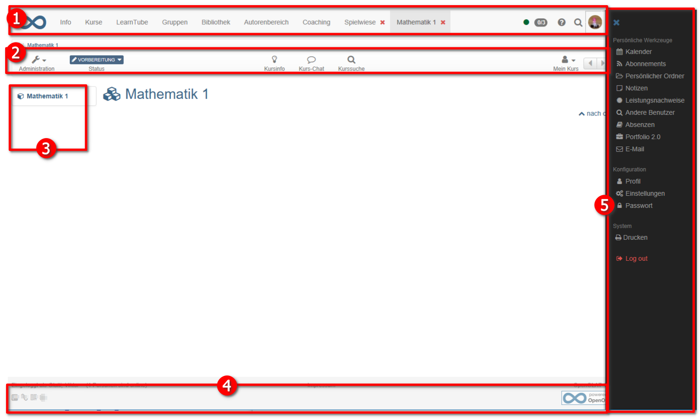

# Wie kann ich eigene CSS für das Kursdesign erstellen?

!!! danger "Nur für Experten!"
	
	Für normale Setups und Nicht-Experten ist die Verwendung eines eigenen Kurs-Designs nicht empfohlen!
	
	Beachten Sie, dass das Ändern des OpenOlat-Layouts durch Manipulation des System-CSS nicht versionsübergreifend unterstützt wird. Das bedeutet, dass das Erstellen eines Kurslayouts nach einem Systemupdate zu einem defekten Kursdesign führen kann. 
	
	Verwenden Sie eigene CSS nur

	* mit Vorsicht,
	* nur, wenn es absolut notwendig ist
	* und wenn Sie die Kontrolle über den Aktualisierungszyklus Ihrer OpenOlat-Installation haben. 

!!! hint "Hinweis"
	
	Bitten Sie Ihren Systemanbieter, Kursthemen zu implementieren, die auf Systemebene unterstützt werden und nach jeder OpenOlat-Aktualisierung neu kompiliert werden und somit garantiert auch nach Aktualisierungen funktionieren.

## Welche Voraussetzungen muss ich mitbringen?

  * Vertiefte CSS-Kenntnisse
  * Erfahrungen mit Browser-Entwicklerwerkzeugen
  * evtl. HTML Grundkenntnisse

## Welche Werkzeuge benötige ich, um das OpenOlat Design zu ändern?

Sie benötigen:

* einen <b>Editor</b> (z.B. [Notepad++](https://notepad-plus-plus.org/)) um die CSS Datei zu erstellen
* und ein Werkzeug um das CSS von OpenOlat zu analysieren, bzw. die entsprechenden Selektoren, die verändert werden sollen, zu identifizieren.

Möglich ist dies z.B. über die <b>Browser Option "Element untersuchen"</b>. In Firefox und Chrome ist dieses Werkzeug bereits integriert.
Klicken Sie mit der rechten Maustaste in die Webseite und wählen Sie dann "Element untersuchen (Q)" bzw. "Untersuchen (Strg+Shift+I)". Wenn Sie z.B. auf die obere Navigationsleiste klicken, zeigt Ihnen die Information den Namen des Selektors an, in diesem Fall „#o_navbar_container“.

## Was ist möglich?

Sie möchten das Kursdesign individuell gestalten und Ihren Kurs optisch aufwerten oder an Ihr Corporate Design der Organisation anpassen?

Das Standard OpenOlat Layout lässt sich mit Hilfe von CSS beliebig anpassen und verändern. So ist es möglich, einem Kurs einen individuellen Wiedererkennungswert zu geben. Auch ein Bezug zum Kursinhalt, eine bestimmte Farbharmonie oder die optische Gestaltung für gamebasierte Kurse kann auf diesem Weg umgesetzt werden.

!!! warning "Aber Vorsicht!!"

	Einige generelle Selektoren (z.B. h2, p) werden in OpenOlat mehrfach verwendet und so können Änderungen sehr weitreichend, jedoch nicht immer in der ganzen
	Tragweite ersichtlich sein. Wird z.B. die Schriftfarbe in Blau geändert, kann es sein, dass die Schrift auf blauen Buttons nicht mehr lesbar ist (z.B. in einem Test). Überdenken Sie also vorab ihre Handlung und halten Sie sich immer an die Grundlagen des Webdesigns, wie beispielsweise ausreichenden Kontrast zwischen Schriftfarbe und Hintergrund.

## Wo wird die CSS-Datei gespeichert und eingebunden?

Um Ihre CSS-Datei für die Gestaltung Ihres OpenOlat Kurses nutzen zu können, müssen Sie im <b>Ablageordner</b> des Kurses einen <b>Unterordner „courseCSS"</b> anlegen und dort die erstellte Kurs CSS Datei ablegen. 

Damit die Datei auch verwendet wird, wird im OpenOlat <b>Kursmenü "Layout"</b> die gewünschte Datei ausgewählt. Wenn Sie später doch wieder zu dem Standard OpenOlat Layout zurückkehren möchten,
wählen Sie die Option "Standard" aus, oder löschen einfach ihre CSS aus dem Ablageordner.

## Beispiele für individuelle Gestaltung

Die Änderungsmöglichkeiten sind vielfältig.

!!! danger "Achtung"

	Das Ändern von OpenOlat-CSS-Klassen kann zu unerwartetem Verhalten beim Aktualisieren des System führen. Die unten aufgeführten Klassennamen und Element-IDs sind nicht garantiert verfügbar und können sich mit OpenOlat-Updates ändern. Auch die zugrunde liegende DOM-Struktur von OpenOlat kann sich ändern. Es wird daher nicht empfohlen, CSS-Regeln zu erstellen, die die Stile im OpenOlat-DOM oder CSS-Namensraum ändern.

## Beispiel: Hintergrund ändern

Um den Hintergrund mit CSS zu ändern, muss man erst den ID-Selektor `#o_body`
benutzen und die Eigenschaft `background`, `background-color` oder
`background-image` deklarieren. Sie können also sowohl das Hintergrundbild als
auch die Hintergrundfarbe auf diesem Weg definieren. Die gewünschte
Hintergrundfarbe können Sie einfach im Ablageordner des Kurses hinterlegen und
passend verlinken.

Der Code für die genannten Selektoren können dann folgendermaßen aussehen:  
  
	#o_body {  
		background-color: red; /*erzeugt einen roten Hintergrund */  
		background-image: url(bild.svg); /* verlinkt zu einem Bild, das als
		Hintergrund verwendet wird*/  
		background-position: center; /* setzt das Bild mittig */  
	}

Meist macht es Sinn entweder eine Hintergrundfarbe oder ein Hintergrundbild zu
verlinken. Hinterlegen Sie das Bild an einer geeigneten Stelle im Ablageordner
des Kurses.

Es wird weiterhin empfohlen, folgende CSS-Einstellungen zu übernehmen, um
andere Abschnitte transparent zu machen, um den gefärbten Hintergrund zu
sehen:

	#o_main_wrapper, #o_main_wrapper #o_main_container {  
		background: transparent;  
	}
	
	#o_main_wrapper #o_main_container #o_main_left {  
		background:transparent; margin-right: 15px;  
	}
	
	#o_main_wrapper #o_main_container #o_main_center {  
		background:transparent;  
	}
	
	#o_footer_wrapper, #o_footer_container {  
		background: transparent;  
	}  

## Beispiel: Kursbaustein Einzelseite  

Oft kann es nötig sein den Hintergrund einer einzelnen HTML Seite dem
Gesamtdesign anzupassen. Auch in diesem Fall wird das Gewünschte mit CSS-Code
realisiert.

Um die HTML Seite beispielsweise transparent zu machen (damit der Hintergrund
der Seite durchscheint) wird in der HTML Seite des Kursbausteins Einzelseite
der body transparent gemacht:  
  
	body {  
		background-color: transparent;  
	}

## Beispiel: Klassen- und ID-Selektoren

Im Folgenden sind einige Bereiche eines OpenOlat Kurses mit den entsprechenden
Klassen und/oder ID-Selektoren aufgeführt, die häufig angepasst werden:

{ class="shadow lightbox" }  
  

 **1\. Obere Menüleiste:** CSS ID-Selektor: `#o_navbar_container`

 **1a Logo austauschen**

Mit `.o_navbar-brand` kann das Logo in der Navigationsleiste ausgetauscht oder
angepasst werden:

  * `display: none;` blendet das Logo aus `.o_navbar-brand {display: none;}`
  * `background: rgba(0, 0, 0, 0) url("logo-k-town.png");` ersetzt das bestehende Logo durch die Grafik logo-k-town.png  
  

 **2\. Kursmenüleiste:** CSS Klassen-Selektoren: `.o_toolbar .o_tools_container`

 **3\. Linke Menüleiste:** CSS ID-Selektor: `#o_main_left_content`

 **4\. Fußzeile:** CSS ID-Selektor: `#o_footer_container` und `#o_footer_wrapper`

 **5\. Benutzermenü (rechtes Ausklappmenü):** CSS ID-Selektor `#o_offcanvas_right`

Sollen die Überschriften angepasst werden, wählen Sie das Element **h2.** Auch
hier können alle Eigenschaften mit CSS-Befehlen den eigenen Ansprüchen
entsprechend angepasst werden. Dasselbe gilt dies auch für das Element **p**
oder auch für die Links **a.** Vorstellbar wären für diese Elemente
beispielsweise folgende CSS-Eigenschaften:

  *  `color: red`; Änderung der Schriftfarbe. Hier kann der Hex Code `#ffffff` (=weiß) oder auch ein RGB Wert `rgb(87 , 53, 4)` angegeben werden.
  *  `font-family: verdana;` so lässt sich die Schriftart anpassen
  *  `font-weight: bold;` definiert die Schriftstärke (`bold` = fett)  
  *  `text-transform: uppercase;` beschreibt das Verhalten der Schrift (`uppercase` = nur Grossbuchstaben)
  *  `text-decoration: underline;` der Text wird unterstrichen dargestellt  

## Weiterführende Informationen

 **[W3school:](http://www.w3schools.com/css/default.asp)** Ressource über die CSS-Sprache  
 **[Notepad++:](https://notepad-plus-plus.org/)** kostenfreier Editor
