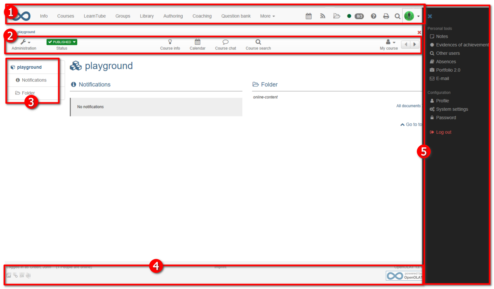

# How can I create custom CSS for my course design?

??? abstract "Objectives and content of this instruction"

    tbd

??? abstract "Target group"

    [ ] Authors [ ] Coaches  [ ] Participants  [x] Administrators

    [ ] Beginners [x] Experienced users  [x] Experts

??? abstract "Expected previous knowledge"

    * Experience as administrator
	* Experienced in HTML and CSS programming

!!! danger "Only for experts!"
	
	Creating your own course design is not recommended for normal setups and non-expert users! 
	
	Note, that modifying the OpenOlat layout by manipulating the system CSS is not supported over versions. This means that creating a course layout may result in a broken course design after a system update. 
	
	Use a own CSS only

	* with caution,
	* only if absolutely necessary
	* and when you are in control over the update cycle of your OpenOlat installation.

!!! hint "Hint"
	
	Ask your system provider to implement course themes that are supported on system level and are recompiled after each OpenOlat update and thus guaranteed to work after updates.

## What requirements do I have to meet?

  * in-depth knowledge of CSS
  * experience with various browser developer tools
  * basic HTML knowledge

## Which tools do I need to customize my OpenOlat design?

You need:

* An <b>editor</b> (e.g. [Notepad++](https://notepad-plus-plus.org/)) to create the CSS file
* and a tool to analyse the website's CSS. This will help you find the appropriate ID and class selectors. 
It can be done e.g. via the <b>browser option "Examine element"</b>.
In Firefox and Chrome this tool is already integrated.
Right-click in the web page and select "Examine Element
(Q)" or "Examine (Ctrl+Shift+I)".
For example, if you click on the top navigation bar, the information will show you the name of the selector, in this case "#o_navbar_container".

## What is possible?

You want to customize the course design and visually enhance your course or adapt it to your organization's corporate design?

The standard OpenOlat layout can be customized and changed as desired using CSS. This makes it possible to give a course an individual recognition value. A reference to the course content, a certain color harmony or the visual design for game-based courses can also be implemented this way.

!!! warning "Warning!!"

	Some element selectors (e.g. “p” or “h2”) are often used throughout the platform. Changes can therefore apply far beyond their original purposes with unforeseen consequences. For instance, should the font color be changed to blue, the changes could also apply to blue buttons, thus rendering the text illegible. Please mind those unexpected consequences before changing the layout of a course. You should also follow the basics of web design, for example by keeping a sufficient contrast between the font color and the background.

## Where is the CSS file stored and integrated?

To be able to use your css file for the design of your OpenOlat course, you must create a <b>subfolder "courseCSS"</b> in the <b>course folder</b> and store the course CSS file there.

To ensure that the file is also used, the desired file is
selected in the OpenOlat <b>course menu "Layout"</b>. If you want to return to the standard OpenOlat layout later, select the option "Standard", or simply delete your CSS from the file folder.

## Examples for individual design

The possibilities for change are manifold. 

!!! danger "Be aware"

	Modifying OpenOlat CSS classes might result in unexpected behavior when updating the system. The class names and element ID's listed below are not guaranteed to be available
	between OpenOlat updates. The DOM tree of OpenOlat is subject of change and thus it is not recommended creating CSS rules that modify the styles in the OpenOlat DOM or CSS namespace.

## Example: Customize the background

To customize the background of a course, you need to use the ID selector
`#o_body` and declare the property `background`, `background-color` or
`background-image`. So you can define both the background image and the
background color for this path. The desired background color can simply be
stored in the course storage folder and linked appropriately.

The code could for instance look like this:  
  
	#o_body {  
		background-color: red; /* creates a red background */  
		background-image: url(bild.svg); /* linkes to an image that is used as
		background */  
		background-position: center; /* sets the image centered */  
	}

Usually it makes sense to link either a background color or a background
image. Place the image in a suitable location in the course storage folder.

Furthermore, it is recommended to use the following CSS settings in order to
make other sections of the website transparent:

	#o_main_wrapper, #o_main_wrapper #o_main_container {  
		background: transparent;  
	}
	
	#o_main_wrapper #o_main_container #o_main_left {  
		background:transparent; margin-right: 15px;  
	}
	
	#o_main_wrapper #o_main_container #o_main_center {  
		background:transparent;  
	}
	
	#o_footer_wrapper, #o_footer_container {  
		background: transparent;  
	}
  
## Example: Course element "Single page"  

It may be usefull from time to time to change the background of a specific
HTML page to adjust to the overall design of a course. It is also possible to
do so with CSS. For instance, the following code can be inserted to the HTML
in order to make the background of the page transparent:  
  
	body {  
		background-color: transparent;  
	}

## Example: ID and class selectors

Here are some sections of a course's site with the appropriate ID or class
selectors:

{ class="shadow lightbox" }  

 **1\. Upper menu:** CSS ID selector: `#o_navbar_container`

 **1a. Change the logo**  

You can change or adjust the logo of the upper menu with the class selector
`.o_navbar-brand`. For example, you can declare the following properties as
follow:

  * `display: none;` (will not display the default logo)
  * `background: rgba(0, 0, 0, 0) url("logo-k-town.png");` (will change the default logo for the file "logo-k-town.png")

 **2\. Course menu:** CSS class selektors: `.o_toolbar .o_tools_container`

 **3\. Left menu:** CSS ID selector: `#o_main_left_content`

 **4\. Footer:** CSS ID selector: `#o_footer_container` and `#o_footer_wrapper`

 **5\. User menu (folding menu on the right):** CSS ID selector `#o_offcanvas_right`

  

Should you wish to change the font of titles in OpenOlat, then you should use the element selector **h2**. Two other element selectors can also be modified to adjust to your design: **p** (paragraph) and **a** (hyperlinks). Many CSS properties may apply to those element selectors. Here are some examples:

  *  `color: red;` (changes the color of the font, here in red. The hex code `#ffffff` or RGB value `rgb(87 , 53, 4)` can alternatively be used.
  *  `font-family: verdana;` (changes the font family)  
  *  `font-weight: bold;` (defines the weight of the font, here `bold`)  
  *  `text-transform: uppercase;` (changes the text to uppercase/all caps)  

## Further links

 **[W3school:](http://www.w3schools.com/css/default.asp)** Useful resource on CSS selectors, elements and properties  
 **[Notepad++:](https://notepad-plus-plus.org/)** Free text editor adjusted for programming and markup languages such as CSS

---

## Checklist

- [x] tbd