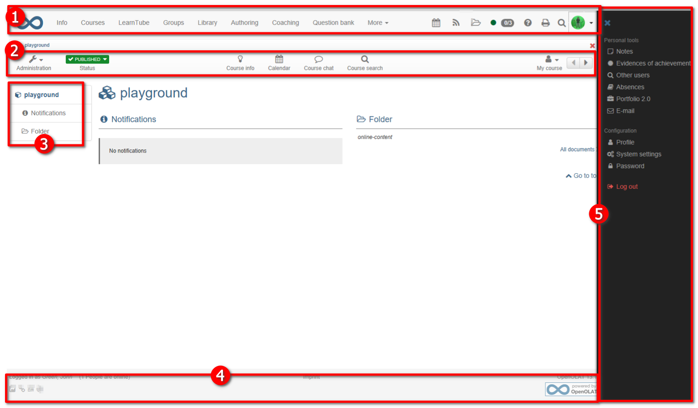

# How can I create custom CSS for my course design? {: #custom_css}

??? abstract "Objectives and content of this instruction"

    You should know that CSS files you create yourself can be used for course design in OpenOlat. However, it would go too far to explain the details of CSS creation here in the manual. Please refer to other resources for more information on this topic, for example the [CSS tutorial by W3Schools](http://www.w3schools.com/css/default.asp).

??? abstract "Target group"

    [ ] Authors [ ] Coaches  [ ] Participants  [x] Administrators

    [ ] Beginners [ ] Advanced users  [x] Experts


??? abstract "Expected previous knowledge"

    * Experience as administrator
    * Experienced in HTML and CSS programming


!!! warning "Only for experts!"

    Using your own course design is not recommended for normal setups and without in-depth CSS knowledge!

    Note that modifying the OpenOlat layout by manipulating the system CSS is not supported across versions. This means that creating a course layout may result in a broken course design after a system update.

    Use your own CSS only

    * with caution,
    * only if absolutely necessary
    * and when you are in control over the update cycle of your OpenOlat installation.

!!! tip "Tip"

    Ask your system provider to set up layout templates at system level. They appear in the selection as "System template", are recompiled after each OpenOlat update and are thus guaranteed to work after updates.

## What requirements do I have to meet? {: #requirements}

  * In-depth knowledge of CSS
  * Experience with browser developer tools
  * Basic HTML knowledge if applicable

## Which tools do I need to customize my OpenOlat design? {: #customize}

You need:

* an **editor** (e.g. [Notepad++](https://notepad-plus-plus.org/)) to create the CSS file
* and a tool to analyse the CSS of OpenOlat, or to identify the selectors that are to be changed.

This is possible, for example, via the **browser option "Inspect element"**. In Firefox and Chrome this tool is already integrated.
Right-click in the web page and then select "Inspect Element (Q)" or "Inspect (Ctrl+Shift+I)". For example, if you click on the top navigation bar, the information will show you the name of the selector, in this case "#o_navbar_container".

## What is possible? {: #possibilities}

You want to customize the course design and visually enhance your course or adapt it to your organization's corporate design?

The standard OpenOlat layout can be customized and changed as desired using CSS. This makes it possible to give a course an individual recognition value. A reference to the course content, a certain color harmony or the visual design for game-based courses can also be implemented this way.

!!! warning "Warning!!"

    Some general selectors (e.g. h2, p) are used several times in OpenOlat, so changes can be very far-reaching, but their full scope is not always apparent. For instance, if the font color is changed to blue, the text on blue buttons may no longer be legible (e.g. in a test). So think your action through beforehand and always follow the basics of web design, for example by keeping a sufficient contrast between the font color and the background.

## Where is the CSS file stored and integrated? {: #storing}

To be able to use your CSS file for the design of your OpenOlat course, you must create a **subfolder "courseCSS"** in the **[storage folder](../../manual_user/learningresources/Storage_folder.md)** of the course and store the course CSS file there.

To ensure that the file is also used, course owners select it in the [course settings](../../manual_user/learningresources/Course_Settings.md#layout) under `Course > Administration > Settings > Tab "Layout"` in the field "Choose layout for this course". The file appears there as "from course folder" with its file name. If you want to return to the standard OpenOlat layout later, select the option "Default", or simply delete your CSS from the storage folder.

## Examples for individual design {: #design}

The possibilities for change are manifold.

!!! warning "Attention"

    Modifying OpenOlat CSS classes might result in unexpected behavior when updating the system. The class names and element IDs listed below are not guaranteed to be available and may change with OpenOlat updates. The underlying DOM structure of OpenOlat may also change. It is therefore not recommended to create CSS rules that modify the styles in the OpenOlat DOM or CSS namespace.

## Example: Customize the background {: #background}

To customize the background with CSS, you first need to use the ID selector `#o_body` and declare the property `background`, `background-color` or `background-image`. So you can define both the background image and the background color this way. The desired background image can simply be stored in the storage folder of the course and linked appropriately.

The code for the selectors mentioned could then look like this:

```css
#o_body {
	background-color: red; /* creates a red background */
	background-image: url(bild.svg); /* links to an image that is used as background */
	background-position: center; /* sets the image centered */
}
```

Usually it makes sense to link either a background color or a background image. Place the image in a suitable location in the storage folder of the course.

Furthermore, it is recommended to use the following CSS settings in order to make other sections transparent so that the colored background is visible:

```css
#o_main_wrapper, #o_main_wrapper #o_main_container {
	background: transparent;
}

#o_main_wrapper #o_main_container #o_main_left {
	background:transparent; margin-right: 15px;
}

#o_main_wrapper #o_main_container #o_main_center {
	background:transparent;
}

#o_footer_wrapper, #o_footer_container {
	background: transparent;
}
```

## Example: Course element "HTML page"  {: #single_page}

It can often be necessary to adapt the background of a single HTML page to the overall design. In this case, too, the desired effect is realized with CSS code.

For example, to make the HTML page transparent (so that the background of the page shines through), the body is made transparent in the HTML page of the [course element "HTML page"](../../manual_user/learningresources/Course_Element_HTML_Page.md):

```css
body {
	background-color: transparent;
}
```

## Example: ID and class selectors {: #example}

Below are some areas of an OpenOlat course with the corresponding
class and/or ID selectors that are frequently customized. The numbers correspond to the numbers in the image.

{ class="shadow lightbox" title="Course view with the user menu open" }

| No. in image | Area | CSS selector |
|---|---|---|
| 1 | Upper menu | ID selector `#o_navbar_container` |
| 2 | Course menu | Class selectors `.o_toolbar .o_tools_container` |
| 3 | Left menu | ID selector `#o_main_left_content` |
| 4 | Footer | ID selectors `#o_footer_container` and `#o_footer_wrapper` |
| 5 | User menu (folding menu on the right) | ID selector `#o_offcanvas_right` |

**Change the logo**

With `.o_navbar-brand` the logo in the upper menu (no. 1) can be replaced or
adjusted:

  * `display: none;` hides the logo `.o_navbar-brand {display: none;}`
  * `background: rgba(0, 0, 0, 0) url("logo-k-town.png");` replaces the existing logo with the graphic logo-k-town.png

If the headings are to be adjusted, select the element **h2**. Here, too, all properties can be adjusted to your own requirements with CSS commands. The same applies to the element **p** or to the links **a**. For example, the following CSS properties would be conceivable for these elements:

  *  `color: red;` changes the font color. The hex code `#ffffff` (=white) or an RGB value `rgb(87 , 53, 4)` can be specified here.
  *  `font-family: verdana;` changes the font family
  *  `font-weight: bold;` defines the font weight (`bold` = bold)
  *  `text-transform: uppercase;` describes the behavior of the font (`uppercase` = capital letters only)
  *  `text-decoration: underline;` the text is displayed underlined

## Further information {: #further_information}

[W3Schools: CSS Tutorial >](http://www.w3schools.com/css/default.asp)<br>
[Notepad++ >](https://notepad-plus-plus.org/)<br>
[Storage folder >](../../manual_user/learningresources/Storage_folder.md)<br>
[Course Settings >](../../manual_user/learningresources/Course_Settings.md)<br>
[Course Element "HTML page" >](../../manual_user/learningresources/Course_Element_HTML_Page.md)<br>
[Customizing: Overview >](../../manual_admin/administration/Customizing.md)

[To the top of the page ^](#custom_css)
