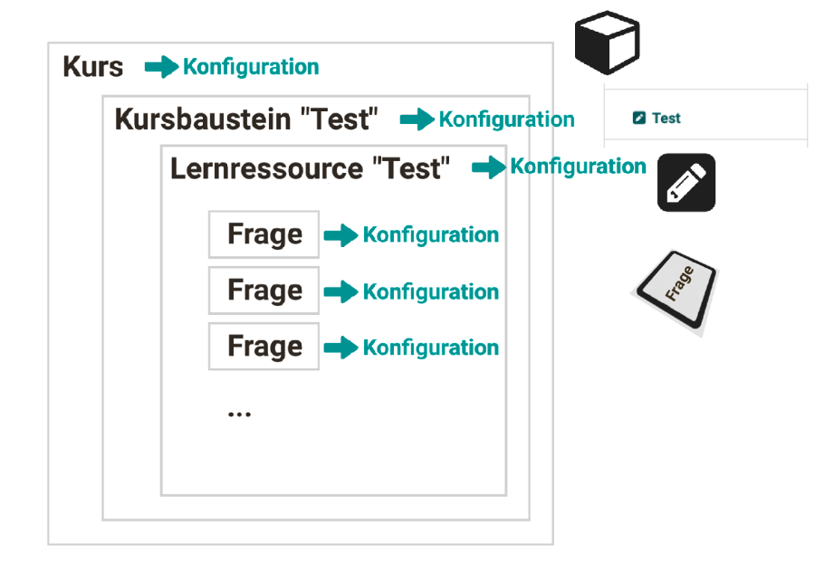

# How do I prepare an online exam? {: #exam_preparation}

??? abstract "Aim and content of these instructions"

    You have already created a course using a test course module and now want to administer an exam. 
    To help you prepare for any potential issues, the following list shows you where and how you can take precautions.

??? abstract "Target group"

    [x] Authors [x] Coaches [ ] Participants

    [x] Beginners [x] Amateurs  [ ] Experts

??? abstract "Expected previous knowledge"

    * ["How do I create my first OpenOlat course?"](../my_first_course/my_first_course.md)
    * ["How do I proceed when creating a test?"](../test_creation_procedure/test_creation_procedure.md)

---

## Initial situation {: #initial_situation}

You have already

- created a course (see ["How do I create my first OpenOlat course?"](../my_first_course/my_first_course.md)),
- inserted a "Test" course element into this course (see ["5. Adding course elements"](../my_first_course/my_first_course.md#5-add-course-elements)),
- completed a test learning resource with all questions and inserted it into the course element
(see ["6. Configuring course elements and adding learning resources"](../my_first_course/my_first_course.md#6-configure-course-elements-and-add-learning-resource)).

Now it is a matter of planning and conducting an exam with this course/test. To make sure you are prepared for potential problems, the following list shows you where a stumbling block might lie and how you can take precautions.

[Go to the top of the page ^](#exam_preparation)

---

## How do I configure my exam? {: #config_exam}

The settings (configuration) are made in various places and on various levels.

{ class="shadow lightbox" }

**Course** level 
On this level you define, for example, when the overall course counts as "passed". 
**Authoring area > select course > Administration > Settings**

**Course element** level 
The "Test" course element is used for exams. Within a course there can be several test course elements, e.g. an entry test, tests per topic area, and a final test. Each test course element can be configured differently, e.g. whether the assessment should be done automatically or manually. 
**Authoring area > select course > Administration > Course editor > select course element > various tabs**

**Learning resource** level 
A test learning resource can be used in various course elements. All settings (e.g. the number of permitted attempts) are then carried over into the respective course element, but can be overridden there. 
**Authoring area > select learning resource > Administration > Settings**

**Question** level 
On the level of a question you define, for example, feedback. 
**Authoring area > select learning resource > Administration > Edit content > select question > various tabs**

[Go to the top of the page ^](#exam_preparation)

---

## Can I run through the exam once as a trial? {: #test_run}

As an author, you understandably want to first call up a completed test yourself as a trial or have someone check it. However, this leads to a problem:

As soon as a test has been filled in and completed once by exam participants, results are saved. If the test is subsequently expanded, e.g. by one question, these participants will have worked on and completed a different version. They may not have passed the test according to the new, expanded version, but were never able to see and answer the additionally added questions. Tests changed after the fact would constitute forgery of documents, which is why OpenOlat does not allow any editing of tests once they have been used.

As long as you as an author switch to the participant view and do not save any results, the test counts as "unused". 
However, if you have your test filled in as a trial "under real conditions" or by selected people, the test learning resource counts as "used" and can no longer be modified. You should be aware of this.

If you nevertheless want to do a trial run with your test, your way out is to create a copy of the test learning resource and test with that copy. This way the actual test remains "unused" and you can continue to modify the learning resource.

You can find more information on how to proceed here:
[How do I exchange a test? >](../../manual_how-to/exchange_tests/exchange_tests.md) 

[Go to the top of the page ^](#exam_preparation)

---

## How is the exam started and ended? {: #start_end_exam}

The start and the duration of the exam are determined by the entries in the configuration of the [assessment mode](../../manual_user/learningresources/Assessment_mode.md).

An assessment mode can be activated and deactivated automatically or manually. This is preset by the authors.
For an automatic start and end, a corresponding time window must be set up under 
**Administration > Assessment management > "Assessment mode configuration" tab**

If a manual start/end by coaches is desired, the assessment mode can be started and ended under
**Administration > Assessment management > "Assessment mode configuration" tab**
by clicking the **Start button**. 
As soon as an assessment mode has been activated, an "End" or "End exam" button is displayed. Click one of the two buttons. The status of the assessment mode then switches to "Ended".

[Go to the top of the page ^](#exam_preparation)

---

## What do I do if participants arrive late? {: #participants_too_late}

Your response to this situation depends on how you have planned and configured the exam.

- Was an automatic start and an automatic end of the exam set up?
- Are all participants late, or is it an individual person?

If **all** exam participants start later, the preset automatic end of the exam can possibly still be adjusted. In that case the same settings apply to all participants. With a manual, delayed start, the configured duration stays the same and the end shifts back accordingly.

If **individual participants** arrive late, it is at the discretion of the supervisor to grant an individual extension.

**Procedure, variant 1:**

- In the course, select the assessment tool under Administration.
- There, select the test course element.
- As a coach, you will find all exam participants with their status displayed in the "Participants" tab.
- Select the checkbox in the first column for all affected people. As soon as at least one person is selected, additional buttons are displayed above the list.
- Select the "Extend" button.
- Enter the extension time in minutes.

!!! info "Note on the extension time"

    The extension time can only be granted to people who have already started the test. 
    It applies equally to all selected people.

- For individual persons you will also find the option "Extend test time" under the 3 dots at the end of a row.

**Procedure, variant 2:**

You can also conduct the exam as planned and also allow an automatic end by OpenOlat. After the end, all unaffected people can leave the exam room. Afterwards, as a coach, you can manually reopen the closed exam for the individual persons concerned in the assessment tool and also end it manually after a certain time.

[Go to the top of the page ^](#exam_preparation)

---

## What do I do if technical problems occur? {: #technical_problems}

If technical problems occur, it is important to know the exact cause. A distinction must be made between errors in the infrastructure (outside of OpenOlat) and problems that could occur in OpenOlat itself.

- **Power outage** 
The OpenOlat system itself is not affected by a power outage on the exam participants' devices, since it runs on other servers and is displayed in the browser. In OpenOlat, whatever was saved with the last save operation is secured. When called up again, the last saved state is available once more.

- **WLAN interruptions** 
In the event of network disruptions, the available exam time may have to be extended manually to compensate for the downtime. (Procedure as described under ["What do I do if participants arrive late?"](#participants_too_late).) In order to be able to assess possible disruptions beforehand, a so-called "stress test" can be carried out a few days in advance in the same room, during which, for example, insufficient WLAN bandwidth can be detected.

- **Access to the internet** 
If access to OpenOlat is interrupted for all exam participants, try to see whether other websites are also unreachable. If so, this possibly points to a disruption at the internet provider. In this case, contact your on-site technician for further clarification.

- **Problems in OpenOlat** 
If it is clearly a problem in OpenOlat, you can contact our support (support@openolat.com). 
If OpenOlat is hosted by frentix, you are welcome to inform us about your exam in advance in the case of large numbers of participants, so that our technicians can keep a special eye on your OpenOlat instance during the running exam. 
You can retrieve information about the operating status of our web servers at any time at [https://www.openolat.com/betriebsstatus/](https://www.openolat.com/betriebsstatus/).

[Go to the top of the page ^](#exam_preparation)

---

## What do I do if participants have questions / problems from home during a running exam? {: #communication}

To defuse this possible situation from the outset, it is best to communicate before the start of the exam what participants should do in such a case. 
As a coach, familiarize yourself with OpenOlat's options for [communication during an exam](../../manual_how-to/communication_during_exam/communication_during_exam.md). 
You may also be able to add a note on how to proceed in an emergency and instructions in the exam course itself.

[Go to the top of the page ^](#exam_preparation)

---

## What do I do if participants accidentally end a test too early and can no longer start it? {: #reset_trials}

If it was configured that only 1 attempt is possible, it can happen that participants can no longer start the test after an accidental (too early) end. In this case, proceed as follows:

- In the course, select the assessment tool under Administration.
- There, select the test course element.
- As a coach, you will find all exam participants with their status displayed in the "Participants" tab.
- Click the 3 dots at the end of the row for the person concerned.
- There you will find the option "Reset number of attempts".

[Go to the top of the page ^](#exam_preparation)

---

## What do I do if the assessment mode is configured incorrectly? {: #wrong_config_assessment_mode}

An assessment mode is created and set up under 
**Course → Administration → Assessment management → Assessment mode configuration** 
As long as the assessment mode has not yet been started, it can be edited there.
For an exam that is already running, subsequent editing of the assessment mode is no longer readily possible.

Recommendations:

- During an already running exam, no live change that affects all participants should be made if at all possible.
- Before you change a running assessment mode for all exam participants, you may be able to check the effect of your change on a test account.
- If possible, you should rather end the exam cleanly, set it up correctly anew, and reset the attempt for those affected. 

Procedure:

1. End the exam  (In manual mode, by coaches or course owners with the End button in the assessment tool.)
2. Create a new, correct assessment mode with a manual start/end.  Attention: The start button only becomes visible to coaches once the configured time window has been reached. For an immediate restart, enter a start time that is imminent and choose "manual". 

!!! tip "Tip"

    As preparation for an emergency, you can copy an assessment mode. Create a **copy** of the exam configuration **with a later start time**. This one is editable again and the settings can be set up anew there. However, you must not forget to delete this replacement assessment mode again once the regularly planned exam has been completed successfully.

!!! warning "Not recommended"

    The assessment mode is also ended when the entire course is ended or deleted. However, this is a side effect and not a clean approach.

[Go to the top of the page ^](#exam_preparation)

---

## What do I do if the test duration/period is configured incorrectly? {: #wrong_config_period}

First it must be clarified what can be understood by test duration/period: 
A) the entries in the course element 
B) the entry in the assessment mode

<h3>A) Entries in the Test course element</h3>

**Course → Administration → Course editor → select course element → Learning path tab** 
Each course element in a learning path course can contain an entry regarding release. A time window can be specified within which the course element can be accessed. The entry "to be completed by" defines by when the course element can be opened. If a course element is open and is being worked on while the deadline expires, the element remains open and can continue to be worked on. There is no automatic ending of access. 
**Course → Administration → Course editor → select "Test" course element → Test configuration tab** 
Here you will find a toggle button "Set test period". During this test period the test can be started. As soon as the "to" time is reached, the test is automatically ended. This is the case even if the defined test time has not yet been used up.

Changes in the course editor in these tabs during a running exam should be avoided. As a rule, using the assessment mode is recommended. During an active assessment mode, other activities in OpenOlat are blocked. If only a release and access option in the course element is configured, other courses in OpenOlat can still be accessed.

<h3>B) Entry in the assessment mode</h3>

**Course → Administration → Assessment management → Assessment mode configuration**

This entry refers to the phase in which the assessment mode is active. That is, the time span during which the exam participants can exclusively work on this exam in OpenOlat.

If an assessment mode has already been started, the duration can no longer be changed. With an automatic start, it is also ended automatically according to the set time. With a manual start, it is also ended manually, and you can determine the duration and end of the assessment mode yourself.

<h3>Extending the test time</h3>

In the case of an automatic ending of the assessment mode, the exam time can be extended for participants who have started the test.

- As a coach, select the test course element
- select the Participants tab
- Select all the checkboxes in the first column for the participants who should receive an extension.
- As soon as at least one checkbox is marked, the "Extend" button also appears above the list.
- Once you have clicked "Extend", you can specify in the pop-up window by how many minutes the test time should be extended.

For individual persons, you will also find the option to extend the test time under the 3 dots at the end of a row in the participant list.

!!! note "Note"

    Please note that an extension can only be granted to people who have already started the test. (If a test is, for example, already being corrected, the working time can no longer be extended.)

As a further legitimate option for extending the test time, the disadvantage compensation could also be used. You will also find this option under the 3 dots at the end of a row.

!!! note "Note"

    With a manual, delayed start, the configured duration stays the same and the end shifts back accordingly.

[Go to the top of the page ^](#exam_preparation)

---

## What do I do if test questions were faulty and an adjustment should be made afterwards? {: #questions_with_mistakes}

If an exam has already been worked on by some participants, the exam or a question itself can no longer be changed.

* If it is a simple error (e.g. a typo) that can easily still be communicated to all participants, informing all exam participants is a good option. Either verbally in the exam room or, for example, in the exam chat. (See [communication during an exam](../../manual_how-to/communication_during_exam/communication_during_exam.md)).

* If a question cannot be solved at all because of the error, the way out remains that all participants receive, for example, the full number of points intended for this question. For this, a manual assessment can be carried out in the assessment tool. Inform the participants during the running exam and then grade the question as announced. It is advisable to supplement the awarding of the points with a corresponding comment giving the reason. 
(See ["This is how you assess the solutions starting from a specific course element"](../../manual_user/learningresources/Assessment_of_learners.md#assess_solutions)).

* Is the test so faulty that the test learning resource should be exchanged? 
In this case, note the instructions ["How do I exchange a test?"](../../manual_how-to/exchange_tests/exchange_tests.md).

[Go to the top of the page ^](#exam_preparation)

---

## What can I do about attempts at cheating? {: #fraud_attempts}

Attempts at cheating during an exam can never be 100% ruled out. For exams in a shared room, the supervisors therefore have a special responsibility.

If the exam material allows it, "open book exams" are often also conducted, in which the use of aids is generally permitted. The exam time is then, however, limited in such a way that there is no time for "just-in-time learning".

On the OpenOlat side, a declaration can be presented to the participants for confirmation at the beginning of an exam. In particular, the use of AI tools, for example, must be clearly regulated. It may be possible, for example, to make it a condition that the exam participants must agree to the monitoring and logging of all data traffic to and from their computer during the exam.

A declaration can be set up for individual courses in OpenOlat (in this case the course with the exam) under 
**Administration > Settings > "Terms of use" tab**. 
See also [Course-specific terms of use >](../../manual_user/basic_concepts/Terms_Of_Use.md#define-terms-of-use-for-a-course) 

To block all other activities in OpenOlat after the start of a test, use an [assessment mode](../../manual_user/learningresources/Assessment_mode.md).

To also restrict all other activities on the exam participants' computer after the start of a test, use the [Safe Exam Browser (SEB)](../../manual_how-to/SEB/SEB.md).

In an assessment mode, a restriction to specific IP addresses can also be made. This allows participation in the exam to be limited to the exclusive use of devices in an exam room.

[Go to the top of the page ^](#exam_preparation)

---

## What do I do if the test was accidentally started a second time, but the first attempt should be assessed? {: #asses_other_attempts}

It can happen that exam participants accidentally end a test that has not been fully completed and then start the test a second time. A restart is saved as a second attempt, in which everything can be started again from the beginning. The entries of the previous attempt are not carried over. However, all attempts are saved and can be viewed by coaches and course owners in the assessment tool.

- As a coach or course owner, select the course.
- Open the assessment tool under Administration > Assessment tool.
- Select the relevant test course element.
- Select the "Participants" tab.
- Open the overview of the person concerned by clicking on a name.
- All test attempts of this person are displayed.
- Click the 3 dots at the end of the row for the test attempt. There you can annul the individual test attempts and restore the first attempt.

[Go to the top of the page ^](#exam_preparation)

---

## How can I prepare the inspection of the exam results? {: #assesment_inspection}

In order to be able to create individual exam inspections for test participants after an exam, you must configure the [assessment inspection](../../manual_user/learningresources/Assessment_inspection.en.md) accordingly under 
**Course → Administration → Assessment management → Assessment inspection configuration tab** 
Here you can, for example, define the duration, the display of results, and restrictions.

Coaches can then schedule inspections for individual participants in the assessment tool according to these specifications.

[Go to the top of the page ^](#exam_preparation)

---

## Checklist {: #checklist}

- [x] Exam rules created? (What is allowed and not allowed)
- [x] Exam participants informed about the rules? (Terms of use of a course defined?)
- [x] Communication during the exam clarified beforehand? (e.g. use of the exam chat)
- [x] Procedure for starting and ending the exam clarified in advance? (Automatic? Manual? By whom?)
- [x] Instruction given on how to end the exam?
- [x] Mock exam conducted? With all exam participants?
- [x] Assessment mode configured?
- [x] Safe Exam Browser configured?
- [x] For very large numbers of participants: frentix informed in advance about the exam date?
- [x] Is an exam inspection planned/set up after the exam?

[Go to the top of the page ^](#exam_preparation)

---

## Further information {: #further_information}

[Defining the terms of use of a course >](../../manual_user/basic_concepts/Terms_Of_Use.en.md#nutzungsbedingungen-eines-kurs-definieren) 
[Assessment mode >](../../manual_user/learningresources/Assessment_mode.en.md) 
[How do I prepare an exam with the Safe Exam Browser (SEB)? >](../../manual_how-to/SEB/SEB.en.md) 
[How do I exchange a test? >](../../manual_how-to/exchange_tests/exchange_tests.en.md) 
[Assessment inspection > ](../../manual_user/learningresources/Assessment_inspection.en.md) 

[Go to the top of the page ^](#exam_preparation)

