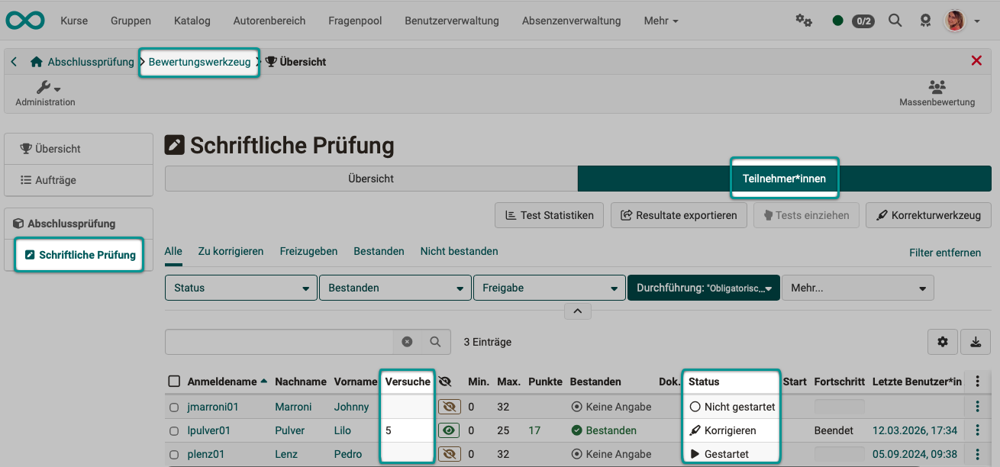
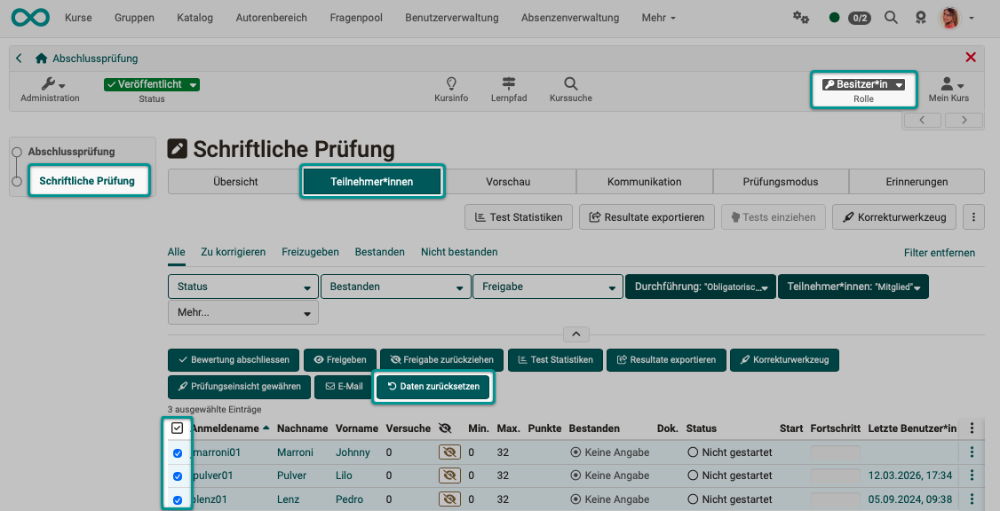
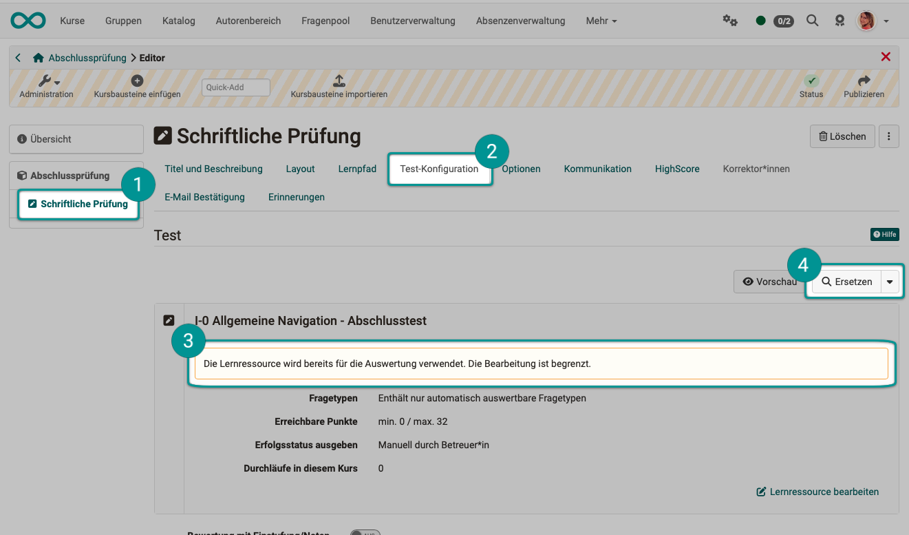
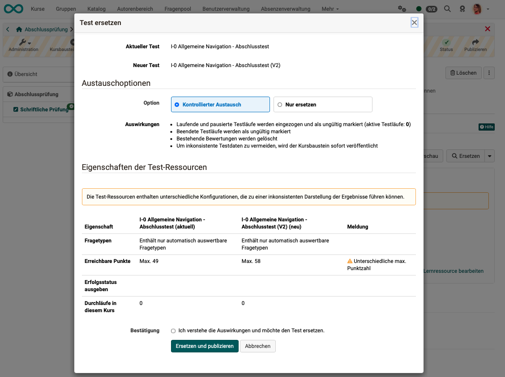

# Wie wechsle ich einen Test aus? {: #exchange_tests}

??? abstract "Ziel und Inhalt dieser Anleitung"

    Diese Anleitung zeigt Ihnen, wie Sie eine Test-Lernressource in einem Test-Kursbaustein durch eine andere ersetzen – und welche Vorbereitungen notwendig sind, wenn bereits Teilnehmer:innen den Test absolviert haben. 

??? abstract "Zielgruppe"

    [x] Autor:innen [x] Betreuer:innen  [ ] Teilnehmer:innen

    [x] Anfänger:innen [x] Fortgeschrittene  [ ] Experten/Expertinnen

??? abstract "Erwartete Vorkenntnisse"

    * ["Wie erstelle ich meinen ersten OpenOlat-Kurs?"](../my_first_course/my_first_course.de.md)
    * ["Wie gehe ich vor, wenn ich einen Test erstelle?"](../test_creation_procedure/test_creation_procedure.de.md)
    * [Bewertungswerkzeug >](../../manual_user/learningresources/Assessment_tool_overview.de.md)

---

## Was muss ich vor dem Austausch wissen? {: #situation}

Ein Test-**Kursbaustein** referenziert immer eine Test-**Lernressource**. Beim Austausch wird diese Referenz auf eine andere Lernressource umgestellt. Die bisherige Test-Lernressource bleibt im System erhalten – sie wird lediglich aus dem Kursbaustein ausgehängt und an ihrer Stelle eine neue Test-Lernressource eingebunden.

**Das zentrale Problem:** Wenn Teilnehmer:innen den Test bereits gestartet oder abgeschlossen haben, existieren Bewertungsdaten, die auf den Inhalt des alten Tests (Fragen, Punktzahlen) abgestimmt sind. Nach dem Austausch passen diese Daten möglicherweise nicht mehr zum neuen Test. Das kann zu Inkonsistenzen in der Bewertung führen.

**Beispiel:** 
Sie möchten in einem Test eine zusätzliche Frage einfügen. Teilnehmer:innen, die den Test noch vor dieser Bearbeitung absolviert haben, konnten die Frage gar nie sehen und Punkte für diese Frage erwerben. In einem bereits von Teilnehmer:innen abgegebenen Test die Fragen nachträglich zu ändern, ist Urkundenfälschung und darf keinesfalls passieren. Deshalb ist eine Veränderung einer benutzten Test-Lernressource durch Autor:innen nicht mehr möglich und wird von OpenOlat blockiert.

Als Faustregel gilt deshalb:

* **Noch kein/keine Teilnehmer:in hat den Test absolviert:** Ein Austausch ist unproblematisch, es sind keine Vorbereitungen notwendig.
* **Teilnehmer:innen haben den Test bereits absolviert:** Vor dem Austausch sorgfältig abwägen. Gegebenenfalls können Daten zurückgesetzt werden. Wenn eine Test-Lernressource ausgetauscht werden soll, gibt es in OpenOlat einen eigenen Prozess, der auch die Archivierung von Daten vor dem Austausch umfasst. 

[zum Seitenanfang ^](#exchange_tests)

---

## Wo nehme ich den Austausch vor? {: #exchange}

Der Austausch erfolgt im **Kurseditor**. Sie benötigen dafür die Rolle **Kursbesitzer:in** oder eine entsprechende Berechtigung zur Kursbearbeitung.

Den Kurseditor öffnen Sie über: 
**Kurs aufrufen > Administration > Kurseditor > Test-Kursbaustein wählen > Tab Testkonfiguration**

!!! info "Voraussetzung"

    Die neue Test-Lernressource muss bereits im System vorhanden sein – entweder selbst erstellt, importiert oder von einer anderen Person freigegeben. Sie können die Test-Lernressource nicht direkt beim Austausch neu erstellen.

[zum Seitenanfang ^](#exchange_tests)

---

## Schritt 1: Vorhandene Testdaten prüfen {: #check_existing_data}

Bevor Sie den Test austauschen, sollten Sie sich im **Bewertungswerkzeug** einen Überblick über die vorhandenen Testdaten verschaffen.

1. Öffnen Sie das Bewertungswerkzeug über **Administration > Bewertungswerkzeug**.
2. Wählen Sie in der linken Seitenleiste den **Test-Kursbaustein**, dessen Test Sie austauschen möchten.
3. Wählen Sie den Button **Teilnehmer:innen**.
4. Prüfen Sie in der Tabelle, ob und wie viele Teilnehmer:innen den Test bereits gestartet oder abgeschlossen haben (Spalten **„Versuche"** und **„Status"**).

{ class="shadow lightbox" }

!!! info "Hinweis"

    Wenn in der Spalte "Versuche" für **alle** Teilnehmer:innen keine Veruche eingetragen sind und der Status **„Nicht gestartet"** ist, sind keine Vorbereitungen notwendig. Sie können direkt mit Schritt 3 fortfahren.

[zum Seitenanfang ^](#exchange_tests)

---

## Schritt 2: Sollen alle Teilnehmer:innen den neuen Test nochmals machen müssen? {: #reset_data}

Auch wenn nur eine einzelne Person den Test "mal probehalber durchgeklickt" hat, gilt die Test-Lernressource bereits als "verwendet" und kann nicht mehr in Struktur und Inhalt abgeändert werden. OpenOlat kann nicht unterscheiden, ob der Testversuch ernst gemeint war oder nicht. 

In einem solchen Fall können auch die Daten einfach zurückgesetzt werden, so dass die Test-Lernressource wieder als "unbenutzt" gilt und ohne Datenverlust ausgetauscht werden kann.
Verwenden Sie dazu den Button **Daten zurücksetzen**. Sie können den Test-Kursbaustein direkt oder im Bewertungswerkzeug auswählen: 
**(Bewertungswerkzeug >) Test-KB wählen > Tab Teilnehmer:innen > Teilnehmer:innen selektieren > Button "Alle Daten zurücksetzen"**

Es ist für Kursbesitzer:innen auch möglich, nur einzelne Tests von bestimmten Personen zurückzusetzen. 

* Selektieren Sie dazu einen (oder auch mehrere oder alle) Namen in der Liste.
* Sobald mindestens ein Name markiert ist, erscheint über der Liste unter anderem auch ein Button "Daten zurücksetzen". 
* Dieser setzt dann nur die Daten der selektierten Teilnehmer:innen zurück. 

{ class="shadow lightbox" }

Je nach Kursbaustein werden folgende Daten zurückgesetzt, beziehungsweise annulliert:

* Fortschritt
* Anzahl Versuche
* Testdurchläufe
* Punkte und Erfolgsstatus
* Freigabe Bewertung
* Erinnerungen

!!! warning "Achtung"

    Das Zurücksetzen von Testdaten ist **nicht umkehrbar**. Beim Zurücksetzen wird eine entsprechende Archivdatei mit den relevanten Daten erstellt und im Anschluss heruntergeladen. Das Archiv steht zusätzlich als Download im Leistungsnachweis der Teilnehmenden zur Verfügung.

Mehr dazu finden Sie im Benutzerhandbuch unter
[Daten zurücksetzen >](../../manual_user/learningresources/Assessment_tool_reset_data.de.md)

[zum Seitenanfang ^](#exchange_tests)

---

## Schritt 3: Lernressource austauschen {: #exchange}

* Öffnen Sie den Kurseditor und wählen Sie den betreffenden Test-Kursbaustein.
* Wählen Sie den Tab "Test-Konfiguration".
* Sie werden darauf hingewiesen, dass die Test-Lernressource bereits für die Auswertung verwendet wird.
* Klicken Sie auf den Button "Ersetzen".
* Wählen, erstellen oder importieren Sie eine neue Test-Lernressource.

{ class="shadow lightbox" }

Nun werden Ihnen die alte und die neue Test-Lernressource gegenübergestellt und Sie haben die Wahl zwischen zwei Austauschoptionen:

* **Kontrollierter Austausch**
* **Nur ersetzen**

{ class="shadow lightbox" }

|                   | Kontrollierter Austausch |  Nur ersetzen  |
| ----------------- | ------------------------ | ------------------------ |
| **Laufende und pausierte Testläufe:** | werden eingezogen und als ungültig markiert | werden eingezogen und als ungültig markiert |
| **Beendete Testläufe:** | werden als ungültig markiert | bleiben gültig |
| **Bestehende Bewertungen:** | werden gelöscht | bleiben unverändert |
| **Veröffentlichung:** | Um inkonsistente Testdaten zu vermeiden, wird der Kursbaustein sofort veröffentlicht | Um inkonsistente Testdaten zu vermeiden, wird der Kursbaustein sofort veröffentlicht   |

[zum Seitenanfang ^](#exchange_tests)

---

## Kurs publizieren {: #publish}

Normalerweise muss nach Arbeiten im Kurseditor ein Kurs bewusst publiziert werden und man verlässt den Editor. Es besteht hier noch die Möglichkeit, gemachte Änderungen wieder zu verwerfen.

Beim Austauschen einer Test-Lernressource muss der Kurs mit dem neuen Test-Kursbaustein nicht mehr publiziert werden. Die Veröffentlichung erfolgt unmittelbar automatisch, damit keine Dateninkonsistenzen entstehen.

Der Schritt "Publizieren" entfällt also in diesem Fall.

[zum Seitenanfang ^](#exchange_tests)

---

## Weiterführende Informationen {: #further_information}

[Test erstellen >](../../manual_user/learningresources/Test.de.md) 
[Daten zurücksetzen >](../../manual_user/learningresources/Assessment_tool_reset_data.de.md) 

[zum Seitenanfang ^](#exchange_tests)

---

## Checkliste {: #checklist}

- [x] Muss die Test-Lernressource zwingend ausgetauscht werden?
- [x] Könnte der Kurs/der Test-Kursbaustein auch kopiert werden? (Damit wieder eine unbenutzte Lernressource vorliegt.)
- [x] Wurde die neue Test-Lernressource bereits im Autorenbereich angelegt?
- [x] Haben Teilnehmende bereits den voherigen Test bearbeitet? Liegen Daten vor?
- [x] Könnten die Test-Daten zurückgesetzt werden?
- [x] Sollen vorhandene Test-Daten ganz gelöscht werden?
- [x] Wurde ein Archiv der bisher angefallenen Daten erstellt?
- [x] Wurde die Archivdatei an einem passenden Ort abgelegt?
- [x] Sollen die Kurs-Teilnehmer:innen über die neue Version des Tests informiert werden?

[zum Seitenanfang ^](#exchange_tests)

