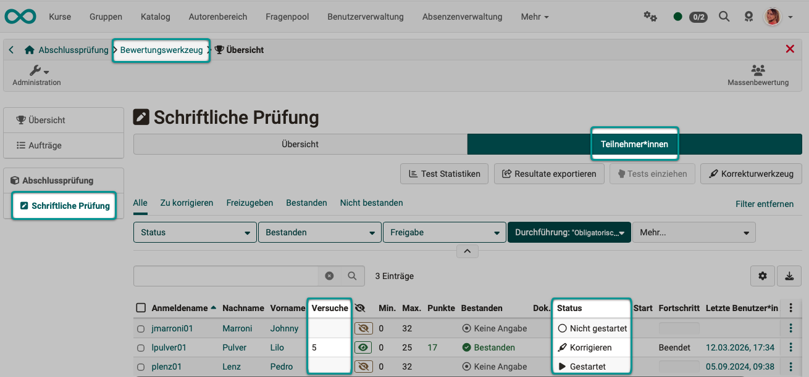
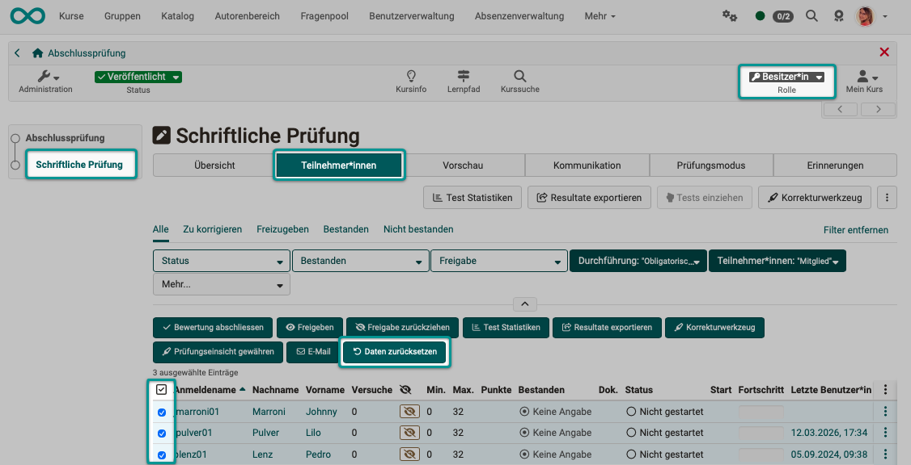
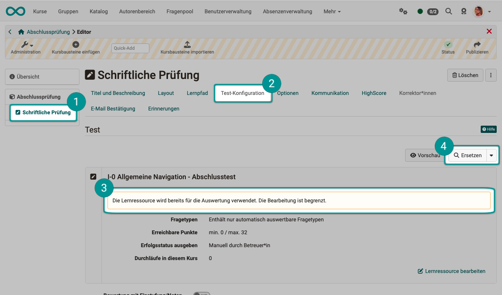
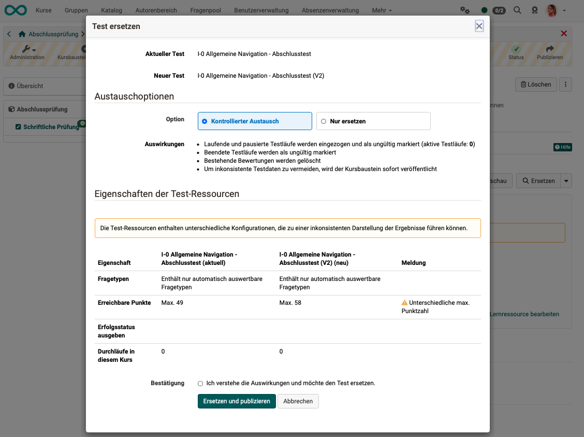

# How do I exchange a test? {: #exchange_tests}

??? abstract "Objectives and content of this instruction"

    This guide shows you how to replace a test learning resource in a "Test" course element with another one and what preparations are necessary if participants have already taken the test.

??? abstract "Target group"

    [x] Authors [x] Coaches  [ ] Participants

    [x] Beginners [x] Advanced users  [ ] Experts

??? abstract "Expected previous knowledge"

    * ["How do I create my first OpenOlat course?"](../my_first_course/my_first_course.md)
    * ["How do I proceed when I create a test?"](../test_creation_procedure/test_creation_procedure.md)
    * [Assessment tool - overview](../../manual_user/learningresources/Assessment_tool_overview.md)

---

## What do I need to know before the exchange? {: #situation}

A "Test" **course element** always references a test **learning resource**. During the exchange, this reference is changed to a different learning resource. The previous test learning resource remains in the system: it is simply unlinked from the course element, and a new test learning resource is linked in its place.

**The main issue:** If participants have already started or completed the test, there is assessment data that is based on the content of the old test (questions, scores). After the exchange, this data may no longer match the new test. This can lead to inconsistencies in the assessment.

**Example:** 
You want to add an extra question to a test. Participants who completed the test before this edit were never able to see the question or earn points for it. Changing questions in a test that has already been submitted by participants constitutes forgery and must not happen under any circumstances. For this reason, OpenOlat restricts editing as soon as a test learning resource is in use: questions can then no longer be added, deleted, copied or moved.

As a rule of thumb, therefore:

* **No participants have taken the test yet:** The exchange is unproblematic; no preparations are necessary.
* **Participants have already taken the test:** Consider this carefully before the exchange. If necessary, data can be reset. If a test learning resource is to be replaced, OpenOlat has a specific process for this that also includes archiving data before the exchange.

[To the top of the page ^](#exchange_tests)

---

## Where do I make the exchange? {: #exchange}

The exchange takes place in the **course editor**. To do this, you need the **course owner** role or the appropriate permission to edit the course.

To open the course editor, go to: 
`Course > Administration > Course editor > Course element "Test" > Tab "Test configuration"`

!!! tip "Requirement"

    The new test learning resource must already exist in the system, either created by you or shared by someone else. Alternatively, you import it as a test file during the exchange. You cannot create a new test learning resource during the exchange.

[To the top of the page ^](#exchange_tests)

---

## Step 1: Check existing test data {: #check_existing_data}

Before replacing the test, you should use the **assessment tool** to get an overview of the existing test data.

1. Open the assessment tool via `Course > Administration > Assessment tool`.
2. In the left sidebar, select the "Test" course element whose test you want to replace.
3. Select the **Participants** button.
4. Check the table to see if any participants have already started or completed the test, and how many (columns **"Attempts"** and **"Status"**).

{ class="shadow lightbox" title="Participants of a test in the assessment tool" }

!!! info "Important"

    If no attempts are listed in the "Attempts" column for **all** participants and the status is **"Not started"**, no preparations are necessary. You can proceed directly to step 3.

[To the top of the page ^](#exchange_tests)

---

## Step 2: Should all participants have to take the new test again? {: #reset_data}

Even if only one person has "clicked through" the test "just to try it out", the test learning resource is already considered "used" and can only be edited to a limited extent. OpenOlat cannot tell whether the test attempt was serious or not.

In such a case, reset the participants' data. The participants then start the test over and no longer see earlier attempts and results. The test learning resource is still considered used, however, and can only be edited to a limited extent.

To do this, use the **Reset data** button. You can select the "Test" course element directly in the course or in the assessment tool: 
`(Assessment tool >) Select course element "Test" > Tab "Participants" > Select participants > Button "Reset data"`

Among others, course owners and persons who have been assigned the "Assessment tool" right in the course may reset data. Coaches without this right do not see the button.

You can also reset only the tests of certain individuals.

* To do this, select one (or more, or all) of the names in the list.
* Once at least one name is selected, a "Reset data" button appears above the list, along with other options.
* This then resets only the data of the selected participants.

{ class="shadow lightbox" title="Participants tab in the Test course element" }

Depending on the course element, OpenOlat resets the following data:

* Progress
* Number of attempts
* Test runs
* Points and success status
* Approval Rating
* Reminders

!!! warning "Attention"

    Resetting test data is **irreversible**. When resetting, a corresponding archive file with the relevant data is created and downloaded afterwards. The archive is also available as a download in the participant's evidence of achievement record.

For more information, see the user manual under: 
[Assessment tool - reset data >](../../manual_user/learningresources/Assessment_tool_reset_data.md)

[To the top of the page ^](#exchange_tests)

---

## Step 3: Exchange learning resources {: #exchange_resource}

1. Open the course editor and select the relevant "Test" course element.
2. Select the "Test configuration" tab. If the test learning resource is already in use, OpenOlat displays the note "The learning resource is already used for the assessment. Editing is limited."
3. Click the "Replace" button and select an existing test learning resource. Via the arrow next to "Replace", you import a test file instead.

{ class="shadow lightbox" title="Test configuration tab in the course editor" }

If the course element cannot be published, OpenOlat refuses the replacement with the message "Before the test resource can be replaced, the course element must be publishable."

If the course element has already been published, OpenOlat opens the "Replace test" dialog. It shows the current and the new test side by side and offers two options under "Replacement options":

* **Controlled replacement**
* **Replace only**

{ class="shadow lightbox" title="Replace test dialog" }

|                   | Controlled replacement |  Replace only  |
| ----------------- | ------------------------ | ------------------------ |
| **Ongoing and suspended test runs:** | are collected and marked as invalid | are collected and marked as invalid |
| **Finished test runs:** | are marked as invalid | remain valid |
| **Existing assessments:** | are deleted | remain unchanged |
| **Publication:** | To avoid inconsistent test data, the course element is published immediately | To avoid inconsistent test data, the course element is published immediately   |

With a controlled replacement, OpenOlat first creates an archive file with the data of the course element and downloads it.

Under "Properties of the test resources", the dialog compares the two tests, for example the question types and the achievable points. It marks differences in the "Message" column.

Finally, activate the checkbox "I understand the impact and would like to replace the test." and click "Replace and publish".

[To the top of the page ^](#exchange_tests)

---

## Publish course {: #publish}

After working in the course editor, you normally publish a course yourself and then exit the editor. Until then, you can discard the changes you have made.

When you exchange the test via the "Replace test" dialog, OpenOlat publishes the course element immediately with the "Replace and publish" button, so that no data inconsistencies arise. A separate "Publish" step is not necessary in this case.

If the course element has never been published, OpenOlat replaces the test learning resource without this dialog. Then publish the course as usual.

[To the top of the page ^](#exchange_tests)

---

## Checklist {: #checklist}

- [x] Is it absolutely necessary to replace the test learning resource?
- [x] Could the course be copied, with the option "Copy" for the test? (Only this creates an unused test learning resource. With "Reuse", the copy uses the same test.)
- [x] Has the new test learning resource already been created in the authoring area?
- [x] Have participants already taken the previous test? Is data available?
- [x] Is it possible to reset the test data?
- [x] Should existing test data be completely deleted?
- [x] Has an archive of the data collected so far been created?
- [x] Was the archive file saved in a suitable location?
- [x] Should the course participants be informed about the new version of the test?

[To the top of the page ^](#exchange_tests)

---

## Further information {: #further_information}

["How do I create my first OpenOlat course?" >](../my_first_course/my_first_course.md) 
["How do I proceed when I create a test?" >](../test_creation_procedure/test_creation_procedure.md) 
[Assessment tool - overview >](../../manual_user/learningresources/Assessment_tool_overview.md) 
[Assessment tool - reset data >](../../manual_user/learningresources/Assessment_tool_reset_data.md) 
[Creating Tests >](../../manual_user/learningresources/Test.md) 
[Course Element "Test" >](../../manual_user/learningresources/Course_Element_Test.md) 
["How do I prepare an online exam?" >](../exam_preparation/exam_preparation.md)

[To the top of the page ^](#exchange_tests)
