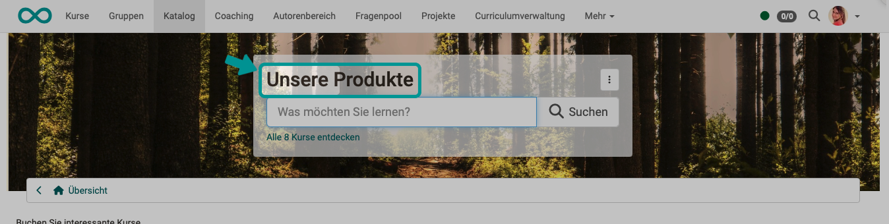

# Wie verwende ich das Sprachanpassungswerkzeug? {: #how_to_use} 

??? abstract "Ziel und Inhalt dieser Anleitung"

     Diese Anleitung zeigt Ihnen, wie Sie Texte der OpenOlat-Benutzeroberfläche (GUI, Grafisches User Interface) anpassen.

??? abstract "Zielgruppe"

    [ ] Autor:innen [ ] Betreuer:innen  [ ] Teilnehmer:innen  [x] Administrator:innen

    [ ] Anfänger:innen [ ] Fortgeschrittene  [x] Experten/Expertinnen

??? abstract "Erwartete Vorkenntnisse"

    * Erfahrung als Administrator:in
	* Erfahrung mit der Verwendung von Variablen in Programmierumgebungen

## Was ist möglich?

Oft wird innerhalb einer Institution oder Firma eine eigene, interne Ausdrucksweise verwendet. Es ist dann erwünscht, dass diese Ausdrucksweise auch in der Lernplattform verwendet wird. Wenn es die **Inhalte** betrifft, können die **Autor:innen** es berücksichtigen. Für spezifische **Anpassungen der OpenOlat-Oberfläche** selbst, kann das **Sprachanpassungswerkzeug** verwendet werden.

**Beispiel:** 
Im Titel der Suchfeldes zum Katalog soll nicht "Katalog" stehen, sondern "Unsere Produkte".

=== "Standardtext"

    { class="shadow lightbox" }

=== "Angepasster Text"

    { class="shadow lightbox" }

**Das Prinzip dahinter:** 
Alle Texte der OpenOlat-Benutzeroberfläche sind einzeln in Variablen abgespeichert. Der Wert dieser Variablen kann mit dem Sprachanpassungswerkzeug gesetzt werden. So können z.B. für die Verwendung von OpenOlat in einer anderen Sprache die Übersetzungen einfach den entsprechenden Variablen zugeordnet werden. Es wird dann auf der Benutzeroberfläche der Wert der Variable in der anderen Sprache angezeigt. Soll ein Begriff z.B. in der deutschen Sprache abgeändert werden, kann sozusagen "von Deutsch nach Deutsch" übersetzt werden. 

**Was nicht möglich ist:** 
Eingebundene externe Tools können selbstverständlich nicht angepasst werden. Wenn z.B. Microsoft-Word aus OpenOlat heraus aufgerufen wird, kann die Benutzeroberfläche von Word nicht angepasst werden. Dies gilt auch für alle anderen externen Tools.

!!! danger "Nur für Experten!"
	
	Für normale Setups ist die Änderung der Texte in der OpenOlat-Benutzeroberfläche nicht empfohlen. Ausgenommen sind einige Stellen, die oft an institutionsinterne/firmeninterne Sprachgewohnheiten angepasst werden.

	Wenn von Ihnen neu zugewiesene Beschriftungen bereits anderweitig als Begriffe in OpenOlat verwendet werden, kann dies zu sehr viel Verwirrung führen!

	Wenn Schlüsselbegriffe umbenannt werden, finden Sie diese auch nicht mehr in der OpenOlat-Hilfe.
	
	Sind Sie sich also bewusst, dass Sie für die Sprachanpassung ein sehr mächtiges Werkzeug benutzen und setzen Sie es vorsichtig ein.

## Welche Voraussetzungen muss ich mitbringen?

  * Sie müssen in OpenOlat die Rolle als **Administrator:in** haben.
  * Es ist hilfreich, wenn Sie etwas Erfahrung im Umgang mit Variablen in Programmierumgebungen mitbringen.

## Wo rufe ich das Sprachanpassungswerkzeug auf?

Sie finden das Werkzeug in 
**Systemadministration > Customizing > Sprachanpassungswerkzeug** 
Klicken Sie dort auf den Button "Start".

{ class="shadow lightbox"}

Das Sprachanpassungswerkzeug öffnet sich in einem neuen Browser-Fenster. Dies ist vorteilhaft, denn so können Sie zur Kontrolle Ihrer Änderungen immer wieder ins Hauptfenster wechseln.

{ class="shadow lightbox"}

## Schritt 1: Welcher Text soll geändert werden? {: #step1} 

An welcher Stelle befindet sich der Begriff, der geändert werden soll? Um herauszufinden, welche Variable dahinter steckt, muss man genau wissen, welcher Begriff gemeint ist. Im Idealfall kennen Sie den Variablennamen (Schlüssel), hinter dem der gesuchte Begriff oder Text in OpenOlat abgelegt wird. Eine Hilfe dazu ist die [Übersicht der Schlüssel](#keys).

**Beispiel:** 
Der Begriff "Katalog" soll nur im Titel des Suchfeldes zum Katalog geändert werden.

Kennen Sie den Schlüssel nicht, ist es für Nicht-Experten etwas schwierig, die richtige Variable zu finden. Dann müssen Sie den richtigen Schlüssel suchen. 

**a)**  Sprache wählen (ganz oben)

{ class="shadow lightbox"}

Je nach bereits bekannten Informationen können Sie eine der Suchfunktionen nutzen. In der Regel empfiehlt sich die Suche mit Suchbegriff im Bereich rechts unten:

 { class="aside-right"}

**b)** Suchbegriff eingeben

**c) suchen in Übersetzungsschlüssel**: Es wird der Suchbegriff im Variablennamen gesucht. 
**suchen in Übersetzung**: Damit wird im Text der Variable gesucht. 

**Beispiel:** 
Wenn Sie nur den auf dem Bildschirm angezeigten Begriff kennen, suchen Sie besser in "Übersetzung". 
Wenn Sie bereits wissen, dass der Begriff "topnav" im Variablennamen (nicht im Text) enthalten ist, ist Ihre Suche mit der Voreinstellung "Übersetzungsschlüssel" und Eingabe von "topnav" im Suchfeld erfolgreicher.

**d) suchen in Sprache**: Damit wird in den Texten der oben ausgewählten Sprache gesucht. 
**suchen in Anpassung**: Damit beschränkt sich die Suche auf bereits vorgenommene Änderungen innerhalb dieser Sprache.

**e) Pakete**  
Solange Sie nicht wissen, in welchem Variablenpaket sich der zu ändernde Text befindet, wählen Sie "alle Pakete". Wenn Sie später genau wissen, zu welchem Paket der gesuchte Text gehört, können Sie gezielt das entsprechende Paket auswählen. Oft kommt innerhalb eines Paketes der Begriff mehrfach vor.

**f) Unterpakete berücksichtigen** 

**g) Nach Prioritäten sortieren** 

**h) Button "Anzeigen"**: Die Fundstellen werden aufgelistet. (Schritt 2) 
**Button "Anpassen"**: Es wird sofort zum Schritt 3 gewechselt.

!!! hint "Tipp"
	
	Sie können jederzeit durch Klick in die Krümelnavigation wieder zurück, um einen neuen Suchvorgang mit anderer Sucheinstellung zu starten.

	{ class="shadow lightbox"}

## Schritt 2: Zu welchem Variablen-Paket könnte der Begriff gehören? {: #step2} 

Die Variablen sind in Paketen zusammengefasst. Die Suche findet Pakete, in denen die im Suchfeld angegebene Variable oder ihr Text enthalten ist. Das Suchergebnis wird dann weiter gefiltert durch die Angabe der anderen Optionen. 
Klicken Sie auf den Button "Anpassen" um in die Maske zum Anpassen zu gelangen.

**Beispiel:** 
Der Begriff "Katalog" soll nur im Titel des Suchfeldes zum Katalog geändert werden.
Der Katalog ist ein Modul, der Name des gefunden Paketes ist also plausibel.

{ class="shadow lightbox"}

Da die Bezeichnungen der Pakete für Laien manchmal nicht sofort verstäündlich sind, finden Sie nachstehend eine kleine [Übersicht der wichtigsten Pakete](#packages).

## Schritt 3: Welche Variable gehört zu diesem Text? {: #step3} 

Nachdem wir das vermutlich richtige Paket gefunden haben, kann aus einer Dropdown-Liste ein Übersetzungsschlüssel ausgewählt werden. (Eine einzelne Variable, die in diesem Paket enthalten ist.) Hier hilft Probieren weiter. 
Sobald ein Übersetzungsschlüssel (Key) gewählt ist, wird der zugehörige Standard-Variablenwert im oberen Textfeld "Sprache Deutsch" angezeigt (nicht editierbar, da Default-Wert). 
Im unteren Textfeld "Anpassung: Deutsch" kann nun der neue Text eingegeben werden, der zu dieser Variablen gespeichert werden soll. 
**Verwenden Sie die Buttons "Weiter" und "Zurück" am unteren Rand, um durch die Schlüssel (Variablen) zu blättern.**

{ class="shadow lightbox"}

!!! hint "Tipp"
	
	Häufig geänderte Variablen und die Pakete, denen sie zugeordnet sind, finden Sie nachstehend in einer kleinen [Übersicht der Schlüssel](#keys).

## Schritt 4: Muss der Begriff noch an anderen Stellen geändert werden? {: #step4} 

Vergessen Sie nicht zu speichern. Kontrollieren Sie dann die gemachte Änderung. Häufig kommt ein Begriff an mehreren Stellen vor. Zu jeder Stelle, an der er auf der OpenOlat-Benutzeroberfläche angezeigt wird, gibt es im Normalfall eine eigene Variable. Das heisst, eventuell müssen die Werte mehrerer Variablen geändert werden.

## Schritt 5: Text in den anderen Sprachen anpassen {: #step5} 

OpenOlat-Benutzer:innen können im persönlichen Menü die Sprache der OpenOlat-Oberfläche ändern. Damit die gemachte Änderung auch nach dem Umstellen auf eine andere Sprache enthalten ist, müssen die betroffenen Variablen auch in den anderen Sprachen entsprechend angepasst werden.

**Beispiel:** 
In der deutschprachigen Version wurde "Katalog" zu "Unsere Produkte". In der englischsprachigen Version soll deshalb auch "Our products" angezeigt werden, statt wie bisher "Catalog".

Sie kennen bereits die Variable und das Paket, in dem sie sich befindet. Sie müssen also lediglich die gewünschte Sprache wählen und dann Schritt 3 ausführen.

## Variablen-Pakete {: #packages} 
 
Auf programmtechnischer Seite sind die Texte der Screens in Variablen-Paketen zusammengefasst. Nachstehend eine Zusammenstellung der am häufigsten geänderten Pakete.

| Bereich, in dem die Variablen angezeigt werden |  Bezeichnung des Pakets                 |
| ---------------------------------------------- | --------------------------------------- |
| Hauptmenü (Kopfzeile)                          | org.olat.core.commons.chiefcontrollers  | 
| Login                                          | org.olat.login                          | 

[zu Schritt 2: Zu welchem Variablen-Paket könnte der Begriff gehören? ^](#step2) 
[zum Seitenanfang ^](#how_to_use)

## Häufig geänderte Beschriftungen und ihre Variablen {: #keys} 

| Standardtext    | Stelle, an der die Variable angezeigt wird | Variable/Schlüssel        | im Paket                                |
| ----------------| ------------------------------------------ | ------------------------- | --------------------------------------- |
| Katalog         | Hauptmenü (Kopfzeile)                      | topnav.catalog            | org.olat.core.commons.chiefcontrollers  |
| Katalog         | Hauptmenü (Kopfzeile) Tooltipp             | topnav.catalog.alt        | org.olat.core.commons.chiefcontrollers  |
| Katalog         | Titel des Suchfeldes                       | header.search.title       | org.olat.modules.catalog.ui             |
| Login           | Titel des Login                            | menu.register             | org.olat.login                          |
| Login           | Text unterhalb des Titels im Login         | menu.register.to.use      | org.olat.login                          |

[zu Schritt 3: Welche Variable gehört zu diesem Text? ^](#step3) 
[zum Seitenanfang ^](#how_to_use)

## Formatierungen und Umbrüche in einem Text

Es gibt Variablen, die enthalten nicht nur ein einzelnes Wort, sondern einen Satz oder längeren Text. 
Mit Hilfe von HTML-Code können Sie auch bestimmte Wörter fett oder als Überschrift kennzeichnen. Ebenso kann ein Umbruch mit einem HTML-Tag erzwungen werden.

!!! warning "Änderungsvorbehalt"
	
	Frentix behält sich vor, Variablen und Default-Texte zu ändern. Bei einem Update werden die mit dem Sprachanpassungswerkzeug angepassten Texte der Benutzeroberfläche nicht automatisch nachgeführt.
	

[zum Seitenanfang ^](#how_to_use)

