# How do I use the language adaptation tool? {: #how_to_use}

??? abstract "Goal and content of these instructions"

    These instructions show you how to adapt texts of the OpenOlat user interface (GUI, Graphical User Interface).

??? abstract "Target group"

    [ ] Authors [ ] Coaches  [ ] Participants  [x] Administrators

    [ ] Beginners [ ] Advanced users  [x] Experts

??? abstract "Expected prior knowledge"

    * Experience as administrator
    * Experience with the use of variables in programming environments

## What is possible? {: #possibilities}

An organization often uses its own internal terminology. It is then desirable that this terminology is also used in the learning platform. If it concerns the **content**, the **authors** can take it into account. For specific **customizations of the OpenOlat interface** itself, the **language adaptation tool** can be used.

**Example:** 
The title of the search field for the catalog should not say "Catalog", but "Our products".

=== "Default text"

    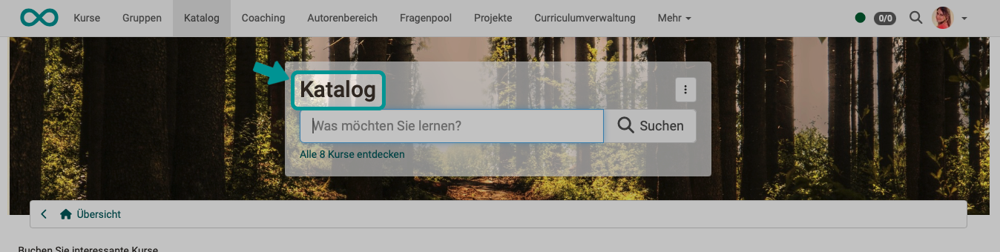{ class="shadow lightbox" title="Catalog with the default text" }

=== "Adapted text"

    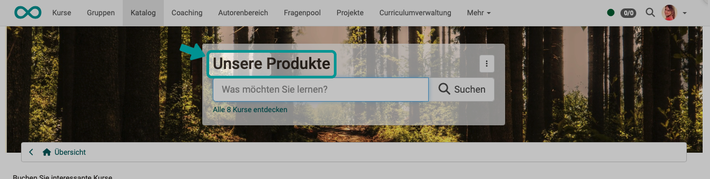{ class="shadow lightbox" title="Catalog with the adapted text" }

**The concept behind this:** 
All texts in the OpenOlat user interface are saved individually in variables. The value of these variables can be set using the language adaptation tool. For example, when using OpenOlat in another language, the translations can simply be assigned to the corresponding variables. The value of the variable in the other language is then displayed on the user interface. If a term is to be changed in German, for example, it can be translated "from German to German", so to speak.

**What is not possible:** 
Of course, integrated external tools cannot be customized. If, for example, Microsoft Word is called from OpenOlat, the Word user interface cannot be customized. This also applies to all other external tools.

!!! warning "Only for experts!"

    For normal setups, changing the texts in the OpenOlat user interface is not recommended. Exceptions are a few places that are often adapted to the internal language habits of an organization.

    If newly assigned labels are already used elsewhere as terms in OpenOlat, this can lead to a lot of confusion!

    If keywords are renamed, you will no longer find them in the OpenOlat help.

    So be aware that you are using a very powerful tool for language adaptation and use it carefully.

## Which requirements should I bring? {: #requirements}

  * You must have the role of **administrator** in OpenOlat.
  * It is helpful if you have some experience in dealing with variables in programming environments.

## Where do I call up the language adaptation tool? {: #language_adaption_tool}

You can find the tool in the system administration under: 
`Administration > Customizing > Language adaptation tool` 
There, click on the button "Start".

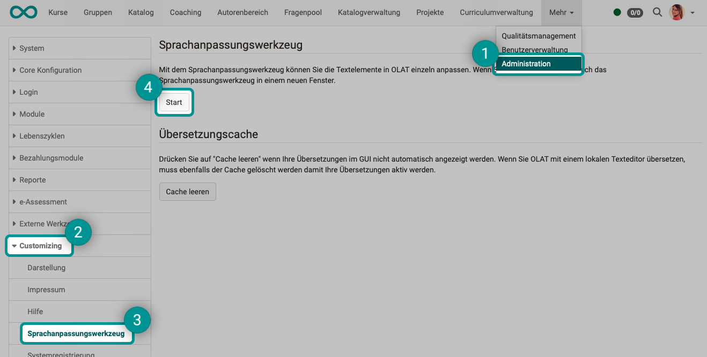{ class="shadow lightbox" title="Language adaptation tool in the system administration" }

The language adaptation tool opens in a new browser window. This is advantageous as you can always switch back to the main window to check your changes.

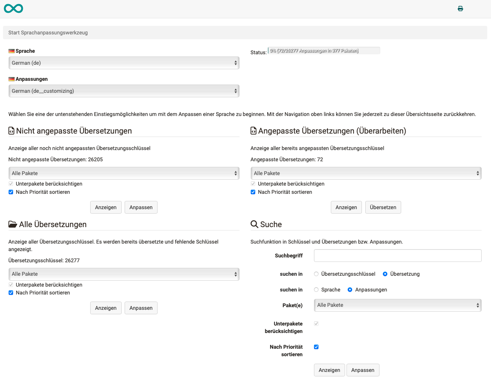{ class="shadow lightbox" title="Start page of the language adaptation tool" }

## Step 1: Which text should be changed? {: #step1}

Where is the term that is to be changed located? To find out which variable is behind it, you need to know exactly which term is meant. Ideally, you know the variable name (key) behind which the term or text you are looking for is stored in OpenOlat. The [Overview of keys](#keys) can help you with this.

**Example:** 
The term "Catalog" should only be changed in the title of the search field of the catalog.

If you do not know the key, it is somewhat difficult for non-experts to find the right variable. Then you have to look for the right key.

**a)** At the very top, in the field "Language", select the language whose text you want to change.

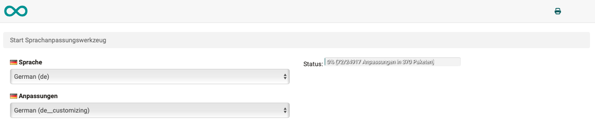{ class="shadow lightbox" title="Language selection in the language adaptation tool" }

**b)** Depending on the information you already know, you can use one of the entry points. As a rule, we recommend the search with a search term in the area "Search" at the bottom right. It offers the following fields:

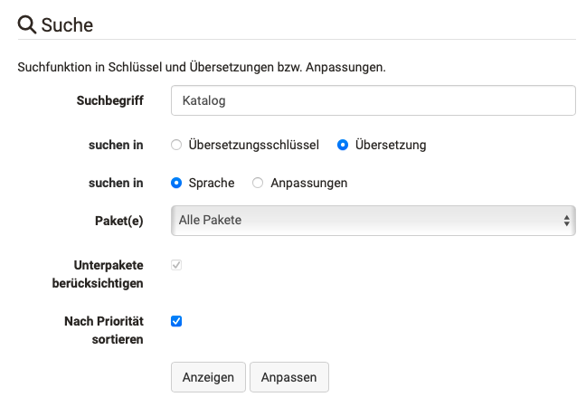{ class="shadow lightbox aside-right" }

#### Search term {: #search_term}

Enter the word you are looking for, for example "Catalog".

#### search in: Translation key or Translation {: #search_in_key_or_translation}

With "Translation key", the search term is searched for in the variable name. With "Translation", the search looks in the text of the variable. The default is "Translation".

**Example:** 
If you only know the term displayed on the screen, search in "Translation". 
If you already know that the term "topnav" is contained in the variable name (not in the text), your search will be more successful with the option "Translation key" and entering "topnav" in the search field.

#### search in: Language or Adaptations {: #search_in_language_or_adaptations}

With "Language", the search looks in the texts of the language selected above. With "Adaptations", the search is limited to changes already made within this language. The default is "Adaptations". If you are looking for a text that you have not adapted yet, select "Language".

#### Package(s) {: #package_selection}

If you do not know in which variable package the text to be changed is located, select "All packages". If you later know exactly which package the text you are looking for belongs to, you can select the relevant package. The term often occurs several times within a package.

#### Consider sub-packages {: #include_subpackages}

With "All packages", the checkbox is always set and cannot be changed. If you have selected a single package, it determines whether the search also includes its sub-packages. Sub-packages are packages whose name begins with the name of the selected package, for example `org.olat.modules.catalog.ui` below `org.olat.modules.catalog`.

#### Sort by priority {: #sort_by_priority}

With the checkbox set, packages and translation keys with a stored priority come first, the others follow in alphabetical order. Without the checkbox, packages and keys are sorted purely alphabetically.

#### Show and Adapt {: #show_and_adapt}

The button "Show" lists the locations found (step 2). The button "Adapt" switches directly to step 3.

!!! tip "Tip"

    You can go back at any time by clicking in the breadcrumb navigation to start a new search process with a different search setting.

    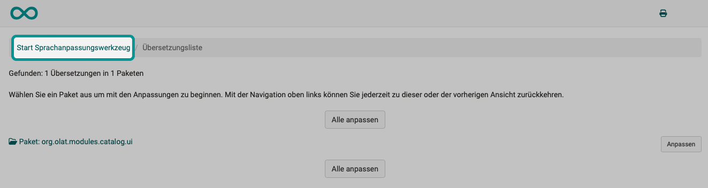{ class="shadow lightbox" title="Breadcrumb navigation in the language adaptation tool" }

## Step 2: Which variable package could the term belong to? {: #step2}

The variables are grouped together in packages. The search finds packages that contain the variable specified in the search field or its text. The search result is then further filtered by specifying the other options. 
Click on the "Adapt" button to access the screen for adapting.

**Example:** 
The term "Catalog" should only be changed in the title of the search field of the catalog.
The catalog is a module, so the name of the package found is plausible.

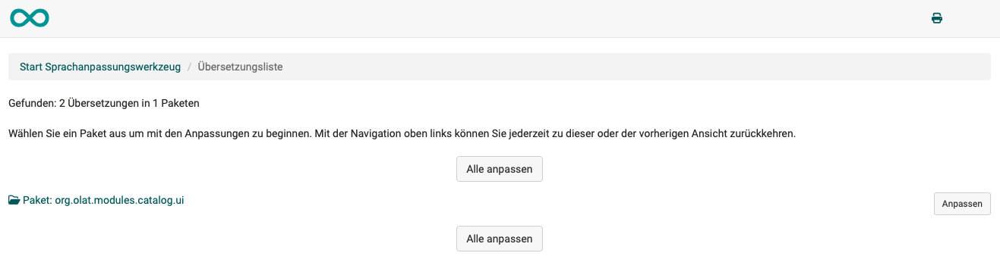{ class="shadow lightbox" title="Translation list after the search" }

As the names of the packages are sometimes not immediately understandable for laymen, you will find a small [overview of the most important packages](#packages) below.

## Step 3: Which variable belongs to this text? {: #step3}

Once we have found the package that is probably correct, a translation key can be selected from a drop-down list. (A single variable that is contained in this package.) Trial and error helps here. 
As soon as a translation key is selected, the corresponding standard variable value is displayed in the upper text field "Language: German" (cannot be edited as it is the default value). 
The new text to be saved for this variable can now be entered in the lower text field "Adaptations: German". The button "Copy from reference" copies the standard text into this field, where you change it. 
With the checkbox "Activate" next to "Comparative language", you display the text of another language for checking. 
**Use the "Next" and "Back" buttons at the bottom to scroll through the keys (variables).**

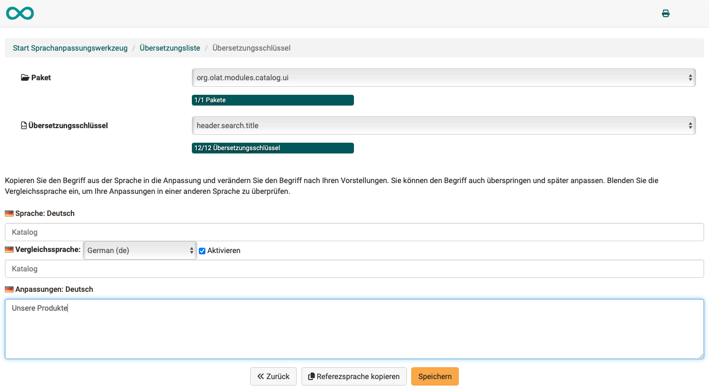{ class="shadow lightbox" title="Editing screen of a translation key" }

!!! tip "Tip"

    Frequently changed variables and the packages to which they are assigned can be found below in a small [Overview of keys](#keys).

## Step 4: Does the term need to be changed in other places? {: #step4}

Do not forget to save. Then check the changes you have made. A term often occurs in several places. There is normally a separate variable for each position where it is displayed on the OpenOlat user interface. This means that the values of several variables may have to be changed.

## Step 5: Adapt text in the other languages {: #step5}

OpenOlat users can change the language of the OpenOlat interface [in the personal menu](../../manual_user/personal_menu/Settings.md#language). To ensure that the change made is also included after switching to another language, the variables concerned must also be adapted accordingly in the other languages.

**Example:** 
In the German-language version, "Katalog" became "Unsere Produkte". In the English-language version, "Our products" should therefore also be displayed instead of "Catalog".

You already know the variable and the package in which it is located. All you have to do is select the desired language and then carry out step 3.

## Which adaptations have I already made? {: #my_adaptations}

Adaptations accumulate over time. The language adaptation tool shows you at any time which translation keys you have already adapted.

**a)** Open the language adaptation tool in the system administration under: 
`Administration > Customizing > Language adaptation tool` 
with the button "Start".

**b)** At the top, in the field "Language", select the language you want. The field "Adaptations" below follows automatically.

**c)** The block "Adapted translations (revision)" shows the number of your adaptations. Leave the selection on "All packages" and click "Show".

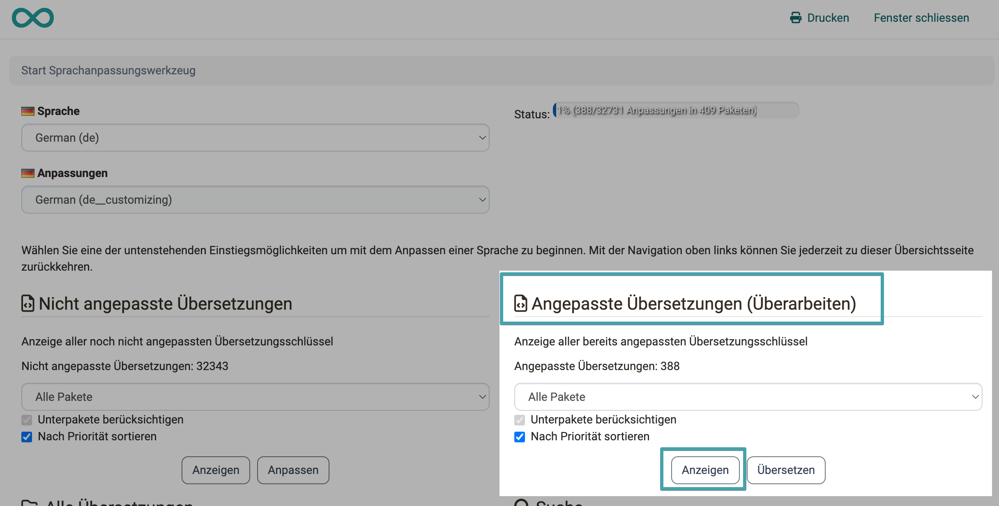{ class="shadow lightbox" title="Entry point Adapted translations on the start page" }

**d)** The translation list shows the number of adaptations and the packages they belong to. With "Adapt" you open the entries of a single package. With "Adapt all" you go through all entries.

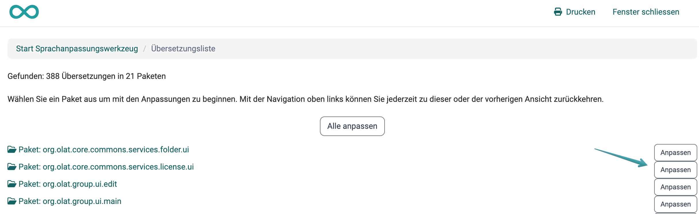{ class="shadow lightbox" title="Translation list of the adaptations" }

**e)** In the editing screen you see the standard text and your adaptation. With "Save & next" you jump to the next entry.

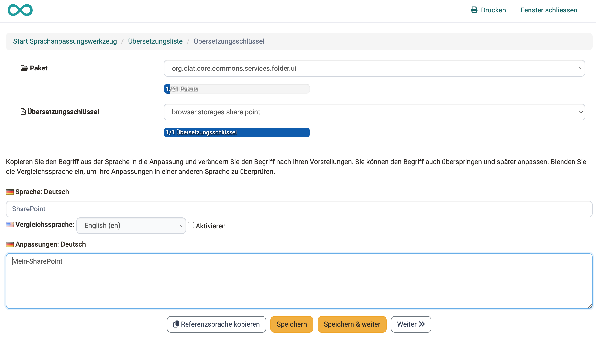{ class="shadow lightbox" title="Editing screen of an adaptation" }

The list always applies to the language selected in the field "Language". Open the list for every language in which you have made adaptations.

If you want to search within your own adaptations only, select the option "Adaptations" at "search in" in the section "Search".

There is no export of the translation list, neither as a table nor as a file. If you want to keep the list, print the displayed translation list from the browser, for example as a PDF. After clicking "Adapt", you step through the filtered entries with "Next" and "Back" without changing anything. The button "Export language packages" in the system administration under `Administration > Core functions > Language and region` exports whole system languages as a language package for another OpenOlat instance. Your adaptations are not included. Find out more under [Language and region](../../manual_admin/administration/Core_functions.md).

!!! tip "Tip"

    In addition, keep your own list of the adapted keys with the reason for each adaptation. This helps you and your successors with the check after an update.

[To the top of the page ^](#how_to_use)

## Variable packages {: #packages}

On the programming side, the texts of the screens are summarized in variable packages. Below is a list of the most frequently changed packages.

| Area in which the variables are displayed      |  Name of the package                    |
| ---------------------------------------------- | --------------------------------------- |
| Main navigation                                | org.olat.core.commons.chiefcontrollers  |
| Login                                          | org.olat.login                          |

[To step 2: Which variable package could the term belong to? ^](#step2) 
[To the top of the page ^](#how_to_use)

## Frequently changed labels and their variables {: #keys}

| Standard text                 | Position at which the variable is displayed              | Variable/Key              | in the package                          |
| ----------------------------- | -------------------------------------------------------- | ------------------------- | --------------------------------------- |
| Catalog                       | Main navigation                                          | topnav.catalog            | org.olat.core.commons.chiefcontrollers  |
| Catalog                       | Main navigation tooltip                                  | topnav.catalog.alt        | org.olat.core.commons.chiefcontrollers  |
| Catalog                       | Title of the search field                                | header.search.title       | org.olat.modules.catalog.ui             |
| OpenOlat - infinite learning  | Title of the login page                                  | login.header              | org.olat.login                          |
| Register here                 | Link to self-registration on the login page              | menu.register             | org.olat.login                          |
| to use OpenOlat               | Text after the link to self-registration                 | menu.register.to.use      | org.olat.login                          |

The login page shows the link to self-registration and the text after it only if self-registration is activated and the option "Display on login page" is set.

[To step 3: Which variable belongs to this text? ^](#step3) 
[To the top of the page ^](#how_to_use)

## Formatting and breaks in a text {: #formatting}

There are variables that contain not just a single word, but a sentence or longer text.
You can also use HTML code to mark certain words in bold or as headings. A line break can also be forced with an HTML tag.

[To the top of the page ^](#how_to_use)

## What happens during an OpenOlat update? {: #update_behaviour}

Your adaptations are stored outside the application and are kept during an update. However, OpenOlat does not update them. If frentix revises a standard text, your adaptation remains unchanged. Your users therefore continue to see your text. Conversely, an improvement of the standard text does not reach them.

With larger changes to the user interface, frentix may rename a translation key, or a position is dropped. Your adaptation then no longer applies and the position appears again in the standard wording.

For this reason, check your adaptations after a larger update. You find the complete list in [Which adaptations have I already made?](#my_adaptations)

[To the top of the page ^](#how_to_use)

## Further information {: #further_information}

[Personal Configuration: Settings >](../../manual_user/personal_menu/Settings.md) 
[Core functions: Overview >](../../manual_admin/administration/Core_functions.md) 
[Customizing: Overview >](../../manual_admin/administration/Customizing.md)

[To the top of the page ^](#how_to_use)
