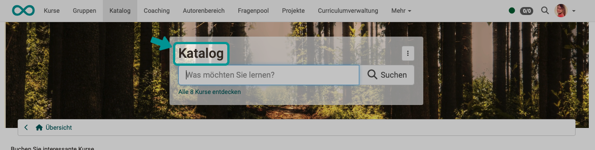
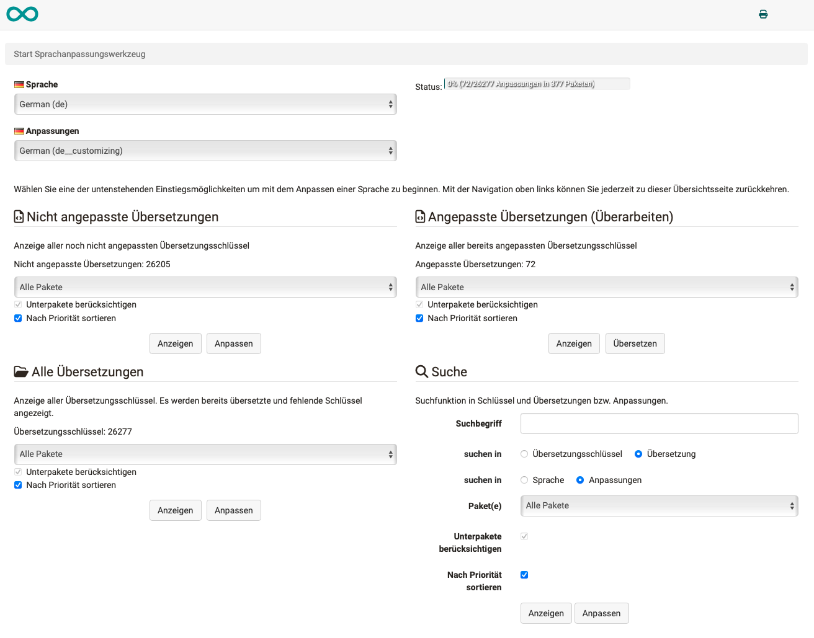
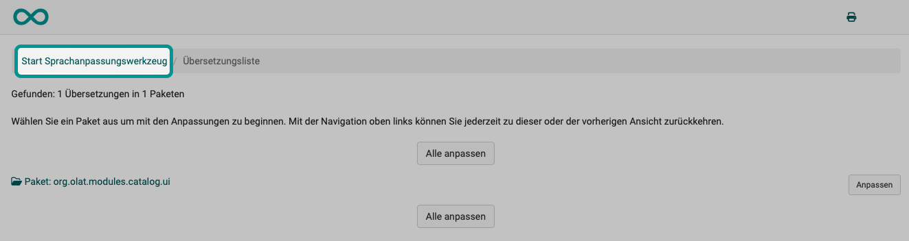

# How do I use the language adaption tool? {: #how_to_use} 

??? abstract "Goal and content of these instructions"

     Diese Anleitung zeigt Ihnen, wie Sie Texte der OpenOlat-Benutzeroberfläche (GUI, Grafisches User Interface) anpassen.

??? abstract "Target group"

    [ ] Authors [ ] Coaches  [ ] Participants  [x] Administrators

    [ ] Beginners [ ] Amateurs  [x] Experts

??? abstract "Expected prior knowledge"

    * Experience as administrator
    * Experience with the use of variables in programming environments

## What is possible?

An institution or company often uses its own internal terminology. It is then desirable that this terminology is also used in the learning platform. If it concerns the **content**, the **authors** can take it into account. For specific **customizations of the OpenOlat interface** itself, the **language customization tool** can be used.

**Example:** 
The title of the search field for the catalog should not say "Catalog", but "Our products".

=== "Standardtext"

    { class="shadow lightbox" }

=== "Angepasster Text"

    { class="shadow lightbox" }

**The concept behind this:** 
All texts in the OpenOlat user interface are saved individually in variables. The value of these variables can be set using the language adaptation tool. For example, when using OpenOlat in another language, the translations can simply be assigned to the corresponding variables. The value of the variable in the other language is then displayed on the user interface. If a term is to be changed in German, for example, it can be translated "from German to German", so to speak. 

**What is not possible:** 
Of course, integrated external tools cannot be customized. If, for example, Microsoft Word is called from OpenOlat, the Word user interface cannot be customized. This also applies to all other external tools.

!!! danger "Only for experts!"
    
    For normal setups, changing the texts in the OpenOlat user interface is not recommended. Exceptions are a few places that are often adapted to internal institutional/company language habits.

    If newly assigned labels are already used elsewhere as terms in OpenOlat, this can lead to a lot of confusion!

    If keywords are renamed, you will no longer find them in the OpenOlat help.
    
    So be aware that you are using a very powerful tool for language adaptation and use it carefully.

## Which requirements should I bring?

  * You must have the role of **administrator** in OpenOlat.
  * It is helpful if you have some experience in dealing with variables in programming environments.

## Where do I call up the language adaptation tool?

You can find the tool under 
**System administration > Customizing > Language adaption tool** 
There, click on the button "Start".

{ class="shadow lightbox"}

The language adaptation tool opens in a new browser window. This is advantageous as you can always switch back to the main window to check your changes.

{ class="shadow lightbox"}

## Step 1: Which text should be changed? {: #step1} 

Wo befindet sich der Begriff, der geändert werden soll? Um herauszufinden, welche Variable dahinter steckt, muss man genau wissen, welcher Begriff gemeint ist. Ideally, you know the variable name (key) behind which the term or text you are looking for is stored in OpenOlat. The [Overview of keys](#keys) can help you with this.

**Example:** 
The term "catalog" should only be changed to catalog in the title of the search field.

If you do not know the key, it is somewhat difficult for non-experts to find the right variable. Then you have to look for the right key. 
**a)**  Select language (at the top)

{ class="shadow lightbox"}

Depending on the information you already know, you can use one of the search functions. As a rule, we recommend searching with the search term in the area at the bottom right:
 { class="aside-right"}

**b)** Enter search term

**c) search in translation key**: The search term in the variable name is searched for. 
**search in translations**: This searches for the variable in the text. 

**Example:** 
If you only know the term displayed on the screen, it is better to search in "Translation". 
If you already know that the term "topnav" is contained in the variable name (not in the text), your search will be more successful with the default setting "Translation key" and entering "topnav" in the search field.

**d) search in language**: This searches in the texts of the language selected above. 
**search in adaptation**: This limits the search to changes already made within this language.

**e) Packages**  
If you do not know in which variable package the text to be changed is located, select "All packages". If you later know exactly which package the text you are looking for belongs to, you can select the relevant package. The term often occurs several times within a package.

**f) Consider sub-packages** 

**g) Sort by priorities** 

**h) Button "Display"**: The locations are listed. (Step 2) 
**Button "Customize"**: The system immediately switches to step 3.

!!! hint "Hint"
    
    You can go back at any time by clicking in the crumb navigation to start a new search process with a different search setting.

    { class="shadow lightbox"}

## Step 2: Which variable package could the term belong to? {: #step2} 

The variables are grouped together in packages. The search finds packages that contain the variable specified in the search field or its text. The search result is then further filtered by specifying the other options. 
Click on the "Customize" button to access the customize screen.

**Example:** 
The term "catalog" should only be changed to catalog in the title of the search field.
The catalog is a module, so the name of the package found is plausible.

{ class="shadow lightbox"}

As the names of the packages are sometimes not immediately understandable for laymen, you will find a small [overview of the most important packages](#packages) below.

## Step 3: Which variable belongs to this text? {: #step3} 

Once we have found the package that is probably correct, a translation key can be selected from a drop-down list. (A single variable that is contained in this package.) Trial and error helps here. 
As soon as a translation key is selected, the corresponding standard variable value is displayed in the upper text field "Language German" (cannot be edited as it is the default value). 
The new text to be saved for this variable can now be entered in the lower text field "Customization: German". 
**Use the "Next" and "Back" buttons at the bottom to scroll through the keys (variables).**

{ class="shadow lightbox"}

!!! hint "Hint"
    
    Frequently changed variables and the packages to which they are assigned can be found below in a small [Overview of keys](#keys).

## Step 4: Does the term need to be changed in other places? {: #step4} 

Do not forget to save. Then check the changes you have made. A term often occurs in several places. There is normally a separate variable for each position where it is displayed on the OpenOlat user interface. This means that the values of several variables may have to be changed.

## Step 5: Adapt text in the other languages {: #step5} 

OpenOlat users can change the language of the OpenOlat interface in the personal menu. To ensure that the change made is also included after switching to another language, the variables concerned must also be adapted accordingly in the other languages.

**Example:** 
In the German-language version, "Catalog" became "Our products". In the English-language version, "Our products" should therefore also be displayed instead of "Catalog" as before.

You already know the variable and the package in which it is located. All you have to do is select the desired language and then carry out step 3.

## Variable packages {: #packages} 
 
On the programming side, the texts of the screens are summarized in variable packages. Below is a list of the most frequently changed packages.

| Area in which the variables are displayed |  Name of the package                 |
| ---------------------------------------------- | --------------------------------------- |
| Main menu (Header)                          | org.olat.core.commons.chiefcontrollers  | 
| Login                                          | org.olat.login                          | 

[to step 2: To which variable package could the term belong? ^](#step2) 
[To the top of the page ^](#how_to_use)

## Frequently changed labels and their variables {: #keys} 

| Standard text    | Position at which the variable is displayed | Variable/Key        | in the package                                |
| ----------------| ------------------------------------------ | ------------------------- | --------------------------------------- |
| Catalog         | Main menu (Header)                      | topnav.catalog            | org.olat.core.commons.chiefcontrollers  |
| Catalog         | Main menu (Header) Tooltipp             | topnav.catalog.alt        | org.olat.core.commons.chiefcontrollers  |
| C'atalog         | Titel of the search field                       | header.search.title       | org.olat.modules.catalog.ui             |
| Login           | Title of the Login                            | menu.register             | org.olat.login                          |
| Login           | Text below the title in the login         | menu.register.to.use      | org.olat.login                          |

[To step 3: Which variable belongs to this text? ^](#step3) 
[To the top of the page ^](#how_to_use)

## Formatting and breaks in a text

There are variables that contain not just a single word, but a sentence or longer text. 
You can also use HTML code to mark certain words in bold or as headings. Wrapping can also be forced with an HTML tag.

!!! warning "Subject to change"
    
    Frentix reserves the right to change variables and default texts. During an update, the user interface texts adapted with the language adaptation tool are not automatically updated.
    

[To the top of the page ^](#how_to_use)

