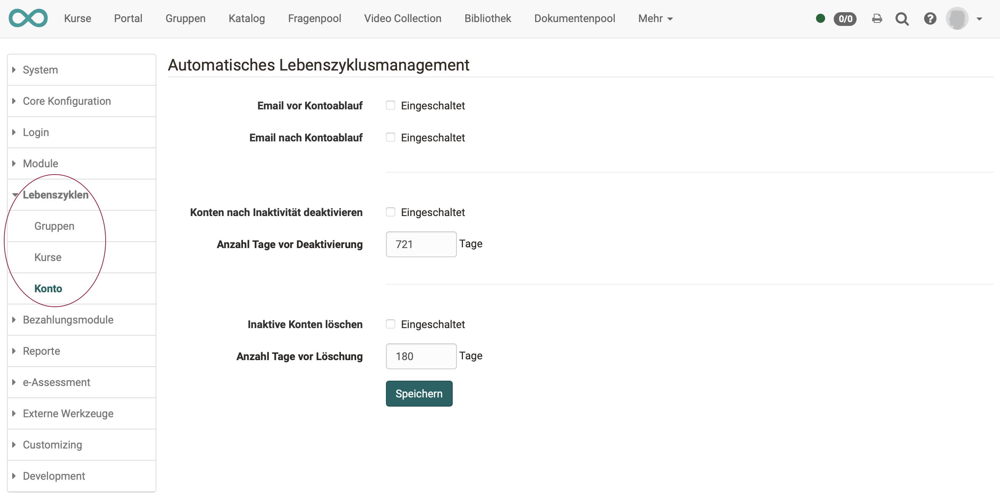
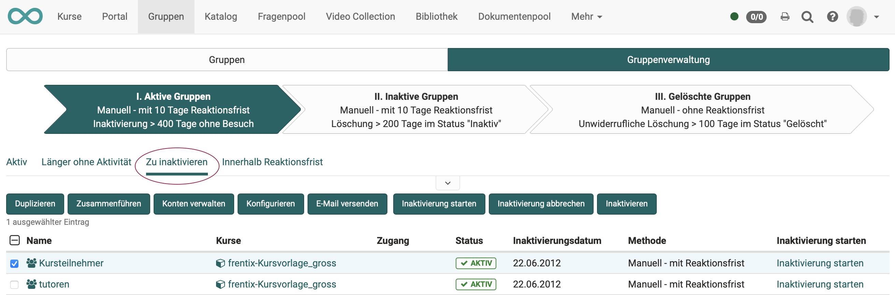
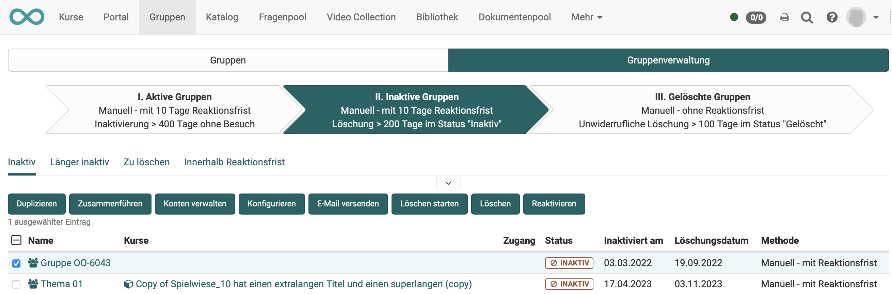
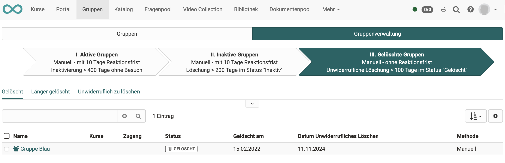
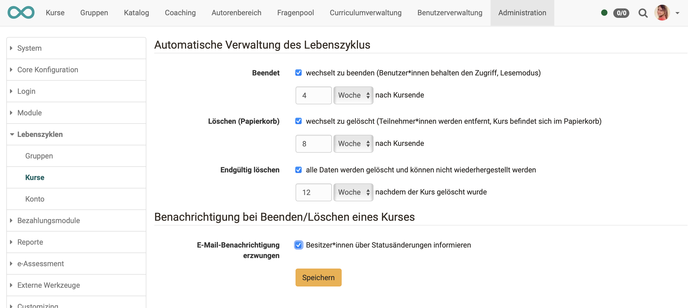
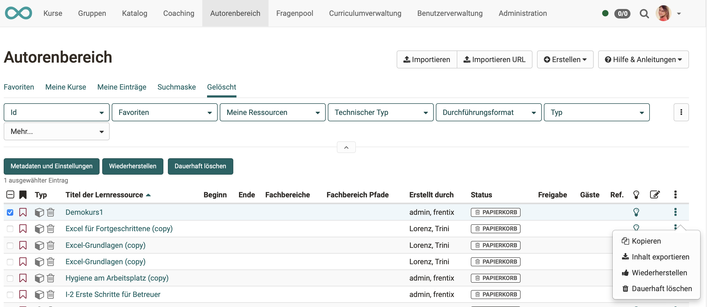
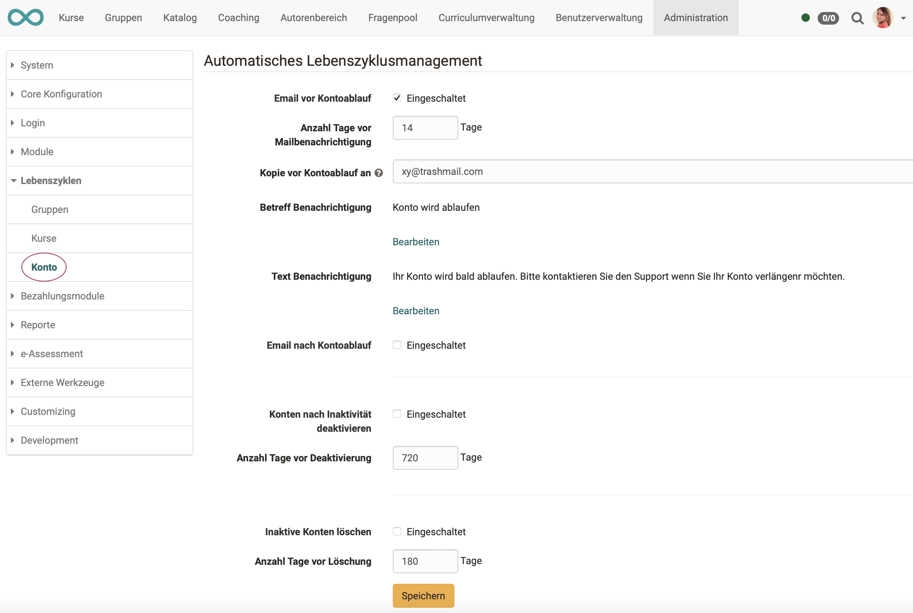

#  Wie manage ich Lebenszyklen von Gruppen, Kursen oder Benutzerkonten?

??? abstract "Ziel und Inhalt dieser Anleitung"

    Sie sollten mit dieser Anleitung

    * wissen, was man in OpenOlat unter Lebenszyklen versteht, 
    * in der Lage sein, ein Lebenszyklenmanagement einzurichten.

??? abstract "Zielgruppe"

    [ ] Autor:innen [ ] Betreuer:innen  [ ] Teilnehmer:innen  [x] Administrator:innen

    [ ] Anfänger:innen [x] Fortgeschrittene  [x] Experten/Expertinnen

??? abstract "Erwartete Vorkenntnisse"

    * Erfahrung als Administrator:in

In OpenOlat kann ein Lebenszyklusmanagement aktiviert werden für

* **Gruppen**
* **Kurse**
* **Benutzerkonten**

OpenOlat überwacht, ob eine Gruppe bzw. ein Kurs länger nicht benutzt wurde oder ein Benutzer lange nicht aktiv war. Nach vorgegebenen Kriterien verschickt es eine Meldung, die erst eine Reaktion und dann z.B. manuelles Löschen ermöglicht. Oder OpenOlat löscht ggf. auch automatisch nach eingestellten Kriterien.
 

## Wo und wie werden die Lebenszyklen eingerichtet?

## Generelle Aktivierung und Einstellung

Die generelle Aktivierung und Festlegung der automatisch ausgeführten Erinnerungen oder Löschungen wird vom Administrator eingestellt unter: 
**Administration > Lebenszyklen**

Auf Grundlage dieser **allgemeinen** Voreinstellungen können dann **für einzelne** Kurse, Gruppen oder Benutzer Lebenszyklen aktviert werden.

{ class="shadow lightbox" }

 

## Gruppen-Lifecycle

Die Betreuung des Gruppen-Lifecycles erfolgt durch Gruppenverwalter im Menü **Gruppen > Tab "Gruppenverwaltung"** 
(auf Grundlage der Voreinstellungen des Administrators).

Klicken Sie im Menü **"Gruppen" > Tab "Gruppenverwaltung"** auf die grossen Pfeile mit der Beschreibung der Schritte. Die Beschreibungen auf den Pfeilen geben die Voreinstellungen des Administrators wieder.

* Im ersten Schritt (1. Pfeil) finden Sie alle aktiven Gruppen aufgelistet. 
* Ihm Tab "Zu inaktivieren" des 1. Pfeils sehen Sie die zur Inaktivierung vorgeschlagenen Kurse (gemäss den Regeln des Administrators).
* Selektieren Sie eine oder mehrere Gruppen, erscheinen Buttons oberhalb der Liste.
* Mit den Buttons über der Liste oder dem Link am Ende einer Listenzeile können Sie nun konkrete einzelne Gruppen inaktivieren und über die bevorstehende Deaktivierung informieren.  

{ class="shadow lightbox" }

 

* Im zweiten Schritt (2. Pfeil) finden Sie alle bereits **inaktiven** Gruppen aufgelistet.
* Wurden vom System Gruppen automatisch auf den Status "inaktiv" gesetzt, besteht hier auch die Möglichkeit, Gruppen wieder zu reaktivieren.  

{ class="shadow lightbox" }

 

* Im dritten Schritt (3. Pfeil) finden Sie alle **gelöschten** Gruppen aufgelistet.
* Diese Liste entspricht dem "Papierkorb". Die Gruppen können nun - automatisch oder manuell - endgültig gelöscht werden.

{ class="shadow lightbox" }

 

## Kurs-Lifecycle 

Die Nutzung des Kurs-Lifecycles kann durch alle Personen erfolgen, die Zugriff auf den Autorenbereich haben.

Grundlage sind die Voreinstellungen des Administrators:

{ class="shadow lightbox" }

 

* Kurse mit dem Status "Gelöscht" werden in einer eigenen Liste "Gelöscht" (= "Papierkorb") gespeichert.   
* Sobald Sie einen Kurs ausgewählt und die Checkbox am Beginn der Zeile markiert haben, erscheinen über der Liste weitere Buttons. Sie können hier einen Kurs wieder herstellen oder endgültig löschen.
* Auch durch Klick auf die 3 Punkte am Ende einer Zeile gelangen Sie zu den Optionen für das Wiederherstellen oder dauerhafte Löschen. 

{ class="shadow lightbox" }

 

## Benutzerkonten-Lifecycle 

Die Nutzung des Benutzerkonten-Lifecycles kann durch alle Personen erfolgen, die Zugriff auf die Benutzerverwaltung haben.

Grundlage sind auch hier die Voreinstellungen des Administrators:

{ class="shadow lightbox" }

 

* Im ersten Schritt können die Konten von Benutzern, die über einen längeren Zeitraum nicht aktiv waren, zunächst deaktiviert und der Benutzerstatus auf "inaktiv" gesetzt werden. Diese Konten erscheinen nun in der Liste "inaktive Benutzer".
* Erfolgt im festgelegten Zeitraum kein erneuter Login, so kann das Benutzerkonto automatisch gelöscht werden.
* Je nach Konfiguration können die Benutzer vor bzw. nach der Deaktivierung oder Löschung des Kontos eine E-Mail mit einem entsprechenden Hinweis erhalten.
* Es können die unterschiedlichen Benachrichtigungstexte im Zusammenhang mit der Kontendeaktivierung formuliert und der Zeitpunkt der Mailbenachrichtigung definiert werden. Ferner kann definiert werden, ob inaktive Benutzer gelöscht werden sollen.

---

## Checkliste

**Gruppen-Lifecycle**

- [x] durch Administrator:in : generelle Aktivierung/Konfiguration unter **Administration > Lebenszyklen > Gruppen** 
- [x] durch Gruppenverwalter:in : Einrichtung im **Menü "Gruppen" > Tab "Gruppenverwaltung"**
- [x] Benachrichtigung der betroffenen Benutzer konfigurieren

**Kurs-Lifecycle**

- [x] durch Administrator:in : generelle Aktivierung/Konfiguration unter **Administration > Lebenszyklen > Kurse** 
- [x] durch alle Personen, die Zugriff auf den Autorenbereich haben: im **Autorenbereich > Tab "Gelöschte"** Kurse markieren und löschen
- [x] Benachrichtigung der betroffenen Benutzer konfigurieren

**Benutzerkonten-Lifecycle**

- [x] durch Administrator:in : Generelle Aktivierung/Konfiguration unter **Administration > Lebenszyklen > Konto** 
- [x] durch alle Personen, die Zugriff auf die Benutzerverwaltung haben: je nach Konfiguration von OpenOlat erkannte inaktive Benutzer manuell deaktivieren/löschen (**Benutzerverwaltung > Benutzer wählen > Tab Konto**)
- [x] Benachrichtigung der betroffenen Benutzer konfigurieren
