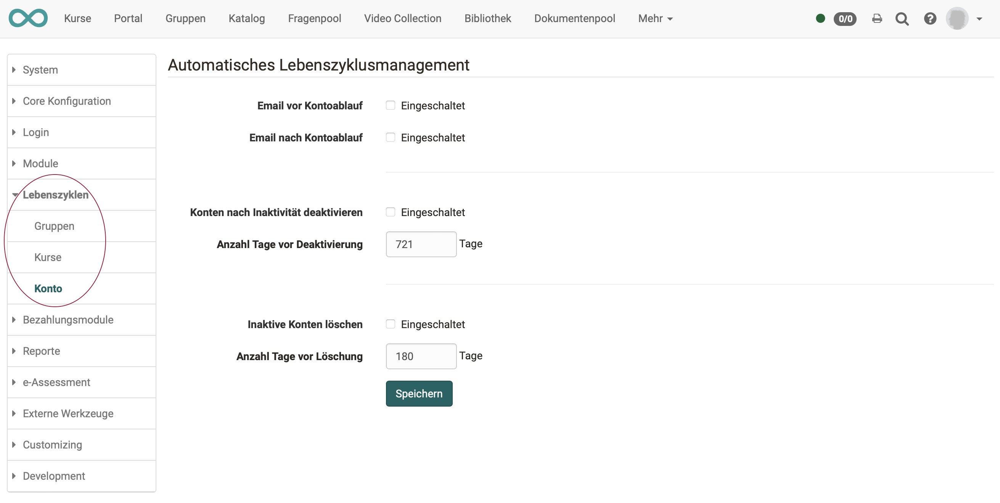
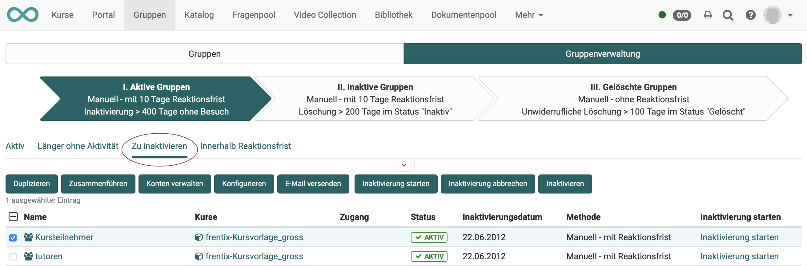
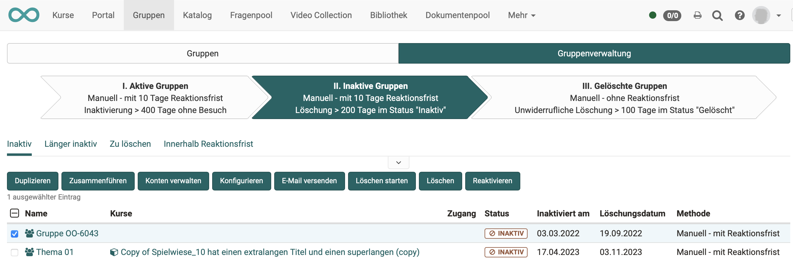
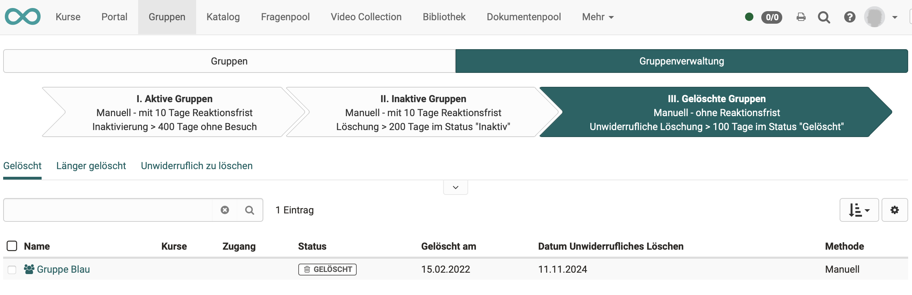
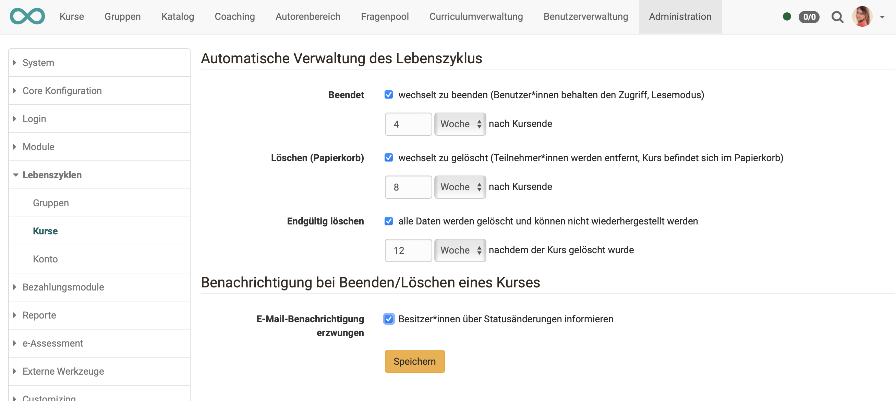
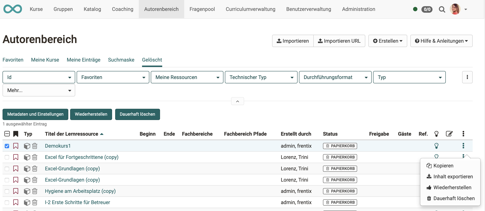
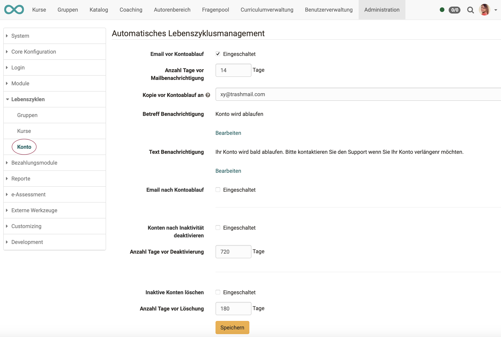

#  Wie manage ich Lebenszyklen von Gruppen, Kursen oder Benutzerkonten?

??? abstract "Ziel und Inhalt dieser Anleitung"

    Sie sollten mit dieser Anleitung

    * wissen, was man in OpenOlat unter Lebenszyklen versteht, 
    * in der Lage sein, ein Lebenszyklenmanagement einzurichten.

??? abstract "Zielgruppe"

    [ ] Autor:innen [ ] Betreuer:innen  [ ] Teilnehmer:innen  [x] Administrator:innen

    [ ] Anfänger:innen [x] Fortgeschrittene  [x] Experten/Expertinnen

??? abstract "Erwartete Vorkenntnisse"

    * Erfahrung als Administrator:in

In OpenOlat kann ein Lebenszyklusmanagement aktiviert werden für

* **Gruppen**
* **Kurse**
* **Benutzerkonten**

OpenOlat überwacht, ob eine Gruppe bzw. ein Kurs länger nicht benutzt wurde oder ein Benutzer lange nicht aktiv war. Nach vorgegebenen Kriterien verschickt es eine Meldung, die erst eine Reaktion und dann z.B. manuelles Löschen ermöglicht. Oder OpenOlat löscht ggf. auch automatisch nach eingestellten Kriterien.
 

## Wo und wie werden die Lebenszyklen eingerichtet?

## Generelle Aktivierung und Einstellung

Die generelle Aktivierung und Festlegung der automatisch ausgeführten Erinnerungen oder Löschungen wird vom Administrator eingestellt unter: 
**Administration > Lebenszyklen**

Auf Grundlage dieser **allgemeinen** Voreinstellungen können dann **für einzelne** Kurse, Gruppen oder Benutzer Lebenszyklen aktviert werden.

{ class="shadow lightbox" }

 

## Gruppen-Lifecycle {: #group_lifestyle} 

Die Betreuung des Gruppen-Lifecycles erfolgt durch Gruppenverwalter im Menü **Gruppen > Tab "Gruppenverwaltung"** 
(auf Grundlage der Voreinstellungen des Administrators).

Klicken Sie im Menü **"Gruppen" > Tab "Gruppenverwaltung"** auf die grossen Pfeile mit der Beschreibung der Schritte. Die Beschreibungen auf den Pfeilen geben die Voreinstellungen des Administrators wieder.

* Im ersten Schritt (1. Pfeil) finden Sie alle aktiven Gruppen aufgelistet. 
* Ihm Tab "Zu inaktivieren" des 1. Pfeils sehen Sie die zur Inaktivierung vorgeschlagenen Kurse (gemäss den Regeln des Administrators).
* Selektieren Sie eine oder mehrere Gruppen, erscheinen Buttons oberhalb der Liste.
* Mit den Buttons über der Liste oder dem Link am Ende einer Listenzeile können Sie nun konkrete einzelne Gruppen inaktivieren und über die bevorstehende Deaktivierung informieren.  

{ class="shadow lightbox" }

 

* Im zweiten Schritt (2. Pfeil) finden Sie alle bereits **inaktiven** Gruppen aufgelistet.
* Wurden vom System Gruppen automatisch auf den Status "inaktiv" gesetzt, besteht hier auch die Möglichkeit, Gruppen wieder zu reaktivieren.  

{ class="shadow lightbox" }

 

* Im dritten Schritt (3. Pfeil) finden Sie alle **gelöschten** Gruppen aufgelistet.
* Diese Liste entspricht dem "Papierkorb". Die Gruppen können nun - automatisch oder manuell - endgültig gelöscht werden.

{ class="shadow lightbox" }

 

## Kurs-Lifecycle {: #course_lifestyle} 

Die Nutzung des Kurs-Lifecycles kann durch alle Personen erfolgen, die Zugriff auf den Autorenbereich haben.

Grundlage sind die Voreinstellungen des Administrators:

{ class="shadow lightbox" }

 

* Kurse mit dem Status "Gelöscht" werden in einer eigenen Liste "Gelöscht" (= "Papierkorb") gespeichert.   
* Sobald Sie einen Kurs ausgewählt und die Checkbox am Beginn der Zeile markiert haben, erscheinen über der Liste weitere Buttons. Sie können hier einen Kurs wieder herstellen oder endgültig löschen.
* Auch durch Klick auf die 3 Punkte am Ende einer Zeile gelangen Sie zu den Optionen für das Wiederherstellen oder dauerhafte Löschen. 

{ class="shadow lightbox" }

 

## Benutzerkonten-Lifecycle {: #user_account_lifecycle}

Die Nutzung des Benutzerkonten-Lifecycles kann durch alle Personen erfolgen, die Zugriff auf die Benutzerverwaltung haben.

Grundlage sind die Voreinstellungen der Administration:

{ class="shadow lightbox" }

 

Der Lebenszyklus eines Benutzerkontos läuft in drei Phasen ab:

* **Kontoablauf** — Ein festes Ablaufdatum wird pro Konto oder systemweit festgelegt. Läuft das Datum ab, wird das Konto deaktiviert oder gelöscht.
* **Deaktivierung** — Konten ohne Login-Aktivität während der konfigurierten Inaktivitätsfrist werden automatisch oder manuell deaktiviert.
* **Löschung** — Nach der Deaktivierungsperiode erfolgt die endgültige Löschung automatisch oder manuell. Je nach Konfiguration kann sie auch ausschliesslich manuell ausgelöst werden.

Zu jeder Phase können Benachrichtigungsmails konfiguriert werden — vor oder nach dem jeweiligen Schritt.

!!! info "Konfiguration in der Administration"
    Fristen, Mailbenachrichtigungen und Automatisierungsgrad für alle drei Phasen werden unter Administration > Lebenszyklen > Konto eingestellt. 
    [Details zum Benutzerkonten-Lebenszyklus](../../manual_admin/administration/Life_cycles_-_Administration.de.md#lifecycle_accounts)

---

## Checkliste {: #checklist} 

**Gruppen-Lifecycle**

- [x] durch Administrator:in : generelle Aktivierung/Konfiguration unter **Administration > Lebenszyklen > Gruppen** 
- [x] durch Gruppenverwalter:in : Einrichtung im **Menü "Gruppen" > Tab "Gruppenverwaltung"**
- [x] Benachrichtigung der betroffenen Benutzer konfigurieren

**Kurs-Lifecycle**

- [x] durch Administrator:in : generelle Aktivierung/Konfiguration unter **Administration > Lebenszyklen > Kurse** 
- [x] durch alle Personen, die Zugriff auf den Autorenbereich haben: im **Autorenbereich > Tab "Gelöschte"** Kurse markieren und löschen
- [x] Benachrichtigung der betroffenen Benutzer konfigurieren

**Benutzerkonten-Lifecycle**

- [x] durch Administrator:in : Generelle Aktivierung/Konfiguration unter **Administration > Lebenszyklen > Konto** 
- [x] durch alle Personen, die Zugriff auf die Benutzerverwaltung haben: je nach Konfiguration von OpenOlat erkannte inaktive Benutzer manuell deaktivieren/löschen (**Benutzerverwaltung > Benutzer wählen > Tab Konto**)
- [x] Benachrichtigung der betroffenen Benutzer konfigurieren
