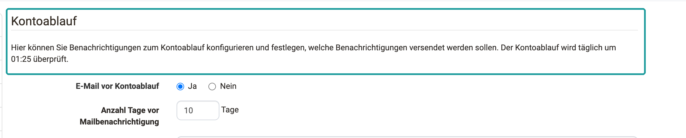
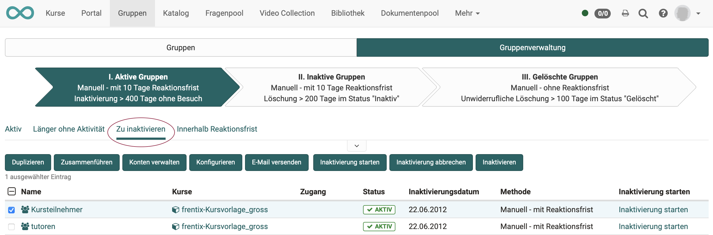
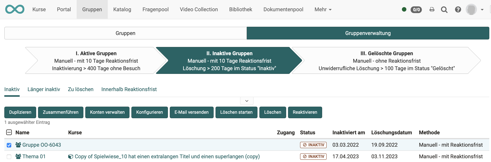
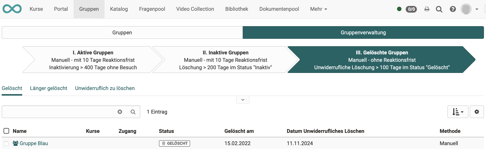
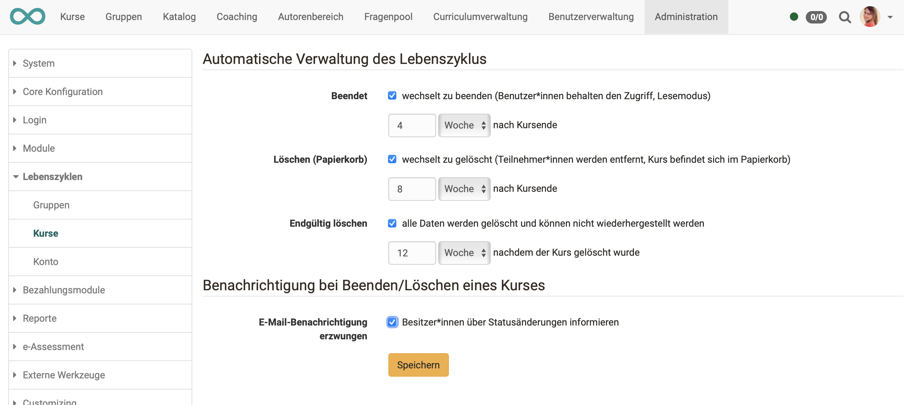
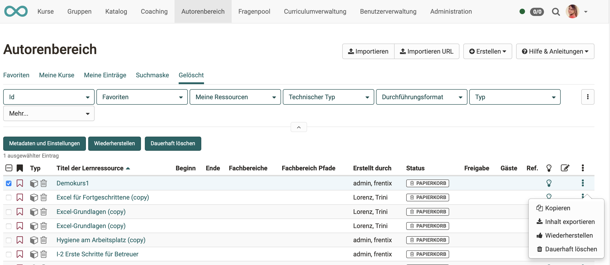
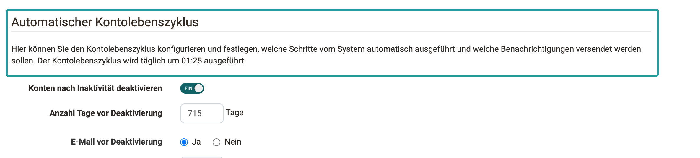

#  Wie manage ich Lebenszyklen von Gruppen, Kursen oder Benutzerkonten? {: #lifecycles}

??? abstract "Ziel und Inhalt dieser Anleitung"

    Sie sollten mit dieser Anleitung

    * wissen, was man in OpenOlat unter Lebenszyklen versteht,
    * in der Lage sein, ein Lebenszyklenmanagement einzurichten.

??? abstract "Zielgruppe"

    [ ] Autor:innen [ ] Betreuer:innen  [ ] Teilnehmer:innen  [x] Administrator:innen

    [ ] Anfänger:innen [x] Fortgeschrittene  [x] Experten/Expertinnen

??? abstract "Erwartete Vorkenntnisse"

    * Erfahrung als Administrator:in

In OpenOlat kann ein Lebenszyklusmanagement aktiviert werden für

* **Gruppen**
* **Kurse**
* **Benutzerkonten**

OpenOlat überwacht, ob eine Gruppe oder ein Kurs länger nicht benutzt wurde oder sich an einem Konto lange niemand mehr angemeldet hat. Nach vorgegebenen Kriterien verschickt es eine Meldung, die erst eine Reaktion und dann z.B. manuelles Löschen ermöglicht. Oder OpenOlat löscht ggf. auch automatisch nach eingestellten Kriterien.

## Stufen/Phasen {: #lifecycle_stages}

Erreicht ein Kurs, eine Gruppe oder ein Konto das "end of life", werden folgende Stufen/Phasen eingehalten:

- **Inaktivierung** 
Bei der Inaktivierung wird der Status von "Aktiv" auf "Inaktiv" gestellt und die Gruppenmitglieder können z.B. nur noch schreibgeschützt auf die Gruppe zugreifen. Inaktive Gruppen, Konten oder Kurse können vollständig reaktiviert werden.
- **Löschung** 
Beim Löschen werden z.B. alle Mitglieder aus der Gruppe und die Verknüpfungen auf Kurse entfernt. Alle restlichen Daten bleiben erhalten und sind einsehbar. Die Gruppe kann wiederhergestellt werden.
- **Endgültige Löschung** 
Beim unwiderruflichen Löschen wird die Gruppe, das Konto oder der Kurs vollständig entfernt.

[Zum Seitenanfang ^](#lifecycles)

---

## Wo und wie werden die Lebenszyklen eingerichtet? {: #lifecycle_setup}

### Generelle Aktivierung und Einstellung {: #lifecycle_activation}

Die generelle Aktivierung und die Festlegung der automatisch ausgeführten Erinnerungen oder Löschungen nimmt die Administration vor. Sie finden die Einstellungen in der System-Administration unter: 
`Administration > Lebenszyklen`

Auf Grundlage dieser **allgemeinen** Voreinstellungen können dann **für einzelne** Kurse, Gruppen oder Konten Lebenszyklen aktiviert werden.

{ class="shadow lightbox" }

[Zum Seitenanfang ^](#lifecycles)

---

### Gruppen-Lifecycle {: #group_lifestyle}

Die Betreuung des Gruppen-Lifecycles erfolgt durch Gruppenverwalter:innen, auf Grundlage der Voreinstellungen der Administration, unter: 
`Gruppen > Tab "Gruppenverwaltung"`

Klicken Sie unter `Gruppen > Tab "Gruppenverwaltung"` auf die grossen Pfeile mit der Beschreibung der Schritte. Die Beschreibungen auf den Pfeilen geben die Voreinstellungen der Administration wieder.

* Im ersten Schritt (1. Pfeil) finden Sie alle aktiven Gruppen aufgelistet.
* Im Reiter "Zu inaktivieren" des 1. Pfeils sehen Sie die zur Inaktivierung vorgeschlagenen Gruppen, gemäss den Regeln der Administration.
* Selektieren Sie eine oder mehrere Gruppen, erscheinen Buttons oberhalb der Liste.
* Mit den Buttons über der Liste oder dem Link am Ende einer Listenzeile können Sie nun konkrete einzelne Gruppen inaktivieren und über die bevorstehende Deaktivierung informieren.

{ class="shadow lightbox" }

 

* Im zweiten Schritt (2. Pfeil) finden Sie alle bereits **inaktiven** Gruppen aufgelistet.
* Wurden vom System Gruppen automatisch auf den Status "inaktiv" gesetzt, besteht hier auch die Möglichkeit, Gruppen wieder zu reaktivieren.

{ class="shadow lightbox" }

 

* Im dritten Schritt (3. Pfeil) finden Sie alle **gelöschten** Gruppen aufgelistet.
* Diese Liste entspricht dem "Papierkorb". Die Gruppen lassen sich hier automatisch oder manuell endgültig löschen.

{ class="shadow lightbox" }

[Zum Seitenanfang ^](#lifecycles)

---

### Kurs-Lifecycle {: #course_lifecycle}

Die Nutzung des Kurs-Lifecycles kann durch alle Personen erfolgen, die Zugriff auf den Autorenbereich haben.

Grundlage sind die Voreinstellungen der Administration:

{ class="shadow lightbox" }

 

* Kurse mit dem Status "Papierkorb" werden im Reiter "Gelöscht" des Autorenbereichs gesammelt.
* Sobald Sie einen Kurs ausgewählt und die Checkbox am Beginn der Zeile markiert haben, erscheinen über der Liste weitere Buttons. Sie können hier einen Kurs wieder herstellen oder endgültig löschen.
* Auch durch Klick auf die 3 Punkte am Ende einer Zeile gelangen Sie zu den Optionen für das Wiederherstellen oder dauerhafte Löschen.

{ class="shadow lightbox" }

[Zum Seitenanfang ^](#lifecycles)

---

### Benutzerkonten-Lifecycle {: #user_account_lifecycle}

Die Nutzung des Benutzerkonten-Lifecycles kann durch alle Personen erfolgen, die Zugriff auf die Benutzerverwaltung haben.

Grundlage sind die Voreinstellungen der Administration:

{ class="shadow lightbox" }

 

Die Konfiguration steht in zwei getrennten Bereichen. Der Bereich **Kontoablauf** greift, wenn ein Konto sein hinterlegtes Ablaufdatum erreicht. Der Bereich **Automatischer Kontolebenszyklus** greift, wenn sich niemand mehr am Konto anmeldet. Es greift, was zuerst eintritt. [:octicons-tag-16:{ title="ab Release 21.1 (OO-8382)" }](https://track.frentix.com/issue/OO-8382)

Daraus ergeben sich drei Phasen:

* **Kontoablauf**: Das Ablaufdatum wird pro Konto hinterlegt. Ist es erreicht, deaktiviert OpenOlat das Konto.
* **Deaktivierung**: Konten ohne Anmeldung während der Inaktivitätsfrist werden automatisch oder manuell deaktiviert.
* **Löschung**: Nach der Deaktivierungsperiode erfolgt die endgültige Löschung automatisch oder manuell. Je nach Konfiguration lässt sie sich auch ausschliesslich manuell auslösen.

Zu jeder Phase können Benachrichtigungsmails konfiguriert werden, vor oder nach dem jeweiligen Schritt.

Wie weit ein einzelnes Konto in diesen Phasen fortgeschritten ist, zeigt der Reiter "Konto" der Person, siehe [Benutzer konfigurieren](../../manual_admin/usermanagement/Configure_User.de.md#automatic_user_lifecycle).

!!! info "Konfiguration in der Administration"

    Fristen, Mailbenachrichtigungen und Automatisierungsgrad für alle drei Phasen stellen Sie in der System-Administration ein unter: 
    `Administration > Lebenszyklen > Konto` 
    [Details zum Benutzerkonten-Lebenszyklus](../../manual_admin/administration/Life_cycles_-_Administration.de.md#lifecycle_accounts)

[Zum Seitenanfang ^](#lifecycles)

---

## Benachrichtigungen {: #lifecycle_messages}

Um unbeabsichtigtes Löschen bestmöglich zu vermeiden, können zu jeder Stufe/Phase der Vorbereitung des Löschens die betroffenen Personen informiert werden.

**Benachrichtigungs-Einstellungen für Kurse:** 
Es kann konfiguriert werden, dass Besitzer:innen über Statusänderungen informiert werden.

**Benachrichtigungs-Einstellungen für Gruppen und Konten:** 

- Mail mit Ankündigung der Inaktivierung
- Reaktionsfrist auf die Ankündigung der Inaktivierung
- Frei definierbarer Benachrichtigungstext zur Ankündigung der Inaktivierung
- Mail mit der Information, dass die Inaktivierung vorgenommen wurde
- Frei definierbarer Benachrichtigungstext nach der Inaktivierung

- Mail mit Ankündigung der Löschung
- Reaktionsfrist auf die Ankündigung der Löschung
- Frei definierbarer Benachrichtigungstext zur Ankündigung der Löschung
- Mail mit der Information, dass die Löschung vorgenommen wurde
- Frei definierbarer Benachrichtigungstext nach der Löschung

- jeweils optionale Mail-Kopie an beliebige Adressen

[Zum Seitenanfang ^](#lifecycles)

---

## Checkliste {: #checklist}

**Gruppen-Lifecycle**

- [x] durch Administrator:in: generelle Aktivierung und Konfiguration in der System-Administration unter `Administration > Lebenszyklen > Gruppen`
- [x] durch Gruppenverwalter:in: Einrichtung unter `Gruppen > Tab "Gruppenverwaltung"`
- [x] Benachrichtigung der betroffenen Benutzer konfigurieren

**Kurs-Lifecycle**

- [x] durch Administrator:in: generelle Aktivierung und Konfiguration in der System-Administration unter `Administration > Lebenszyklen > Kurse`
- [x] durch alle Personen, die Zugriff auf den Autorenbereich haben: unter `Autorenbereich > Tab "Gelöscht"` Kurse markieren und löschen
- [x] Benachrichtigung der betroffenen Benutzer konfigurieren

**Benutzerkonten-Lifecycle**

- [x] durch Administrator:in: generelle Aktivierung und Konfiguration in der System-Administration unter `Administration > Lebenszyklen > Konto`
- [x] durch alle Personen, die Zugriff auf die Benutzerverwaltung haben: erkannte inaktive Konten manuell deaktivieren oder löschen unter `Benutzerverwaltung > "Konto der Person" > Reiter "Konto"`
- [x] Benachrichtigung der betroffenen Benutzer konfigurieren

[Zum Seitenanfang ^](#lifecycles)

## Weiterführende Informationen {: #further_information}

**Auf dieser Seite erwähnt** 
[Lebenszyklen: Administration >](../../manual_admin/administration/Life_cycles_-_Administration.de.md) 
[Benutzer konfigurieren >](../../manual_admin/usermanagement/Configure_User.de.md)

**Weiterführend** 
[Gruppen-Lebenszyklus >](../../manual_admin/administration/Automatic_Group_Lifecycle.de.md) 
[Benutzer:in löschen >](../../manual_admin/usermanagement/Delete_User.de.md)

[Zum Seitenanfang ^](#lifecycles)
