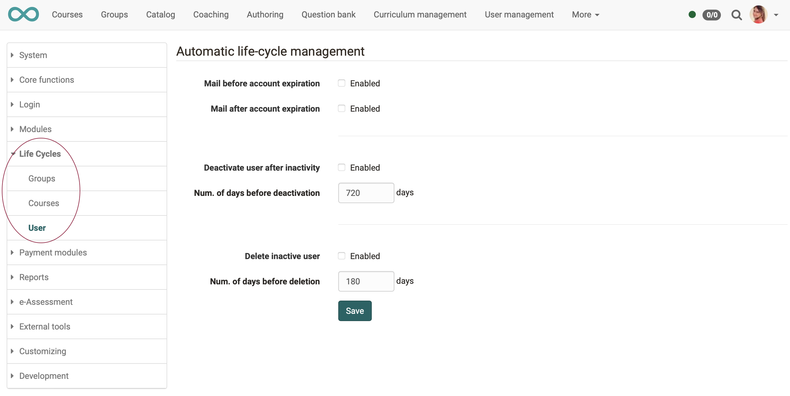
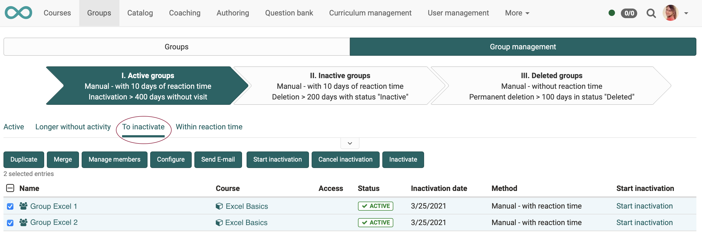
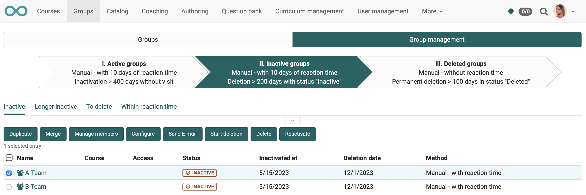
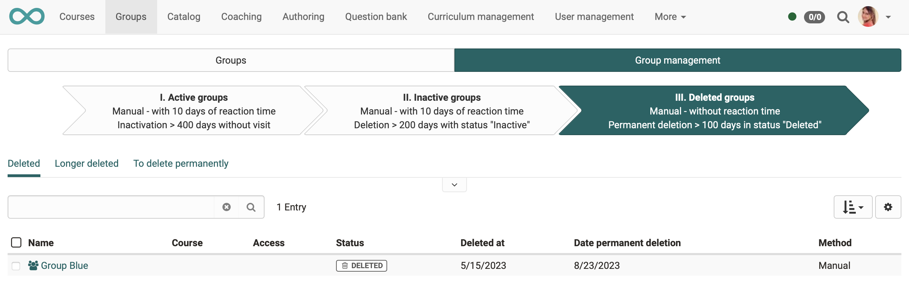
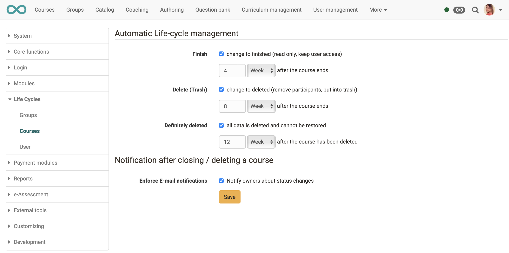
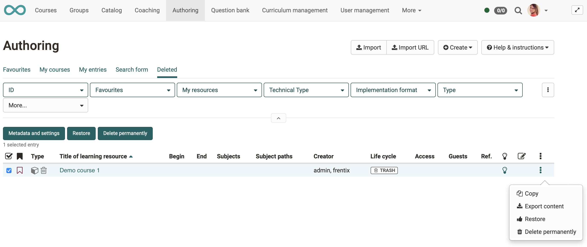
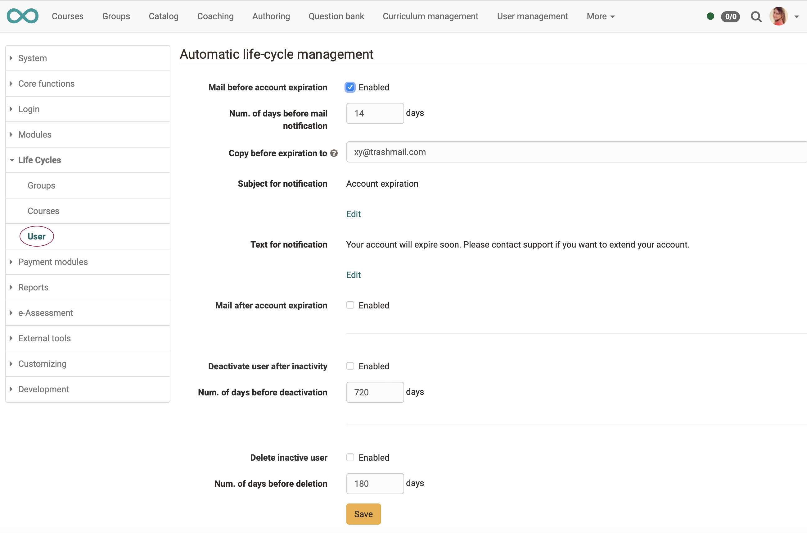

#  How do I manage lifecycles of groups, courses or user accounts?

??? abstract "Objectives and content of this instruction"

    With these instructions you should

    * know what is meant by lifecycles in OpenOlat, 
    * be able to set up life cycle management.

??? abstract "Target group"

    [ ] Authors [ ] Coaches  [ ] Participants  [x] Administrators

    [ ] Beginners [x] Experienced users  [x] Experts

??? abstract "Expected previous knowledge"

    * Experience as administrator

In OpenOlat, lifecycle management can be enabled for

* **groups** 
* **courses**
* **user accounts**

OpenOlat monitors whether an object has not been used for a long time or a user has not been active for a long time. According to predefined criteria, it sends a message that first enables a reaction and then, for example, manual deletion. Or OpenOlat deletes if necessary also automatically according to set criteria.

## Where and how are the life cycles set up?

## General activation and setting

The general activation and definition of the automatically executed reminders or deletions is set by the administrator under:
**Administration > Life Cycles**

Based on these **general** presets, life cycles can then be activated **for individual** courses, groups or users.

{ class="shadow lightbox" }

 

## Group lifecycle

The group lifecycle is managed by group administrators in the menu **Groups > tab "Group management"** 
(based on the administrator's preferences).

In the menu **"Groups" > tab "Group management"** click on the big arrows with the description of the steps. The descriptions on the arrows reflect the administrator's default settings.

* In the first step (1st arrow) you will find all active groups listed.
* In the "To inactivate" tab of the 1st arrow you will see the courses proposed for inactivation (according to the administrator's rules).
* If you select one or more groups, buttons appear above the list.
* With the buttons above the list or the link at the end of a list line you can now inactivate specific individual groups and inform them about the upcoming deactivation.

{ class="shadow lightbox" }

 

* In the second step (2nd arrow) you will find all already **inactive** groups listed.
* If groups were automatically set to the status "inactive" by the system, it is also possible to reactivate groups here.

{ class="shadow lightbox" }

 

* In the third step (3rd arrow) you will find all **deleted** groups listed.
* This list corresponds to the "recycle bin". The groups can now be permanently deleted - automatically or manually.

{ class="shadow lightbox" }

 

## Course lifecycle 

The course lifecycle can be used by anyone who has access to the authoring area.

The basis is the administrator's default settings:

{ class="shadow lightbox" }

 

* Courses with the status "Deleted" are saved in a separate "Deleted" list (= "Recycle bin").   
* As soon as you have selected a course and marked the checkbox at the beginning of the line, further buttons appear above the list. Here you can restore a course or delete it permanently
* Also by clicking on the 3 dots at the end of a line you will get to the options for restoring or permanently deleting. 

{ class="shadow lightbox" }

 

## User account lifecycle

The user account lifecycle can be used by anyone who has access to the user administration.

The basis for this is also the default settings of the administrator:

{ class="shadow lightbox" }

 

* In the first step, the accounts of users who have not been active for a longer period of time can first be deactivated and the user status set to "inactive". These accounts will now appear in the list under "inactive users".
* If there is no new login within the specified period, the user account can be deleted automatically.
* Depending on the configuration, users may receive an e-mail with an appropriate notice before or after account deactivation or deletion.
* The different notification texts related to account deactivation can be formulated and the time of mail notification can be defined. Furthermore, it can be defined whether inactive users should be deleted.

---

## Checklist

**Group lifecycle**

- [x] By administrators: general activation/configuration at **Administration > Lifecycle > Groups** 
- [x] By group managers: settings at **menue "Groups" > tab "Group management"**
- [x] Configure notification of affected users

**Course lifecycle**

- [x] By administrators: general activation/configuration at **Administration > Lifecycle > Courses** 
- [x] By anyone who has access to the authoring area: mark courses in **Authoring > tab "Deleted"** and delete them
- [x] Configure notification of affected users

**User account lifecycle**

- [x] By administrators: general activation/configuration at **Administration > Lifecycle > Account** 
- [x] By anyone who has access to the **User management**: depending on the configuration of OpenOlat, manually deactivate/delete recognized inactive users (**User management > select user > tab Account**)
- [x] Configure notification of affected users
