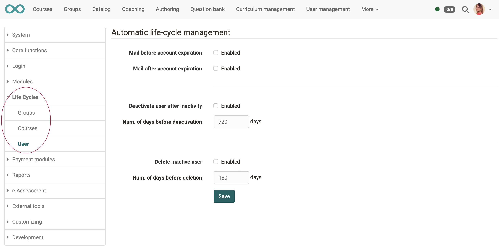
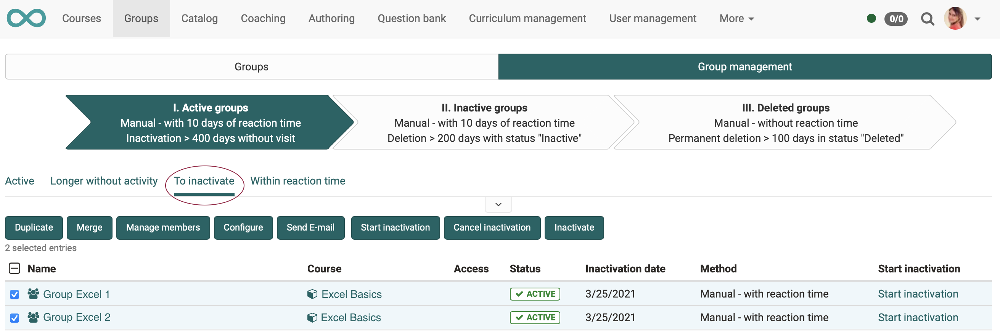
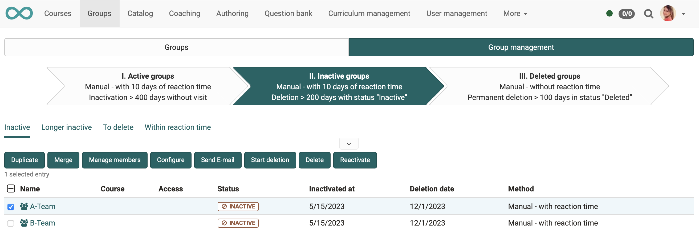
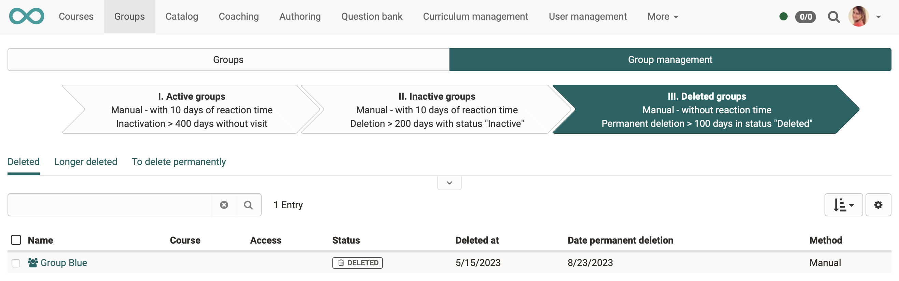
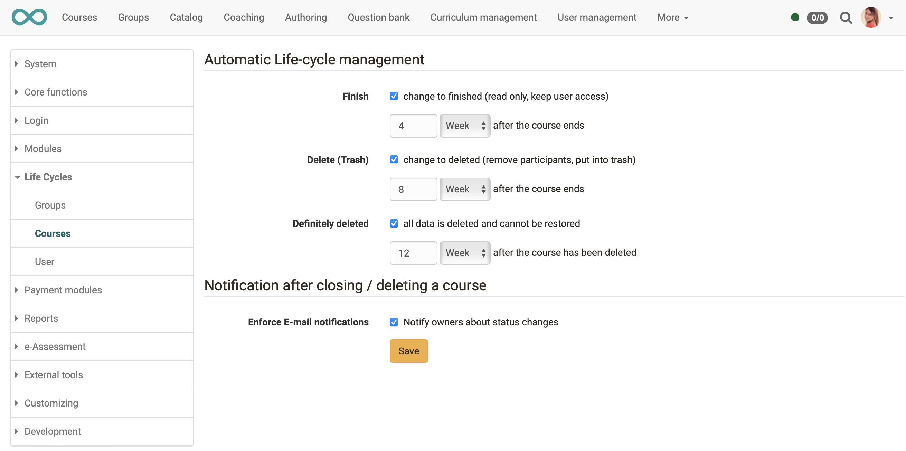
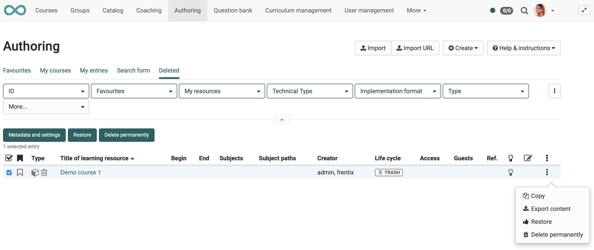
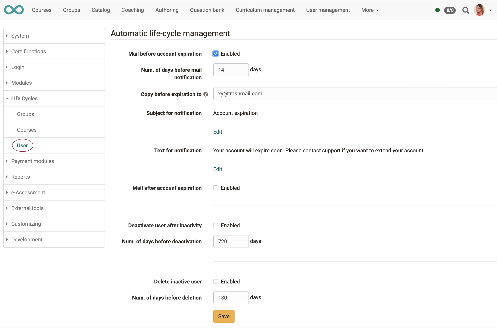

#  How do I manage lifecycles of groups, courses or user accounts?

??? abstract "Objectives and content of this instruction"

    With these instructions you should

    * know what is meant by lifecycles in OpenOlat, 
    * be able to set up life cycle management.

??? abstract "Target group"

    [ ] Authors [ ] Coaches  [ ] Participants  [x] Administrators

    [ ] Beginners [x] Experienced users  [x] Experts

??? abstract "Expected previous knowledge"

    * Experience as administrator

In OpenOlat, lifecycle management can be enabled for

* **groups** 
* **courses**
* **user accounts**

OpenOlat monitors whether an object has not been used for a long time or a user has not been active for a long time. According to predefined criteria, it sends a message that first enables a reaction and then, for example, manual deletion. Or OpenOlat deletes if necessary also automatically according to set criteria.

## Stages/Phases {: #lifecycle_stages}

When a course, group, or account reaches its "end of life," the following steps/phases are followed:

- **Inactivation**  
When a group is deactivated, its status changes from "Active" to "Inactive," and group members can, for example, only access the group in read-only mode. Inactive groups, accounts, or courses can be fully reactivated.
- **Deletion**  
When a group is deleted, for example, all members are removed from the group and any links to courses are removed. All other data is retained and remains viewable. The group can be restored.
- **Final deletion**  
When you permanently delete a group, account, or course, it is completely removed.

[To the top of the page ^](#lifecycle)

---

## Where and how are the life cycles set up?

### General activation and setting {: #lifecycle_activation}

The general activation and definition of the automatically executed reminders or deletions is set by the administrator under:
**Administration > Life Cycles**

Based on these **general** presets, life cycles can then be activated **for individual** courses, groups or users.

{ class="shadow lightbox" }

[To the top of the page ^](#lifecycle)

---

## Group lifecycle {: #group_lifestyle} 

The group lifecycle is managed by group administrators in the menu **Groups > tab "Group management"** 
(based on the administrator's preferences).

In the menu **"Groups" > tab "Group management"** click on the big arrows with the description of the steps. The descriptions on the arrows reflect the administrator's default settings.

* In the first step (1st arrow) you will find all active groups listed.
* In the "To inactivate" tab of the 1st arrow you will see the courses proposed for inactivation (according to the administrator's rules).
* If you select one or more groups, buttons appear above the list.
* With the buttons above the list or the link at the end of a list line you can now inactivate specific individual groups and inform them about the upcoming deactivation.

{ class="shadow lightbox" }

 

* In the second step (2nd arrow) you will find all already **inactive** groups listed.
* If groups were automatically set to the status "inactive" by the system, it is also possible to reactivate groups here.

{ class="shadow lightbox" }

 

* In the third step (3rd arrow) you will find all **deleted** groups listed.
* This list corresponds to the "recycle bin". The groups can now be permanently deleted - automatically or manually.

{ class="shadow lightbox" }

 

## Course lifecycle {: #course_lifecycle} 

The course lifecycle can be used by anyone who has access to the authoring area.

The basis is the administrator's default settings:

{ class="shadow lightbox" }

 

* Courses with the status "Deleted" are saved in a separate "Deleted" list (= "Recycle bin").   
* As soon as you have selected a course and marked the checkbox at the beginning of the line, further buttons appear above the list. Here you can restore a course or delete it permanently
* Also by clicking on the 3 dots at the end of a line you will get to the options for restoring or permanently deleting. 

{ class="shadow lightbox" }

[To the top of the page ^](#lifecycle)

---

## User account lifecycle {: #user_account_lifecycle}

The user account lifecycle can be used by anyone who has access to the user administration.

The basis is the default settings of the administration:

{ class="shadow lightbox" }

 

The life cycle of a user account consists of three phases:

* **Account Expiration** — A fixed expiration date is set for each account or system-wide. When the date expires, the account is deactivated or deleted.
* **Deactivation** — Accounts with no login activity during the configured inactivity period are deactivated automatically or manually.
* **Deletion** — After the deactivation period, permanent deletion occurs automatically or manually. Depending on the configuration, it may also be triggered exclusively manually.

Notification emails can be configured for each phase—before or after the respective step.

!!! info "Configuration in the Administration"

    Deadlines, email notifications, and the level of automation for all three phases are configured under Administration > Lifecycles > Account.
    [Details about the user account lifecycle](../../manual_admin/administration/Life_cycles_-_Administration.md#lifecycle_accounts)

[To the top of the page ^](#lifecycle)

---

## Notifications {: #lifecycle_messages}

To minimize the risk of accidental deletion as much as possible, the affected individuals can be notified at each stage or phase of the preparation for deletion. 

**Notification Settings for Courses:** 
It can be configured so that owners are notified of status changes.

**Notification Settings for Groups and Accounts:** 

- Email announcing the deactivation
- Response time following the announcement of the deactivation
- Customizable notification text announcing the deactivation
- An email confirming that the account has been deactivated
- Customizable notification text after deactivation

- Email announcing the deletion
- Response period following the notice of deletion
- Customizable notification text announcing the deletion
- An email confirming that the deletion has been completed
- Customizable notification text after deletion

- Optional email copy to any address in each case

[To the top of the page ^](#lifecycle)

---

## Checklist {: #checklist} 

**Group lifecycle**

- [x] By administrators: general activation/configuration at **Administration > Lifecycle > Groups** 
- [x] By group managers: settings at **menue "Groups" > tab "Group management"**
- [x] Configure notification of affected users

**Course lifecycle**

- [x] By administrators: general activation/configuration at **Administration > Lifecycle > Courses** 
- [x] By anyone who has access to the authoring area: mark courses in **Authoring > tab "Deleted"** and delete them
- [x] Configure notification of affected users

**User account lifecycle**

- [x] By administrators: general activation/configuration at **Administration > Lifecycle > Account** 
- [x] By anyone who has access to the **User management**: depending on the configuration of OpenOlat, manually deactivate/delete recognized inactive users (**User management > select user > tab Account**)
- [x] Configure notification of affected users

[To the top of the page ^](#lifecycle)
