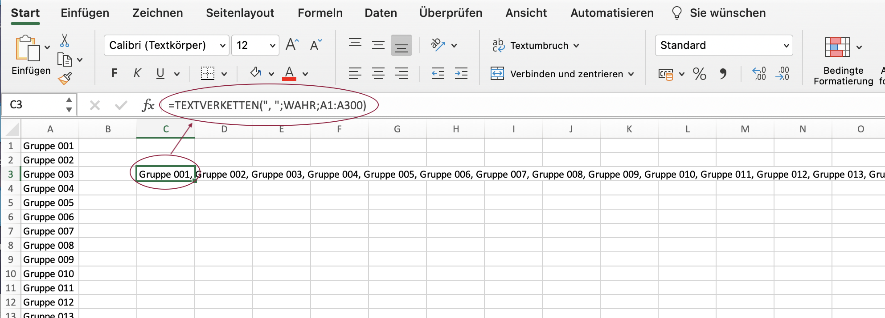

# Wie kann ich effizient viele Gruppen erstellen?

??? abstract "Ziel und Inhalt dieser Anleitung"

    Die Erstellung einer grossen Anzahl Gruppen im Standardprozesse ist aufwändig.
    Der hier beschriebene Beispiel zeigt, wie viele Gruppen mit unterschiedlichen Namen effizient erstellt werden können.

??? abstract "Zielgruppe"

    [x] Autor:innen [x] Betreuer:innen  [ ] Teilnehmer:innen

    [ ] Anfänger:innen [x] Fortgeschrittene  [x] Experten/Expertinnen

??? abstract "Erwartete Vorkenntnisse"

    * Erfahrung mit der Erstellung von Gruppen

---

## Use Case und Zielsetzung

Use Case von Karin Niffeler, Uni Zürich:

* In einem Kurs mit 600 Teilnehmer:innen sollen ca. 400 Gruppen gebildet werden.
* Die Gruppen sollen den Kursbaustein "Gruppenaufgabe" nutzen.
* Die Kursteilnehmer:innen bilden innerhalb eines Kurses selbst Gruppen mit jeweils 1 oder 2 Mitgliedern.
* Die Gruppen müssen voneinander unterscheidbar sein.

## Der Standardprozess

Als Kursbesitzer:in können Sie im Kurs (Administration > Mitgliederverwaltung > Gruppen) Gruppen erstellen. Diese Gruppen können in den Kursbausteinen verwendet werden.

Mit Hilfe des Kursbausteins "Einschreibung" können Kursteilnehmer:innen sich selbst in eine Gruppe einschreiben.

Unter dem Reiter "Gruppen" können die Kursteilnehmer:innen selbst Gruppen erstellen und Mitglieder hinzufügen. Diese Gruppen können später mit einem Kurs verknüpft werden.

## Problem

Es gibt für den/die Kursbesitzer:in viel Aufwand um alles aufzusetzen.

## Lösung Schritt 1

Es ist möglich, mehrere Gruppen auf einmal zu erstellen:

xxx

<h3>Weiterhin bestehendes Problem:</h3>
Der/die Kursbesitzer:in muss immer noch die einzelnen Gruppennamen selbst definieren.
Auf diese Art 400 Gruppen zu erstellen ist sehr aufwändig.

## Lösung Schritt 2 mit einer Excel-Datei

Im PopUp "Neue Gruppe erstellen" kann man mehrere Gruppen hinzufügen. Dazu braucht es eine kommaseparierte Liste.

Ideal ist, wenn die Gruppennamen auch ein Prefix und/oder Suffix haben können.
Z.B. "DE Gruppe-001", "DE Gruppe-002", "DE Gruppe-003", "EN group-001", "EN group-002", "EN group-003"

Dazu gibt es einen Workaround mit Excel. Zuerst müssen in Excel die Gruppen aufgelistet werden. Danach können diese nach OpenOlat in einem String ins Feld "Gruppennamen" kopiert werden.

<h3>Erstellung der Excel-Datei</h3>

* Erstellen Sie ein neues Excel-Dokument.
* Definieren Sie Gruppen in Spalte A. Hier kann mit Prefixen und/oder Suffixen gearbeitet werden. Die Möglichkeiten von Excel können hier optimal verwendet werden um die Gruppennamen zu erzeugen.
* In einer neuen Zelle in einer anderen Spalte fügen Sie die Formel hinzu: 
**=TEXTVERKETTEN(", ";WAHR;A1:A400)** 
(Englische Excel-Version: **= TEXTJOIN(", ",TRUE,A1:A400)**)
* Durch diesen Befehl wird in dieser Zelle eine Zeichenkette (String) mit den kommaseparierten Gruppennamen erzeugt.
* Kopieren Sie diesen String (Zeichenkette).

screen
{ class="shadow lightbox" }

!!! note "Hinweis"

    Ist die Zelle markiert, kopiert man durch Ctrl+C und Ctrl+V die **Formel**. Um die erzeugte **Zeichenkette** in die Zwischenablage zu kopieren, müssen Sie die **Inhalte einfügen** (Shift+Ctrl+V).

<h3>Übertrag in den OpenOlat-Kurs</h3>

* Mitgliederverwaltung > Gruppen > Gruppe erstellen
* PopUp "Neue Gruppe erstellen": im Feld "Gruppennamen" den String kleben
* Alle Gruppen werden erstellt
