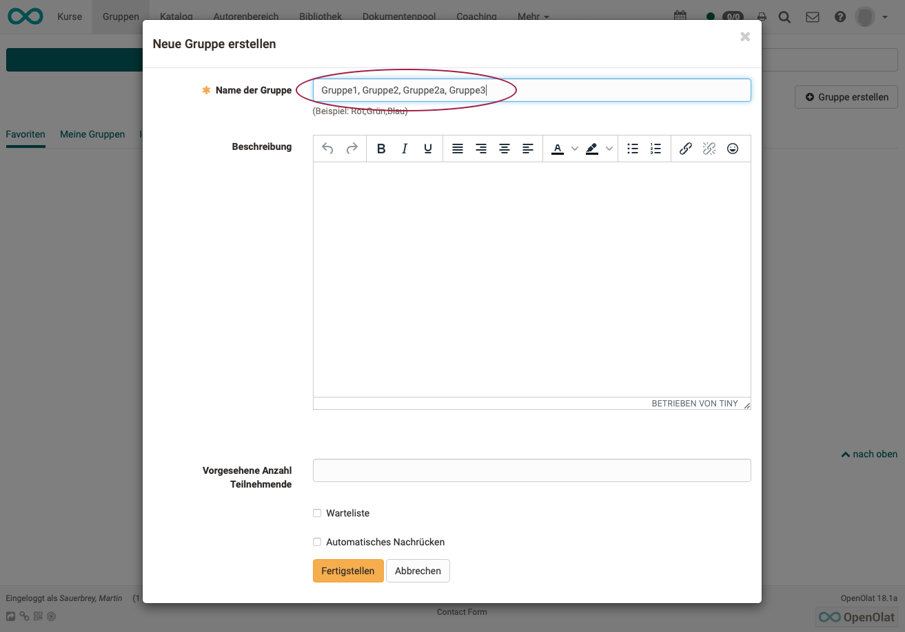
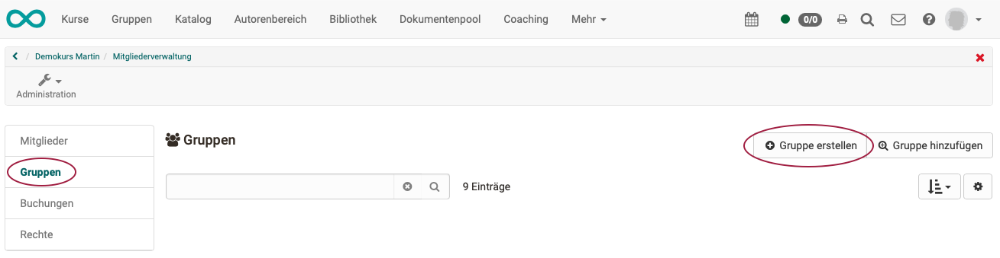

# How can I efficiently create many groups at once?

??? abstract "Aim and content of these instructions"

    Creating a large number of groups is time-consuming in the standard process.
    The example described here shows how many groups with different names can be created efficiently.

??? abstract "Target group"

    [x] Authors [x] Coaches  [ ] Participants

    [ ] Beginners [x] Advanced  [x] Experts

??? abstract "Expected prior knowledge"

    * Experience with the creation of groups

---

## Use Case and Objective

Use Case of Karin Niffeler, Uni Zürich:

* In a course with 600 participants, about 400 groups should be formed.
* The groups should use the course element "group task".
* The participants form groups of 1 or 2 members within a course.
* The groups must be distinguishable from each other.

## The standard process

As a course owner, you can create groups in the course: 
**Administration > Members management > Groups > Create groups** These groups can be used in the course elements.

With the help of the course element "Enrolment", course participants can then enrol themselves in one of these groups.

Under the tab "Groups", course participants can also create groups and add members. These groups can also be linked to a course later.

## Problem

With a large number of groups, there is a lot of work for the course owner to set everything up.

## Solution Step 1

It is possible to create several groups at once: In the pop-up "Create new group" you can enter several group names at the same time if they are separated by a comma.

{ class="shadow lightbox" }

<h3>Continuing problem:</h3>
The course owner still has to define the individual group names.
Creating 400 groups in this way is very time-consuming.

## Solution Step 2 with an Excel file

The comma-separated list with the group names can be generated using an Excel file.

It is ideal if the group names can also have a prefix and/or suffix.
For example "EN group-001", "EN group-002", "EN group-003", "DE Gruppe-001", "DE Gruppe-002", "DE Gruppe-003"

1. First, the group names must be created in Excel.
2. The group names are then joined together to form a comma-separated text string.
3.The text string can then be copied to OpenOlat into the field "Group name".

<h3>1. Create group names</h3>

* Create a new Excel document.
* Define all group names in column A. Here you can work with prefixes and/or suffixes. The possibilities of Excel can be optimally used here to create the group names.

<h3>2. Create text strings</h3>

* In a new cell in another column, add the formula: 
**= TEXTJOIN(", ",TRUE,A1:A400)**
*This command creates a string with the comma-separated group names in this cell.
* Copy this string (character string) to the clipboard.

{ class="shadow lightbox" }

!!! note "Note"

    Once the cell is selected, you can copy the **Formula** by pressing Ctrl+C and Ctrl+V. To copy the created **string** to the clipboard, you must use the **paste contents**. (Shift+Ctrl+V).

<h3>3. Transfer to the OpenOlat course</h3>

* Open the Members management of the course:  
Administration > Member management > Groups > "Create group" button

{ class="shadow lightbox" }

* In the pop-up "Create a new group", insert the text string in the "Group name" field.

{ class="shadow lightbox" }

* If properties are to be the same for all groups, define a description, the intended number of participants, etc.

* Click on "Finish" to create all groups.