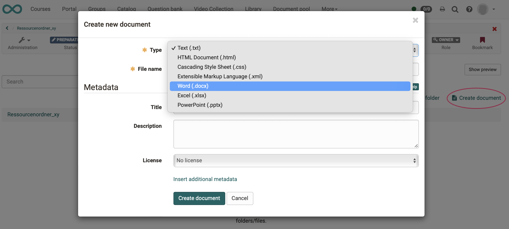

# How can I use the same files in several courses?

If you want to implement a teaching scenario with several courses, e.g. a course of studies, and many files are to be used in all courses, it is advisable to store these files centrally in the **resource folder** and then integrate it in the desired courses. This has the advantage that you only have to make changes to the files once and they are automatically visible in all linked courses.

Typical examples for such files are:

* basic framework conditions,
* general terms and conditions,
* organizational information,
* information on general support and contact persons,
* cross-course teaching materials
* etc.

## What you need

* author rights
* a [resource folder](../../manual_user/learningresources/index.md)
* multiple courses
* files you want to use several times

## Procedure:

## 1. Create a Ressource Folder  

1.1 Go to the [Authoring Area](../../manual_user/area_modules/Authoring.md) and select "Create" -> "Resource folder".

{ class="shadow lightbox" }  
 

1.2 Enter a suitable name for the resource folder and complete the general description form as required. Since the resource folder is used more for internal organization, it is not mandatory to enter information here. The description of the learning resource serves more for your own organization.  

{ class="shadow lightbox" }  

!!! info "Note"

    Resource folders are listed like other learning resources in the authoring area. Technically, a complete resource folder is a single learning resource.
 

1.3 Chose in the authoring area the resource folder, listed there as learning resource.  

{ class="shadow lightbox" }  
 

1.4 Here you can now upload files and create subfolders if necessary.

Use [**WebDAV**](../webdav/webdav.md) if you want to upload many files.  

The usual setting options for learning resources are also available to you (Administration -> Settings).

{ class="shadow lightbox" } 

1.5 Alternatively you can create files directly here.

{ class="shadow lightbox" } 

## 2. Include Resource Folders in Courses  

2.1 Open the desired course and select in the "Administration", submenu "Settings" the tab "Options".

{ class="shadow lightbox" }

 

2.2 Choose "Replace" under "Selected resource folder".

{ class="shadow lightbox" } 

 

2.3 Here you can select the resource folder you created in advance and link it to the course. When you have selected a resource folder, its name will appear as well as the
the button "Delete selection", with which you can deselect it again.

 

2.4 By default, the files in the resource folder are write-protected within courses. This makes sense because you want to change and update the files centrally.  However, if it is necessary to overwrite (single) central files
again in the course and only for the respective course, you can remove the write protection in the "Options" menu of the course.

{ class="shadow lightbox" }
    
Repeat the procedure for all relevant courses.

## 3. Organize Access to the Files  

3.1 To access the resource folder files within the course, go to the course's storage folder. Here you will find the automatically created subfolder "_sharedfolder".

{ class="shadow lightbox" }

{ class="shadow lightbox" }
  
3.2 The files of this folder can now be added in the course editor like all other files of the storage folder via course element "[Single Page](../../manual_user/learningresources/Knowledge_Transfer.md#single_page)".

!!! warning "Please note"

    You can only include <b>one</b> resource folder <b>per course</b>. You should therefore carefully consider in advance which files you want to organize using a cross-course resource folder instead of the course-specific folder.

