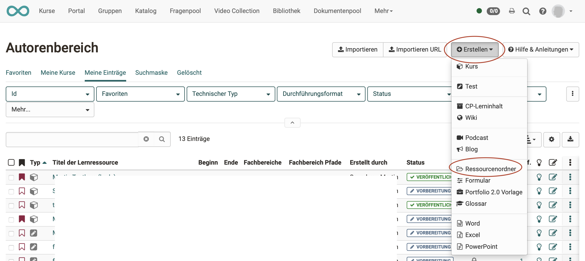
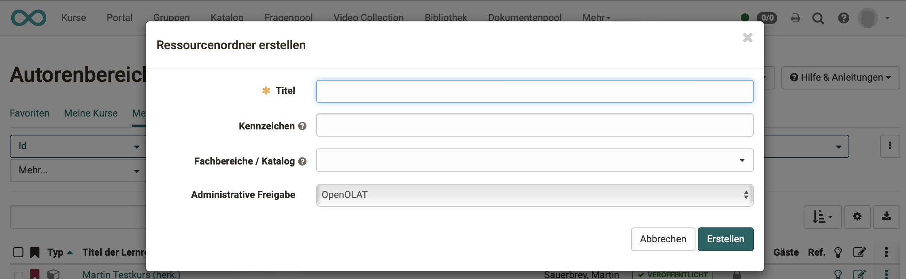
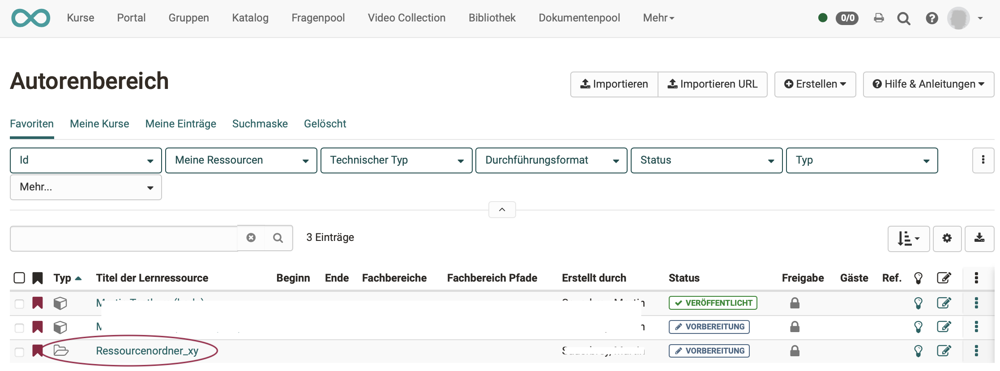
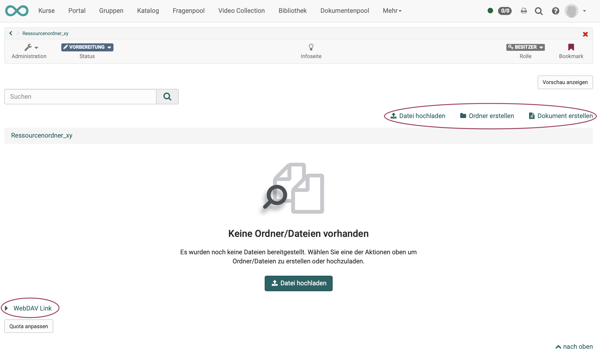
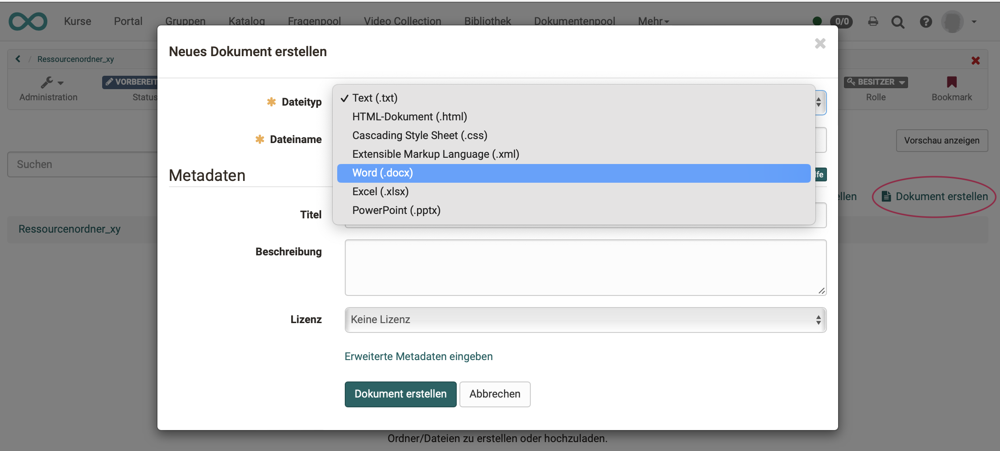
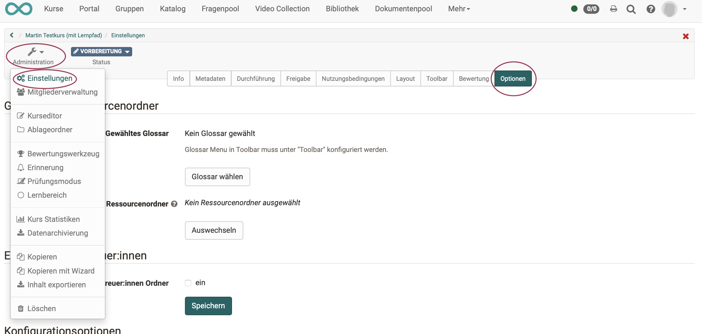
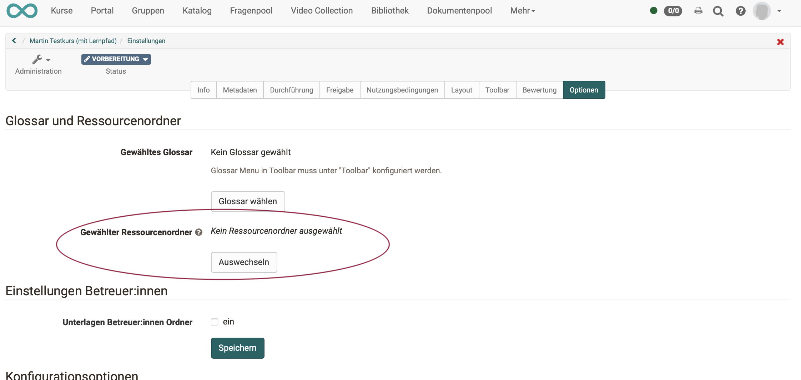
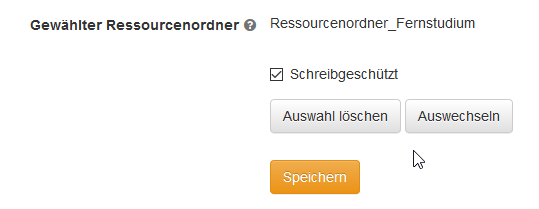
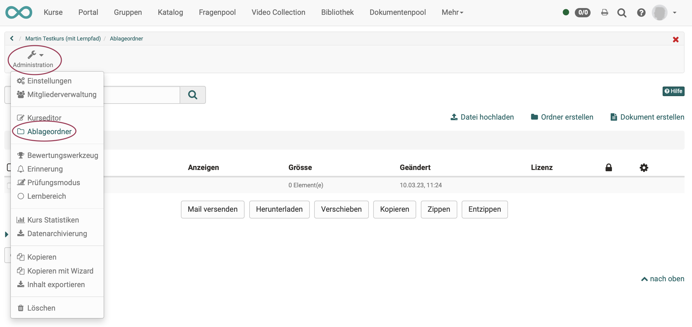
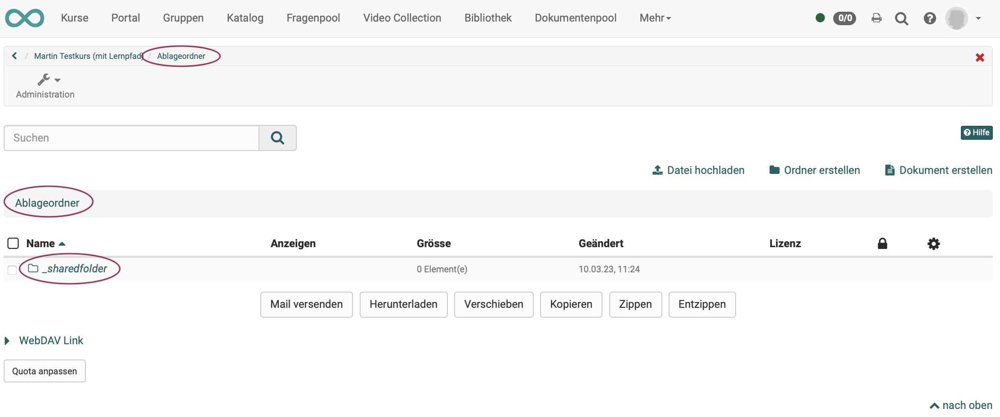

# Wie kann ich dieselben Dateien in mehreren Kursen einsetzen?

Wenn Sie ein Lehrszenario mit mehreren Kursen, z.B. einen Studiengang umsetzen wollen und dabei viele Dateien in allen Kursen verwendet werden sollen, bietet es sich an, diese Dateien zentral im <b>Ressourcenordner</b> abzulegen und dann in allen gewünschten Kursen einzubinden.  
Das hat den Vorteil, dass Sie Änderungen an den Dateien nur einmal vornehmen müssen und diese automatisch in allen verlinkten Kursen sichtbar werden. Typische Beispiele für derartige Dateien sind: 
* grundsätzliche Rahmenbedingungen,
* AGBs,
* organisatorische Infos,
* Infos zur generellen Betreuung bzw. Ansprechpartnern
* usw.

## Was Sie benötigen:

* Autorenrechte
* einen [Ressourcenordner](../course_create/Course_Settings.de.md)
* mehrere Kurse
* Dateien, die Sie mehrfach verwenden wollen

## Vorgehensweise:

## 1. Ressourcenordner erstellen  
 
1.1 Gehen Sie hierfür in den [Autorenbereich](../authoring/index.de.md) und wählen Sie
„Erstellen“ -> „Ressourcenordner“.
       

1.2 Vergeben Sie einen passenden Namen für den Ressourcenordner und füllen Sie das allgemeine Beschreibungsformular nach Bedarf aus. Da der Ressourcenordner eher für die interne Organisation verwendet wird, ist es nicht zwingend nötig, hier Infos zu hinterlegen. Die Beschreibung der Lernressource dient hier eher Ihrer eigenen Organisation.  
       

!!! info "Hinweis"

    Ressourcenordner werden wie andere Lernressourcen im Autorenbereich aufgelistet. Technisch gesehen, ist ein kompletter Ressourcenordner eine einzelne Lernressource.

1.3 Wählen Sie im Autorenbereich den als Lernressource aufgelisteten Ressourcenordner.  
       

1.4 Hier können Sie nun Dateien hochladen und ggf. Unterordner erstellen.

Nutzen Sie [**WebDAV**](../supported_tech/Using_WebDAV.de.md), wenn Sie viele Dateien hochladen wollen.  

Es stehen Ihnen auch die üblichen Einstellmöglichkeiten für Lernressourcen zur Verfügung (Administration -> Einstellungen).

    

1.5 Alternativ können Sie hier Dateien auch direkt erstellen.
     
 
## 2. Ressourcenordner in Kurse einbinden  

2.1 Öffnen Sie den gewünschten Kurs und wählen Sie in der "Administration" im Untermenü "Einstellungen" den Reiter "Optionen".

 
2.2 Klicken Sie unter "Gewählter Ressourcenordner" auf "Auswechseln".

 
 
2.3 Hier können Sie nun Ihren im Vorfeld erstellten Ressourcenordner auswählen und
so mit dem Kurs verlinken. Wenn Sie einen Ressourcenordner ausgewählt haben, erscheint sein Name sowie
der Button "Auswahl löschen", mit dem Sie ihn wieder abwählen können.
  
2.4 Standardmässig sind die Dateien des Ressourcenordners innerhalb von Kursen schreibgeschützt. Das macht Sinn, da man die Dateien ja zentral ändern und aktualisieren möchte. Ist es jedoch notwendig (einzelne) zentrale Dateien noch
einmal im Kurs und zwar nur für den jeweiligen Kurs zu überschreiben, können Sie den Schreibschutz im Menü "Optionen" des Kurses entfernen.

 
  
Wiederholen Sie das Vorgehen für alle relevanten Kurse.

## 3. Zugriff auf die Dateien organisieren  

3.1 Um auf die Dateien des Ressourcenordners innerhalb des Kurses zuzugreifen, gehen Sie in den Ablageordner des Kurses. Hier finden sie den automatisch
angelegten Unterordner „_sharedfolder“.

  
3.2 Die Dateien dierses Ordners können Sie nun wie alle anderen Dateien des Ablageordners über
den Kursbaustein "[Einzelne Seite](../course_elements/Knowledge_Transfer.de.md)" im Kurseditor
hinzufügen.

!!! warning "Zu beachten"

    Sie können lediglich <b>einen</b> Ressourcenordner <b>pro Kurs</b> einbinden. Überlegen Sie deshalb im Vorfeld genau, welche Dateien Sie über einen kursübergreifenden Ressourcenordner statt des kursbezogenen Ablageordners organisieren möchten.