# Wie erstelle ich meinen ersten OpenOlat-Kurs?

## 1. Autorenrechte besorgen

Um OpenOlat-Kurse erstellen zu können, benötigen Sie Autorenrechte. Wenden Sie sich bitte an Ihren <b>Administrator</b>, damit er Ihnen die Autorenrolle gibt. Sobald Sie Autor sind, erscheint im Menü Ihrer Kopfzeile der Eintrag <b>„Autorenbereich“</b>.

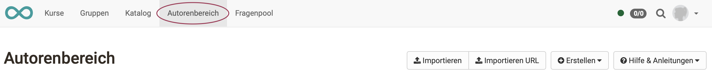{ class="shadow lightbox" }

!!! hint "Hinweis"
	
	Eventuell ist ein Abmelden und neues Anmelden erforderlich, damit nach der Aktivierung der Autorenrolle der Menüeintrag bei Ihnen sichtbar wird.
 

## 2. Autorenbereich betreten

Nach dem Öffnen des Autorenbereichs sehen Sie eine leere Liste, denn Sie haben ja noch keine eigenen Kurse erstellt.

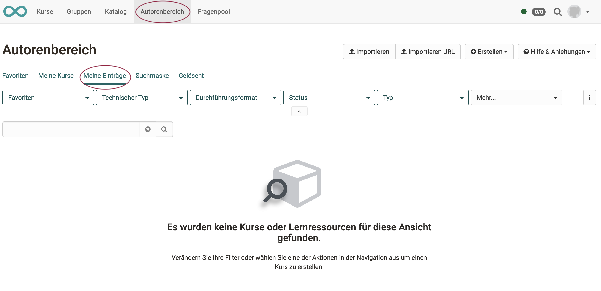{ class="shadow lightbox" }

Wenn Sie die Suchmaske verwenden, finden Sie auch Kurse und Lernressourcen anderer Autoren. Allerdings nur solche,
 
* die von den Autoren-Kollegen bereits veröffentlicht wurden 
* und ein Zugriff durch andere Autoren erlaubt wurde.

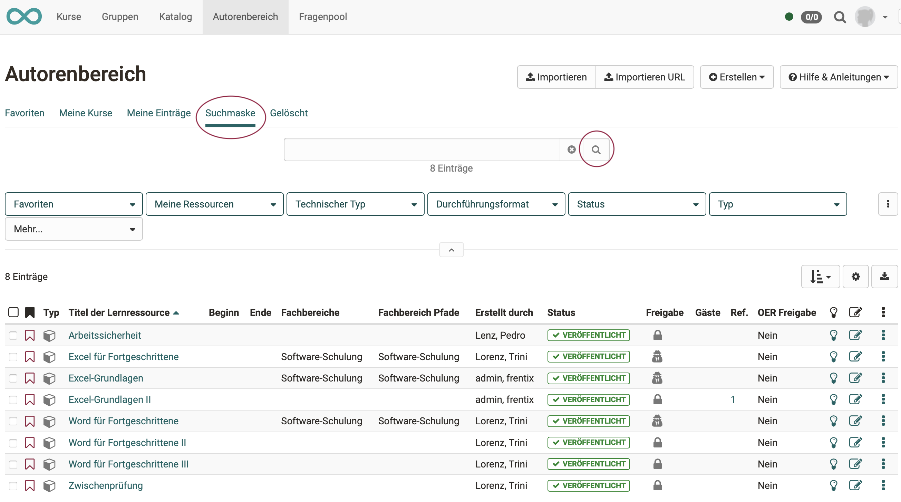{ class="shadow lightbox" }

!!! hint "Hinweis"
	
	Sie können auf das Lupensymbol klicken ohne einen Suchbegriff einzugeben. Sie erhalten so <b>alle</b> verfügbaren Kurse und Lernressourcen angezeigt.
	Mit den Filteroptionen können Sie die Suchergebnisse dann filtern. 
 

## 3. Neuen Kurs erstellen

Der Button zum Erstellen neuer Kurse und anderer Lernressourcen befindet sich im Autorenbereich rechts oben. Erstellen Sie hier einen neuen Kurs.

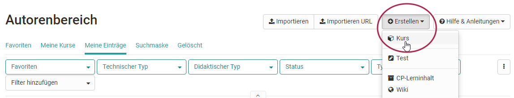{ class="shadow lightbox" }

Sie werden gleich zu Beginn gefragt, ob Sie einen <b>Lernpfadkurs</b> oder einen <b>herkömmlichen Kurs</b> erstellen wollen.

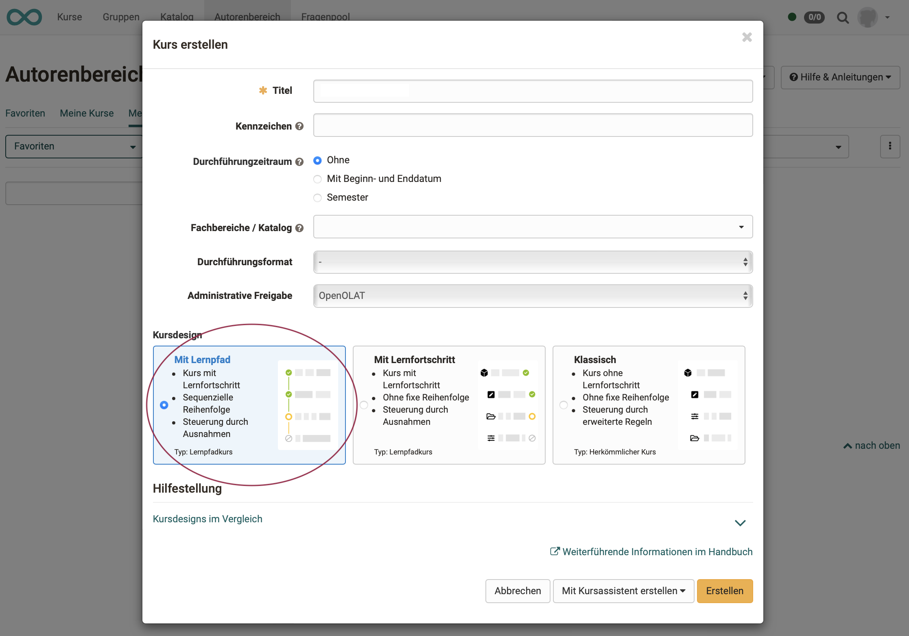{ class="shadow lightbox" }

Damit der Kurs gespeichert werden kann, braucht es zwingend einen Titel. Die weiteren Angaben können Sie auch zu einem späteren Zeitpunkt noch ergänzen und bearbeiten.

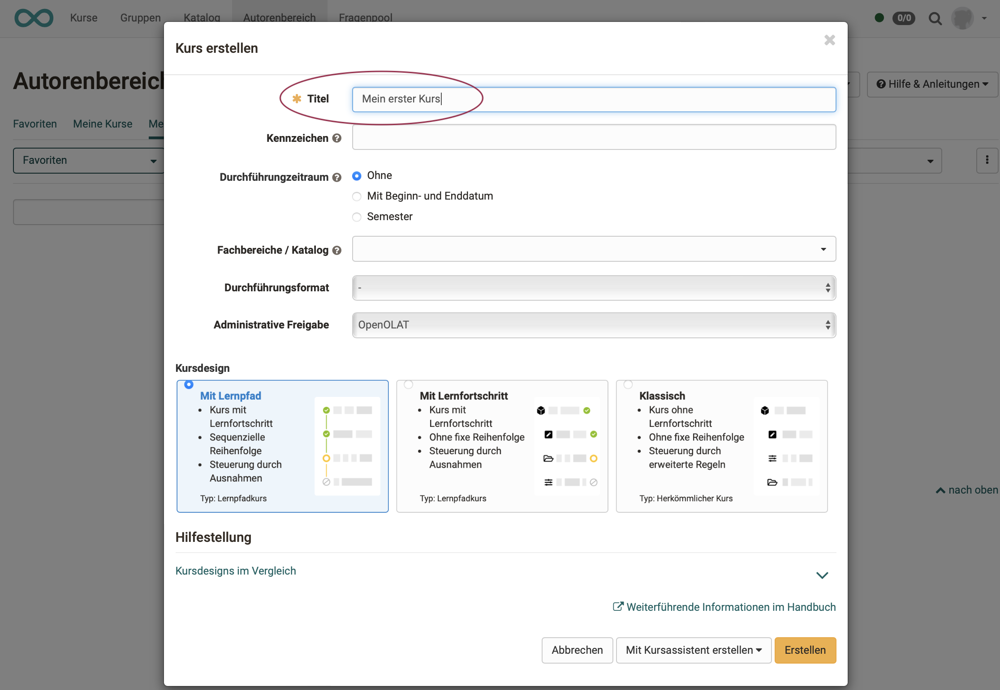{ class="shadow lightbox" }

Mit Klick auf die Hilfestellung "Kursdesigns im Vergleich" können Sie sich über die Unterschiede der Kursdesigns informieren.

{ class="shadow lightbox" }

!!! hint "Hinweis"
	
	Es besteht die Möglichkeit, sich von einem Kursassistenten (Wizard) durch die Erstellung des Kurses führen zu lassen. In dieser Anleitung soll jedoch zum besseren Verständnis das Vorgehen in Einzelschritten dargestellt werden.
	
	
(Den Assistenten rufen Sie rechts unten auf.)

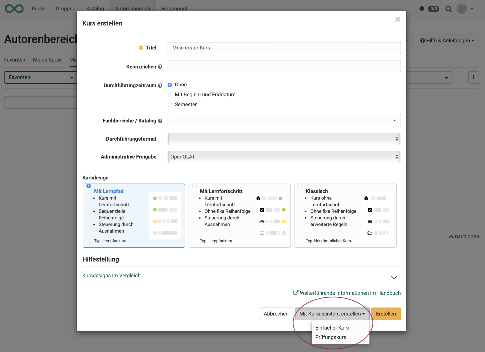{ class="shadow lightbox" }

Klicken Sie zum Abschluss dieses Schritts auf "<b>Erstellen</b>".
 

## 4. Kurseinstellungen vornehmen

Unmittelbar nachdem der neue Kurs erstellt wurde, gelangen Sie zu den Einstellungen. In jedem der Tabs gibt können Sie detaillierte Angaben machen. Für den Anfang übenehmen wir die Voreinstellungen. 
Später können Sie diese Kurseinstellungen jederzeit wieder aufrufen und bearbeiten unter <b>Administration > Einstellungen</b>. 

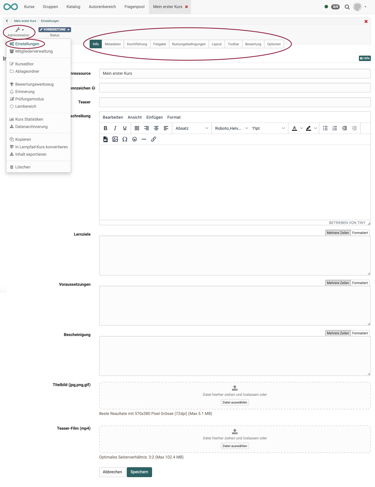{ class="shadow lightbox" }

Die hier gemachten Einstellungen <b>betreffen den Kurs als Ganzes</b>. Wenn Sie im nächsten Schritt dann Kursbausteine eingefügt haben, können Sie auch dort Einstellungen vornehmen. Dort gelten die Einstellungen jeweils nur für den aktuell ausgewählten Kursbaustein.
 
!!! hint "Hinweis"
	
	Vergessen Sie nicht, zu speichern!
 

## 5. Kursbausteine hinzufügen

Ein OpenOlat-Kurs besteht aus Kursbausteinen. Die Reihenfolge der ausgewählten Kursbausteine spiegelt sich im <b>Kursmenü</b> wieder.

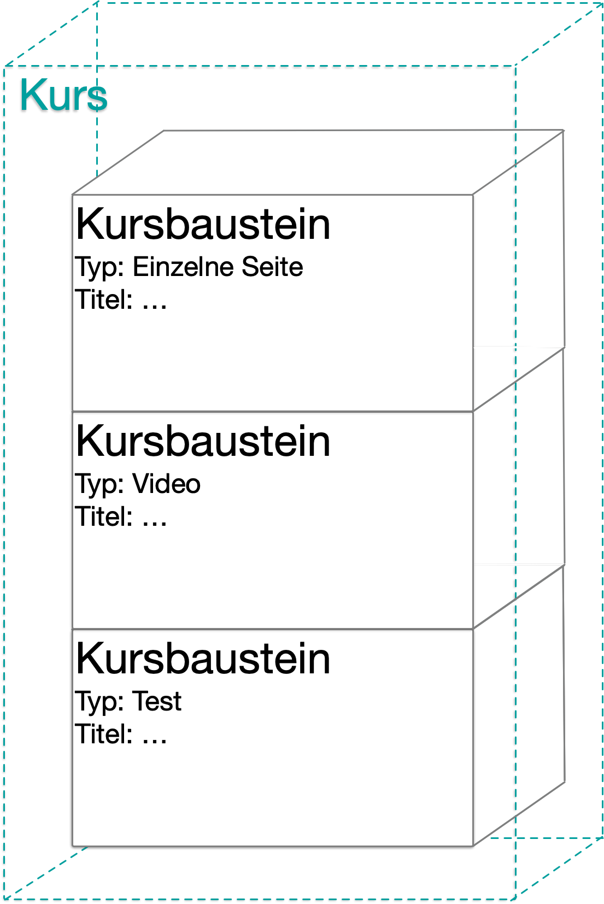{ width=240px class="lightbox" }

Zum Bearbeiten und Hinzufügen von neuen Kursbausteinen öffnen Sie den <b>Kurseditor</b>. Sie erkennen an der <b>schraffierten Kopfzeile</b>, dass Sie sich im Editor befinden.

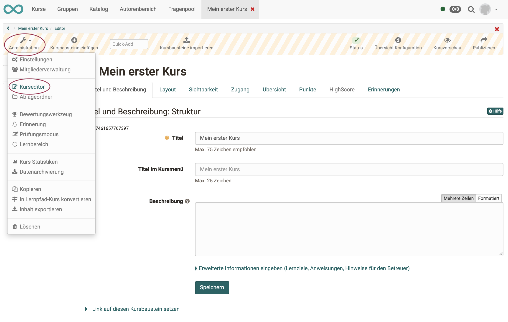{ class="shadow lightbox" }

Mit Klick auf das Icon <b>"Kursbausteine einfügen"</b> öffnen Sie eine Auswahl der verfügbaren Kursbausteine.

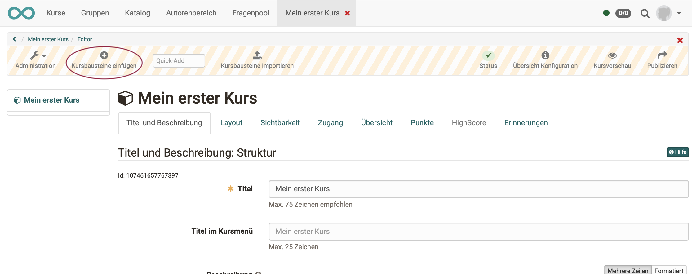{ class="shadow lightbox" }

Durch Klick auf einen der aufgelisteten Bausteine wird ein Kursbaustein dieses Typs im Kurs eingefügt.

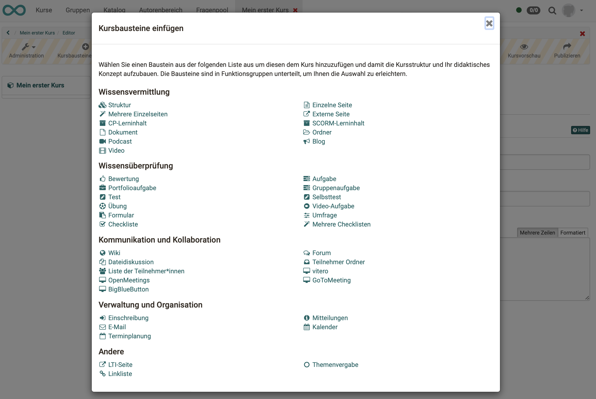{ class="shadow lightbox" }

Nach dem Einfügen lassen sich die Kursbausteine im Kursmenü <b>mit gedrückter Maustaste verschieben</b>. Ziehen Sie einen Baustein auf einen Strukturbaustein, wird er dort als untergeordnetes Element eingeordnet. (Strukturbausteine können zugeklappt werden, so dass ihr Inhalt verborgen und das Menü übersichtlicher wird.)

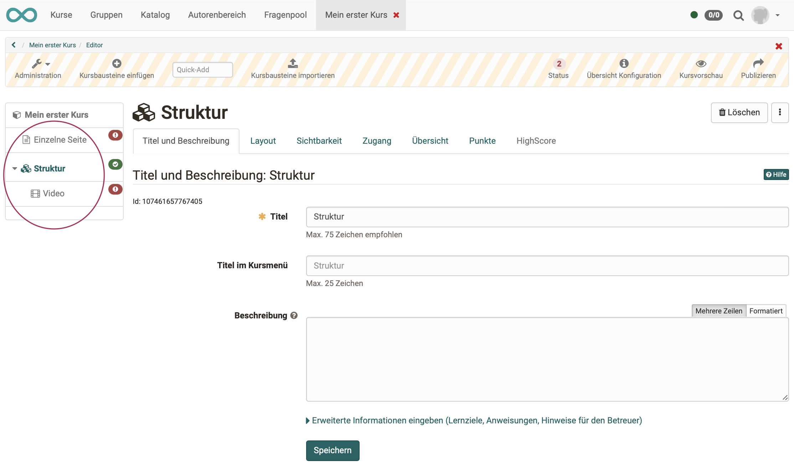{ class="shadow lightbox" }
 

## 6. Kursbausteine konfigurieren und Lernressourcen hinzufügen

!!! hint "Hinweis"
	
	Zum Konfigurieren eines Kursbausteins bleiben Sie weiterhin im Kurseditor. (Im Unterschied zum Konfigurieren des Kurses als Ganzem, siehe Punkt 4.)

Um einen Kursbaustein zu bearbeiten, wählen Sie den Kursbaustein links im <b>Kursmenü</b>. Dann werden rechts jeweils die Optionen zum Konfigurieren dieses Kursbausteins in mehreren Tabs angezeigt.

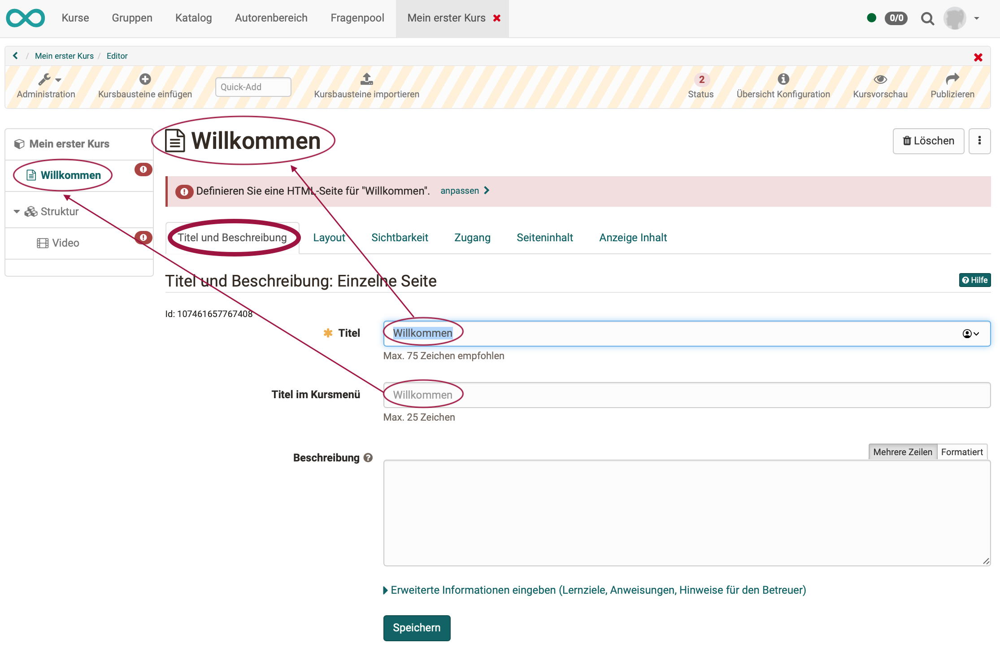{ class="shadow lightbox" }

Viele Kursbausteine benötigen eine Lernressource. Stellen Sie sich die Kursbausteine als Behälter vor, in die eine Lernressource eingefügt werden muss.

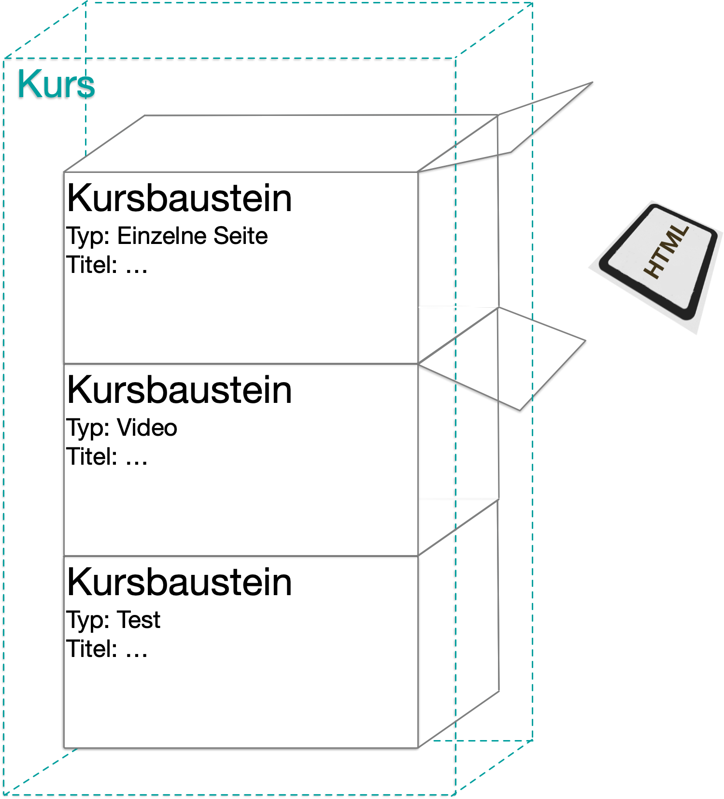{ width=300px class="lightbox" }

<h3> Beispiel 1</h3> 
Der Kursbaustein vom Typ "<b>Einzelne Seite</b>" benötigt eine <b>HTML-Datei</b> als Lernressource. Im <b>Tab "Seiteninhalt"</b> können Sie eine neue HTML-Datei erstellen, eine bereits in OpenOlat vorhandene einbinden oder eine anderswo erstellte HTML-Datei in OpenOlat importieren.

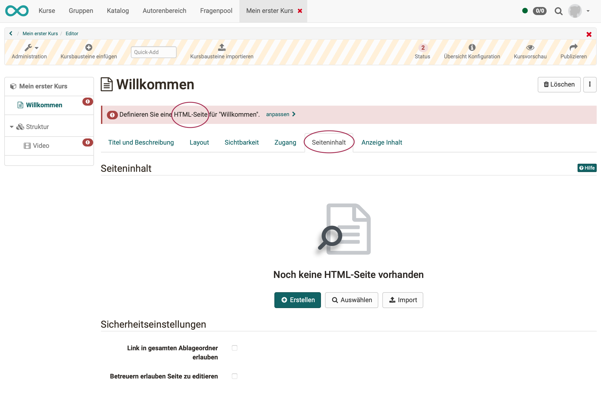{ class="shadow lightbox" }

<h3> Beispiel 2</h3> 
Der Kursbaustein vom Typ "<b>Video</b>" benötigt eine <b>mp4-Datei</b> als Lernressource. 

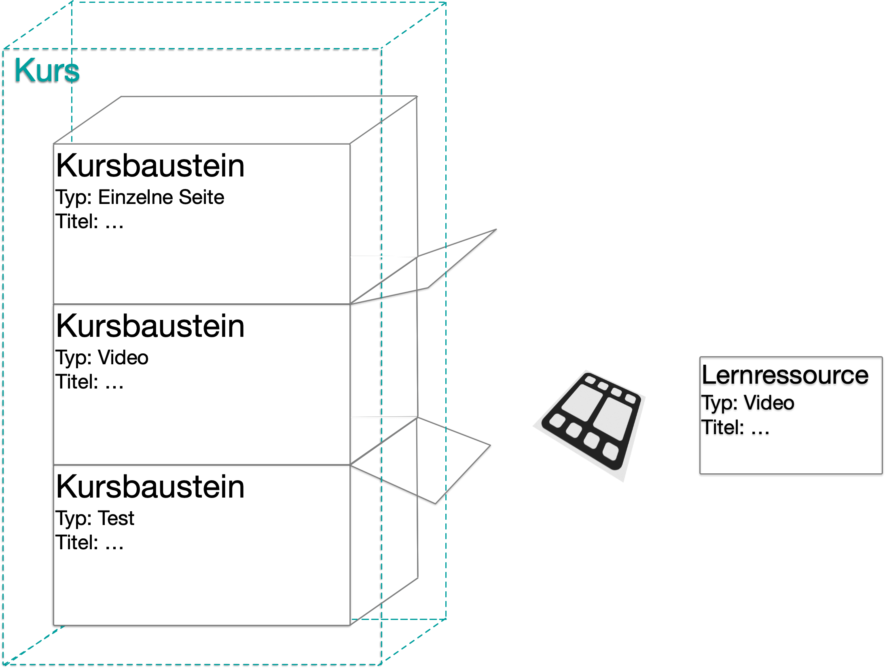{ width=470px class="lightbox" }

Wird z.B. gewünscht, dass das Video als "angesehen" gilt, wenn 95% tatsächlich angesehen wurden, dann wird diese <b>Konfiguration auf dem Kursbaustein</b> vorgenommen. Also dem Behälter und nicht als Information in der Lernressource ergänzt.

Dieses Konzept hat den Vorteil, dass die mp4-Datei (Lernressource) ausgetauscht werden kann, ohne dass der Kursbaustein aus dem Kursmenü verschwindet und komplett von Neuem konfiguriert werden muss. 
  
	
Es gibt auch noch <b>Konfigurationsmöglichkeiten der Lernressource</b>, wie z.B. Annotationen (Anmerkungen).
	
Wenn die Video-Lernressource in verschiedenen Kursen und Kursbausteinen verwendet wird, sind diese Annotationen in allen Kursbausteinen dabei, in die diese Lernressource eingebunden wird.

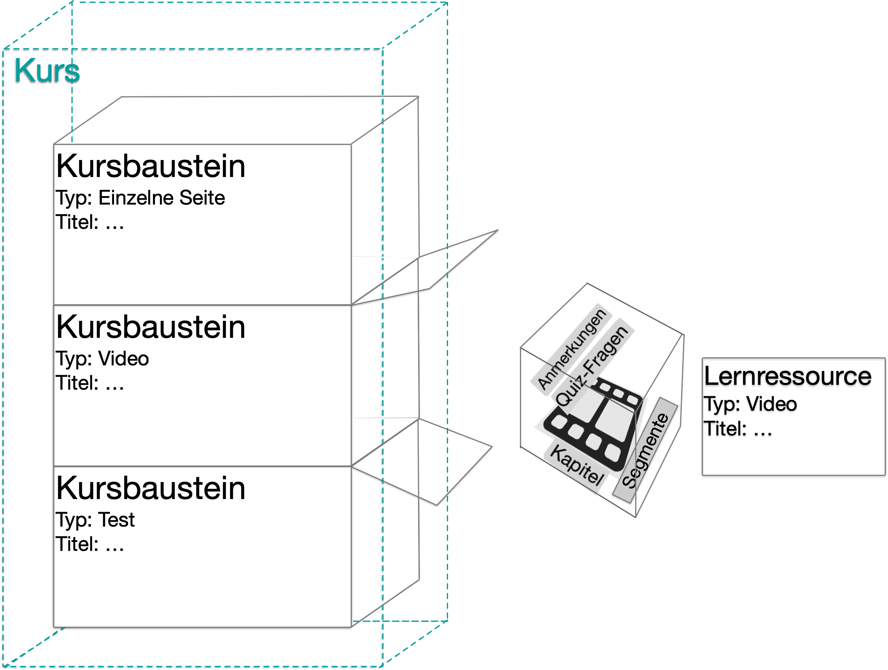{ width=470px class="lightbox" }

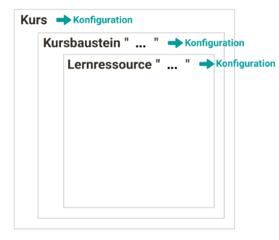{ class="lightbox" }
 

## 7. Arbeitsergebnis kontrollieren

Im Kursmenü sehen Sie (solange Sie sich im Kurseditor befinden) auf den Kursbausteinen kleine Symbole. Sie zeigen an, wenn die Konfiguration eines Kursbausteins noch unvollständig oder fehlerhaft ist. 

In der Kopfzeile des Kurseditors öffnet ein Klick auf die kleine rote Zahl (falls Fehler vorhanden sind) ein Popup, das alle unvollständigen Kursbausteine auflistet. Sie können dort direkt zu den betroffenen Kursbausteinen springen.

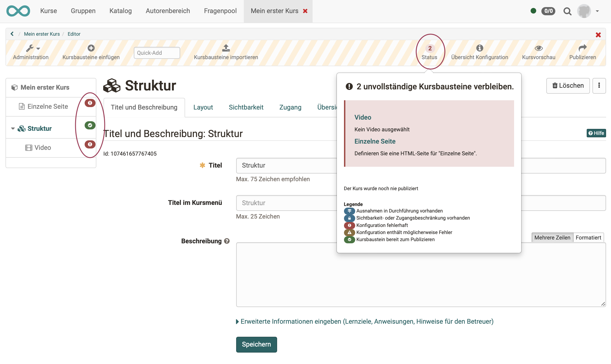{ class="shadow lightbox" }

 
Wenn Sie als Autor im Kurseditor arbeiten, tun Sie das in der Rolle als <b>Besitzer</b> dieses Kurses. Nach Verlassen des Kurseditors können Sie auch in die <b>Teilnehmeransicht</b> wechseln, um das Arbeitsergebnis zu überprüfen.

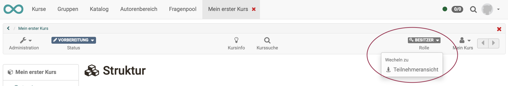{ class="shadow lightbox" }
 

## 8. Kurs publizieren

Sind alle gewünschten Kursbausteine eingefügt und konfiguriert?
Zum <b>Verlassen des Kurseditors</b> klicken Sie auf

* das <b>Icon "Publizieren"</b> (schrittweises Vorgehen) oder
* das <b>rote Kreuz</b> rechts oben (abgekürztes Vorgehen) oder
* die <b>Breadcrumb</b> (abgekürztes Vorgehen)

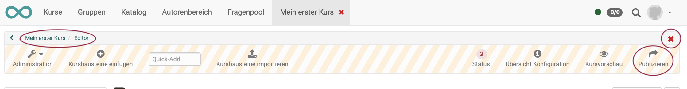{ class="shadow lightbox" }

Beim Publizieren (Verlassen des Kurseditors) wird von OpenOlat geprüft, ob der Kurs technisch gesehen lauffähig ist.

!!! hint "Hinweis"
	
	Wenn nach dem Publizieren ein Kursbaustein nicht im Menü enthalten ist, hat OpenOlat entdeckt, dass dieser Kursbaustein unvollständig war und ihn für den lauffähigen Kurs deaktiviert. Wenn Sie wieder in den Kurseditor gehen, ist dort dieser Kursbaustein immer noch vorhanden. Er hat ein rotes Symbol, weil z.B. noch eine Lernressource fehlt. (Siehe Schritt 7)

!!! hint "Hinweis"
	
	Verwechseln Sie "<b>Publizieren</b>" nicht mit "<b>Veröffentlichen</b>" (Schritt 10).
	Nach dem Publizieren ist Ihr Kurs noch nicht für andere verfügbar. Dies geschieht erst beim Veröffentlichen.
 

## 9. Mitglieder hinzufügen

Ihr Kurs ist nun lauffähig, aber noch nicht veröffentlicht. Wenn Sie  bereits namentlich wissen, welche Personen Zugriff auf diesen Kurs haben sollen, können Sie dem Kurs diese Personen als Kursmitglieder hinzufügen. Dazu gehen Sie in die Mitgliederverwaltung Ihres Kurses. 

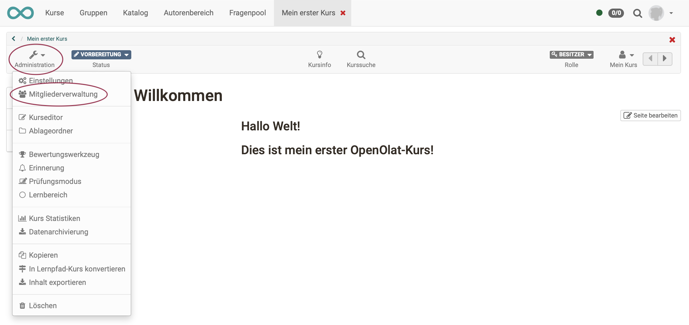{ class="shadow lightbox" }

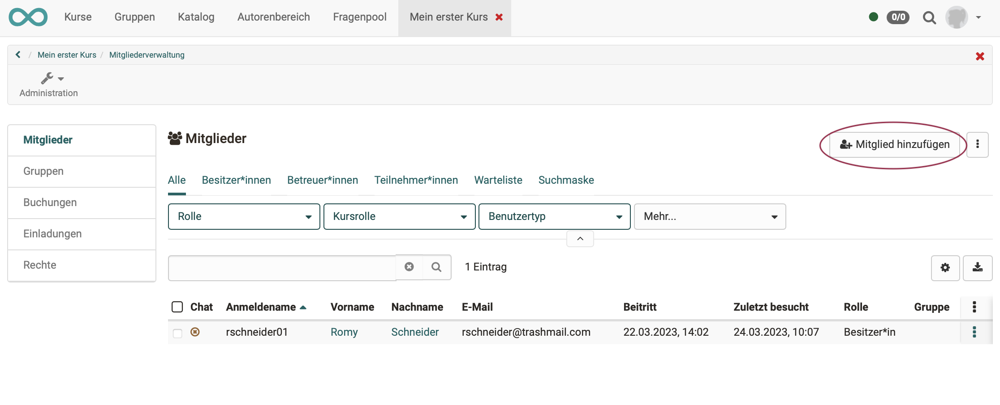{ class="shadow lightbox" }

!!! hint "Hinweis"
	
	Es gibt verschiedene Möglichkeiten, wie ein Kurs Mitglieder erhalten kann. Z.B. auch dadurch, dass sich Personen selbst eintragen. Mehr dazu finden Sie an anderer Stelle im Handbuch.

## 10. Kurs veröffentlichen

Wird ein neuer Kurs erstellt, hat dieser zunächst immer den <b>Status "Vorbereitung"</b>. Das heisst, nur Sie als Autor sehen den Kurs. Er befindet sich sozusagen in der Werkstatt (Autorenbereich) auf Ihrer persönlichen Werkbank.

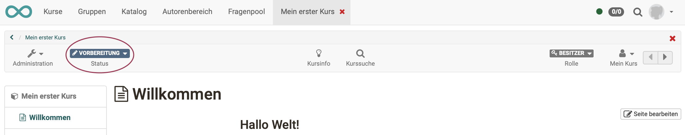{ class="shadow lightbox" }

Durch Klick auf "Vorbereitung" können Sie einen anderen Status wählen. Es sind folgende Zustände möglich:

{ class="shadow lightbox" }

Status| Zugriff|
---|---|  
<b>Vorbereitung</b> | Nur Besitzer dieses Kurses haben Zugriff.|
<b>Review</b> | Nur Besitzer dieser Lernressource haben Zugriff. Alle Vorbereitungen zu dieser Lernressource sind abgeschlossen und die Inhalte sind zur weiteren Überprüfung freigegeben.  
<b>Freigabe Betreuer</b> | Der Kurs kann neben dem Autor (Kursbesitzer) auch noch von Betreuern dieses Kurses geöffnet werden.  
<b>Veröffentlicht</b> | Der Kurs ist nun auch im Bereich "Kurse" auffindbar. Er kann von allen Berechtigten (Teilnehmer, Betreuer, evtl. Gäste) geöffnet und besucht werden.  
<b>Beendet</b> | Der Kurs kann zwar von den Kursmitgliedern noch geöffnet und angesehen werden, es sind jedoch keine Bearbeitungen mehr möglich (Tests, Formulare, usw.)
  

Um Ihren ersten eigenen Kurs nun für andere OpenOlat-Benutzer sichtbar zu machen, ändern Sie den Status auf <b>"Veröffentlicht"</b>. Der Kurs ist dann gewissermassen von Ihrer Werkbank in den Verkaufsraum gebracht worden.

### Anzeige im Katalog

Wenn Sie möchten, können Sie Ihren Kurs auch in den <b>OpenOlat-Katalog</b> aufnehmen, ihn also bildlich gesprochen ins Schaufenster stellen.
Dazu geben Sie ihn in den Kurseinstellungen frei. 
Ausserdem muss ein Angebot für den Katalog erstellt und der Kurs buchbar gemacht werden. (Bisher haben wir zu Ihren Kurs nur manuell ausgewählten Mitgliedern Zugang gewährt (= Freigabe "Privat").)

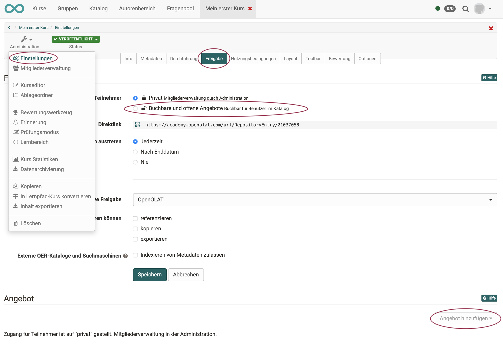{ class="shadow lightbox" }

!!! hint "Hinweis"
	
	Voraussetzung für eine Veröffentlichung im Katalog ist natürlich, dass vom Administrator ein Katalog eingerichtet wurde. Sie erkennen es daran, ob in Ihrer Kopfzeile eine Menüoption "Katalog" angezeigt wird.
	
