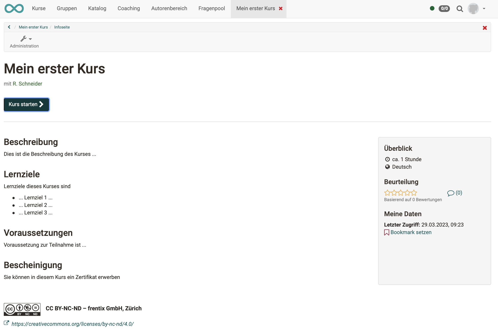
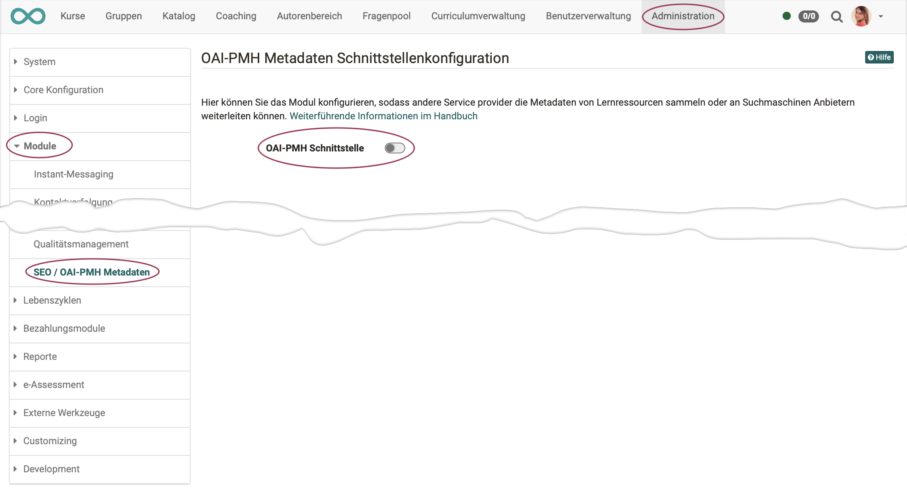
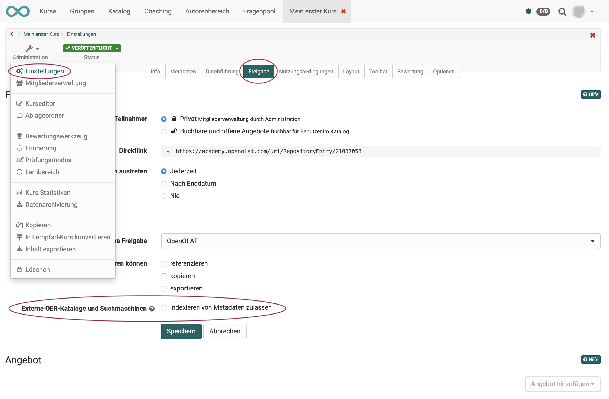
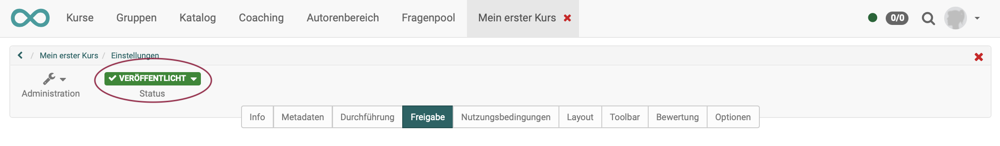
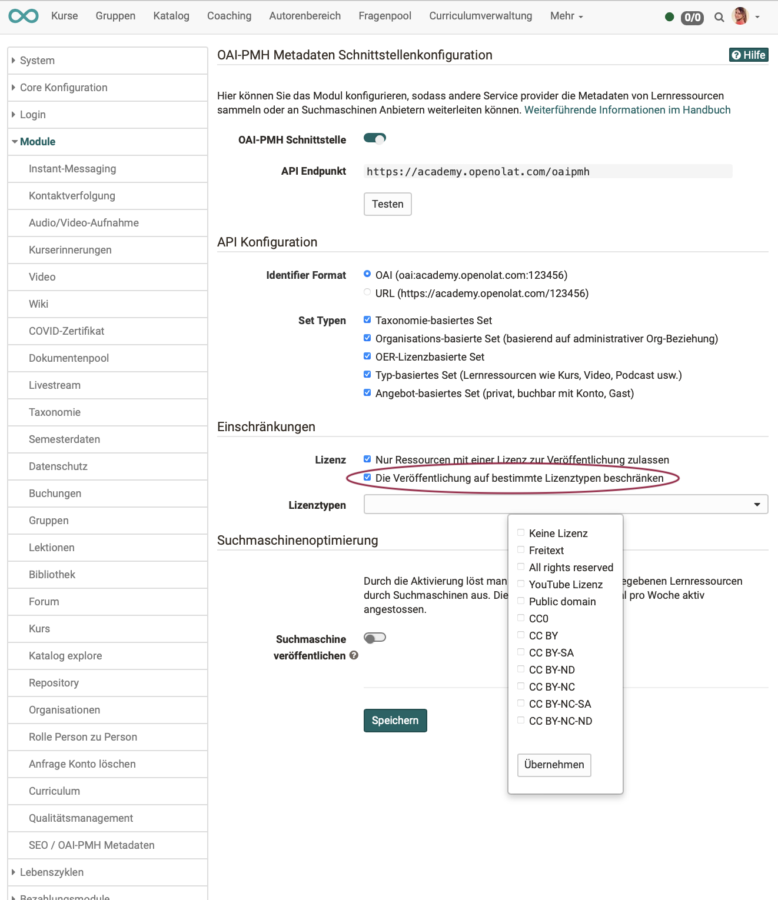
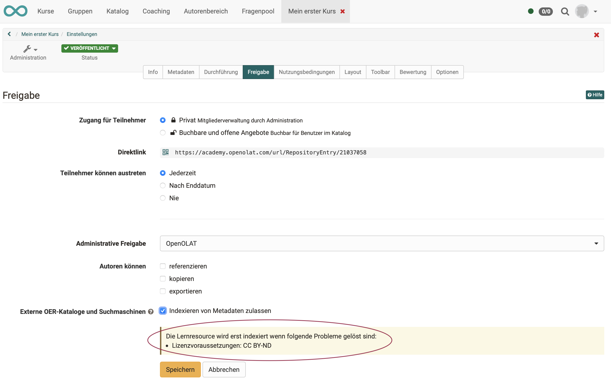
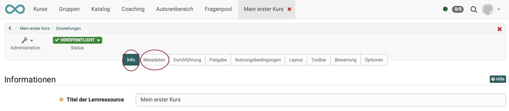

# Wie kann ich meine Kurse durch Suchmaschinen finden lassen?

## Finden Suchmaschinen alle OpenOlat-Kurse?

Nein. Wer in OpenOlat lernen und arbeiten will, muss sich im Normalfall registrieren. OpenOlat ist nach aussen ein geschützter Raum, der von Suchmaschinen nicht durchsucht werden kann. Es muss deshalb ausdrücklich festgelegt werden, was Suchmaschinen finden dürfen.

Darüber hinaus gibt es evtl. auch noch den Wunsch, dass Suchmaschinen nicht nur finden <b>dürfen</b>, sondern bestimmte Angebote möglichst finden <b>sollen</b>. 

<b>Beispiel</b>:  Bestimmte in OpenOlat erstellte Infoseiten sollen als Werbung dienen und in Suchmaschinen erscheinen und ausgewertet werden.

## Was gibt OpenOlat für Suchmaschinen zum Durchsuchen frei?

Seit Release 17.2 kann eingestellt werden, dass
- alle Angaben der <b>Infoseite</b> zu den Kursen und Lernressourcen
- sofern der Besitzer des Kurses / der Lernressource es erlaubt
- und der Administrator die Funktion generell zur Verfügung gestellt hat 

an Suchmaschinen übergeben werden.

## Wie wird diese Funktion generell aktiviert?

Das Modul kann vom Administrator unter 
- <b>Administration -> Module -> SEO/OAI-PMH Metadaten</b>

eingeschaltet werden. 

Standardmässig ist dieses Modul auf jeder Instanz deaktiviert.

Wenn das Modul eingeschaltet wurde, ist der API-Endpoint verfügbar, wo alle veröffentlichten Ressourcen über XML verfügbar sind.

## Wie wird diese Funktion für bestimmte Kurse / Lernressourcen aktiviert?

(Voraussetzung: Generelle Aktivierung der Funktion durch den Administrator)

1. Damit die Informationen an die Suchmaschinen weiter gegeben werden, muss der jeweilige Autor (Besitzer) dies für seinen Kurs / seine Lernressource erlauben.

  

2. Es werden nur Kurse / Lernressourcen berücksichtigt, die den Status „Veröffentlicht“ haben.

3. (Optional) Es kann festgelegt werden, dass nur Kurse/Lernressourcen mit Lizenz indexierbar sind. Der Administrator kann definieren welche Lizenzen zum Indexieren erlaubt sind. Die Autoren können dann ihren Kurs / ihre Lernressource nur noch indexieren lassen, wenn eine dieser Lizenzen gewählt ist.

Option für den Administrator:

Hinweis zur Beschränkung an den Autor:

## Wie sehe ich im Autorenbereich, welche Kurse/Lernressourcen zur Indexierung freigegeben sind?

Im Autorenbereich kann durch <b>Einblenden der Spalte OER</b> angezeigt werden, von welchen Kursen/Lernressourcen die Infoseiten für Suchmaschinen freigegeben sind.

## Wie kann ich als Autor zur Suchmaschinenoptimierung beitragen?

Bei den Informationen auf den Infoseiten der Kurse und Lernressourcen handelt es sich um Angaben, die von den Autoren unter den <b>Einstellungen</b> im 
* <b>Tab Info</b> und 
* <b>Tab Metadaten</b>  

erfasst werden. Je mehr Angaben die Autoren also hier einpflegen und je besser die Beschreibungen sind, desto besser wird ein Angebot von Suchmaschinen gefunden.

## Wie mache ich eine Suchmaschinenoptimierung (SEO*) als Admin?
*Search Engine Optimization

Optionen zur SEO finden Sie als Administrator auf der gleichen Seiten, auf der Sie auch die Funktion generell aktivieren:

- <b>Administration > Module > OAI PMH</b>

Weitere Informationen finden Sie im Administrationshandbuch.

## Wie gibt OpenOlat die Daten weiter?

OpenOlat verwendet das OAI-PMH zur Weitergabe von Metadaten an Suchmaschinen, Portale oder Kataloge. OAI-PMH steht für "Open Archives Initiative - Protocol for Metadata Harvesting“.  Weitergehende Informationen sind auf der Open Archives Webseite zu finden.

Von OpenOlat werden die Daten an einem API Endpoint zur Verfügung gestellt und können dort von aussen abgegriffen werden.

Zu jeder Infoseite wird eine Resource-Infoseite erzeugt. (Die Resource-Infoseite holt sich die Daten der Infoseite.)

Diese Resource-Infoseite wird dann indexiert: Eine Suchmaschine benutzt einen Index für die Suche und die Resource-Infoseite wird in diesen Index der Suchmaschine integriert.

OpenOlat übergibt der Suchmaschine den Link auf die Resource-Infoseite. Dann durchsucht die Suchmaschine diese Resource-Infoseite und sammelt die Suchbegriffe.