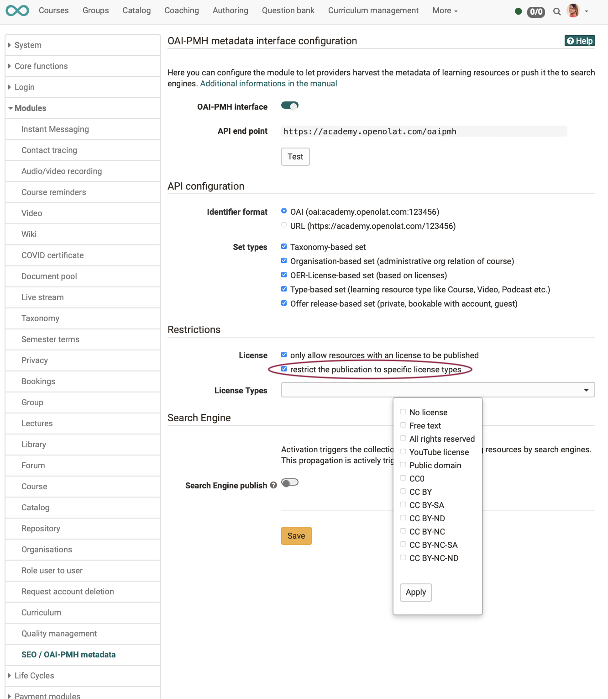

# How can I have my courses found by search engines?

## Do search engines find all OpenOlat courses?

No. Anyone who wants to learn and work in OpenOlat must normally register. OpenOlat is externally a protected space that cannot be searched by search engines. Therefore, it must be explicitly defined what search engines are allowed to find.

In addition, there may also be the desire that search engines should not only be <b>allowed</b> to find, but <b>should find</b> certain offers if possible.

<b>Example</b>:  Certain info pages created in OpenOlat are intended to serve as advertisements and should appear in search engines to be evaluated.

## What does OpenOlat release for search engines to browse?

Since release 17.2 it is possible to set that

* all information on the <b>info page</b> of the courses and learning resources
* as long as the owner of the course / learning resource allows it
* and the administrator has made the function generally available 

are transferred to search engines.

## How is this function generally enabled?

The module can be activated by the administrator under
  <b>Administration -> Modules -> SEO/OAI-PMH metadata</b> 

By default, this module is disabled on every instance.

If OAI is enabled, the SEO settings become visible. (Enable SEO only, is not possible).

When the module is turned on, the API endpoint is available where all published resources are available via XML.

## How is this feature enabled for specific courses / learning resources?

(Prerequisite: General activation of the function by the administrator)

1) In order for the information to be shared with the search engines, the respective author (owner) must allow this for their course / learning resource.

2) Only courses / learning resources that have the status "Published" are considered.

3) (Optional) It can be defined that only courses/learning resources with license are indexable. The administrator can define which licenses are allowed for indexing. Authors can then only have their course/learning resource indexed if one of these licenses is selected.

Options for the administrator:

Note on limitation to the author:

## How do I see in the authoring area which courses/learning resources are enabled for indexing?

In the authoring area, the <b>OER column can be displayed</b> to show which courses/learning resources have their info pages released for search engines.

## How can I contribute to search engine optimization as an author?

The information on the info pages of the courses and learning resources is recorded by the authors under the <b>settings</b> 
- in the <b>Info tab</b> and 
- the <b>Metadata tab</b>.

So the more information the authors enter here and the better the descriptions are, the better an offer will be found by search engines.

## How do I do search engine optimization (SEO) as an administrator?

Options for SEO can be found by administrators on the same page where you activate the function in general:

  <b>Administration > Modules > SEO/OAI-PMH metadata</b>

For more information, see the Administration Guide.

## How does OpenOlat forward and share the data?

OpenOlat uses the OAI-PMH to pass metadata to search engines, portals or catalogs. OAI-PMH stands for "Open Archives Initiative - Protocol for Metadata Harvesting".  Further information can be found on the Open Archives website.

From OpenOlat, the data is made available at an API endpoint where it can be tapped from the outside.

A Resource Info Page is created for each Info Page. (The Resource Info Page fetches the Info Page data).

This Resource Info Page is then indexed: A search engine uses an index for searching and the Resource Info Page is integrated into this index of the search engine.

OpenOlat passes the link to the Resource Info Page to the search engine. Then the search engine searches this Resource Info Page and collects the search terms.